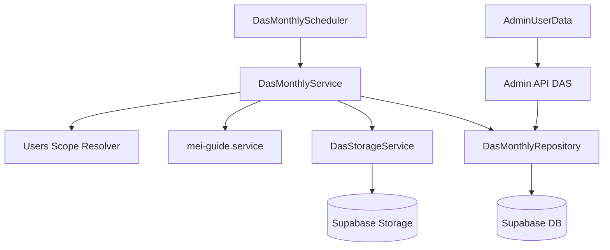

# Meu-financeiro Brownfield Enhancement Architecture

## Introduction

Este documento define a arquitetura para a evolucao de automacao mensal do DAS com persistencia de PDF e painel administrativo de pendencias, com base no RPD `docs/rpd-automacao-das.md`.

Objetivo principal: ampliar capacidade operacional fiscal sem quebrar fluxos existentes de MEI/NFSe e admin.

### Existing Project Analysis

#### Current Project State

- **Primary Purpose:** plataforma financeira com modulos transacionais e operacionais (incluindo MEI/NFSe).
- **Current Tech Stack:** Express no backend, React no frontend, Supabase para dados e integracoes externas (Serpro/MEI).
- **Architecture Style:** monolito modular (controllers/services/routes por dominio).
- **Deployment Method:** backend Node com pipeline existente de lint/build e evolucao para gates completos.

#### Available Documentation

- `docs/brief.md`
- `docs/rpd-automacao-das.md`
- `docs/architecture.md` (arquitetura brownfield anterior)

#### Identified Constraints

- Preservar compatibilidade de `mei-guide` e painel admin atual.
- Respeitar isolamento por empresa e regras de permissao existentes.
- Nao expor segredos em payloads/logs.
- Evoluir com baixo risco de regressao e rollout incremental.

### Change Log

| Change | Date | Version | Description | Author |
| --- | --- | --- | --- | --- |
| Initial draft | 2026-02-23 | 0.1 | Arquitetura de automacao DAS baseada no RPD | Aria (Architect) |

## Enhancement Scope and Integration Strategy

### Enhancement Overview

**Enhancement Type:** new feature addition + major feature modification  
**Scope:** job mensal, persistencia de PDF DAS, API admin de pendencias, novo bloco no painel admin  
**Integration Impact:** significant impact em backend e frontend administrativo

### Integration Approach

**Code Integration Strategy:** adicionar novo dominio de DAS mensal (servico + scheduler + endpoints admin) reaproveitando `mei-guide.service.js` como fonte de execucao de geracao/download.  
**Database Integration:** criar tabela de historico mensal por usuario/competencia com idempotencia.  
**API Integration:** expor endpoints admin para consulta consolidada e reprocessamento.  
**UI Integration:** ampliar `AdminUserData` e `adminUserDataService` para bloco "Pendencias DAS".

### Compatibility Requirements

- **Existing API Compatibility:** rotas existentes de `mei-guide` permanecem intactas.
- **Database Schema Compatibility:** mudanca aditiva (novas tabelas/indices), sem quebrar estruturas atuais.
- **UI/UX Consistency:** seguir padrao de accordions/cards/loading/empty/error existente.
- **Performance Impact:** consultas admin com filtros e indices para manter triagem rapida.

## Tech Stack Alignment

| Category | Current Technology | Version | Usage in Enhancement | Notes |
| --- | --- | --- | --- | --- |
| Backend runtime | Node.js | atual do projeto | job mensal, endpoints admin | sem troca de stack |
| Backend framework | Express | atual do projeto | novas rotas/controllers/services | padrao atual |
| Frontend | React + TS | atual do projeto | bloco de pendencias no painel | padrao UI existente |
| Data | Supabase | atual do projeto | historico DAS e metadados | mudanca aditiva |
| Storage | Supabase Storage | atual do projeto | persistencia PDF DAS | naming deterministico |

Sem necessidade de nova tecnologia obrigatoria no MVP.

## Data Models and Schema Changes

### New Data Model: das_mensal_status

**Purpose:** registrar o processamento mensal do DAS por usuario e competencia, incluindo referencia ao PDF persistido.  
**Integration:** vincula-se a usuarios ja existentes e a contexto de empresa para consultas admin.

**Key Attributes:**
- `id`: uuid - identificador tecnico
- `user_id`: uuid - usuario alvo do DAS
- `empresa_id`: uuid - empresa do usuario/admin
- `competencia`: text (`YYYY-MM`) - periodo fiscal
- `documento_fiscal`: text - valor derivado de `cert_document` normalizado
- `status`: text (`pago` | `pendente` | `erro`)
- `pdf_bucket`: text - bucket de armazenamento
- `pdf_path`: text - caminho do arquivo no storage
- `processed_at`: timestamp - quando processou
- `error_message`: text nullable - erro de processamento
- `created_at`: timestamp
- `updated_at`: timestamp

**Relationships:**
- **With Existing:** `user_id` referencia usuarios existentes; `empresa_id` referencia escopo empresarial atual.
- **With New:** base para endpoints de consulta e reprocessamento.

### Schema Integration Strategy

**Database Changes Required:**
- **New Tables:** `das_mensal_status`
- **Modified Tables:** nenhuma obrigatoria no MVP
- **New Indexes:** `(empresa_id, competencia, status)`, `(user_id, competencia)`, unique `(user_id, competencia)`
- **Migration Strategy:** migration aditiva com rollback simples (drop table/index)

**Backward Compatibility:**
- Nao altera contratos existentes de tabelas atuais.
- Fluxo manual atual continua operando sem dependencia da nova tabela.

## Component Architecture

### New Component: DasMonthlyScheduler

**Responsibility:** disparar processamento mensal em `dia 1, 08:00, America/Sao_Paulo`.  
**Integration Points:** inicializacao no boot do backend, chama `DasMonthlyService`.

**Dependencies:**
- **Existing Components:** `users.service.js`, `mei-guide.service.js`
- **New Components:** `DasMonthlyService`, `DasStorageService`

### New Component: DasMonthlyService

**Responsibility:** orquestrar lote mensal por empresa/admin, resolver documento, gerar/baixar DAS, classificar status e persistir.  
**Integration Points:** job automatico + endpoint de reprocessamento manual.

**Dependencies:**
- **Existing Components:** auth/contexto de usuario e servicos MEI existentes
- **New Components:** repositorio `DasMonthlyRepository`, storage adapter

### New Component: DasAdminController / DasAdminRoutes

**Responsibility:** endpoints para consulta de pendencias e reprocessamento por competencia/cliente.  
**Integration Points:** `backend/src/routes/admin.routes.js`.

### New Component: Frontend Admin DAS Block

**Responsibility:** renderizar lista consolidada de pendencias no `AdminUserData`.  
**Integration Points:** `frontend/src/services/adminUserDataService.ts` + estado local da pagina.

### Component Interaction Diagram



## API Design and Integration

### API Integration Strategy

Seguir padrao de rotas admin existentes, com `requireAuth` + `requireAdmin` e escopo por empresa.

### New API Endpoints

#### Listar status/pedencias DAS

- **Method:** `GET`
- **Endpoint:** `/api/admin/das/status`
- **Purpose:** retornar consolidado por competencia com filtros (`competencia`, `status`, `q`).

#### Reprocessar DAS

- **Method:** `POST`
- **Endpoint:** `/api/admin/das/reprocess`
- **Purpose:** reprocessar cliente/competencia especificos.

#### Request (exemplo)

```json
{
  "userId": "uuid",
  "competencia": "2026-02"
}
```

#### Response (exemplo)

```json
{
  "ok": true,
  "message": "Reprocessamento iniciado"
}
```

## Source Tree Integration

### New File Organization

```text
backend/src/
├── controllers/
│   └── das-admin.controller.js
├── routes/
│   └── das-admin.routes.js
├── services/
│   ├── das-monthly.service.js
│   ├── das-storage.service.js
│   └── das-repository.service.js
└── jobs/
    └── das-monthly.scheduler.js

frontend/src/
├── services/
│   └── dasAdminService.ts
└── pages/
    └── AdminUserData.tsx (bloco de pendencias DAS)

supabase/migrations/
└── xxxx_create_das_mensal_status.sql
```

### Integration Guidelines

- **File Naming:** manter padrao kebab-case ja adotado.
- **Folder Organization:** preservar separacao por dominio controller/service/route.
- **Import/Export Patterns:** manter estilo atual do projeto (ESM backend, TS frontend).

## Infrastructure and Deployment Integration

### Existing Infrastructure

**Current Deployment:** backend/frontend atuais com pipeline existente  
**Infrastructure Tools:** Supabase + ambiente atual de deploy  
**Environments:** dev/staging/prod

### Enhancement Deployment Strategy

**Deployment Approach:** rollout em 2 etapas:
1. backend (schema + service + scheduler + API)
2. frontend (painel admin DAS)

**Pipeline Integration:** adicionar testes do novo dominio e validar gates obrigatorios.

### Rollback Strategy

**Rollback Method:** desativar scheduler por config, manter tabela sem consumo, remover bloco frontend por feature flag.  
**Risk Mitigation:** idempotencia por `(user_id, competencia)`, retry controlado, logs estruturados.  
**Monitoring:** sucesso/falha por competencia, taxa de cobertura e pendencias.

## Coding Standards and Conventions

### Existing Standards Compliance

- **Code Style:** seguir padrao atual do repo.
- **Linting Rules:** sem introduzir bypass; adequar novos arquivos ao lint.
- **Testing Patterns:** reaproveitar padroes de teste backend/frontend existentes.
- **Documentation Style:** atualizar artefatos em `docs/` e stories relacionadas.

### Critical Integration Rules

- **Existing API Compatibility:** nao quebrar contratos `mei-guide` atuais.
- **Database Integration:** mudancas aditivas e idempotentes.
- **Error Handling:** mensagens acionaveis sem vazar segredo.
- **Logging Consistency:** logs estruturados com contexto e sem credenciais.

## Testing Strategy

### Integration with Existing Tests

**Existing Test Framework:** manter o stack de testes atual do projeto.  
**Test Organization:** testes focados por dominio (job/service/api/admin UI).  
**Coverage Requirements:** minimo para fluxo mensal, consulta e reprocessamento.

### New Testing Requirements

#### Unit Tests

- normalizacao de competencia/documento
- classificacao de status (`pago`/`pendente`/`erro`)
- idempotencia de persistencia

#### Integration Tests

- execucao do job mensal com lote de usuarios
- persistencia do PDF + metadados
- endpoint admin com filtros e isolamento por empresa

#### Regression Tests

- validar que `/mei-guide` manual continua funcional
- validar `AdminUserData` sem regressao nas secoes existentes

## Security Integration

### Existing Security Measures

**Authentication:** middleware de auth existente  
**Authorization:** `requireAdmin` + escopo por empresa  
**Data Protection:** manter redacao de dados sensiveis em logs  
**Security Tools:** praticas e middlewares atuais do backend

### Enhancement Security Requirements

- nao expor PDFs fora do escopo empresarial correto
- acesso a endpoints DAS admin somente para perfis autorizados
- controle de acesso ao storage por path e contexto de empresa

### Security Testing

- testes de autorizacao (admin de outra empresa nao deve visualizar dados indevidos)
- testes de tentativa de acesso sem token
- validacao de nao vazamento de segredo em logs/respostas

## Observability and Operational Metrics

- Total processado por competencia
- Total sucesso/pendente/erro
- Taxa de cobertura por empresa
- Tempo medio de processamento por lote
- Total de reprocessamentos manuais e taxa de sucesso

## Checklist Results Report

Checklist arquitetural preliminar:
- escopo brownfield significativo: **ok**
- integracao com stack atual: **ok**
- compatibilidade e rollback definidos: **ok**
- riscos principais mapeados: **ok**
- estrategia de testes e seguranca definida: **ok**

## Next Steps

### Story Manager Handoff

Usar este documento + `docs/rpd-automacao-das.md` para gerar stories executaveis na ordem:
1. schema/persistencia DAS
2. job mensal
3. API admin
4. painel admin
5. observabilidade e testes

Cada story deve incluir checkpoint de compatibilidade com fluxos existentes.

### Developer Handoff

Implementar incrementalmente com foco em:
- idempotencia por cliente/competencia
- isolamento por empresa
- nao regressao de `mei-guide` e `AdminUserData`
- logs estruturados e testes minimos por etapa
