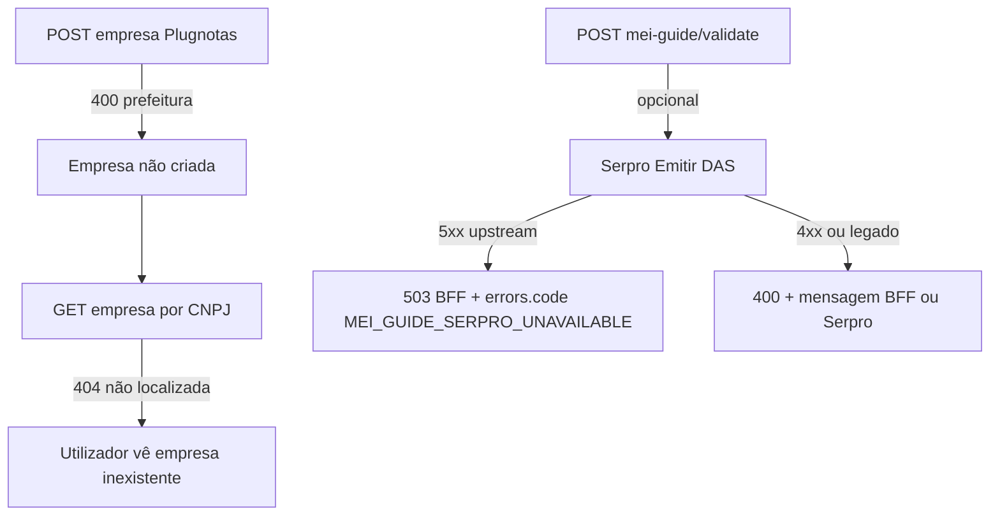

# Brief: correção do cadastro Plugnotas — análise dos erros na consola e plano de acção

**Data:** 2026-04-08  
**Contexto:** utilizador não conclui o registo da empresa no Plugnotas; a UI mostra validação **`fields.nfse.config.prefeitura: Preenchimento obrigatório`**.  
**Pedido:** analisar a cadeia de erros HTTP observada, explicar causa raiz provável e orientar correção (produto + integração + eventual código).

**Documentos que este brief complementa (não substitui):**

- [`brief-plugnotas-empresa-nfse-config-prefeitura-payload-2026-04-08.md`](brief-plugnotas-empresa-nfse-config-prefeitura-payload-2026-04-08.md) — payload `nfse.config.prefeitura` vs `inscricaoMunicipal`, opções A–D.  
- [`brief-nfse-nacional-sem-im-prefeitura-2026-04-08.md`](brief-nfse-nacional-sem-im-prefeitura-2026-04-08.md) — intenção NFS-e Nacional sem colecta municipal na UI.  
- [`docs/operacao-mei-nfse.md`](../operacao-mei-nfse.md) — variáveis Plugnotas e operação; mapa da tríade (consola): [`#triagem-erros-consola-guia-mei`](../operacao-mei-nfse.md#triagem-erros-consola-guia-mei).

---

## 1. Resumo executivo

| Erro na consola | Interpretação |
|-----------------|---------------|
| `GET …/emissao-fiscal/empresa?cpfCnpj=…` **404** | **Efeito esperado** após falha do `POST`: a empresa **não existe** no Plugnotas enquanto o cadastro não for aceite. **Não é bug de GET.** |
| `POST …/emissao-fiscal/empresa` **400** com `nfse.config.prefeitura` | **Bloqueio real:** o validador do Plugnotas exige **`nfse.config.prefeitura`** no JSON; o produto envia `nfse.config` mínimo `{ producao: true }` e `nacional: true`, **sem** `prefeitura` (ver `buildNfEmissionEmpresaPayload` em `frontend/src/utils/nfEmissionCompany.ts`). |
| `POST …/mei-guide/validate` **503** *(contrato actual — **FR-CONS P0**)* | **Problema distinto** do Plugnotas: o fluxo chama Serpro (`emitirServico` → `/Emitir`). Respostas upstream **≥ 500** são mapeadas para **HTTP 503** no BFF com `errors.code: MEI_GUIDE_SERPRO_UNAVAILABLE`, `integration: serpro` e `upstreamStatus`. Não desbloqueia cadastro Plugnotas. Mapa operacional: [`operacao-mei-nfse.md#triagem-erros-consola-guia-mei`](../operacao-mei-nfse.md#triagem-erros-consola-guia-mei). |
| `POST …/mei-guide/validate` **400** + mensagem genérica *(legado / excepção)* | **Histórico:** antes do P0, falhas Serpro **5xx** podiam surgir como **400** + texto tipo *Internal Server Error*; ainda possível em clientes desactualizados ou ramos **4xx** Serpro. Ver `backend/src/services/gestao/emitir.service.js` — `emitirServico`. |

**Conclusão:** corrigir o cadastro Plugnotas passa por **(1)** alinhar conta/ambiente Plugnotas (NFS-e Nacional na API) **e/ou** **(2)** enriquecer o payload com `nfse.config.prefeitura` conforme contrato oficial **e/ou** **(3)** UI/fluxo híbrido (ver opções no brief da prefeitura). O **404** no GET e falhas no **`validate`** (hoje sobretudo **503** Serpro, ou **400** legado) são **ruído correlacionado** ou **falha Receita/Serpro**, não a causa do `prefeitura`.

---

## 2. Cadeia causal (ordem lógica)

1. **`POST /api/mei-notas/setup/emissao-fiscal/empresa`** falha → empresa não fica registada.  
2. **`GET …/empresa?cpfCnpj=`** continua a devolver 404 até existir registo válido no Plugnotas.  
3. **`POST /api/mei-guide/validate`** pode falhar **em paralelo** por indisponibilidade ou erro Serpro; **não** desbloqueia o `POST` empresa.

---

## 3. Plano de correção (prioridade sugerida)

1. **Confirmar ambiente Plugnotas** (API key, URL sandbox vs produção) alinhados com o painel onde “NFS-e Nacional” está activo. Desalinhamento é causa frequente de o validador ainda exigir ramo municipal (`prefeitura`).  
2. **Evidência técnica:** com `PLUGNOTAS_DEBUG` (ou ambiente não-prod), usar logs de `POST /empresa` já previstos no backend para inspeccionar o corpo **redigido** enviado ao Plugnotas (`docs/operacao-mei-nfse.md`).  
3. **Decisão de produto (@pm):** seguir uma das opções **A–D** em [`brief-plugnotas-empresa-nfse-config-prefeitura-payload-2026-04-08.md`](brief-plugnotas-empresa-nfse-config-prefeitura-payload-2026-04-08.md) (conta/suporte, derivação automática, campos explícitos, ou híbrido). **Não** assumir formato de `prefeitura` sem documentação Plugnotas ou ticket.  
4. **`mei-guide/validate`:** se o sintoma persistir, correlacionar com logs `[error]` do Express (corpo do `req` resumido) e resposta Serpro. **5xx Serpro → 503 BFF** + `errors.code` está implementado na story [**FR-CONS P0**](../stories/story-fr-cons-p0-serpro-emitir-503-mei-guide-validate.md); copy de utilizador na spec UX CONS §6.

---

## 4. Critérios de aceite (rascunho para story)

1. Utilizador consegue concluir **`POST` empresa** sem 400 `nfse.config.prefeitura` **no cenário acordado** (nacional na API **ou** payload municipal completo).  
2. Documentação interna liga este brief + brief da prefeitura + operação MEI NFS-e.  
3. Mensagens de erro distingue **falha Plugnotas** (prefeitura / nacional) de **falha Serpro** no validate, quando a story de UX/backend for aberta.

---

## 5. Referência rápida de código

| Peça | Ficheiro |
|------|----------|
| Payload `nfse` sem `prefeitura` | `frontend/src/utils/nfEmissionCompany.ts` — `buildNfEmissionEmpresaPayload` |
| Chamadas HTTP Plugnotas empresa | `backend/src/services/plugnotas/empresa.service.js` |
| Serpro **5xx** → **503** + `errors` / **4xx** → `badRequest` | `backend/src/services/gestao/emitir.service.js` — `emitirServico` |
| Rota validate guia | `backend/src/routes/mei-guide.routes.js` → `validateGuide` |

---

## Change log

| Data | Nota |
| --- | --- |
| 2026-04-08 | Versão inicial: correlação GET 404 / POST empresa / POST validate; plano de correção e ligação a briefs existentes. |
| 2026-04-08 | Ligação bidireccional ao runbook: secção **Triagem: erros na consola** em `docs/operacao-mei-nfse.md#triagem-erros-consola-guia-mei` (FR-CONS-MAP-01 / story P1 operação). |
| 2026-04-08 | Alinhamento pós-QA (obs. Quinn): resumo §1 e mermaid com **503** + `MEI_GUIDE_SERPRO_UNAVAILABLE`; linha legado **400**; §3 ponto 4 actualizado (P0); §5 tabela `emitirServico`. |
