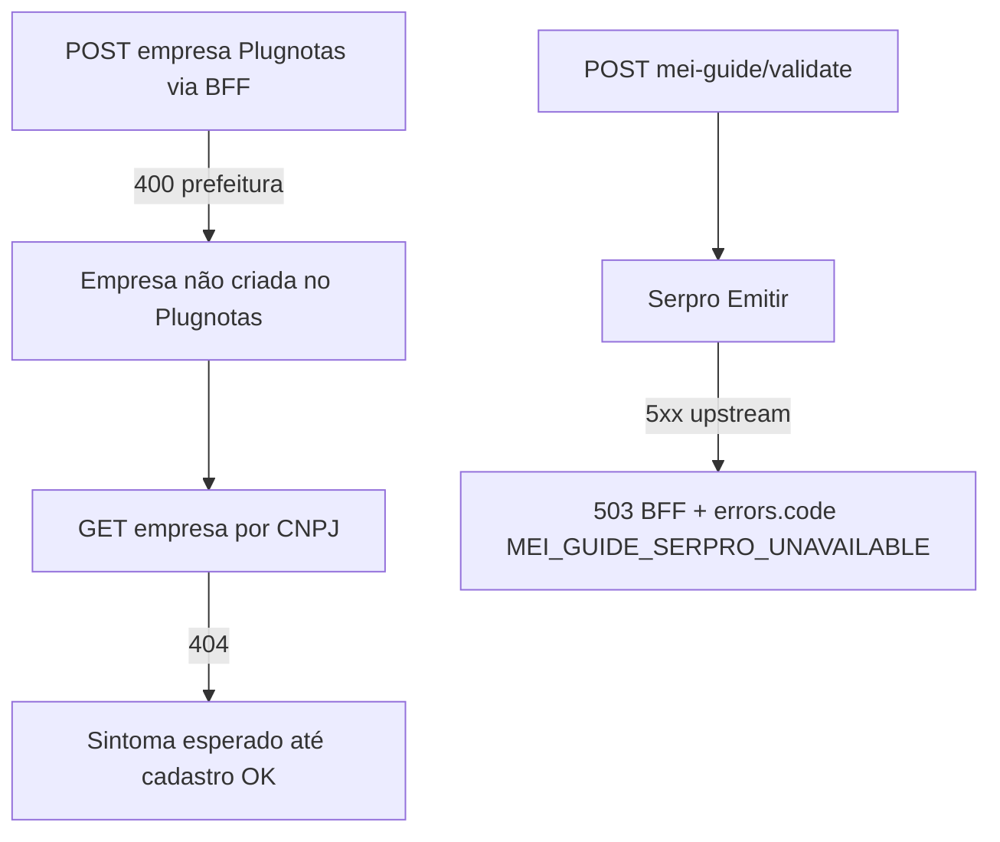

# Operacao MEI/NFSe

**Caminhos relativos:** links para `stories/`, `prd/`, `adr/`, `brief/`, `qa/` neste ficheiro são relativos à pasta **`docs/`** (o próprio ficheiro está em `docs/operacao-mei-nfse.md`). URLs `https://...` são absolutas.  
**Equivalência com stories:** um destino `prd/PRD-….md` aqui é o mesmo ficheiro em `docs/prd/` referido como `../prd/PRD-….md` a partir de `docs/stories/*.md` (critérios de aceite das stories usam frequentemente esta segunda forma).

<a id="guia-mei-escopo-apenas-nfse"></a>

## Escopo da Guia MEI no produto (apenas NFS-e na interface)

- **Limitação D-01 (épico):** o fluxo **Guia MEI** (`GuidesMei`) é voltado a **MEI prestador de serviços**; na **interface** o utilizador **só emite e opera NFS-e** (não há escolha de NF-e nem NFC-e na tela).
- **Inscrição estadual (IE):** o formulário da Guia MEI **não pede** IE da empresa. O backend envia ao Plugnotas o valor definido na política MEI quando a IE não vem do utilizador — hoje **`ISENTO`** (ver `plugnotas-mei-empresa-policy` / ADR de payload apenas NFS-e).
- **Inscrição municipal (IM) e prefeitura (modo NFS-e Nacional):** no fluxo em [`PRD-nfse-nacional-sem-im-prefeitura-mei-2026-04-08.md`](prd/PRD-nfse-nacional-sem-im-prefeitura-mei-2026-04-08.md), a **Guia MEI** **não** inclui campos obrigatórios para IM nem para escolha de prefeitura no **formulário local** de cadastro. O **Plugnotas** pode, ainda assim, devolver erros que exijam dados municipais (conta, ambiente ou política do provedor). Isto **não** significa que o utilizador “faltou preencher” um campo visível na app — ver [Modo NFS-e Nacional no formulário vs exigência municipal na API](#nfse-nacional-vs-municipal-cadastro).
- **Backend e API:** endpoints de NF-e/NFC-e podem existir para outros contextos ou contratos do emissor; na Guia MEI a experiência exposta ao utilizador é **só NFS-e**. Decisão de produto documentada no PRD: [`epic-guia-mei-apenas-nfse-prd.md`](stories/epic-guia-mei-apenas-nfse-prd.md).
- **Erros que citam NFC-e ou `nfce` no JSON:** podem aparecer no **cadastro/atualização da empresa** no Plugnotas (payload enviado pelo app após o certificado), mesmo com a UI de emissão só NFS-e — ver [Cadastro da empresa e NFC-e (QR e SEFAZ)](#cadastro-empresa-nfce-qrcode-sefaz).

<a id="plugnotas-nfse-nacional-spike-nat01"></a>
<a id="emissor-nfse-nacional-spike-nat01"></a>

### NFS-e Nacional no cadastro Plugnotas (NAT-01 / NAT-02 / US-MEI-NAT-03)

#### Default do produto

- O aplicativo envia ao Plugnotas, no cadastro da empresa, o bloco **`nfse`** com **`nacional: true`** por padrão no **`POST /empresa`** (criação), alinhado ao comportamento esperado do painel (*Ativar emissão de NFS-e Nacional*).
- No **`PATCH /empresa/:cnpj`**, o backend **só** inclui ou completa `nfse.nacional` quando o cliente já envia o objeto **`nfse`** no corpo; atualizações que **não** trazem `nfse` **não** alteram a configuração remota desse toggle (evita sobrescrever ajuste feito manualmente no painel). Detalhes: [`ADR-plugnotas-nfse-nacional-empresa-spike.md`](adr/ADR-plugnotas-nfse-nacional-empresa-spike.md).

#### Contrato em código e risco de API (**NFR-N04**)

- O **nome da propriedade** (`nfse.nacional`, boolean) foi **adotado** a partir da primeira hipótese do spike; **não** há, neste repositório, trecho público estável da documentação Plugnotas que prove o mesmo nome em todos os ambientes.
- Se o provedor **rejeitar** o JSON (HTTP **400** com validação de empresa) ou **ignorar** o campo, tratar como possível divergência de contrato: conferir mensagem de erro, abrir ticket com Plugnotas/TecnoSpeed e atualizar o ADR quando houver resposta oficial.

#### Documentação e painel Plugnotas

- **Documentação geral da API:** [docs.plugnotas.com.br](https://docs.plugnotas.com.br/) (acesso pode depender de rede/autenticação; na prática o time costuma cruzar com o painel).
- **Painel web:** [app2.plugnotas.com.br](https://app2.plugnotas.com.br) — após cadastro pelo app, verificar na ficha da empresa se a opção de **NFS-e Nacional** reflete o esperado (homologação/produção conforme a conta).

#### Município, credenciamento e rejeições

- A **NFS-e Nacional** depende de **adesão municipal/prestador** e regras do provedor. Mesmo com `nacional: true` no payload, podem ocorrer:
  - **400** ou mensagens de validação no cadastro ou na emissão;
  - comportamento em que o painel **não** exibe nacional ativa (município ainda só no modelo antigo, CNPJ sem credenciamento adequado, etc.).
- **Não** concluir automaticamente que o app “não enviou o campo” antes de comparar o **corpo da requisição** (logs redigidos de cadastro empresa, com opt-in `PLUGNOTAS_DEBUG` em produção) com a resposta do Plugnotas.

<a id="nfse-nacional-vs-municipal-cadastro"></a>

#### Modo NFS-e Nacional no formulário vs exigência municipal na API (**FR-NAT-DOC-01**)

- **No produto (Guia MEI, painel DAS):** o cadastro orientado a **NFS-e Nacional** envia `nfse.nacional: true` conforme [`ADR-plugnotas-nfse-nacional-empresa-spike.md`](adr/ADR-plugnotas-nfse-nacional-empresa-spike.md) e **não** acrescenta IM nem prefeitura ao payload a partir de campos do formulário descritos no PRD abaixo.
- **Resposta da API:** mensagens que citam `inscricaoMunicipal`, inscrição municipal, prefeitura ou `nfse.config` municipal indicam **tensão entre modo nacional escolhido no produto e validações que o emissor aplica** (limitação de conta, homologação vs produção, ou regra ainda municipal na ponta). **NFR-N04:** painel web e corpo de erro podem **divergir** até existir evidência fechada (ticket ou doc oficial do provedor); não prometa em nome do produto que a emissão está **legalmente** autorizada ou homologada em todos os municípios.
- **Referências de produto e engenharia:** PRD [`PRD-nfse-nacional-sem-im-prefeitura-mei-2026-04-08.md`](prd/PRD-nfse-nacional-sem-im-prefeitura-mei-2026-04-08.md); especificação de UX [`ux-spec-nfse-nacional-sem-im-prefeitura-mei-2026-04-08.md`](specs/ux-spec-nfse-nacional-sem-im-prefeitura-mei-2026-04-08.md); nota de arquitetura [`architecture-nfse-nacional-sem-im-prefeitura-mei-2026-04-08.md`](technical/architecture-nfse-nacional-sem-im-prefeitura-mei-2026-04-08.md).
- **Sintomas na interface:** copy de ajuda e painel de retry âmbar quando a heurística municipal dispara — ver [Mensagens Plugnotas → dica na Guia MEI](#plugnotas-nfse-nacional-erros-mensagens) e `frontend/src/utils/nfseNacionalPlugnotasErrorHints.ts`.

<a id="nfse-config-prefeitura-cadastro-pref"></a>

#### `nfse.config.prefeitura` obrigatório vs inscrição municipal na raiz (**FR-PREF-DOC-01**)

- O Plugnotas pode devolver **400** citando `fields.nfse.config.prefeitura` ou `nfse.config.prefeitura` (preenchimento obrigatório). Isto é **distinto** do campo **`inscricaoMunicipal`** ao nível raiz do JSON de empresa: preencher a IM opcional na Guia MEI **não** substitui a configuração de prefeitura dentro de **`nfse.config`** quando o validador exige esse ramo.
- **Produto / UX:** PRD [`PRD-plugnotas-empresa-nfse-config-prefeitura-payload-2026-04-08.md`](prd/PRD-plugnotas-empresa-nfse-config-prefeitura-payload-2026-04-08.md); spec [`ux-spec-plugnotas-nfse-config-prefeitura-payload-2026-04-08.md`](specs/ux-spec-plugnotas-nfse-config-prefeitura-payload-2026-04-08.md); arquitetura [`architecture-plugnotas-nfse-config-prefeitura-payload-2026-04-08.md`](technical/architecture-plugnotas-nfse-config-prefeitura-payload-2026-04-08.md).
- **Interface:** quando a mensagem casa com a variante **PREF-L1**, a Guia MEI mostra copy que explica a diferença (painel âmbar de retry e painel vermelho de erro) — funções `isPlugnotasNfseConfigPrefeituraRequirementMessage` e `getPlugnotasEmpresaCadastroErrorUxVariant` em `frontend/src/utils/nfseNacionalPlugnotasErrorHints.ts`.
- **PREF-L2 (spec UX §3.2):** exigências municipais **só** com inscrição municipal (sem gatilho L1) usam a mesma copy genérica municipal (**NAT §5.2**); no código isto corresponde à variante interna `'municipal-generic'` (não a `'prefeitura-config'`).
- **Consulta GET empresa após falha no registo:** se o utilizador ainda tem o painel de **retry** (cadastro da empresa não concluído) e a consulta devolve “não encontrado” / **404**, a app pode prefixar a mensagem com orientação para resolver o erro de registo antes de interpretar como CNPJ errado.
- **FR-CONS (P1) — triade UX / CONS-B:** o mesmo prefixo (UX §5.4) aplica-se quando o painel de retry **já não** está visível mas o marcador de sessão SOL-P1 (`guiaMeiEmpresaFase2FailFlag`) indica falha recente no POST fase 2 — `withPlugnotasEmpresaConsultPendingCadastroPrefixIfApplicable` com `sessionPostFailedFlag`. Erros de validação guia / Serpro (CONS-C) **não** disparam dica NFS-e Nacional / municipal na heurística — `shouldOfferNfseNacionalOperacaoDocHint` em `nfseNacionalPlugnotasErrorHints.ts`; story [`story-fr-cons-p1-guidesmei-fr-cons-ux-paridade-sol.md`](stories/story-fr-cons-p1-guidesmei-fr-cons-ux-paridade-sol.md).
- **Payload com `prefeitura` preenchida** no `nfse.config` — ver fecho do spike P0 e evidência redigida: [`NFR-PREF-EV-01-plugnotas-prefeitura-spike-p0-closure-2026-04-08.md`](evidence/NFR-PREF-EV-01-plugnotas-prefeitura-spike-p0-closure-2026-04-08.md) (**FR-P0-SPIKE-01**, **FR-P0-DOC-01**). Trilhos **C/D** permanecem stories condicionais no mesmo eixo PRD PREF.
- **400 com `prefeitura.login` / `senha` obrigatório** (mensagem do emissor, distinto de tabela IBGE e de “só falta `prefeitura` / trilho B”): [Triagem PLOGIN — 400 `prefeitura.login`](#plogin-400-prefeitura-login-obrigatorio-triagem).

<a id="plogin-400-prefeitura-login-obrigatorio-triagem"></a>

##### Triagem **P1** — HTTP **400** com **`prefeitura.login` / `senha` obrigatório** (FR-NATEX canónico)

**Sintoma:** resposta **400** do **Plugnotas** (upstream) cuja mensagem indica explicitamente **`nfse.config.prefeitura.login`**, **`prefeitura.login`**, **`prefeitura.senha`** ou texto equivalente.

**Classificação canónica NATEX:** este cenário é uma **exceção municipal não suportada no fluxo nacional**. A jornada padrão do produto continua sendo **NFS-e Nacional**. O frontend **não recolhe** `login`/`senha` de prefeitura e o backend **não aceita nem encaminha** essas credenciais neste percurso.

**Não confundir com:**

1. **TIBGE / CID** — erro sobre **`endereco.codigoCidade`**, valor não encontrado na **tabela de cidades IBGE** do emissor, ou `codigoIBGECidade`: ver [endereco.codigoCidade e tabela IBGE](#endereco-codigo-cidade-ibge-plugnotas) e [400 cadastro empresa: qual erro? — CID vs TIBGE vs PREF](#cadastro-empresa-400-qual-erro).  
2. **Só falta `nfse.config.prefeitura` / trilho B** — o backend pode derivar **`nfse.config.prefeitura.codigoIbge`** a partir de **`endereco.codigoCidade`** com **`PLUGNOTAS_NFSE_PREFEITURA_DERIVE_IBGE=true`**; isso **não** dispensa **login/senha** quando o Plugnotas as exige no schema — ver [Trilho B — env `PLUGNOTAS_NFSE_PREFEITURA_DERIVE_IBGE`](#prefb-trilho-b-env-derive-ibge) e [Spike P0 — trilho B](#p0-prefeitura-spike-trilho-b).  
3. **400 do BFF (DP-PLOGIN-02)** — bloqueio interno `prefeitura_ibge_apenas_insuficiente_dp02` **antes** do emissor — ver [DP-PLOGIN-02](#dp02-prefeitura-ibge-apenas-bloqueio).
4. **Erro de endpoint / rota errada** — esta classificação é indevida enquanto o erro útil vier do emissor pedindo `prefeitura.login`/`senha`. Não reclassificar este caso como problema de rota.

**Referências canónicas:** PRD [`PRD-nfse-nacional-padrao-com-excecao-credenciais-prefeitura-plugnotas-2026-04-09.md`](prd/PRD-nfse-nacional-padrao-com-excecao-credenciais-prefeitura-plugnotas-2026-04-09.md); spec UX [`ux-spec-nfse-nacional-padrao-bloqueio-excecao-credenciais-prefeitura-plugnotas-2026-04-10.md`](specs/ux-spec-nfse-nacional-padrao-bloqueio-excecao-credenciais-prefeitura-plugnotas-2026-04-10.md); arquitetura [`architecture-nfse-nacional-padrao-bloqueio-excecao-credenciais-prefeitura-plugnotas-2026-04-10.md`](technical/architecture-nfse-nacional-padrao-bloqueio-excecao-credenciais-prefeitura-plugnotas-2026-04-10.md).

**Contrato público (Plugnotas) — FR-PLOGIN-03:** [Documentação da API (Postman)](https://documenter.getpostman.com/view/3720339/2sB3WpSh1R?version=latest) — ramo `prefeitura`; **não** copiar credenciais para o Git nem para tickets públicos.

**Registo mínimo em ticket interno ou acta (sem secrets em canal aberto):**

1. Guardar **mensagem de erro completa** (texto ou screenshot) e **ambiente** (homologação/produção).  
2. Se possível, guardar **metadados redigidos** do erro (`plugnotasCode`, `plugnotasRequest.method`, `plugnotasRequest.path`, `httpStatus`) ou referência ao log/response correspondente.  
3. Registar em **ticket interno ou acta**; **não** colar tokens, certificados nem credenciais reais em Slack/Git público.

**Orientação operacional:** não pedir credenciais ao utilizador, não abrir tarefa para recolha de `login`/`senha` no produto e não tratar o caso como endpoint errado. Classificar como **não suportado no fluxo nacional** e encaminhar a triagem via runbook/suporte apropriado.

**Causalidade:** se o `POST` do cadastro falhar com esta exceção, um `GET` posterior sem empresa é apenas consequência do cadastro não concluído. O `GET` negativo não substitui a causa raiz registada no `POST`.

**Ver também:** [Quadro CID / TIBGE / PREF](#cadastro-empresa-400-qual-erro); [Matriz canónica NATEX — exceção municipal bloqueada](#natex-matriz-operacional-excecao-municipal-bloqueada).

<a id="p0-prefeitura-spike-trilho-b"></a>

##### Spike P0 — decisão trilho **B** (`nfse.config.prefeitura`)

- **PRD P0 (ação cadastro):** [`PRD-acao-p0-cadastro-empresa-prefeitura-400-get-404-2026-04-08.md`](prd/PRD-acao-p0-cadastro-empresa-prefeitura-400-get-404-2026-04-08.md).
- **Decisão registada:** trilho **B** — o backend pode preencher **`nfse.config.prefeitura.codigoIbge`** a partir de **`endereco.codigoCidade`** (7 dígitos), **somente** com **`PLUGNOTAS_NFSE_PREFEITURA_DERIVE_IBGE=true`** (defeito desligado — **NFR-P0-REG-01**). Detalhes: [`ADR-plugnotas-empresa-payload-apenas-nfse.md`](adr/ADR-plugnotas-empresa-payload-apenas-nfse.md) (complemento 2026-04-08), story [`story-fr-cons-p0-plugnotas-empresa-backend-trilho-b-nfse-prefeitura.md`](stories/story-fr-cons-p0-plugnotas-empresa-backend-trilho-b-nfse-prefeitura.md).
- **Evidência / spike (sem PII):** [`evidence/NFR-PREF-EV-01-plugnotas-prefeitura-spike-p0-closure-2026-04-08.md`](evidence/NFR-PREF-EV-01-plugnotas-prefeitura-spike-p0-closure-2026-04-08.md).
- **Trilho A** (ajuste só no painel Plugnotas) não foi escolhido como **único** encerramento do P0; as secções **Sandbox vs produção** e **Checklist manual pós-cadastro** mais abaixo neste runbook continuam válidas para qualquer trilho.
- **FR-P0-OUT-01 / 02** (POST 2xx + GET coerente no ambiente acordado): fechar com evidência **interna** (ticket/QA) **sem** CNPJ nem chaves no Git.
- **NFR-PREF-EV-01 (produção):** antes do primeiro deploy com **`PLUGNOTAS_NFSE_PREFEITURA_DERIVE_IBGE=true`** em ambiente real, validar conta/sandbox conforme nível **B** em [`NFR-PREF-EV-01-plugnotas-prefeitura-spike-p0-closure-2026-04-08.md`](evidence/NFR-PREF-EV-01-plugnotas-prefeitura-spike-p0-closure-2026-04-08.md) §8 e anexar registo redigido ao processo de release (fora do Git se contiver dados sensíveis).

<a id="dp01-prefeitura-portal-credenciais"></a>

##### DP-PLOGIN-01 — histórico legado de credenciais do portal municipal

- Esta secção fica mantida apenas como **histórico** de análise anterior.
- A política vigente do produto para a jornada Guia MEI / NFS-e Nacional foi revista pela iniciativa **FR-NATEX**: o frontend **não** apresenta campos de `login`/`senha` de prefeitura e o backend **não** aceita nem encaminha essas credenciais neste fluxo.
- Para operação, QA e suporte, usar como referência canónica a triagem [FR-NATEX](#plogin-400-prefeitura-login-obrigatorio-triagem) e a [matriz canónica NATEX](#natex-matriz-operacional-excecao-municipal-bloqueada).
- **FR-ALNFB (estado actual após P1 + flags):** quando as entregas P1 estiverem mergeadas e as flags estiverem ligadas conforme [Fallback municipal condicionado (FR-ALNFB)](#alnfb-fallback-municipal-operacao-qa), o produto pode oferecer **segundo passo guiado** com classificação `runtimeDecision`. Enquanto as flags estiverem **desligadas**, a triagem [FR-NATEX](#plogin-400-prefeitura-login-obrigatorio-triagem) mantém-se para o fluxo sem credenciais.

<a id="dp02-prefeitura-ibge-apenas-bloqueio"></a>

##### DP-PLOGIN-02 — bloqueio BFF quando só `codigoIbge` em município da lista

- **Opt-in:** `PLUGNOTAS_NFSE_PREFEITURA_IBGE_ONLY_BLOCK_ENABLED` e `PLUGNOTAS_NFSE_PREFEITURA_IBGE_ONLY_BLOCK_CODES` (IBGEs de 7 dígitos). **Defeito desligado;** lista vazia ⇒ sem bloqueio. Ver ADR [`ADR-plugnotas-empresa-payload-apenas-nfse.md`](adr/ADR-plugnotas-empresa-payload-apenas-nfse.md) complemento DP-PLOGIN-02.
- **Sintoma controlado:** HTTP **400** do BFF com `errors.plugnotasCode` = `prefeitura_ibge_apenas_insuficiente_dp02` — distinto de **400** do emissor com `nfse.config.prefeitura` obrigatório (PREF-L1) e de erros de tabela IBGE em `endereco` (TIBGE-L1). **Triagem:** não tratar como “falta só corrigir IBGE” se o código indicar DP02.
- **Activar / desactivar:** mesmo critério que DP01 (reinício Node; owner promoção **@po**).

<a id="prefb-trilho-b-env-derive-ibge"></a>

##### Trilho B — env `PLUGNOTAS_NFSE_PREFEITURA_DERIVE_IBGE` (FR-PREFB: derivação IBGE → `nfse.config.prefeitura.codigoIbge`)

- **Sintoma:** HTTP **400** do Plugnotas citando `fields.nfse.config.prefeitura`, `nfse.config.prefeitura` ou preenchimento obrigatório desse ramo — ver [secção PREF](#nfse-config-prefeitura-cadastro-pref).
- **Mitigação trilho B:** com **`PLUGNOTAS_NFSE_PREFEITURA_DERIVE_IBGE=true`**, o BFF pode preencher **`nfse.config.prefeitura.codigoIbge`** a partir de **`endereco.codigoCidade`** (**7 dígitos** após normalização — alinhar com [endereco.codigoCidade e tabela IBGE](#endereco-codigo-cidade-ibge-plugnotas) e §3 do brief PREFB). O defeito da env é **desligado**; **reinicie** o processo Node do backend após alterar a variável (local: `backend/.env`; Vercel ou outro host: novo deploy ou restart conforme a plataforma após mudar env).
- **Ambientes:** **dev/staging/homologação** — pode activar-se para testes; **produção** continua **opt-in** (**DP-PREFB-01** no PRD PREFB): validar conta e evidência (**NFR-PREF-EV-01**) antes do primeiro uso real com `true`.
- **Causalidade:** se o **POST** cadastro empresa falhar, um **GET** empresa pode devolver **404** até existir **POST** 2xx — [Encadeamento POST → GET 404](#cadastro-post-404-get-empresa).
- **PRD / brief PREFB (400 prefeitura + derivação IBGE):** [`PRD-correcao-400-nfse-config-prefeitura-derive-ibge-2026-04-09.md`](prd/PRD-correcao-400-nfse-config-prefeitura-derive-ibge-2026-04-09.md); [`brief-correcao-400-nfse-config-prefeitura-derive-ibge-2026-04-09.md`](brief/brief-correcao-400-nfse-config-prefeitura-derive-ibge-2026-04-09.md).
- **Spec UX e arquitetura (referência):** [`ux-spec-correcao-400-nfse-config-prefeitura-derive-ibge-2026-04-09.md`](specs/ux-spec-correcao-400-nfse-config-prefeitura-derive-ibge-2026-04-09.md); [`architecture-correcao-400-nfse-config-prefeitura-derive-ibge-2026-04-09.md`](technical/architecture-correcao-400-nfse-config-prefeitura-derive-ibge-2026-04-09.md).
- **FR-PREFB-ESC-01 — se o erro persistir após trilho B + IBGE válido (7 dígitos) e revisão de ambiente:** PRD PREF [`PRD-plugnotas-empresa-nfse-config-prefeitura-payload-2026-04-08.md`](prd/PRD-plugnotas-empresa-nfse-config-prefeitura-payload-2026-04-08.md); PRD P0 ação cadastro [`PRD-acao-p0-cadastro-empresa-prefeitura-400-get-404-2026-04-08.md`](prd/PRD-acao-p0-cadastro-empresa-prefeitura-400-get-404-2026-04-08.md). Se a mensagem for **`prefeitura.login`/senha obrigatório** (não só falta de `codigoIbge`), ver também [Triagem PLOGIN — 400 `prefeitura.login`](#plogin-400-prefeitura-login-obrigatorio-triagem).

<a id="programa-briefing-fr-brief-op"></a>

##### Programa briefing (FR-BRIEF-OP)

Camada operacional / triagem (**FR-BRIEF-OP-01** a **FR-BRIEF-OP-06**) — ponteiros canónicos (sem duplicar o [brief curto](brief/briefing-acao-correcao-prefeitura-400-get-404-guia-mei-2026-04-09.md)):

- **PRD formal** — requisitos e critérios §9: [`PRD-briefing-acao-correcao-prefeitura-400-get-404-guia-mei-2026-04-09.md`](prd/PRD-briefing-acao-correcao-prefeitura-400-get-404-guia-mei-2026-04-09.md).
- **Spec UX** — guardrails **BRIEF-OP-UX**, checklist doc equipas: [`ux-spec-briefing-acao-prefeitura-400-get-404-guia-mei-2026-04-09.md`](specs/ux-spec-briefing-acao-prefeitura-400-get-404-guia-mei-2026-04-09.md).
- **Arquitetura** — triagem, superfícies e rastreio **FR-BRIEF-OP-***: [`architecture-briefing-acao-prefeitura-400-get-404-guia-mei-2026-04-09.md`](technical/architecture-briefing-acao-prefeitura-400-get-404-guia-mei-2026-04-09.md).

<a id="cadastro-post-404-get-empresa"></a>

#### Encadeamento **POST** cadastro empresa → **GET** **404** (**FR-SOL-DIAG-01**, **FR-SOL-ANT-01**)

- Se o **`POST`** `…/emissao-fiscal/empresa` falhar (ex.: **400** com `nfse.config.prefeitura` **ou** **400** com validação de **cidade IBGE** / tabela de municípios em `endereco`), o Plugnotas **não** cria a empresa na conta; um **`GET`** `…/emissao-fiscal/empresa?cpfCnpj=` pode devolver **404** (*não localizamos empresa*). Isto é **esperado**: o **404** não indica por si um “bug só da consulta” — trata primeiro o erro do **envio** (POST) ou conclui o cadastro com sucesso antes de esperar dados na consulta. Distinção entre tipos de **400**: [400 cadastro empresa: qual erro?](#cadastro-empresa-400-qual-erro). Consolidação para suporte: [Triagem: erros na consola do browser](#triagem-erros-consola-guia-mei) (**FR-CONS-MAP-01**).
- **Antipadrões:** (1) assumir que **inscrição municipal** na raiz do JSON substitui **`nfse.config.prefeitura`** quando o erro citar esse campo — ver [secção PREF](#nfse-config-prefeitura-cadastro-pref); (2) **repetir só o GET** esperando 200 sem corrigir o POST; (3) assumir que **`nfse.nacional: true`** no payload dispensa **`prefeitura`** em **todas** as contas (**NFR-N04**).
- **Produto / UX:** PRD [`PRD-solucao-400-prefeitura-404-get-empresa-mei-2026-04-08.md`](prd/PRD-solucao-400-prefeitura-404-get-empresa-mei-2026-04-08.md); spec [`ux-spec-solucao-400-prefeitura-404-get-empresa-mei-2026-04-08.md`](specs/ux-spec-solucao-400-prefeitura-404-get-empresa-mei-2026-04-08.md); arquitetura [`architecture-solucao-400-prefeitura-404-get-empresa-mei-2026-04-08.md`](technical/architecture-solucao-400-prefeitura-404-get-empresa-mei-2026-04-08.md). A Guia MEI mostra blocos contextuais (`PlugnotasEmpresaCadastroSolContextPanel`) e heurística `resolvePlugnotasEmpresaCadastroSolUxState` em `frontend/src/utils/plugnotasEmpresaCadastroSolUx.ts`.
- **Marcador de sessão (SOL-L2 / P1):** após falha confirmada do POST fase 2 (cadastro empresa), o cliente grava em `sessionStorage` a chave `mei:empresaFase2Fail:v1:${userId}:${cnpj14}` com **apenas** `{ t: number }` (TTL ~30 min; sem texto de erro). Limpeza após POST 2xx de empresa ou GET com dados de cadastro parseáveis; expirado → UX volta ao estado neutro **SOL-L3**. Código: `frontend/src/utils/guiaMeiEmpresaFase2FailFlag.ts`.

<a id="endereco-codigo-cidade-ibge-plugnotas"></a>

#### `endereco.codigoCidade` e tabela de municípios IBGE (**FR-CID-DOC-01**)

- O Plugnotas pode devolver **400** com validação do tipo *valor não encontrado na tabela de cidades do IBGE* ou menção a **`fields.endereco.codigoCidade`**. Isto é **distinto** de erros sobre **`nfse.config.prefeitura`** ou só inscrição municipal — ver secção [acima](#nfse-config-prefeitura-cadastro-pref). Também é **distinto** de **400** que exige **`prefeitura.login`/senha** no ramo municipal — [Triagem PLOGIN — 400 `prefeitura.login`](#plogin-400-prefeitura-login-obrigatorio-triagem).
- **Formato técnico:** o aplicativo normaliza o código para **string com apenas dígitos** (7 dígitos típicos de município IBGE) no cliente e no servidor antes de `POST`/`PATCH` `/empresa`, para evitar rejeição só por tipo JSON (ex.: número vs string) ou caracteres não numéricos colados na consulta CNPJ.
- **Dados incorrectos na fonte:** se, após normalização, o **conteúdo** ainda não existir na tabela que o emissor usa, o **400** pode persistir — aí o utilizador deve conferir município e código no cadastro CNPJ ou na base oficial do IBGE; não é falha de “formato” corrigível só no app.
- **Referências:** PRD [`PRD-plugnotas-empresa-codigo-cidade-ibge-2026-04-08.md`](prd/PRD-plugnotas-empresa-codigo-cidade-ibge-2026-04-08.md); arquitetura [`architecture-plugnotas-empresa-codigo-cidade-ibge-2026-04-08.md`](technical/architecture-plugnotas-empresa-codigo-cidade-ibge-2026-04-08.md).
- **Quadro consolidado** (CID vs TIBGE vs PREF) e **runbook** de escalação: [400 cadastro empresa: qual erro?](#cadastro-empresa-400-qual-erro) e [Runbook: rejeição IBGE com código aparentemente correcto](#cadastro-empresa-erro-ibge-tabela).

<a id="cadastro-empresa-400-qual-erro"></a>
<a id="cadastro-empresa-erro-ibge-tabela"></a>

#### 400 cadastro empresa: qual erro? — **CID** vs **TIBGE** vs **PREF** (**FR-TIBGE-DOC-01**)

Use esta tabela para desambiguar mensagens de validação no **`POST`** `…/emissao-fiscal/empresa` antes de abrir ticket no provedor ou assumir bug só do **`GET`**.

| Tema | O que é | Sintomas típicos na mensagem | PRD / artefactos |
| --- | --- | --- | --- |
| **CID** (formato / tipo) | Normalização de **`endereco.codigoCidade`**: string só com dígitos, paridade cliente ↔ BFF; evita **400** só por número vs string ou caracteres estranhos. | Erros de tipo, serialização, ou texto que indique formato inválido **antes** de falar em “tabela IBGE” no sentido semântico. | [`PRD-plugnotas-empresa-codigo-cidade-ibge-2026-04-08.md`](prd/PRD-plugnotas-empresa-codigo-cidade-ibge-2026-04-08.md); [`architecture-plugnotas-empresa-codigo-cidade-ibge-2026-04-08.md`](technical/architecture-plugnotas-empresa-codigo-cidade-ibge-2026-04-08.md) |
| **TIBGE** (tabela do emissor) | O **conteúdo** do código (7 dígitos) **não existe** na tabela de municípios que o **Plugnotas** usa, ou está **incoerente** com cidade/UF (dados CNPJ desactualizados, homónimos). A mensagem pode citar **`fields.endereco.codigoIBGECidade`** — no **payload** da app o campo canónico continua **`endereco.codigoCidade`**. | *«…não encontrada na tabela de cidades do IBGE»*, *«codigoIBGECidade»*, `fields.endereco.codigoCidade` com falha de lookup. | [`PRD-correcao-ibge-tabela-plugnotas-400-get-404-2026-04-09.md`](prd/PRD-correcao-ibge-tabela-plugnotas-400-get-404-2026-04-09.md); [`ux-spec-correcao-ibge-tabela-plugnotas-400-get-404-2026-04-09.md`](specs/ux-spec-correcao-ibge-tabela-plugnotas-400-get-404-2026-04-09.md); [`architecture-correcao-ibge-tabela-plugnotas-400-get-404-2026-04-09.md`](technical/architecture-correcao-ibge-tabela-plugnotas-400-get-404-2026-04-09.md) |
| **PREF** / **SOL** | Configuração municipal no ramo **`nfse.config`** (ex.: **`nfse.config.prefeitura`**) ou narrativa **POST falhou → GET 404**. | `nfse.config.prefeitura` obrigatório; encadeamento com [404 no GET](#cadastro-post-404-get-empresa). | PREF: [`PRD-plugnotas-empresa-nfse-config-prefeitura-payload-2026-04-08.md`](prd/PRD-plugnotas-empresa-nfse-config-prefeitura-payload-2026-04-08.md); SOL: [`PRD-solucao-400-prefeitura-404-get-empresa-mei-2026-04-08.md`](prd/PRD-solucao-400-prefeitura-404-get-empresa-mei-2026-04-08.md), [Encadeamento POST → GET 404](#cadastro-post-404-get-empresa) |

**Nota:** **NFR-TIBGE-01** — não há neste produto uma cópia local completa da tabela IBGE para substituir a do emissor; a correcção passa por dados correctos e, em último caso, ticket ao **Plugnotas** (ver runbook abaixo).

##### Runbook — rejeição cidade IBGE / tabela (**FR-TIBGE-OPS-01**)

1. No DevTools (rede), confirmar o valor enviado em **`endereco.codigoCidade`** no corpo do **POST** (após normalização no cliente).  
2. Comparar com a [consulta oficial de municípios IBGE](https://www.ibge.gov.br/explica/codigos-dos-municipios-do-brasil-1670360003609) para o **mesmo** município e UF do formulário.  
3. Se o código estiver **incorrecto** — corrigir dados (manual ou nova consulta CNPJ) e repetir o **POST**.  
4. Se o código estiver **correcto** na fonte IBGE e o **400** persistir — abrir **ticket** junto do **Plugnotas** (ambiente, conta, código IBGE; CNPJ apenas conforme política do fornecedor) e registar evidência interna em [`docs/evidence/`](evidence/) quando aplicável (**sem** PII em repositório público).  
5. **GET 404** após falha do **POST** — comportamento **esperado** até existir **POST** 2xx; ver [Encadeamento POST → GET 404](#cadastro-post-404-get-empresa).

#### Sandbox vs produção (**NFR-N04**)

- **`PLUGNOTAS_API_BASE_URL`** e **`PLUGNOTAS_API_KEY`** devem ser da **mesma conta** e do **mesmo ambiente** (sandbox **ou** produção). Cadastrar em sandbox e inspecionar em produção (ou o inverso) gera inconsistência e falso diagnóstico sobre `nfse.nacional`.
- O comportamento do campo pode variar entre ambientes; qualquer evidência formal (aceite/rejeição) deve registrar **qual URL base** e **qual conta** foram usadas.

#### Checklist manual pós-cadastro (evidência operacional — **FR-N02**)

Use em **homologação/sandbox** (recomendado) antes de repetir em produção:

1. Configurar backend com `PLUGNOTAS_API_BASE_URL` / `PLUGNOTAS_API_KEY` de **sandbox**.
2. Na Guia MEI, concluir fluxo **certificado A1** + **cadastro da empresa** com CNPJ e dados válidos para o ambiente.
3. No painel Plugnotas (mesma conta), localizar a empresa pelo CNPJ e verificar o estado do controle **NFS-e Nacional** (ligado / disponível conforme UI do provedor).
4. Se houver **400** no cadastro, copiar a mensagem exibida ao utilizador e, se possível, o trecho relevante do log redigido do servidor (`PLUGNOTAS_DEBUG` se necessário) para suporte interno — **sem** colar `x-api-key` nem PII completa em tickets públicos.

5. **Após executar** o checklist em sandbox (ou homologação), **registar** data, `PLUGNOTAS_API_BASE_URL` usada (sem expor API key) e resultado (ex.: nacional refletida no painel / 400 com mensagem X) nas **QA Results** da story **US-MEI-NAT-03** no épico ou em ticket interno — fecha o ciclo **FR-N02** além do artefato estático.

PRD de produto: [`PRD-nfse-nacional-default-cadastro-plugnotas.md`](prd/PRD-nfse-nacional-default-cadastro-plugnotas.md). Épico: [`epic-nfse-nacional-plugnotas-prd.md`](stories/epic-nfse-nacional-plugnotas-prd.md) (**US-MEI-NAT-03**).

<a id="plugnotas-nfse-nacional-erros-mensagens"></a>

### Mensagens Plugnotas → dica na Guia MEI (**US-MEI-NAT-04**, **FR-N05**)

O frontend não reparseia JSON do emissor: usa a **string de erro** já consolidada pelo backend (`message` / `details`). Quando a heurística abaixo casa, a UI exibe texto de ajuda curto e um link para esta secção de cadastro nacional (âncoras `#plugnotas-nfse-nacional-spike-nat01` ou `#emissor-nfse-nacional-spike-nat01`, esta última igual à constante `NFSE_NACIONAL_OPERACAO_DOC_ANCHOR` no código), ou para `frontend/public/guia-mei-nfse-nacional.html#emissor-nfse-nacional-spike-nat01` quando `VITE_MEI_OPERACAO_NFSE_DOC_URL` **não** está definido.

| Disparo (texto normalizado: minúsculas, sem acento) | Comportamento na UI |
| --- | --- |
| Substring `nfse.nacional` | Dica + link |
| `nfs-e nacional`, `nfse nacional` ou `nfs e nacional` | Dica + link |
| `emissao nacional` | Dica + link |
| `ambiente nacional` | Dica + link |
| `nota nacional` **e** (`nfse` ou `servico` / nota de serviço) | Dica + link |
| `nacional` **e** (`municipio`, `prefeitura`, `credenci`, `aderiu`, `adesao`) | Dica + link |
| `nacional` **e** (`indispon`, `nao dispon`, `nao suport`) | Dica + link |
| `plugnotas` **e** `nacional` **e** (`nfse` ou `nfs`) | Dica + link |
| **`inscricaomunicipal`**, inscrição municipal ou (`inscricao` **e** `municipal`) | Dica + link (+ parágrafo **FR-NAT-ERR-01** quando a UI mostra a explicação municipal) |
| `prefeitura` **e** contexto de cadastro fiscal (`nfse`, `emitente`, `empresa`, `cadastro`, `plugnotas`, `nfse.config`, `config.prefeitura`) — **não** aplica se só `nfce` sem `nfse` | Idem |

**Implementação:** `frontend/src/utils/nfseNacionalPlugnotasErrorHints.ts` (lista `NFSE_NACIONAL_PLUGNOTAS_HINT_PATTERNS_DOC` + testes: manter alinhamento com esta tabela). **Onde aparece:** `GuiaMeiEmpresaCadastroErrorPanel`, `EmissaoFiscalErrorAlert`, `EmissaoFiscalErrorAlertModal` (link com tom `rose` no modal), `PlugnotasIntegrationErrorAlert`, painel âmbar de retry em `GuidesMei.tsx`, e corpo partilhado `PlugnotasMunicipalRequirementOperacaoCopy.tsx`.

Épico: [`epic-nfse-nacional-plugnotas-prd.md`](stories/epic-nfse-nacional-plugnotas-prd.md) (**US-MEI-NAT-04**).

<a id="alnfb-fallback-municipal-operacao-qa"></a>

## Fallback municipal condicionado (FR-ALNFB) — operação, matriz QA e rollout

**Estado do produto (2026-04):** em paralelo ao histórico [DP-PLOGIN-01](#dp01-prefeitura-portal-credenciais) e à triagem [FR-NATEX](#plogin-400-prefeitura-login-obrigatorio-triagem), o repositório segue a política **national-first + fallback municipal condicionado** do PRD [`PRD-alinhamento-payload-local-empresa-plugnotas-documentos-ativos-fallback-municipal-2026-04-15.md`](prd/PRD-alinhamento-payload-local-empresa-plugnotas-documentos-ativos-fallback-municipal-2026-04-15.md). **Não apagar** as secções históricas acima; usar **esta secção** quando o caso estiver coberto pelas stories P1 e por `runtimeDecision` estável no BFF (ver arquitetura [`architecture-alinhamento-payload-local-empresa-plugnotas-documentos-ativos-fallback-municipal-2026-04-15.md`](technical/architecture-alinhamento-payload-local-empresa-plugnotas-documentos-ativos-fallback-municipal-2026-04-15.md) §11–12).

### Cenários operacionais (runbook **FR-ALNFB-11**)

| # | Cenário | Leitura operacional | `runtimeDecision.scenario` / notas (BFF → UI) |
|---|--------|---------------------|-----------------------------------------------|
| 1 | **Nacional puro** | Cadastro com tentativa nacional; município compatível com NFS-e Nacional no preflight; sem segundo passo. | `success_nacional` (ou fluxo com `fallback_sync` após `PATCH`, conforme resposta). |
| 2 | **Nacional com erro de contrato/dados** | Validação rejeitada (payload, IBGE, IM, schema); tratar como erro de dados/contrato **antes** de assumir fallback municipal. | `payload_contrato` ou códigos de validação sem abertura do passo municipal. |
| 3 | **Município incompatível com NFS-e Nacional — fallback disponível** | Preflight indica autenticação municipal; política e flags permitem segundo passo guiado (credenciais só na sessão). | `prefeitura_login_required_fallback_available` — UI mostra bloco **só** com flag frontend + classificação BFF. |
| 4 | **Município incompatível — fallback indisponível** | Auth municipal exigida mas rota guiada não elegível (política, lista DP02, ou flag backend off). | `prefeitura_login_required_blocked` ou `prefeitura_ibge_apenas_insuficiente_dp02` — estado terminal na UX guiada. |
| 5 | **Retry municipal concluído** | Segundo envio com modo municipal e credenciais válidas de teste/conta; `POST` / `PATCH` concluídos. | `success_municipal` ou `fallback_sync` (matriz mínima arquitetura §12.2); regressão: `documentosAtivos` coerente; **sem** credenciais em logs ou tickets. |

### Matriz QA mínima (**NFR-ALNFB-05**)

Repetir **por ambiente** (dev / staging / produção). Colunas alinhadas a `runtimeDecision.scenario` (§12.2) e, quando útil ao diagnóstico, aos sinais §12.1 (`attemptMode`, `upstreamCallSkipped`, `consultedMunicipio`).

| Ambiente | Caso | Passos resumidos | `runtimeDecision.scenario` esperado | Sinais §12.1 (opcional; registar na evidência se presentes no JSON) | Evidência (sem secrets) |
|----------|------|------------------|----------------------------------------|---------------------------------------------------------------------|-------------------------|
| _(preencher)_ | Feliz **nacional** | Certificado + cadastro empresa; NFS-e nacional; dados válidos para a conta | `success_nacional` (ou sucesso sem passo municipal) | _(ex.: `consultedMunicipio` no preflight)_ | Resposta BFF / log redigido; **não** colar corpo com PII. |
| _(preencher)_ | **Retry municipal** | Após `prefeitura_login_required_fallback_available`, segundo POST com payload municipal e credenciais de **teste** | `success_municipal` ou `fallback_sync` após cadastro concluído | _(ex.: `attemptMode`, `upstreamCallSkipped` conforme resposta BFF)_ | Nota de QA ou ticket interno; **nunca** `login`/`senha` reais em Git, Slack público ou fixtures versionadas (**NFR-ALNFB-01**). |

### Rollout governado (arquitetura §11.3, **DP-ALNFB-08**)

**Ordem segura** (não inverter sem análise de risco):

1. Deploy **backend** com código novo, **`PLUGNOTAS_NFSE_PREFEITURA_CREDENCIAIS_ENABLED` desligada**.
2. Deploy **frontend** com suporte aos cenários, **`VITE_PLUGNOTAS_NFSE_PREFEITURA_CREDENCIAIS_ENABLED` desligada**.
3. Ligar a **flag frontend** (UI do segundo passo onde o BFF já sinalizar `fallback_available`).
4. Ligar a **flag backend** (autorizar encaminhamento municipal no BFF).
5. **Monitorizar** `runtimeDecision.scenario`, regressão do caminho nacional e erros 4xx/5xx na rota de empresa.

| Papel | Owner sugerido | Critério de promoção (gate) |
|-------|----------------|----------------------------|
| Decisão de release | **@po** | P1 mergeadas ou RC único acordado; critérios de aceite verdes; gates repo ver § abaixo. |
| Flags backend (host) | **@devops** / eng. de plantão | Smoke §12.2 da arquitetura em staging antes de produção. |
| Flags frontend (build) | **@dev** / **@devops** | Env revisto no pipeline; não ativar FE antes do passo 2. |
| Validação operacional | **@qa** | Matriz mínima por ambiente; evidências sem vazamento de credenciais. |

**IV3 (PRD Story 1.4):** com flags **off**, municípios já estáveis só no nacional **não** devem mudar de modo “em silêncio”; novos caminhos são **opt-in** por variáveis de ambiente.

### Smoke pós-deploy (checklist)

- [ ] Caminho **nacional** sem credenciais de prefeitura continua utilizável (regressão §12.3 da arquitetura ALNFB).
- [ ] Respostas BFF expõem `errors.runtimeDecision` quando aplicável; logs **sem** `prefeitura.login` / `prefeitura.senha` em claro (incl. cliente HTTP redigido).
- [ ] UI distingue primeiro passo nacional vs segundo passo municipal; sem persistir credenciais em `localStorage` / querystring.
- [ ] `prefeitura_login_required_fallback_available` **não** abre formulário sem flag frontend + sinal BFF coerente.

### Referências

- PRD (Story 1.4): [`docs/prd/PRD-alinhamento-payload-local-empresa-plugnotas-documentos-ativos-fallback-municipal-2026-04-15.md`](prd/PRD-alinhamento-payload-local-empresa-plugnotas-documentos-ativos-fallback-municipal-2026-04-15.md)
- UX §12: [`docs/specs/ux-spec-alinhamento-payload-local-empresa-plugnotas-documentos-ativos-fallback-municipal-2026-04-15.md`](specs/ux-spec-alinhamento-payload-local-empresa-plugnotas-documentos-ativos-fallback-municipal-2026-04-15.md)
- Arquitetura §11–12: [`docs/technical/architecture-alinhamento-payload-local-empresa-plugnotas-documentos-ativos-fallback-municipal-2026-04-15.md`](technical/architecture-alinhamento-payload-local-empresa-plugnotas-documentos-ativos-fallback-municipal-2026-04-15.md)

**Gates repo (NFR-ALNFB-06):** na raiz do repositório, `npm run lint`, `npm run typecheck`, `npm run test` — executados no branch mergeado antes de promover flags em produção.

<a id="triagem-erros-consola-guia-mei"></a>

## Triagem: erros na consola do browser (Guia MEI) (**FR-CONS-MAP-01**)

**Princípio:** na [spec UX CONS](specs/ux-spec-correcao-cadastro-plugnotas-erros-console-mei-2026-04-08.md) (secção 2 — mapa de specs), **consola ≠ UI**: o painel da Guia MEI pode humanizar ou encadear mensagens; na aba **Rede** aparecem pedidos distintos ao BFF. Esta secção consolida a **tríade** mais comum de incidentes — **sem PII de exemplo** — para suporte e engenharia correlacionarem sintoma e sistema certo (Plugnotas vs Serpro).

### Mapa rápido — endpoint × sintoma × causa provável × próximo passo

| Gatilho | Pedido BFF (típico) | Sintoma na rede / consola | Causa provável | Próximo passo |
| --- | --- | --- | --- | --- |
| **CONS-B** (cadastro / consulta empresa) | `GET /api/mei-notas/setup/emissao-fiscal/empresa?cpfCnpj=` | **404** (`success: false` no JSON da app) | Depois de um **`POST` empresa falhado**, o Plugnotas **não criou** a empresa na conta; o **404 é esperado** até existir registo aceite. **Não** é, por si só, “bug só da consulta”. | Tratar primeiro o **erro do `POST`** (ex.: **400** `prefeitura` ou **400** cidade IBGE) ou concluir o cadastro com sucesso antes de esperar **200** no GET. Ver [Encadeamento POST → GET 404](#cadastro-post-404-get-empresa). |
| **CONS-A / PREF** | `POST` ou `PATCH …/emissao-fiscal/empresa` | **400** com texto citando **`nfse.config.prefeitura`** ou `fields.nfse.config.prefeitura` | Validador do **Plugnotas** exige configuração de prefeitura dentro de **`nfse.config`**; é **distinto** de preencher só **`inscricaoMunicipal`** na raiz do JSON. | PRD [**FR-PREF**](prd/PRD-plugnotas-empresa-nfse-config-prefeitura-payload-2026-04-08.md), spec UX PREF e [secção PREF neste runbook](#nfse-config-prefeitura-cadastro-pref). |
| **CONS-A / TIBGE** (cidade IBGE) | `POST` ou `PATCH …/emissao-fiscal/empresa` | **400** citando **tabela de cidades do IBGE**, `codigoIBGECidade`, `fields.endereco.codigoCidade` com lookup inválido | Código de município **rejeitado pela tabela do emissor** ou incoerente com endereço — **distinto** de [CID](#cadastro-empresa-400-qual-erro) (só formato) e de [PREF](#nfse-config-prefeitura-cadastro-pref). | [400 cadastro empresa: qual erro?](#cadastro-empresa-400-qual-erro), [Runbook IBGE](#cadastro-empresa-erro-ibge-tabela), PRD [**FR-TIBGE**](prd/PRD-correcao-ibge-tabela-plugnotas-400-get-404-2026-04-09.md). |
| **CONS-C** (validate guia / Serpro) | `POST /api/mei-guide/validate` | **HTTP 503** com `errors.code: MEI_GUIDE_SERPRO_UNAVAILABLE` e `integration: serpro` *(contrato pós [P0 Serpro](stories/story-fr-cons-p0-serpro-emitir-503-mei-guide-validate.md))*; em cenários legados pode ainda aparecer **400** com mensagem genérica até alinhar cliente | Falha **5xx** ou indisponibilidade no **Serpro** (`/Emitir`); **não** desbloqueia cadastro no Plugnotas nem substitui correção de **`prefeitura`**. | Copy **CONS-C** na UI (spec UX CONS §6); orientar “tentar mais tarde” / canal Receita, **sem** misturar com NFS-e Nacional ou painel de empresa. |

### Ordem de verificação sugerida (suporte)

1. Identificar **qual** pedido falhou por último no fluxo que o utilizador descreveu (empresa **vs** validate).  
2. Se houver **400** em **`…/empresa`**, resolver **PREF / payload / ambiente Plugnotas** antes de interpretar um **404** subsequente no GET.  
3. Se o sintoma for **`…/mei-guide/validate`** com **503** + código Serpro, **não** redireccionar o utilizador para checklist de cadastro Plugnotas como causa única.

### Diagrama — cadeia causal (resumo)

Fluxo equivalente ao [brief da consola](brief/brief-correcao-cadastro-plugnotas-erros-console-2026-04-08.md) e ao diagrama de sequência na [arquitetura CONS](technical/architecture-correcao-cadastro-plugnotas-erros-console-mei-2026-04-08.md) (§1.2); versão operacional:



### Artefactos relacionados (ponteiro; copy detalhada nas specs)

| Artefacto | Link |
| --- | --- |
| PRD CONS (requisitos) | [`PRD-correcao-cadastro-plugnotas-erros-console-mei-2026-04-08.md`](prd/PRD-correcao-cadastro-plugnotas-erros-console-mei-2026-04-08.md) |
| Brief — cadeia na consola | [`brief-correcao-cadastro-plugnotas-erros-console-2026-04-08.md`](brief/brief-correcao-cadastro-plugnotas-erros-console-2026-04-08.md) |
| Spec UX CONS (CONS-A/B/C) | [`ux-spec-correcao-cadastro-plugnotas-erros-console-mei-2026-04-08.md`](specs/ux-spec-correcao-cadastro-plugnotas-erros-console-mei-2026-04-08.md) |
| Arquitetura CONS | [`architecture-correcao-cadastro-plugnotas-erros-console-mei-2026-04-08.md`](technical/architecture-correcao-cadastro-plugnotas-erros-console-mei-2026-04-08.md) |
| Spec SOL (400 + 404 GET) | [`ux-spec-solucao-400-prefeitura-404-get-empresa-mei-2026-04-08.md`](specs/ux-spec-solucao-400-prefeitura-404-get-empresa-mei-2026-04-08.md) |

### Rastreio em stories (**FR-CONS-EVID-01**)

As stories de implementação **FR-CONS P0/P1** devem referenciar esta âncora no **Dev Agent Record** / checklist: **`docs/operacao-mei-nfse.md#triagem-erros-consola-guia-mei`**. Exemplos: [P0 Serpro 503](stories/story-fr-cons-p0-serpro-emitir-503-mei-guide-validate.md), [P1 paridade SOL/CONS na Guia MEI](stories/story-fr-cons-p1-guidesmei-fr-cons-ux-paridade-sol.md), [P1 runbook tríade](stories/story-fr-cons-p1-operacao-mei-nfse-triade-erros-consola.md).

### Revisão operação (informal)

Registar **OK** na story [STORY-FR-CONS-P1-OPERACAO-TRIADE](stories/story-fr-cons-p1-operacao-mei-nfse-triade-erros-consola.md) ou comentário no MR após leitura desta secção *(critério de aceite da story)*.

---

## Objetivo
Registrar pre-condicoes, variaveis de ambiente e orientacoes basicas para operacao do fluxo MEI/NFSe.

**Smoke E2E NF-e / NFC-e (sandbox):** runbook reproduzível em [`runbook/runbook-smoke-nfe-nfce-plugnotas-sandbox.md`](runbook/runbook-smoke-nfe-nfce-plugnotas-sandbox.md) (PRD POSQA **FR-POSQA-01** / **FR-POSQA-02**).

**Erro comum na emissão:** se a UI ou o backend mostrarem mensagem no sentido de *falha na validacao do JSON* vinda do emissor, consulte a seção [Mensagem: Falha na validacao do JSON](#mensagem-falha-na-validacao-do-json) (troubleshooting por tipo de nota e checklist).

## Pre-condicoes
1. Backend configurado com Supabase e credenciais da integracao externa.
2. Usuario autenticado para acessar endpoints protegidos de NFSe.
3. Frontend apontando para backend correto via `VITE_API_URL`.

## Antes de atribuir erro ao Plugnotas (conectividade local)

<a id="guia-mei-conectividade-local"></a>

Se a Guia MEI mostrar **Failed to fetch**, **`TypeError: Failed to fetch`** ou **`net::ERR_CONNECTION_REFUSED`** no DevTools **antes** de aparecer um **status HTTP** (200, 400, 401, etc.) na requisição, a causa provável é **falta de conexão com o backend deste aplicativo**, não uma rejeição do **provedor Plugnotas**. O fluxo de **certificado A1** na guia chama o seu servidor em **`POST /api/mei-guide/certificate`** (multipart); sem backend no ar, essa chamada falha na origem.

**Checklist mínimo (desenvolvimento local)**

1. **Subir o backend** na porta esperada pelo proxy do frontend (padrão do repositório: **`3333`**, ver `PORT` em `backend/.env` e `frontend/vite.config.ts` → `server.proxy['/api'].target`).
2. **Subir o frontend** (Vite; porta padrão **`3000`**, ver `frontend/vite.config.ts` → `server.port`).
3. **Validar saúde do backend** com requisição direta à **raiz do servidor**, **fora** do prefixo montado em `/api`:
   - `GET http://localhost:3333/health` → corpo esperado `{"status":"ok"}` (definido em `backend/src/server.js`).
   - **Nota:** o proxy do Vite encaminha apenas caminhos que começam com **`/api`**. O **`/health`** de smoke test deve ir à **porta do Express** (ex.: `3333`), não à origem do Vite (`3000`), salvo configuração explícita diferente.
4. **Só então** enviar o certificado na Guia MEI. Em DEV, o browser costuma chamar `http://localhost:3000/api/...`; o Vite **repassa** `/api` para `http://localhost:3333`.

Se o backend estiver parado, o sintoma típico é falha de rede no envio do certificado — **não** conclua que o Plugnotas recusou o cadastro até existir **resposta HTTP** do seu backend com mensagem do emissor.

**Referências**

- Brief (análise do caso): [`docs/brief/brief-failed-to-fetch-guia-mei-certificado.md`](brief/brief-failed-to-fetch-guia-mei-certificado.md)
- PRD: [`docs/prd/PRD-guia-mei-conectividade-backend-failed-to-fetch.md`](prd/PRD-guia-mei-conectividade-backend-failed-to-fetch.md)

## Variaveis de Ambiente Criticas (Backend)
- `PLUGNOTAS_API_BASE_URL`
- `PLUGNOTAS_API_PATH_PREFIX` (opcional; ex.: `/api` se a API oficial exigir segmento antes de `/empresa`, `/nfse`, etc.)
- `PLUGNOTAS_API_KEY`
- `PLUGNOTAS_DEBUG` (opcional; valores **truthy** interpretados como `true` **sem diferenciar maiúsculas** / `True` / `TRUE`). **Opt-in explícito** em **produção** para logs extras do Plugnotas (ex.: `[plugnotas] …`, `[plugnotas empresa cadastro] POST|PATCH … 400 request payload (redacted):` com JSON **redigido** em **400** de `POST /empresa` e `PATCH /empresa/:cnpj`). **Sem** flag em produção esse payload **não** é impresso. Fora de produção (`NODE_ENV !== 'production'`), o log de cadastro empresa pode aparecer **sem** a flag. Redação: `redactPayload` + máscara leve de PII cadastral (razão social, endereço, email, CEP, inscrições) em `plugnotas-empresa-cadastro-debug.js`; **nunca** headers nem `x-api-key`.)
- `PLUGNOTAS_CERT_409_RESOLVE_LOG_LEVEL` (opcional; **padrão `warn`** em `backend/src/config/env.js`). Controla o destino (`console.error`/`warn`/`info`/`debug`) das mensagens `[plugnotas] certificado 409 resolve` emitidas em **`resolverCertificadoIdAposConflito409`** quando o POST `/certificado` retorna **409** e a resolução do ID percorre GETs (`empresa`, `certificado?cpfCnpj=`, listagem). Cada registro inclui **etapa estável** (`empresa_get`, `certificado_filtro`, `certificado_lista`, `parse_listagem`), `outcome`, **CNPJ mascarado** e opcionalmente `httpStatus` / `listItemCount` — **sem** querystring completa, senha de `.pfx`, nem corpo de listagem. Use `off` se o volume incomodar em ambientes com muitos 409.
- `PLUGNOTAS_EMIT_400_LOG_LEVEL` (opcional; `error` padrão ou `warn` — nível do log de diagnóstico em HTTP 400 nas chamadas ao Plugnotas, ex.: `[emissao-fiscal NFe] 400 response:`)
- `PLUGNOTAS_TIMEOUT_MS`
- `PLUGNOTAS_WEBHOOK_TOKEN`
- `PLUGNOTAS_WEBHOOK_REQUIRE_TOKEN`
- `PLUGNOTAS_WEBHOOK_ALLOW_QUERY_TOKEN`
- `PLUGNOTAS_NFSE_CANCEL_PATH`
- `PLUGNOTAS_NFE_CANCEL_PATH`
- `PLUGNOTAS_NFCE_CANCEL_PATH`
- `MEI_API_BASE_URL`
- `MEI_API_TOKEN`
- `MEI_API_TIMEOUT_MS`
- `SUPABASE_URL`
- `SUPABASE_ANON_KEY`
- `SUPABASE_SERVICE_ROLE_KEY`

<a id="plugnotas-empresa-payload-apenas-nfse"></a>

## Plugnotas: cadastro de empresa (modo apenas NFS-e)

O backend normaliza o JSON enviado ao Plugnotas em `POST /empresa` e `PATCH /empresa/:cnpj`: **`nfe` e `nfce` inativos** (`ativo: false`, `tipoContrato: 0`) **sem** objeto `config`, e **`inscricaoEstadual`** vazia no cadastro vira o valor definido em `plugnotas-mei-empresa-policy.js` (hoje **`ISENTO`**). O **`POST`** também garante o bloco **`nfse`** com **`nacional: true`** por padrão (**US-MEI-NAT-02**); ver [NFS-e Nacional no cadastro Plugnotas](#plugnotas-nfse-nacional-spike-nat01). Em `PATCH` sem as chaves `nfe`/`nfce`, esses blocos **não** são enviados (evita reativar NFC-e legada). Detalhes apenas NFS-e: [`ADR-plugnotas-empresa-payload-apenas-nfse.md`](adr/ADR-plugnotas-empresa-payload-apenas-nfse.md).

### Checklist de deriva de contrato addCompany (FR-ADDCO-05)

Use esta checklist **antes de release** sempre que houver mudança documentada no contrato upstream equivalente a `addCompany`, alteração de validação do provedor para `POST /empresa` / `PATCH /empresa/:cnpj`, ou dúvida interna de paridade entre payload, backend e UX da Guia MEI.

#### Gatilho de uso

1. Houve mudança na documentação pública do provedor para `addCompany`, `POST /empresa` ou `PATCH /empresa/:cnpj`.
2. Um erro novo de cadastro empresa passou a exigir campos, mensagens ou regras não cobertos pela baseline validada.
3. Houve alteração interna em `buildNfEmissionEmpresaPayload`, `cadastrarEmpresaPlugNotas` ou copy/hints da Guia MEI que possa afetar a paridade com o provedor.

#### Passos de revisão

1. Confirmar ambiente e credenciais antes de concluir qualquer diagnóstico:
   `PLUGNOTAS_API_BASE_URL` e `PLUGNOTAS_API_KEY` devem apontar para a mesma conta e o mesmo ambiente (sandbox ou produção).
2. Revisar o payload frontend em `frontend/src/utils/nfEmissionCompany.ts`, com foco em `buildNfEmissionEmpresaPayload`.
3. Revisar a normalização e a política backend em `backend/src/services/plugnotas/empresa.service.js`, com foco em `cadastrarEmpresaPlugNotas` e fallback `POST /empresa` -> `PATCH /empresa/:cnpj`.
4. Revisar copy, hints e estados de UX na Guia MEI, com foco em `frontend/src/pages/GuidesMei.tsx`, `GuiaMeiEmpresaCadastroErrorPanel`, heurísticas de hint e retry parcial.
5. Verificar se a mudança impacta distinção por fase:
   `certificado` versus `empresa` devem continuar distinguíveis em logs, erros tipados e UX.
6. Verificar se a mudança introduz risco de vazamento:
   não expor segredos, credenciais, tokens ou detalhes sensíveis do provedor em mensagens ao utilizador ou em registos públicos.

#### Pontos obrigatórios de inspeção

- `buildNfEmissionEmpresaPayload`
- `cadastrarEmpresaPlugNotas`
- copy/hints da Guia MEI para cadastro empresa, incluindo `GuiaMeiEmpresaCadastroErrorPanel`
- retry parcial após falha da fase `empresa`
- verificação de ambiente (`PLUGNOTAS_API_BASE_URL`, chave e coerência sandbox/produção)

#### Decisão final

Registar exatamente uma destas saídas ao fim da revisão:

- `sem gap`
- `gap documentado sem bloqueio`
- `gap bloqueante para release`

#### Local de registo da execução

Registar cada execução futura desta checklist em uma story, epic ou ticket interno associado à mudança, incluindo:

1. data da revisão;
2. ambiente usado (`PLUGNOTAS_API_BASE_URL`, sem expor chave);
3. decisão final (`sem gap`, `gap documentado sem bloqueio` ou `gap bloqueante para release`);
4. links para os artefatos afetados;
5. resumo curto do impacto em payload, backend e UX.

**Documentos ativos (P0):** o corpo pode incluir **`documentosAtivos: { nfse, nfe, nfce }`** (booleanos). O servidor monta os três blocos conforme a selecção, valida pelo menos um tipo activo e **não** reenvia `documentosAtivos` ao Plugnotas. Se **`documentosAtivos` estiver ausente** no `POST`, o default continua **só NFS-e activo** (equivalente ao comportamento anterior). No **`PATCH`**, se **`documentosAtivos` estiver ausente**, mantém-se a semântica acima (omitir `nfe`/`nfce` quando o cliente não os envia).

## Endpoints Relevantes

### Emissao e Gestao NFSe
- `POST /api/mei-notas/emitir`
- `POST /api/mei-notas/setup/emissao-fiscal/certificado` — upload do certificado A1 (multipart) para o provedor de emissão
- `POST /api/mei-notas/setup/emissao-fiscal/emitente` — **(P1, opcional)** mesmo fluxo que certificado + empresa em **uma** requisição: `multipart/form-data` com campo ficheiro `arquivo`, `senha`, opcionais `email` / `cpfCnpj` / `cnpj`, e campo texto **`payload`** com JSON da empresa (mesma forma que `POST …/empresa`, **sem** `certificado` — o servidor injeta o `id` após o passo do certificado). Limite de ficheiro **5 MiB** (igual ao upload isolado). Em erro HTTP, `errors.orchestrationPhase` vale **`certificado`** ou **`empresa`** conforme a fase que falhou (**NFR-ORQ-CERT-02**). Com `documentosAtivos` no JSON, o espelho Supabase segue o mesmo critério que `POST …/empresa`. Rotas `POST …/certificado` e `POST …/empresa` **mantêm-se** (**CR-ORQ-CERT-01**).
- `POST /api/mei-notas/setup/emissao-fiscal/empresa` — cadastro inicial da empresa (payload deve incluir `certificado`, id retornado no passo anterior)
- `GET /api/mei-notas/setup/emissao-fiscal/empresa?cpfCnpj=` — consulta cadastro da empresa no provedor pelo CNPJ (somente dígitos na query)
- `PATCH /api/mei-notas/setup/emissao-fiscal/empresa` — atualiza dados cadastrais **sem** reenviar certificado (útil quando empresa e A1 já existem no provedor; corpo alinhado ao cadastro, sem campo `certificado`)
- Alias legado (mesmos handlers): `POST|GET|PATCH /api/mei-notas/setup/plugnotas/*` (equivalente aos paths `emissao-fiscal` acima)
- `GET /api/mei-notas`
- `GET /api/mei-notas/:id`
- `GET /api/mei-notas/:id/pdf`
- `GET /api/mei-notas/:id/xml`
- `POST /api/mei-notas/webhook`
- `GET /api/mei-notas/relatorio/nfe`

## Certificado Plugnotas: não foi possível obter o ID automaticamente

<a id="certificado-plugnotas-409-sem-id"></a>

Quando a Guia MEI mostra que o certificado **já está cadastrado** no Plugnotas porém **não foi possível obter o ID automaticamente**, o backend pode ter emitido o código de negócio **`certificado_409_sem_id`** na resposta JSON de erro (`errors.plugnotasCode`). Isso indica que o **POST** de certificado recebeu **409** (duplicado) e as tentativas de **GET** para recuperar o ID existente não devolveram um ID utilizável — não é o mesmo caso de falha de rede antes de qualquer HTTP.

**Checklist de diagnóstico (resumo)**

1. **CNPJ no formulário** — 14 dígitos, alinhado ao certificado e ao cadastro no Plugnotas.
2. **Conta Plugnotas** — Em [app2.plugnotas.com.br](https://app2.plugnotas.com.br), usar a **mesma conta** associada à **API key** configurada no servidor; confirmar que o certificado aparece para o CNPJ.
3. **`PLUGNOTAS_API_BASE_URL` e `PLUGNOTAS_API_KEY`** — Mesmo **ambiente** (sandbox/produção); evitar misturar credenciais de contas ou ambientes diferentes.
4. **Empresa no provedor** — Se não houver empresa cadastrada para o CNPJ na conta, o fluxo de resolução pode depender só da listagem de certificados; pode ser necessário completar o cadastro no painel conforme o provedor.

Brief detalhado: [`docs/brief/brief-plugnotas-certificado-409-sem-id.md`](brief/brief-plugnotas-certificado-409-sem-id.md).

<a id="plugnotas-gateway-upstream-502-504"></a>

### Gateway upstream Plugnotas (HTTP 502, 503, 504 e HTML de proxy)

- Quando o **Plugnotas** (ou um proxy à frente) responde com **502 Bad Gateway**, **503 Service Unavailable** ou **504 Gateway Timeout**, o backend **normaliza** a mensagem ao cliente para texto em português canónico e pode anexar **`errors.plugnotasCode`** com prefixo **`plugnotas_gateway_`** (ex.: `plugnotas_gateway_502`). Isto **não** indica rejeição do certificado ou dos dados do formulário — é **indisponibilidade temporária** do emissor.
- **Antes** dessa normalização, o corpo podia ser **HTML** de página de erro; a Guia MEI deixa de repetir esse HTML na área de detalhe longo quando o caso é classificado como gateway.
- **Após falha no envio do certificado:** se uma consulta **`GET /empresa/:cnpj`** devolver **404**, pode ser efeito de cadastro incompleto após o erro acima — repetir o fluxo quando o emissor voltar a responder, ou confirmar no painel Plugnotas se empresa/certificado existem na conta correta.
- Referências: [`docs/brief/brief-mei-plugnotas-certificado-502-bad-gateway-2026-04-08.md`](brief/brief-mei-plugnotas-certificado-502-bad-gateway-2026-04-08.md); PRD [`docs/prd/PRD-mei-plugnotas-certificado-gateway-upstream-502-2026-04-08.md`](prd/PRD-mei-plugnotas-certificado-gateway-upstream-502-2026-04-08.md).

### Catálogo de clientes e produtos (após emissão)

Após uma emissão bem-sucedida via provedor externo, o backend grava o registro da nota em `mei_nfse` e em seguida tenta **upsert** no catálogo local (Supabase), para atalhos no formulário da Guia MEI (`GuidesMei.tsx`):

| Tipo (`documentType`) | Cliente (origem no payload) | Itens (origem) |
| --- | --- | --- |
| **NFSE** | `tomador` | `servico[]` |
| **NFE** / **NFCE** | `destinatario` | `itens[]` |

- **Tabelas:** `mei_nfse_clientes`, `mei_nfse_produtos`.
- **Chave de deduplicação:** `user_id`, `document_type`, `dedupe_key` (ver `upsertClienteCatalogo` / `upsertProdutosCatalogo` em `backend/src/services/mei-notas.service.js`).
- **Ordem:** o catálogo só é atualizado depois da resposta do provedor e do `insert` em `mei_nfse`; se a emissão falhar antes, o catálogo não é gravado por esse fluxo.
- **Falha no catálogo:** o upsert está em `try/catch`; erro no Supabase gera apenas `console.warn` e **não** reverte a nota já persistida.
- **Leitura:** `GET /api/mei-notas/catalogo/clientes` e `GET /api/mei-notas/catalogo/produtos` (parâmetro opcional `documentType` para filtrar por NFSE, NFE ou NFCE).

### Fluxo Guia MEI
- `POST /api/mei-guide`
- `GET /api/mei-guide/:periodo/download`
- `POST /api/mei-guide/validate`
- `POST /api/mei-guide/certificate` — upload do certificado A1 (multipart) para o backend; pré-requisito de conectividade com o servidor (ver [Antes de atribuir erro ao Plugnotas](#guia-mei-conectividade-local))
- `DELETE /api/mei-guide/certificate`
- `GET /api/mei-guide/certificate/status`

### DAS Mensal (Admin)
- `GET /api/admin/das/status`
- `GET /api/admin/das/pending`
- `POST /api/admin/das/reprocess`

## Cadastro da empresa e NFC-e (QR e SEFAZ)

<a id="cadastro-empresa-nfce-qrcode-sefaz"></a>

Use esta seção quando a interface ou o backend exibirem erro de **validação do JSON** no cadastro/atualização de empresa, ou texto que cite `nfce`, `versaoQrCode` ou `nfce.config.sefaz`.

**Referência de produto (épico NFC-e cadastro):** [PRD — cadastro empresa Plugnotas (NFC-e / QR Code e SEFAZ)](prd/PRD-cadastro-empresa-plugnotas-nfce-qrcode-sefaz.md) — decisão de `versaoQrCode` / `nfce.config`. Para mensagens genéricas de validação na emissão: [PRD — emissão MEI e erros de validação Plugnotas](prd/PRD-emissao-mei-plugnotas-erros-validacao.md).

### Fluxo operacional na Guia MEI (certificado → empresa)

Ordem esperada no app (endpoints já listados em **Endpoints relevantes**):

1. **`POST /api/mei-notas/setup/emissao-fiscal/certificado`** — envio do certificado A1 (multipart). A resposta deve trazer identificador usado no passo seguinte (`certificado` / id conforme contrato do backend).
2. **`POST /api/mei-notas/setup/emissao-fiscal/empresa`** — cadastro inicial no Plugnotas. O corpo inclui os dados da empresa e referência ao certificado obtido no passo 1. Sem certificado válido no provedor, o cadastro de empresa costuma falhar antes ou durante `POST /empresa` no Plugnotas.
3. **`PATCH /api/mei-notas/setup/emissao-fiscal/empresa`** — quando a empresa **já existe** no mesmo ambiente/token: atualização **sem** reenviar o `.pfx` (ver troubleshooting **2b.1** se aparecer “não localizamos… empresa”).

Se o erro ocorrer só no passo 2 ou 3, isole a requisição correspondente no DevTools (abaixo).

### `versaoQrCode` (v1) e `nfce.config.sefaz` (v2)

- **Estratégia adotada no produto:** NFC-e com **QR versão 1** (`nfce.config.versaoQrCode: 1`), alinhada ao ADR-06 e ao PRD do épico. Isso **reduz** a necessidade do bloco **`nfce.config.sefaz`** típico da **versão 2** do QR na API Plugnotas.
- **Regra resumida (conforme documentação Plugnotas):** ao usar **QR versão 2**, o schema costuma exigir dados de **`sefaz`** (credenciamento SEFAZ / parâmetros da UF). **Não preencha `sefaz`** “no chute”: copie apenas campos previstos no schema e exemplos oficiais.
- Se o erro da API citar **`sefaz`**, **`versaoQrCode`** ou combinação inválida: confira no [portal Plugnotas](https://docs.plugnotas.com.br/) o contrato de `POST /empresa` → `nfce` / `nfce.config` e compare com o **payload enviado** (passos seguintes).

### Inspecionar payload e resposta (DevTools → Network)

1. Abra as ferramentas de desenvolvedor do navegador → aba **Network**.
2. Dispare de novo o fluxo (enviar certificado / cadastrar ou atualizar empresa).
3. Localize a chamada do **frontend ao seu backend**, por exemplo:
   - `POST …/api/mei-notas/setup/emissao-fiscal/certificado` ou
   - `POST …/api/mei-notas/setup/emissao-fiscal/empresa` / `PATCH …/api/mei-notas/setup/emissao-fiscal/empresa`.
4. Aba **Payload** / **Request**: confira o JSON enviado (estrutura `nfce`, `nfce.config`, `versaoQrCode`). **Não** copie em tickets públicos dados pessoais completos nem tokens; use trechos fictícios ou apenas nomes de campos.
5. Aba **Response**: leia `message` e, se existir, `errors`, `details` ou estruturas aninhadas — o app costuma refletir essas informações na Guia MEI.
6. Compare o corpo relevante com o **contrato** do `POST /empresa` na documentação Plugnotas (campos obrigatórios, tipos e bloco NFC-e).

### Diagnóstico no servidor (payload Plugnotas redigido — US-NFCE-EMP-04)

Em **HTTP 400** nas rotas Plugnotas `POST /empresa` e `PATCH /empresa/:cnpj`, o backend pode registrar no log do servidor uma linha `[plugnotas empresa cadastro] … 400 request payload (redacted):` com JSON **redigido e com máscara leve de PII**, quando `NODE_ENV !== 'production'` **ou** quando `PLUGNOTAS_DEBUG` está habilitado (case-insensitive; ver **Variáveis de ambiente críticas** no topo deste documento). Útil para comparar o que de fato foi enviado ao provedor sem abrir o código.

**Produção:** sem `PLUGNOTAS_DEBUG`, esse dump de corpo **não** deve aparecer; mantém opt-in explícito para evitar vazamento operacional.

## Troubleshooting rápido

### 1) Webhook nao autorizado
- Verificar se `PLUGNOTAS_WEBHOOK_TOKEN` esta configurado no backend.
- Confirmar envio de token no header `x-webhook-token` (ou `x-api-key`).
- Se usar query `token`, habilitar explicitamente `PLUGNOTAS_WEBHOOK_ALLOW_QUERY_TOKEN=true`.

### 2c) Logs `[emissao-fiscal NFSe]`, `[emissao-fiscal NFe]` ou `[emissao-fiscal NFCe]` com `400 response`
- Indica que o **Plugnotas** respondeu HTTP 400; o backend registra o corpo da resposta e, em **POST de emissão**, o JSON enviado **redigido** (mascaramento de `cpfCnpj` em objetos aninhados). **Headers não são logados** (evita vazar `x-api-key`).
- Pode aparecer também em falhas de **download** (GET PDF/XML) quando a API retorna 400.
- Para tratar como aviso em agregadores de log, use `PLUGNOTAS_EMIT_400_LOG_LEVEL=warn`.

### 2) Erro na emissao de NFSe
- Validar CNPJ do prestador (14 digitos).
- Confirmar campos obrigatorios do servico (codigo, cnae, discriminacao, valor). MEI no Simples Nacional: **nao** informar aliquota ISS no payload (o app e o backend seguem essa regra).
- Verificar disponibilidade e credenciais do provedor de emissão (variáveis `PLUGNOTAS_*` no backend).

### 2b) Mensagem "Esta rota não existe no serviço" (ou similar) vinda do Plugnotas
- Não é rota faltando no Express: o backend já respondeu (ex.: HTTP 400) e repassou a mensagem do **provedor Plugnotas**.
- No DevTools → Network → aba **Response**, confira `message` e, se existir, `errors.plugnotasRequest` (método e path usados na API externa, ex.: `POST /nfse`).
- Alinhar **`PLUGNOTAS_API_BASE_URL`** com o ambiente da conta: produção (`https://api.plugnotas.com.br`) ou sandbox (`https://api.sandbox.plugnotas.com.br`), e usar o **`PLUGNOTAS_API_KEY`** correspondente ao mesmo ambiente.
- Conferir a documentação oficial em [docs.plugnotas.com.br](https://docs.plugnotas.com.br/) se a URL base ou os paths mudaram.
- No servidor, com `PLUGNOTAS_DEBUG=true` ou fora de produção, o backend pode registrar no log `[plugnotas] METHOD /path status mensagem` para diagnóstico.
- Em falhas de **atualização** (`PATCH .../setup/emissao-fiscal/empresa`), a resposta JSON pode incluir `errors.plugnotasUpdateAttempts`: tentativa **PATCH** em `/empresa/:cnpj` (a API pública não expõe `PUT` nesse recurso; chamadas antigas `PUT` retornavam 404 com a mesma mensagem genérica).

### 2b.1) HTTP 404 e mensagem "Não localizamos qualquer Empresa…" (PATCH /empresa/:cnpj)

- Significa que **não existe cadastro desse CNPJ no Plugnotas para o `PLUGNOTAS_API_KEY` atual** (ou o ambiente base não coincide com onde a empresa foi criada).
- **PATCH** só altera empresa **já existente**; o **primeiro cadastro** é **`POST /empresa`** com certificado, conforme o fluxo da guia MEI ("Enviar certificado").
- Checklist rápido:
  1. No [app Plugnotas](https://app2.plugnotas.com.br/), confirmar se o CNPJ está na **mesma conta** do token usado no backend.
  2. **`PLUGNOTAS_API_BASE_URL`** e **`PLUGNOTAS_API_KEY`** no **mesmo** ambiente (sandbox vs produção).
  3. Usar **"Consultar cadastro no emissor"** (`GET /empresa/:cnpj`); se também falhar, cadastrar pela guia com **.pfx** antes de **"Atualizar cadastro (sem novo certificado)"**.

### 2b.2) HTTP 409 em POST /certificado ("Já existe um Certificado…")

- Significa que o **mesmo certificado (.pfx) já foi enviado** antes para aquela conta Plugnotas (não é falha de rede).
- O backend tenta **obter o ID do certificado** automaticamente: `GET /empresa/:cnpj` (se o CNPJ for enviado no formulário) e, se necessário, `GET /certificado` para localizar o item pelo CNPJ.
- **Recomendação:** manter o CNPJ preenchido na guia ao clicar em **"Enviar certificado"**, para o fluxo seguir para `POST /empresa` com o `certificado` correto.
- Se ainda assim não houver ID (token/ambiente divergente ou formato de resposta diferente), confira o certificado no [app Plugnotas](https://app2.plugnotas.com.br/) e as variáveis `PLUGNOTAS_*`.

### 2b.3) POST /empresa — validação do JSON (endereço)

- O Plugnotas valida o corpo de **cadastro de empresa**; campos de **endereço** devem estar coerentes com o [schema da API](https://docs.plugnotas.com.br/). Em especial, **logradouro** deve conter o **nome completo da via** (ex.: "Av. Brasil", "Rua das Flores"), não só abreviação de tipo (ex.: "Av"). A guia MEI valida o mínimo antes do envio; ao falhar, a mensagem de erro pode incluir **detalhes por campo** quando a API devolve `errors` no JSON.
- **Tipo de logradouro** (`tipoLogradouro`) e **nome da via** (`logradouro`) são campos separados: não repita só o tipo no campo logradouro.

### 2b.4) POST /empresa — inscrições e NFC-e (validação Plugnotas)

- A API Plugnotas pode exigir **`inscricaoMunicipal`** e **`inscricaoEstadual`** no JSON de empresa em **alguns** cenários. No **modo NFS-e Nacional** da Guia MEI (PRD [`PRD-nfse-nacional-sem-im-prefeitura-mei-2026-04-08.md`](prd/PRD-nfse-nacional-sem-im-prefeitura-mei-2026-04-08.md)), o **formulário** **não** recolhe IM nem prefeitura — ver [Modo NFS-e Nacional no formulário vs exigência municipal na API](#nfse-nacional-vs-municipal-cadastro). A **IE** não é digitada pelo utilizador — o app envia a política MEI (**`ISENTO`** quando vazia no fluxo suportado). Mensagens municipais na resposta vêm do **provedor**, não de campos obrigatórios em falta na UI desse modo.
- O bloco **`nfce`** no payload de empresa é mantido **inativo** no modo apenas NFS-e (ver [Plugnotas: cadastro de empresa](#plugnotas-empresa-payload-apenas-nfse)). Se a **resposta de erro** ainda citar **`nfce`**, **`versaoQrCode`** ou **`sefaz`**, trate como validação do **cadastro** no provedor, não como emissão de NFC-e pela tela da Guia MEI.
- Se a validação reclamar de **`nfce.config.sefaz`** quando **`versaoQrCode`** for 2, o app tende a enviar **`versaoQrCode: 1`** em `nfce.config` para alinhar ao schema sem exigir `sefaz` nesse cenário. Ajustes finos: documentação Plugnotas e credenciamento SEFAZ.

### 2c) Checklist: par URL + token (local e Vercel)
- `PLUGNOTAS_API_BASE_URL` e `PLUGNOTAS_API_KEY` devem ser do **mesmo** ambiente (sandbox ou produção). Não use URL de produção com chave de sandbox, nem o contrário.
- **Local:** valores em `backend/.env`; reinicie o processo do backend após alterar.
- **Vercel:** no projeto do backend, em Settings → Environment Variables, confira Production e Preview; redeploy após mudanças. Se `PLUGNOTAS_API_KEY` estiver só em **Production**, deploys de **Preview** não recebem a chave (comportamento diferente do 404 local; pode falhar antes com token ausente). Para testar em preview, replique a chave no escopo de Preview ou use **All Environments** (com o mesmo par base+chave coerente).
- Em **desenvolvimento** (`NODE_ENV` diferente de `production`), falhas ao Plugnotas já aparecem no log com a **URL completa** ao final da linha `[plugnotas]`. Em **produção**, use `PLUGNOTAS_DEBUG=true` no backend para o mesmo efeito (sem expor a chave).

### 2c.1) Produção (API oficial Plugnotas) — checklist

Para **cadastro de empresa** e **emissão** contra a API real (prefeitura/SEFAZ), use o par abaixo no **backend** (`backend/.env` e variáveis do deploy). Referência: [documentação da API](https://docs.plugnotas.com.br/) e artigo [Primeiros Passos com o Plugnotas](https://atendimento.tecnospeed.com.br/hc/pt-br/articles/23715383551767-Primeiros-Passos-com-o-Plugnotas) (exemplos com `https://api.plugnotas.com.br/empresa`, `/certificado`, etc.).

| Variável | Valor típico (produção API oficial) |
|----------|----------------------------------------|
| `PLUGNOTAS_API_BASE_URL` | `https://api.plugnotas.com.br` (sem barra final) |
| `PLUGNOTAS_API_PATH_PREFIX` | Vazio, salvo orientação contrária da TecnoSpeed para a sua conta |
| `PLUGNOTAS_API_KEY` | Token no Plugnotas (avatar → exibir token), **não** o token genérico só do TecnoAccount |
| `PLUGNOTAS_TIMEOUT_MS` | Ex.: `15000` |
| `PLUGNOTAS_WEBHOOK_TOKEN` | Segredo definido por você; obrigatório em produção no backend |
| `CORS_ORIGIN` / `FRONTEND_URL` | Origem HTTPS do site (para o browser chamar o backend) |

**Homologação:** na API oficial, **mesmo host** (`https://api.plugnotas.com.br`) e **mesmo token**; a diferença é o JSON (ex.: `config.producao` em dados da nota/empresa), não a variável `PLUGNOTAS_API_BASE_URL`.

**Frontend:** em produção, `VITE_API_URL` no build do frontend deve ser a URL **HTTPS absoluta** do backend (ver `frontend/.env.example`).

### 2d) Smoke test direto no Plugnotas (GET empresa)
Valida credenciais e host antes de depurar o app. Substitua `BASE`, `TOKEN` e o CNPJ (14 dígitos):

```bash
curl -sS -H "Accept: application/json" -H "x-api-key: TOKEN" "BASE/empresa/CNPJ14DIGITOS"
```

Exemplos de `BASE`: `https://api.plugnotas.com.br` (produção) ou `https://api.sandbox.plugnotas.com.br` (sandbox). Se usar prefixo no backend (`PLUGNOTAS_API_PATH_PREFIX=/api`), o smoke test deve usar a URL completa até o segmento antes de `/empresa`, por exemplo `https://api.plugnotas.com.br/api`. Se este GET retornar erro de rota inexistente ou 401, corrija `PLUGNOTAS_*` no backend antes de retestar a Guia MEI.

### 2e) HTTP 404 em todas as tentativas em `/empresa` (banner com `Tentativas Plugnotas: ... → HTTP 404`)
- **Referência da doc:** produção típica `https://api.plugnotas.com.br`, sandbox `https://api.sandbox.plugnotas.com.br` (sem barra final), conforme [docs.plugnotas.com.br](https://docs.plugnotas.com.br/). Os endpoints REST de empresa costumam ser `/empresa` e `/empresa/:cnpj` **na raiz desse host** — não há na documentação pública um prefixo `/api` obrigatório para esses paths; 404 em **todas** as tentativas costuma indicar host errado, URL base copiada incorretamente ou mistura sandbox/produção.
- Significa que o host alcançado **não expõe** esses paths na raiz configurada: host errado, ou falta de segmento na URL (ex.: `/api`) se a sua conta ou versão da API exigir.
- Confirme na [documentação oficial](https://docs.plugnotas.com.br/) se a URL base deve incluir um prefixo antes de `/empresa`.
- Opcional no backend: defina `PLUGNOTAS_API_PATH_PREFIX` (ex.: `/api`) em `backend/.env` e no deploy; o backend monta todas as chamadas ao Plugnotas como `PLUGNOTAS_API_BASE_URL` + prefixo + path (ex.: `/empresa/...`). Reinicie o backend após alterar.
- Alternativa: incluir o prefixo diretamente em `PLUGNOTAS_API_BASE_URL` (ex.: `https://api.plugnotas.com.br/api`) e deixar `PLUGNOTAS_API_PATH_PREFIX` vazio — evite duplicar o segmento.

### 2f) Matriz canónica ENDP — ambiente, fallback e consulta do cadastro empresa

Esta é a matriz operacional canónica da iniciativa **FR-ENDP** para validar `POST /empresa`, fallback `PATCH` e leitura correta do `GET` posterior sem concluir "rota errada" cedo demais.

#### Regras de uso

1. Preencher uma linha por execução real em dev, homologação ou produção controlada.
2. Não anexar token, payload bruto, senha de certificado, `.pfx/.p12`, CNPJ completo nem respostas completas do provedor.
3. Registar o ambiente por `PLUGNOTAS_API_BASE_URL` e, quando aplicável, `PLUGNOTAS_API_PATH_PREFIX`, sempre sem segredos.
4. Se o backend/UI devolver `errors.plugnotasRequest`, `errors.plugnotasCode` ou `httpStatus`, usar estes metadados na coluna de evidência ou resultado observado sem copiar o JSON completo.
5. Antes de classificar como "rota errada", confirmar coerência entre `PLUGNOTAS_API_BASE_URL`, `PLUGNOTAS_API_KEY` e `PLUGNOTAS_API_PATH_PREFIX`, além do cenário imediatamente anterior (`POST` ou `PATCH`) que originou a consulta.

#### Campos obrigatórios por linha

| cenário | pré-condição/entrada | resultado esperado | resultado observado | decisão | evidência/local do registo |
|---------|----------------------|--------------------|---------------------|---------|-----------------------------|
| nome curto do cenário validado | ambiente, dados e ação executada sem segredos | comportamento esperado segundo PRD/arquitetura | síntese factual do que ocorreu | `sem gap`, `gap documentado sem bloqueio` ou `gap bloqueante para release` | link/ID de story, ticket, log redigido, screenshot interna ou nota de QA |

#### Matriz mínima

| cenário | pré-condição/entrada | resultado esperado | resultado observado | decisão | evidência/local do registo |
|---------|----------------------|--------------------|---------------------|---------|-----------------------------|
| Ambiente coerente antes do cadastro | `PLUGNOTAS_API_BASE_URL` e `PLUGNOTAS_API_KEY` do mesmo ambiente; `PLUGNOTAS_API_PATH_PREFIX` vazio ou alinhado à conta; backend reiniciado após mudança | Smoke test e/ou primeira chamada do fluxo não indicam mistura sandbox/produção nem prefixo duplicado; path lógico mantém `/empresa` | Preencher com host usado, prefixo efetivo e síntese do teste | Preencher | Story/ticket interno + data + host base sem chave |
| `POST /empresa` bem-sucedido | Certificado e payload mínimos válidos; ambiente coerente; BFF em `POST /api/mei-notas/setup/emissao-fiscal/empresa` | Empresa cadastrada no emissor; UI não fala em rota nova; consulta posterior encontra a empresa no mesmo ambiente | Preencher com status HTTP/BFF, operação percebida e síntese da UI | Preencher | Registo redigido de QA ou log interno sem payload bruto |
| `POST` com conflito seguido de fallback `PATCH` | Empresa já existente no mesmo token/ambiente; backend com política de fallback ativa | Backend trata conflito como atualização, preserva narrativa operacional de sincronização e não abre falso erro arquitetural | Preencher com indícios de fallback (`operation=updated|existing`, status e copy exibida) | Preencher | Story/ticket + evidência redigida do backend/UI |
| `POST` falho seguido de `GET` sem empresa | Primeiro cadastro falha por payload/validação ou erro de ambiente; depois ocorre consulta `GET /empresa/:cnpj` no mesmo ambiente | `GET` negativo é interpretado como consequência do cadastro não concluído; não concluir "rota errada" sem revisar ambiente e erro anterior | Preencher com erro anterior, metadados (`plugnotasCode`, `plugnotasRequest`, `httpStatus`) e síntese da narrativa final | Preencher | Ticket de QA/suporte com mensagem redigida e referência ao passo anterior |
| Diferenciação entre ambiente/configuração e payload/contrato | Um cenário de erro com suspeita de ambiente e outro com rejeição do payload | Equipa consegue separar "host/token/prefixo incoerente" de "dados enviados rejeitados" antes de escalar arquitetura | Preencher com classificação final e razão curta | Preencher | Story/ticket + links para logs redigidos, DevTools Response ou runbook aplicado |

<a id="rob-matriz-operacional-cenarios-cadastro-empresa-plugnotas"></a>

### 2f.1) Matriz canónica ROB — cenários robustos do cadastro empresa PlugNotas

Esta é a matriz operacional canónica da iniciativa **FR-ROB** para classificar, registar e revisar o cadastro de empresa no PlugNotas sem confundir sucesso nacional, ambiente, payload, fallback, exceção municipal bloqueada e ausência posterior da empresa.

#### Regras de uso ROB

1. Usar esta matriz quando a análise exigir visão consolidada dos cenários do cadastro empresa, acima das matrizes específicas ENDP e NATEX.
2. Preencher uma linha por execução real ou por incidente revisado com evidência suficiente e redigida.
3. Não anexar token, payload bruto, certificado, `login`/`senha` de prefeitura, CNPJ completo nem resposta integral do emissor.
4. Sempre que existirem, registar `plugnotasCode`, `plugnotasRequest.method`, `plugnotasRequest.path` e `httpStatus` como evidência estruturada, sem colar o JSON completo.
5. Preservar a cadeia causal do fluxo: `POST /empresa` -> fallback `PATCH /empresa/:cnpj` -> `GET /empresa/:cnpj`.
6. Não classificar "rota errada" enquanto a evidência útil apontar para ambiente/configuração, rejeição de payload, fallback resolvido ou exceção municipal bloqueada.

#### Colunas obrigatórias da matriz ROB

| cenário | pré-condição/entrada | resultado esperado | resultado observado | classificação final | decisão | evidência/local do registo |
|---------|----------------------|--------------------|---------------------|---------------------|---------|-----------------------------|
| nome canónico do cenário ROB | ambiente, ação executada e contexto mínimo sem segredos | comportamento esperado segundo PRD/arquitetura/UX ROB | síntese factual do que ocorreu | classe operacional final usada por QA/operação | `sem gap`, `gap documentado sem bloqueio`, `triagem operacional concluída` ou `gap bloqueante para release` | ticket/story/runbook, log redigido, screenshot interna ou nota de QA |

#### Matriz mínima ROB

| cenário | pré-condição/entrada | resultado esperado | resultado observado | classificação final | decisão | evidência/local do registo |
|---------|----------------------|--------------------|---------------------|---------------------|---------|-----------------------------|
| `success_nacional` | Ambiente coerente; `POST /api/mei-notas/setup/emissao-fiscal/empresa`; payload válido; fluxo NFS-e Nacional sem credenciais municipais | Empresa é cadastrada com sucesso no emissor; UI comunica sucesso nacional sem linguagem de endpoint; consulta posterior encontra a empresa no mesmo ambiente | Preencher com status, `operation=created` quando disponível e síntese da copy mostrada | `success_nacional` | Preencher | Ticket/nota de QA + response/log redigido |
| `ambiente_configuracao` | Host/base URL, token, prefixo ou gateway/upstream incompatível; ou `plugnotasCode = ambiente_configuracao` / `plugnotas_gateway_*` | Equipa classifica o incidente como problema de integração/ambiente antes de culpar dados do formulário ou rota | Preencher com host/prefixo redigidos, `httpStatus`, `plugnotasCode` e razão curta | `ambiente_configuracao` | Preencher | Ticket/story + referência ao runbook ENDP/ROB + log redigido |
| `payload_contrato` | `POST /empresa` com rejeição 400 do emissor por dados enviados ou contrato do payload; `plugnotasCode = payload_contrato` quando disponível | Caso é tratado como revisão de dados/contrato do emissor; UI orienta correção de campos e não reclassifica como problema de ambiente | Preencher com mensagem redigida, campos citados e metadados disponíveis | `payload_contrato` | Preencher | Ticket interno + response/log redigido |
| `fallback_sync` | Empresa já existente no mesmo token/ambiente; backend resolve conflito via `PATCH /empresa/:cnpj`; `operation=updated|existing` | Fluxo é registado como sincronização/atualização bem-sucedida, não como erro; UI comunica sincronização do emitente | Preencher com indícios de fallback, `operation`, status e copy exibida | `fallback_sync` | Preencher | Story/ticket + evidência redigida do backend/UI |
| `prefeitura_login_required_blocked` | `POST /empresa` devolve erro do emissor exigindo `prefeitura.login`, `prefeitura.senha` ou `plugnotasCode = prefeitura_login_required_blocked` | Caso é tratado como exceção municipal bloqueada; permanece **não suportado no fluxo nacional**; não se recolhem credenciais no produto | Registar explicitamente a origem da evidência (`plugnotasCode`, `plugnotasRequest`, `httpStatus`, mensagem/log redigido) e a narrativa final sem "endpoint errado" | `não suportado no fluxo nacional` | Preencher | Ticket de suporte/QA + story NATEX/ROB + link para esta secção |
| `empresa_nao_cadastrada` | Após falha anterior relevante em `POST` ou ausência de cadastro no mesmo ambiente, ocorre `GET /empresa/:cnpj` negativo com `plugnotasCode = empresa_nao_cadastrada` quando disponível | `GET` negativo é tratado como consequência do cadastro não concluído; não apaga a causa raiz anterior nem vira incidente isolado de rota | Preencher com referência cruzada ao passo anterior, `plugnotasRequest`, `httpStatus` e síntese da narrativa final | `empresa_nao_cadastrada` | Preencher | Mesmo ticket do erro anterior + nota de causalidade |

#### Guardrails ROB de classificação e evidência

- Se `fallback_sync` ocorrer, não abrir incidente de erro arquitetural; registar como sincronização operacional bem-sucedida.
- Se `empresa_nao_cadastrada` vier após erro anterior relevante, apontar a causa raiz anterior na mesma linha ou no mesmo ticket antes de fechar a triagem.
- Na linha `prefeitura_login_required_blocked`, usar obrigatoriamente `classificação final = não suportado no fluxo nacional`.
- Na linha `ambiente_configuracao`, distinguir explicitamente `host/token/prefixo/upstream` de rejeição de payload.
- Na linha `payload_contrato`, citar apenas o campo ou grupo funcional rejeitado; não copiar payload bruto.
- Em qualquer cenário, preferir evidência redigida do backend/browser: `message`, `plugnotasCode`, `plugnotasRequest`, `httpStatus`, `operation`, referência a log ou ticket.

<a id="rtcad-matriz-validacao-municipio-ambiente"></a>

### 2f.2) RTCAD — matriz executável por município e ambiente

Esta secção liga a taxonomia ROB/NATEX/TRO ao artefato de validação final do Epic 1 RTCAD, consolidado em `docs/qa/qa-matriz-rtcad-cadastro-empresa-plugnotas-2026-04-14.md`.

#### Regras de uso RTCAD

1. Usar a matriz RTCAD quando a decisão depender explicitamente do par `município/IBGE + ambiente` e não apenas da taxonomia ROB.
2. Manter uma linha por cenário e ambiente, marcando explicitamente se a evidência veio de `automatizado executado`, `manual executado` ou `preparo controlado`.
3. Registar sempre `município/IBGE`, `ambiente`, `resultado do preflight`, `chamada de cadastro`, `classificação BFF`, `estado UX esperado` e `observações operacionais`.
4. Reaproveitar a taxonomia ROB/NATEX/TRO e acrescentar `prefeitura_ibge_apenas_insuficiente_dp02` quando o preflight identificar município sem caminho nacional elegível e sem `login`/`senha` explícitos.
5. Quando o mesmo `codigoIbge` variar por ambiente, manter linhas separadas e citar a fonte da diferença para evitar generalização indevida sobre município real.
6. Preservar a redaction já definida neste runbook: sem token, payload bruto, certificado, `login`/`senha` ou CNPJ completo.

#### Referências canónicas RTCAD

- Matriz consolidada: `docs/qa/qa-matriz-rtcad-cadastro-empresa-plugnotas-2026-04-14.md`
- Taxonomia base de classificação: secção ROB desta página
- Exceção municipal bloqueada: secções NATEX, TOP e TRO desta página
- Evidência manual já disponível para `prefeitura_login_required_blocked`: `docs/qa/top-prefeitura-login-required-blocked-2026-04-10.md` e `docs/qa/tro-prefeitura-login-required-blocked-2026-04-13-inc-tro-2026-04-13-plogin-blocked.md`
- Caso **IBGE `5002704` (REC500)** — decisão de produto fechada e documentação operacional: ver [REC500 — IBGE `5002704` (caso recorrente conhecido)](#rec500-ibge-5002704-caso-recorrente). **Após o fix PFLNAT (motor):** cruzar sempre com [PFLNAT — preflight nacional vs login municipal (suporte)](#pflnat-preflight-nacional-vs-login-municipal-suporte).

<a id="pflnat-preflight-nacional-vs-login-municipal-suporte"></a>

### PFLNAT — preflight nacional vs login municipal (suporte) (**DP-PFLNAT-01**)

Alguns municípios devolvem no preflight **simultaneamente** `padraoNacionalEnabled` (ou equivalente) **e** metadados `requiresLogin` / `requiresSenha`. Isso **não** significa, por si só, que o utilizador deva ser bloqueado no **modo NFS-e Nacional** por falta de credenciais do portal da prefeitura: a decisão **DP-PFLNAT-01** está centralizada em `resolveEmpresaCadastroMunicipioRuntimeDecision` (`empresa-cadastro-runtime-decision.js`) — quando o nacional está disponível e a tentativa é o modo nacional por defeito, o BFF concede `runtimeDecision.scenario = success_nacional` e permite o upstream **antes** de aplicar bloqueio só com base nesses metadados de login (município «híbrido»). Diagnóstico de negócio e exemplo IBGE **5002704**: [`brief/brief-diagnostico-preflight-nacional-antes-login-campo-grande-5002704-2026-04-15.md`](brief/brief-diagnostico-preflight-nacional-antes-login-campo-grande-5002704-2026-04-15.md).

**Antes de concluir «falta credencial da prefeitura» ou escalar como PLOGIN só pelo preflight:** (1) confirmar que o ambiente está na **versão** que inclui o merge do motor PFLNAT (P0) descrito no PRD; (2) inspecionar a resposta de erro ou sucesso do BFF e campos estáveis — em particular `errors.runtimeDecision.scenario`, `errors.runtimeDecision.padraoNacionalEnabled`, `errors.runtimeDecision.requiresLogin`, `errors.runtimeDecision.upstreamCallSkipped` e `errors.plugnotasCode` — para distinguir bloqueio **no preflight** de falha **após** `POST /empresa` no Plugnotas (mensagem/código distintos). Referências: PRD [`prd/PRD-preflight-nacional-precedencia-sobre-login-municipal-plugnotas-2026-04-15.md`](prd/PRD-preflight-nacional-precedencia-sobre-login-municipal-plugnotas-2026-04-15.md), arquitetura [`technical/architecture-preflight-nacional-precedencia-sobre-login-municipal-plugnotas-2026-04-15.md`](technical/architecture-preflight-nacional-precedencia-sobre-login-municipal-plugnotas-2026-04-15.md); matriz e evidência de regressão: [`qa/pflnat-p1-matriz-preflight-hibrido-evidencia.md`](qa/pflnat-p1-matriz-preflight-hibrido-evidencia.md). Persona e tom UX (suporte): [`specs/ux-spec-preflight-nacional-precedencia-login-municipal-plugnotas-2026-04-15.md`](specs/ux-spec-preflight-nacional-precedencia-login-municipal-plugnotas-2026-04-15.md) §4.

**NFR:** não usar exemplos com credenciais reais, CNPJ completo nem tokens em tickets ou actas públicas.

<a id="rec500-ibge-5002704-caso-recorrente"></a>

#### REC500 — IBGE `5002704` (caso recorrente conhecido)

Esta subsecção fixa a leitura operacional para **um** município com evidência consolidada no Epic 1 REC500. **Não** extrapole a conclusão a todos os cenários com `requiresLogin` / `requiresSenha` noutros IBGEs.

| Dimensão | Leitura canónica (2026-04-15) |
|----------|-------------------------------|
| **Preflight (`producao`)** | Híbrido: `padraoNacionalEnabled=true`, `requiresLogin=true`, `requiresSenha=false` — ver [`docs/qa/rec500-preflight-5002704-ambientes-2026-04-14.md`](qa/rec500-preflight-5002704-ambientes-2026-04-14.md). |
| **Homologação** | Evidência comparável **inconclusiva** no mesmo artefacto até nova coleta operacional. |
| **BFF / classificação** | **Histórico (pré-motor PFLNAT):** bloqueio **`prefeitura_login_required_blocked`** antes do `POST /empresa` no híbrido quando o motor ainda priorizava o metadado de login municipal em relação ao nacional — **não** era classificação de «endpoint errado». **Operação (após deploy do fix PFLNAT / P0):** no modo nacional por defeito, com `padraoNacionalEnabled` no preflight, o BFF deve conceder `success_nacional` e permitir upstream **antes** de bloquear só por `requiresLogin` / `requiresSenha`; validar **versão deployada** e `errors.runtimeDecision` — ver [PFLNAT — preflight nacional vs login municipal (suporte)](#pflnat-preflight-nacional-vs-login-municipal-suporte). |
| **Decisão formal** | **`manter policy vigente`** no âmbito **REC500 / Epic 2 / rollout** — [`docs/prd/PRD-recorrencia-prefeitura-login-required-blocked-5002704-2026-04-14.md`](prd/PRD-recorrencia-prefeitura-login-required-blocked-5002704-2026-04-14.md) §18; espelho em [`docs/technical/architecture-recorrencia-prefeitura-login-required-blocked-5002704-2026-04-14.md`](technical/architecture-recorrencia-prefeitura-login-required-blocked-5002704-2026-04-14.md) §18. **Não confundir** com a entrega **PFLNAT (motor / DP-PFLNAT-01):** a precedência «nacional antes de bloqueio só por metadado de login no preflight» está em PRD/arquitetura PFLNAT e na secção [PFLNAT — preflight nacional vs login municipal (suporte)](#pflnat-preflight-nacional-vs-login-municipal-suporte); §18 aqui não substitui nem revoga esse comportamento do BFF após deploy do P0. |
| **Epic 2 (correção controlada)** | **Não** iniciado com base nesta decisão. |
| **Rollout controlado (Epic 2 operação)** | **N/A** em 2026-04-15 — sem excepção técnica a ativar; encerramento documental e plano futuro condicional: [`docs/qa/rec500-rollout-controlado-5002704-2026-04-14.md`](qa/rec500-rollout-controlado-5002704-2026-04-14.md). |
| **Fase 2 municipal** | **Não** confundir com Epic 2; iniciativa futura separada se a organização decidir jornada com credencial municipal (ver PRD §18). |
| **UX** | Estado alinhado a **REC500-UX-L1** (bloqueio honesto; sem retry cego) na [`ux-spec-recorrencia-prefeitura-login-required-blocked-5002704-2026-04-14.md`](specs/ux-spec-recorrencia-prefeitura-login-required-blocked-5002704-2026-04-14.md) §7.2. |
| **Matriz RTCAD** | Linha `RTCAD-REC500-01` em [`docs/qa/qa-matriz-rtcad-cadastro-empresa-plugnotas-2026-04-14.md`](qa/qa-matriz-rtcad-cadastro-empresa-plugnotas-2026-04-14.md). |

**Leitura conjunta (suporte):** a linha **Decisão formal** acima fixa o pacote de produto REC500 (épico, rollout, fase 2 municipal). A triagem **imediata** do preflight e do `runtimeDecision` no modo nacional após o fix PFLNAT segue a secção [PFLNAT — preflight nacional vs login municipal (suporte)](#pflnat-preflight-nacional-vs-login-municipal-suporte); use ambas sem misturar «policy REC500 §18» com «precedência do motor no preflight».

**Guardrail:** triagem de outros municípios continua a seguir ROB/NATEX/TRO e a matriz RTCAD genérica; use esta subsecção apenas quando o **IBGE `5002704`** ou o pacote REC500 forem explicitamente referenciados.

<a id="natex-matriz-operacional-excecao-municipal-bloqueada"></a>

### 2g) Matriz canónica NATEX — triagem da exceção municipal bloqueada no fluxo nacional

Esta é a matriz operacional canónica da iniciativa **FR-NATEX** para triagem do caso em que o emissor exige `prefeitura.login`/`senha`, apesar de a jornada do produto seguir **NFS-e Nacional** como padrão.

#### Regras de uso

1. Usar esta matriz quando a dúvida principal for distinguir **exceção municipal bloqueada** de erro de ambiente, IBGE ou payload genérico.
2. Não recolher `login`/`senha` de prefeitura no produto nem pedir essas credenciais ao utilizador como passo de troubleshooting.
3. Não classificar o caso como "endpoint errado" quando a evidência útil vier do emissor exigindo `prefeitura.login`/`senha`.
4. Se existir `GET` sem empresa após o `POST` falho, registar o `GET` como consequência e preservar a causa raiz do `POST`.
5. Registar apenas evidência redigida: `plugnotasCode`, `plugnotasRequest.method`, `plugnotasRequest.path`, `httpStatus`, mensagem redigida e referência ao ticket/log.

#### Campos obrigatórios por linha

| cenário | pré-condição/entrada | resultado esperado | resultado observado | decisão | evidência/local do registo |
|---------|----------------------|--------------------|---------------------|---------|-----------------------------|
| nome curto do cenário | ambiente e ação executada sem segredos | comportamento esperado segundo PRD/arquitetura NATEX | síntese factual do que ocorreu | `sem gap`, `triagem operacional concluída` ou `gap bloqueante para release` | ticket/story/runbook, log redigido, screenshot interna ou nota de QA |

#### Matriz mínima NATEX

| cenário | pré-condição/entrada | resultado esperado | resultado observado | decisão | evidência/local do registo |
|---------|----------------------|--------------------|---------------------|---------|-----------------------------|
| Sucesso nacional padrão | Fluxo Guia MEI em ambiente coerente, sem recolha de credenciais municipais, cadastro em `POST /api/mei-notas/setup/emissao-fiscal/empresa` | Empresa é cadastrada ou sincronizada sem qualquer referência a `login`/`senha` de prefeitura; narrativa permanece NFS-e Nacional | Preencher com status, síntese da UI e resultado final | Preencher | Ticket/nota de QA + response/log redigido |
| Erro de ambiente/configuração | Host, token ou prefixo incoerente entre ambientes | Equipa distingue erro de ambiente antes de culpar payload ou exceção municipal | Preencher com host/prefixo redigidos, classificação final e razão curta | Preencher | Ticket/story + referência ao runbook ENDP ou log redigido |
| Erro IBGE ou payload genérico | Cadastro falha por `codigoCidade`, IBGE ou outro campo rejeitado sem exigir credencial municipal | Caso é classificado como payload/contrato ou dado municipal genérico, distinto de exceção bloqueada | Preencher com mensagem redigida e metadados disponíveis | Preencher | Ticket interno + response/log redigido |
| Exceção municipal bloqueada (`prefeitura.login` / `senha` obrigatório) | `POST` devolve erro do emissor exigindo `prefeitura.login`, `prefeitura.senha` ou `plugnotasCode = prefeitura_login_required_blocked` | Caso é classificado como **não suportado no fluxo nacional**; não se recolhem credenciais no produto; não se trata como endpoint errado | Registar explicitamente: classificação final = `não suportado no fluxo nacional`; origem da evidência = `plugnotasCode`, mensagem redigida e/ou referência ao response/log; decisão operacional final = triagem via runbook/suporte sem pedir credenciais; local do ticket/story/runbook associado | Preencher | Ticket de suporte/QA + story NATEX + link para esta secção do runbook |
| `GET` negativo posterior a `POST` bloqueado | Após erro do `POST`, ocorre consulta `GET /empresa/:cnpj` no mesmo ambiente e a empresa não é encontrada | `GET` negativo é registado como consequência do cadastro não concluído; a causa raiz continua sendo a exceção do `POST` | Preencher com referência cruzada ao erro anterior e narrativa final sem "rota errada" | Preencher | Mesmo ticket do `POST` + nota de causalidade |

#### Guardrails específicos da exceção bloqueada

- Não anexar nem solicitar `login`, `senha`, certificado, token ou payload bruto.
- Quando a linha da exceção bloqueada for preenchida, usar obrigatoriamente a classificação final `não suportado no fluxo nacional`.
- A origem da evidência deve apontar para pelo menos um entre `plugnotasCode`, mensagem redigida ou referência objetiva ao response/log.
- A decisão operacional final deve indicar consulta a runbook/suporte apropriado, sem abrir ação para recolha de credenciais no frontend ou no backend.
- Se houver `GET` posterior sem empresa, ligar a evidência ao mesmo ticket e manter a cadeia causal `POST` falho -> `GET` negativo.

#### Guardrails de evidência

- Em logs ou screenshots, mascarar CNPJ para formato parcial e nunca incluir `x-api-key`, senha, ficheiro de certificado ou payload completo.
- Quando a evidência vier do browser, preferir a aba **Response** e anotar só `message`, `errors.plugnotasRequest`, `errors.plugnotasCode` e `httpStatus` quando existirem.
- Quando a evidência vier do backend, preferir logs redigidos já suportados pelo serviço; se houver JSON, copiar apenas campos necessários ao diagnóstico.
- Em produção, anexar a evidência em ticket/sistema interno; evitar persistir detalhes sensíveis no Git.

<a id="top-roteiro-operacional-prefeitura-login-required-blocked"></a>

### 2h) TOP — roteiro canónico de teste operacional (`prefeitura_login_required_blocked`)

Roteiro operacional único para o cenário TOP em que o cadastro empresa falha no `POST` com `HTTP 400` e `errors.plugnotasCode = prefeitura_login_required_blocked`.

#### Pré-condições mínimas (reprodutibilidade)

1. Backend e frontend ativos no mesmo ambiente (local/homologação/produção controlada).
2. `PLUGNOTAS_API_BASE_URL` e `PLUGNOTAS_API_KEY` coerentes entre si.
3. Se houver mudança de `.env`, reiniciar o backend antes da execução.
4. Coleta de evidência obrigatoriamente redigida (sem token, senha, certificado ou payload bruto).

#### Passo A — executar cadastro na Guia MEI

1. Submeter o cadastro pelo fluxo Guia MEI.
2. Confirmar que a narrativa da UI não trata o caso como "endpoint errado".
3. Não solicitar `login`/`senha` municipal no produto.

#### Passo B — capturar response do `POST` (FR-TOP-04)

1. Em DevTools Network, abrir a response do `POST /api/mei-notas/setup/emissao-fiscal/empresa`.
2. Registar, no mínimo:
   - `message`
   - `errors.plugnotasCode`
   - `errors.plugnotasRequest.method`
   - `errors.plugnotasRequest.path`
   - `errors.httpStatus`
3. Correlacionar com log backend redigido do mesmo evento (`[plugnotas empresa cadastro] ... 400 request payload (redacted)`), usando proximidade temporal + método/path + `httpStatus` + `plugnotasCode`.

#### Passo C — validar causalidade do `GET` posterior (quando aplicável)

1. Executar `GET /api/mei-notas/setup/emissao-fiscal/empresa?cpfCnpj=...` no mesmo ambiente.
2. Se o `GET` for negativo (`empresa_nao_cadastrada`), registar como consequência do `POST` falho.
3. Não substituir a causa raiz do `POST` pela consulta `GET`.

#### Passo D — classificação final ROB/NATEX e decisão binária

1. Classificar o cenário com base na matriz ROB/NATEX desta secção.
2. Regra obrigatória: com `plugnotasCode = prefeitura_login_required_blocked`, usar `classificação final = não suportado no fluxo nacional`.
3. Registrar decisão final somente como:
   - `esperado pela política vigente`; ou
   - `regressão técnica a corrigir`.

#### Checklist de correlação frontend ↔ backend

- Mesma janela temporal entre response browser e log backend redigido.
- `plugnotasRequest.method` coerente (`POST` no erro primário; `GET` apenas como consequência quando aplicável).
- `plugnotasRequest.path` coerente (`/empresa` no erro primário).
- `httpStatus` e `plugnotasCode` alinhados entre as evidências.
- Evidência anexada com CNPJ mascarado e referência de ticket interno.

#### Destino canónico da evidência TOP

- Registar em ticket interno/QA com referência à story TOP.
- Manter artefato local em `docs/qa/top-prefeitura-login-required-blocked-2026-04-10.md` (ou equivalente) com:
  - campos FR-TOP-04;
  - causalidade do `GET` (quando aplicável);
  - classificação final ROB/NATEX;
  - decisão binária (`esperado` vs `regressão`);
  - checklist de redaction.

<a id="tro-protocolo-operacional-prefeitura-login-required-blocked"></a>

### 2i) TRO — protocolo canónico de triagem e evidência operacional (`prefeitura_login_required_blocked`)

Protocolo canónico da iniciativa **FR-TRO** para reduzir retrabalho operacional e evitar reclassificação indevida como erro de endpoint.

#### Regras obrigatórias FR-TRO

1. Se `plugnotasCode = prefeitura_login_required_blocked`, classificar como **`não suportado no fluxo nacional`**.
2. Não diagnosticar o caso como "endpoint errado" quando o contrato de erro estiver presente.
3. Não solicitar `login`/`senha` de prefeitura no produto ou no troubleshooting da ocorrência.
4. Se houver `GET` negativo após o `POST` falho, registar o `GET` como consequência e manter a causa raiz no `POST`.
5. Encerrar sempre com decisão binária:
   - `esperado pela política vigente`; ou
   - `regressão técnica a corrigir`.

#### Evidência mínima obrigatória (FR-TRO-03)

Registar no artefato local e no ticket interno, com redaction:

- `message`
- `errors.plugnotasCode`
- `errors.plugnotasRequest.method`
- `errors.plugnotasRequest.path`
- `errors.httpStatus`

#### Nomeação e rastreabilidade de artefatos `docs/qa/`

- Padrão prioritário para novas ocorrências FR-TRO:  
  `docs/qa/tro-prefeitura-login-required-blocked-YYYY-MM-DD-<ticket-ou-incidente>.md`
- Compatibilidade legado: artefatos `top-...` continuam válidos para histórico.
- Quando existir referência a arquivo legado `top-...`, explicitar no resumo da execução o mapeamento legado -> ocorrência atual (`tro-...` + ticket interno).

#### Template mínimo TRO (resumo)

```md
# Evidência TRO Operacao/QA — prefeitura_login_required_blocked

- Data da execução:
- Responsável:
- Story ID:
- Ticket interno (ID/link):
- Ambiente (local/homologacao/producao controlada):

## Evidência mínima FR-TRO-03
- message:
- errors.plugnotasCode:
- errors.plugnotasRequest.method:
- errors.plugnotasRequest.path:
- errors.httpStatus:

## Causalidade operacional (quando aplicável)
- Registro do POST falho:
- Registro do GET posterior:
- Interpretação: GET negativo como consequência do POST falho

## Decisão final
- Classificação: nao suportado no fluxo nacional | outro
- Decisão: esperado pela política vigente | regressão técnica a corrigir

## Checklist de redaction
- [ ] Sem token/certificado/credenciais em claro
- [ ] Sem payload sensível bruto
```

#### Governanca de escalonamento FR-TRO-07/08 (produto/operacao)

- Fonte canonica de decisao de escalonamento:  
  `docs/architecture/project-decisions/tro-governanca-gatilhos-escalonamento-prefeitura-login-required-blocked-2026-04-13.md`
- Regras:
  1. manter politica vigente enquanto nenhum gatilho FR-TRO-08 estiver ativo;
  2. abrir PRD dedicado somente quando houver gatilho confirmado (volume recorrente com impacto operacional, demanda comercial explicita, ou decisao estrategica de ampliar cobertura municipal);
  3. vincular decisao ao ticket interno + evidencia local `docs/qa/` da ocorrencia/cluster.
  4. apos cada encerramento de ocorrencia/cluster TRO, atualizar o artefato canonico de governanca com registro de manutencao (ticket, decisao, responsavel e proxima revisao).

### 3) PDF/XML indisponivel
- Confirmar se a nota ja foi concluida/autorizada.
- Atualizar status da nota via sincronizacao antes de novo download.

### 4) Falha de CORS/autenticacao
- Revisar `CORS_ORIGIN` no backend.
- Confirmar token de sessao no frontend e autorizacao nas chamadas API.

### 5) Job mensal DAS nao executou
- Verificar se `MEI_DAS_SCHEDULER_ENABLED` nao esta `false`.
- Confirmar horario local esperado: dia 1, a partir das 08:00 (`America/Sao_Paulo`).
- Verificar logs do backend com prefixo `[mei-das]`.

### 6) Cliente ficou com status erro no DAS
- Validar se o usuario possui `cert_document` com CNPJ valido (14 digitos).
- Validar disponibilidade da integracao Serpro no momento do processamento.
- Executar reprocessamento manual via `POST /api/admin/das/reprocess`.

<a id="mensagem-falha-na-validacao-do-json"></a>

## Mensagem: Falha na validacao do JSON

O link a partir de **Objetivo** usa a âncora `#mensagem-falha-na-validacao-do-json`, definida explicitamente no HTML acima para compatibilidade entre visualizadores (GitHub, VS Code, etc.).

Texto típico (ou muito parecido) devolvido pelo **Plugnotas** quando o corpo JSON enviado **não atende ao schema ou às regras** da API de emissão (NFSe, NF-e ou NFC-e). O backend repassa ou compõe a mensagem para o cliente; **não** indica “bug de JSON” do Express em condições normais — a requisição chegou e o **provedor recusou o payload**.

### O que fazer primeiro

1. **Confirmar origem:** a mensagem veio na resposta da API após `POST /api/mei-notas/emitir` (ou em cadastro/atualização de empresa no emissor). Em caso de dúvida, use os logs do servidor com prefixo `[emissao-fiscal NFSe]`, `[emissao-fiscal NFe]` ou `[emissao-fiscal NFCe]` e `400 response` (ver **Troubleshooting rápido** → item **2c)** neste documento).
2. **Inspecionar no navegador (DevTools → Network):**
   - Localize a requisição **`POST .../api/mei-notas/emitir`** (ou rota de setup fiscal, se o erro for no cadastro).
   - Aba **Payload** / **Request**: confira o JSON que o frontend enviou (sem copiar tokens; o header `Authorization` é da sessão do app, não é chave Plugnotas).
   - Aba **Response**: leia `message` e, se existir, estruturas de `errors` ou detalhes por campo — o backend costuma concatenar isso na string de erro exibida na Guia MEI.
3. **Revisar o payload** frente ao contrato do tipo de documento (`documentType`: `NFSE`, `NFE`, `NFCE`) e à [documentação oficial da API Plugnotas](https://docs.plugnotas.com.br). Não use exemplos com **chave real** (`x-api-key`); em curl ou Postman use sempre placeholders como `SUA_CHAVE_API` ou `TOKEN`.

### Campos que mais costumam gerar rejeição (por tipo)

| Tipo | Onde olhar primeiro |
| --- | --- |
| **NFSe** | **Prestador:** CNPJ (14 dígitos), endereço mínimo coerente com o cadastro no Plugnotas. **Tomador:** CPF/CNPJ válido, razão social. **Serviço:** `codigo`, `cnae`, `discriminacao`, `valorServico` (obrigatoriedade). **MEI / Simples Nacional:** nao informar `iss.aliquota` — a Guia MEI e o admin nao coletam aliquota ISS. |
| **NF-e / NFC-e** | Aplicável a **outros canais** ou contratos com o emissor; **não** há formulário NF-e/NFC-e na **Guia MEI** (escopo só NFS-e na UI — ver [Escopo da Guia MEI](#guia-mei-escopo-apenas-nfse)). Para referência de schema: emitente/destinatário, itens (`ncm`, `cfop`, etc.) e tributação conforme API Plugnotas. |

### NFSe: codigo do servico curto (`servico[0].codigo` / tamanho minimo)

**Sintoma:** resposta **400** com mensagem do Plugnotas ou do app no sentido de *Falha na validacao do JSON de NFSe* citando `servico[0].codigo` e **tamanho minimo (sem mascara)** (tipicamente **6** caracteres alfanumericos apos remover pontos, tracos e similares).

**Causa provavel:** codigo municipal / lista de servicos informado com poucos caracteres uteis apos a mascara; ou codigo inventado muito curto.

**Acao:** informe o **codigo oficial** do servico conforme a prefeitura ou o cadastro no Plugnotas. A **Guia MEI** e o **admin** validam o mesmo criterio antes do envio. Consulte a [Documentacao API Plugnotas](https://docs.plugnotas.com.br) e o checklist interno [`docs/qa/plugnotas-multitipo-checklist.md`](qa/plugnotas-multitipo-checklist.md) quando aplicavel.

### Alinhamento com QA interno

Checklist operacional multi-tipo (sandbox/produção, tipos de nota, webhook, downloads): [`docs/qa/plugnotas-multitipo-checklist.md`](qa/plugnotas-multitipo-checklist.md).

### Erros de extensão do navegador (não são do app)

Mensagens como **`No tab with id`** ou falhas ao abrir o painel Network causadas por **extensões** (bloqueadores, tradutores, ferramentas de privacidade) **não** são geradas pelo Meu Financeiro. Se o diagnóstico travar no DevTools, teste em **janela anônima** sem extensões ou em outro navegador.

### Referência externa

- [Documentação API Plugnotas](https://docs.plugnotas.com.br) — schemas, exemplos e regras por endpoint (empresa, certificado, NFSe, NF-e, NFC-e).

## Fluxo Operacional Recomendado
1. Validar CNPJ e dados basicos do prestador.
2. Emitir NFSe.
3. Sincronizar status ate conclusao.
4. Baixar PDF/XML quando disponivel.
5. Em caso de erro recorrente, coletar logs e payload resumido para diagnostico.

## Checklist operacional do provedor de emissão (multi-tipo)
URL base de produção típica (conforme `PLUGNOTAS_API_BASE_URL`): ver documentação do provedor configurado no servidor.

1. Confirmar ambiente de emissao (sandbox vs produção) conforme URL em `PLUGNOTAS_API_BASE_URL`.
2. Confirmar token correto do ambiente (`x-api-key`): em sandbox use sempre a chave de API do sandbox (PLUGNOTAS_API_KEY); nao misturar sandbox e producao.
3. Confirmar cadastro de empresa/certificado A1 (`.pfx/.p12`) no ambiente usado.
4. Confirmar `config.producao` no cadastro da empresa:
   - `false` para homologacao.
   - `true` para producao.
5. Confirmar webhook ativo e endpoint acessivel externamente:
   - Rota local do projeto: `POST /api/mei-notas/webhook`.
   - Backend deve retornar `2xx` apenas quando processar com sucesso.
6. Validar emissao por tipo conforme o **canal** em uso:
   - **Guia MEI (utilizador final):** fluxo de emissão exposto é **NFSE** apenas.
   - **API / testes / histórico:** podem existir registros ou chamadas com `NFE` / `NFCE` — validar conforme escopo do cliente.
7. Validar ciclo completo:
   - emissao assíncrona;
   - consulta/sync;
   - webhook de status final;
   - download PDF/XML.
8. Se houver rejeicao de schema/tributacao (especialmente NF-e/NFC-e), validar XML em validador oficial e revisar campos da Reforma Tributaria (IBS/CBS/IS).

## Checklist Postman
1. Importar collections oficiais da TecnoSpeed para sandbox e producao.
2. Definir variáveis de ambiente no Postman:
   - `baseUrl`
   - `x-api-key`
3. Executar smoke mínimo:
   - emissao;
   - consulta resumo;
   - cancelamento;
   - download PDF/XML;
   - (NFe) relatorio.
4. Registrar evidencias (request/response) para QA.

## Operacao DAS Mensal (Runbook Curto)
1. No dia 1, monitorar resumo de execucao do job DAS no backend.
2. Validar `total`, `ok` e `erro` do lote e competencia processada.
3. Em caso de falha parcial, usar `POST /api/admin/das/reprocess` por usuario/competencia.
4. Conferir painel admin em `/dados-dos-usuarios` na secao de pendencias DAS.
5. Se necessario, abrir incidente com logs de `[mei-das]` e contexto de usuario/competencia.

## Estado Atual da API NFSe (2026-03-12)

### Mapa funcional confirmado
- Base oficial: `GET/POST/PATCH /api/mei-notas` (alias legado: `/api/notas`).
- Endpoints de NFSe implementados:
  - `POST /api/mei-notas/emitir`
  - `POST /api/mei-notas/setup/emissao-fiscal/certificado` (alias: `.../setup/plugnotas/certificado`)
  - `POST /api/mei-notas/setup/emissao-fiscal/emitente` (alias: `.../setup/plugnotas/emitente`) — composto certificado+empresa (P1)
  - `POST /api/mei-notas/setup/emissao-fiscal/empresa` (alias: `.../plugnotas/empresa`)
  - `GET /api/mei-notas/setup/emissao-fiscal/empresa?cpfCnpj=` (alias: `.../plugnotas/empresa`)
  - `PATCH /api/mei-notas/setup/emissao-fiscal/empresa` (alias: `.../plugnotas/empresa`)
  - `GET /api/mei-notas`
  - `GET /api/mei-notas/:id` (com `?sync=true` para sincronizar status)
  - `PATCH /api/mei-notas/:id`
  - `POST /api/mei-notas/:id/cancelar`
  - `POST /api/mei-notas/:id/arquivar`
  - `GET /api/mei-notas/:id/pdf`
  - `GET /api/mei-notas/:id/xml`
  - `GET /api/mei-notas/catalogo/clientes`
  - `GET /api/mei-notas/catalogo/produtos`
  - `POST /api/mei-notas/webhook`
- Seguranca de acesso:
  - Rotas de negocio protegidas por `requireAuth` e `requireMeiEnabled`.
  - Webhook com validacao por token (`x-webhook-token`, `x-api-key` ou query `token`).
- Integracao externa:
  - Adaptador HTTP no backend em `backend/src/services/plugnotas/` (NFSe, NFe, NFCe, empresa).
  - Operacoes cobertas: emissao, consulta por ID/protocolo/integracao, cancelamento e download PDF/XML.

### Validacao operacional local
- `GET http://localhost:3333/health` retornou `200`.
- `GET http://localhost:3333/api/mei-notas` sem token retornou `401` (`Token ausente`).
- `GET http://localhost:3333/api/notas` sem token retornou `401` (`Token ausente`).
- `POST http://localhost:3333/api/mei-notas/webhook` com `{}` retornou `400` (`Webhook sem identificadores da NFSe`).
- Logs locais do backend mostram chamadas recentes de NFSe em execucao (`/api/mei-notas` e catalogos), sem erro estrutural de rota.

### Cobertura automatizada atual
- Backend (alvo NFSe + regressao atual do backend): `44 passed`
  - Comando executado: `npm test --workspace backend -- tests/mei-notas-core.test.js tests/mei-notas-routes.test.js tests/plugnotas-nfse.test.js`
- Frontend (service NFSe): `9 passed`
  - Comando executado: `npm test --workspace frontend -- src/services/meiNotasService.test.ts`
- Conclusao: API NFSe esta funcional e com cobertura basica ativa, mas ainda com espaco para ampliar cenarios criticos ponta a ponta.

### Riscos observados
1. Webhook ainda depende de token compartilhado (sem assinatura de payload e sem anti-replay).
2. Cobertura de testes foca mais em validacoes/contrato do que em cenarios E2E de emissao-sync-download.
3. Story de regressao ampla (`docs/stories/3.3-p1-cobertura-regressao-fluxos-criticos.md`) ainda nao esta concluida.

### Priorizacao recomendada (curto prazo)
1. Fechar Story 3.3 com foco em emissao happy-path backend, webhook por `plugnotas_id` e `id_integracao`, sync (`?sync=true`) e download PDF/XML disponivel/indisponivel.
2. Endurecer webhook (token obrigatorio em ambientes de integracao e estrategia de assinatura do payload).
3. Revalidar quality gates apos ampliacao de cobertura e anexar evidencia de execucao para QA.
