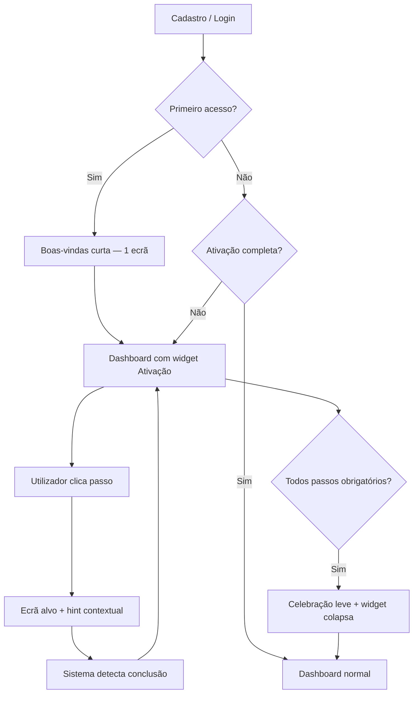

# Ativação guiada — especificação de produto

> **Status:** ideia aprovada para documentação · **não implementado**  
> **Data:** 2026-05-25  
> **Canais:** App (Expo/RN), Site (onde fizer sentido), Backend (Supabase/API), WhatsApp (Midas)

---

## 1. Problema

Hoje o utilizador passa por um **onboarding genérico** (3 slides institucionais) guardado só em `AsyncStorage` (`onboarding_done`). Depois do login, entra no dashboard **sem saber o que fazer primeiro**.

O produto já tem vários pilares (transações, contas, orçamentos, agenda, MEI/DAS/NFSe, bot WhatsApp), mas **não há um fio condutor** que:

- ligue app ↔ WhatsApp ↔ MEI (site/app);
- reduza abandono nos primeiros 7 dias;
- mostre progresso claro (“falta 2 passos para estar operacional”).

---

## 2. Objetivo

Substituir (ou complementar) o onboarding actual por uma **ativação guiada**: checklist persistente, com passos acionáveis, detecção automática de conclusão e UI visível até o utilizador estar “pronto”.

### Métricas de sucesso (MVP)

| Métrica | Meta inicial |
|--------|----------------|
| % utilizadores com ≥ 3 passos core concluídos em 7 dias | > 40% |
| % com telefone WhatsApp ligado em 14 dias | > 25% |
| % com ≥ 1 transação criada em 3 dias | > 50% |
| Taxa de dismiss do widget sem completar | monitorizar (não bloquear) |

---

## 3. Estado actual (referência técnica)

| Peça | Onde | Comportamento hoje |
|------|------|-------------------|
| Slides de boas-vindas | `App/frontend/screens/OnboardingScreen.tsx` | 3 slides; “Pular” ou fim → `onboarding_done` |
| Flag local | `App/frontend/app/onboarding.tsx`, `app/index.tsx` | `AsyncStorage` apenas no dispositivo |
| Telefone / perfil | `SettingsScreen.tsx` | `updatePhone` → liga bot (`n8n_link`) |
| Google Calendar | Settings + `googleCalendarStore` | OAuth; usado na agenda |
| Contas | `ContasScreen.tsx` | CRUD contas financeiras |
| Transações | `TransactionsScreen.tsx` | Lançamentos manuais |
| Orçamentos | `OrcamentosScreen.tsx` | Orçamento por categoria |
| MEI | `MeiScreen.tsx` (app) + `GuidesMei.tsx` (site) | Certificado, DAS, NFSe |
| Bot WhatsApp | OpenClaw + Z-API | Exige telefone no perfil |

**Gap:** nenhuma destas acções alimenta um “progresso de ativação” unificado.

---

## 4. Proposta — experiência do utilizador

### 4.1 Fluxo geral



### 4.2 Boas-vindas (substituir ou encurtar slides)

**MVP:** 1 ecrã (não 3):

- Título: *“Vamos deixar sua conta pronta em poucos minutos”*
- Subtítulo: *“Você pode pular e voltar depois pelo dashboard.”*
- CTA primário: **Começar ativação**
- Secundário: **Ir direto ao app**

Quem escolhe “Ir direto” vê o widget no dashboard; quem “Começar” abre o painel expandido do checklist.

### 4.3 Widget no dashboard

Card fixo (topo ou abaixo do header), estilo alinhado ao design tech/glass existente:

- Barra de progresso: `3/5 concluídos`
- Lista de passos com ícone: pendente · em progresso · feito
- Cada linha: título curto + botão **Fazer agora** (deep link)
- Link discreto: *“Ocultar por agora”* (snooze 7 dias, não marca como completo)
- Quando 100% dos passos **obrigatórios**: animação breve + card minimiza para chip “Conta ativa ✓”

**Regra:** o widget **não bloqueia** navegação; só orienta.

---

## 5. Passos da ativação

### 5.1 Passos core (todos os utilizadores)

| ID | Passo | Critério de conclusão (automático) | Destino no app |
|----|-------|-----------------------------------|----------------|
| `profile_name` | Confirmar seu nome | `displayName` não vazio (≥ 2 chars) | Configurações → Perfil |
| `phone_whatsapp` | Ligar WhatsApp | Telefone válido BR em perfil / `n8n_link` resolvível | Configurações → Telefone |
| `first_account` | Criar uma conta | ≥ 1 registo em `contas_financeiras` activo | Contas → Nova conta |
| `first_transaction` | Registrar movimentação | ≥ 1 transação do utilizador | Transações → Novo |
| `first_budget` | Definir um orçamento | ≥ 1 orçamento de categoria no mês actual | Orçamentos |

### 5.2 Passos opcionais (recomendados)

| ID | Passo | Critério | Destino |
|----|-------|----------|---------|
| `google_calendar` | Conectar Google Calendar | Integração OAuth activa | Configurações → Google |
| `explore_dashboard` | Ver resumo do mês | Evento: utilizador abriu dashboard 2+ dias ou scroll no módulo saldo | Dashboard |

### 5.3 Passos MEI (condicionais)

Mostrar **só se** `memberships.mei === true` ou flag MEI no perfil/empresa (mesma regra já usada no app).

| ID | Passo | Critério | Destino |
|----|-------|----------|---------|
| `mei_certificate` | Certificado A1 | Certificado MEI presente (API `fetchMeiCertificateStatus`) | MEI → Certificado / Site GuidesMei |
| `mei_das_view` | Consultar DAS | Utilizador abriu aba DAS ou `get_das_payment_status` ok | MEI → DAS |
| `mei_nfse_catalog` | Cadastrar cliente NFSe | ≥ 1 cliente no catálogo NFSe | MEI → Notas / catálogo |

**Ordem sugerida na UI:** core primeiro → opcionais → bloco MEI (colapsável “Sou MEI”).

### 5.4 Passos admin (condicionais)

Só para `admin` / `superadmin`:

| ID | Passo | Critério | Destino |
|----|-------|----------|---------|
| `admin_users` | Conhecer gestão de acessos | Visitou `ManageUsersScreen` ou aprovou 1 pedido | Gerenciar acessos |

---

## 6. Detecção de conclusão

### 6.1 Princípio

- **Preferir detecção server-side** (fonte da verdade) sobre cliques manuais “marquei como feito”.
- Recalcular progresso ao abrir dashboard, após criar transação/conta, e em pull-to-refresh.
- Cache local opcional para offline; reconciliar no sync.

### 6.2 Fontes de dados (existentes)

| Passo | Query / serviço |
|-------|-----------------|
| Nome | `profiles.display_name` ou auth metadata |
| Telefone | `user_metadata.phone` / tabela link WhatsApp |
| Conta | `contas_financeiras` count |
| Transação | `transactions` count por `user_id` |
| Orçamento | orçamentos do mês (store existente) |
| Google | flag integração calendar |
| MEI cert | endpoint certificado MEI |
| MEI DAS | tab visit ou status DAS |
| NFSe catálogo | `list_nfse_clientes` count |

### 6.3 API proposta (MVP)

```
GET  /api/users/me/activation
POST /api/users/me/activation/dismiss   { snoozeDays: 7 }
```

**Resposta exemplo:**

```json
{
  "ok": true,
  "progress": {
    "completed": 3,
    "totalRequired": 5,
    "percent": 60,
    "isComplete": false,
    "dismissedUntil": null
  },
  "steps": [
    {
      "id": "phone_whatsapp",
      "title": "Ligar WhatsApp",
      "description": "Use o Midas no celular para lançar gastos por mensagem.",
      "status": "pending",
      "required": true,
      "route": "settings:phone",
      "completedAt": null
    }
  ]
}
```

---

## 7. Modelo de dados (proposta)

### Opção A — MVP sem migration pesada

- Calcular passos **on-the-fly** no backend (sem tabela nova).
- Guardar só `activation_dismissed_until` em `profiles` ou `user_metadata`.

### Opção B — Persistência explícita (fase 2)

Tabela `user_activation_progress`:

| Coluna | Tipo | Notas |
|--------|------|-------|
| `user_id` | uuid PK | |
| `step_id` | text | ex. `first_transaction` |
| `status` | enum | pending, completed, skipped |
| `completed_at` | timestamptz | |
| `metadata` | jsonb | opcional |

**Recomendação:** começar com **Opção A**; migrar para B se precisarmos de analytics fino ou passos “skipped” manualmente.

---

## 8. Site (marketing / web app)

| Onde | O quê |
|------|--------|
| Landing (`LandingPage.tsx`) | Secção “Comece em 5 minutos” com os mesmos 5 passos core (copy only) |
| Pós-login site admin | Banner fino se MEI sem certificado (link GuidesMei) |
| GuidesMei | Chip “Passo 3 de 5: certificado” se activation incompleta (fase 2) |

Site **não precisa** duplicar o widget completo no MVP; basta alinhar messaging.

---

## 9. WhatsApp (Midas)

Quando `phone_whatsapp` estiver **pendente** e utilizador abrir o bot sem telefone ligado:

- Bot já orienta a guardar telefone na app (SOUL existente).
- **Melhoria futura:** deep link ou QR na Configurações → “Abrir conversa com o Midas” (`wa.me/...`).

Quando telefone **ligado** e `first_transaction` pendente:

- Mensagem única no widget: *“Experimente: envie ‘gastei 25 no café’ no WhatsApp.”*

Não enviar push proactivo de ativação no MVP (evitar spam).

---

## 10. Copy orientativa (PT-BR)

| Passo | Título | Descrição curta |
|-------|--------|-----------------|
| profile_name | Seu nome | Como aparece no app e no bot. |
| phone_whatsapp | WhatsApp | Lance gastos e receba DAS pelo celular. |
| first_account | Uma conta | Carteira, banco ou dinheiro — onde entra e sai o dinheiro. |
| first_transaction | Primeiro lançamento | Entrada ou saída; pode ser de hoje. |
| first_budget | Um orçamento | Limite mensal numa categoria (ex.: Alimentação). |
| google_calendar | Google Calendar | Lembretes de pagamento na agenda. |
| mei_certificate | Certificado MEI | Necessário para DAS e notas fiscais. |

---

## 11. Fases de implementação

### Fase 1 — MVP (app)

- [ ] Endpoint `GET /api/users/me/activation` (cálculo on-the-fly)
- [ ] Componente `ActivationChecklistCard` no dashboard
- [ ] Deep links / `navigateTo` para cada passo
- [ ] Substituir ou encurtar `OnboardingScreen` (1 ecrã)
- [ ] Snooze dismiss (local ou backend)
- [ ] Testes unitários das regras de conclusão

### Fase 2 — Polish

- [ ] Sync dismiss + progresso entre dispositivos (backend)
- [ ] Passos MEI/admin condicionais
- [ ] Landing alinhada
- [ ] Eventos analytics (opcional)

### Fase 3 — Retenção

- [ ] Nudge suave por email/WhatsApp só se telefone ligado e passo pendente > 7 dias
- [ ] Reativação checklist se utilizador inactive 30 dias e passos incompletos

---

## 12. Fora de escopo (MVP)

- Gamificação (badges, pontos)
- Bloquear app até completar checklist
- Onboarding vídeo
- Import de extrato como passo (feature separada)
- Tutorial interactivo passo-a-passo overlay (coach marks) — pode vir depois

---

## 13. Critérios de aceitação (MVP)

1. Utilizador novo vê widget com ≥ 5 passos core após login.
2. Ao criar primeira transação, passo `first_transaction` marca **feito** sem refresh manual (ou no próximo focus do dashboard).
3. Utilizador MEI vê passos MEI adicionais; utilizador não-MEI não vê.
4. “Ocultar por agora” esconde widget por 7 dias.
5. Com todos os passos obrigatórios feitos, widget desaparece ou minimiza.
6. Slides antigos de 3 páginas removidos ou reduzidos a 1 ecrã introdutório.
7. `npm run lint`, `typecheck`, `test` no App e backend conforme AGENTS.md.

---

## 14. Arquivos prováveis (implementação futura)

| Área | Caminho |
|------|---------|
| Spec (este doc) | `Site/docs/product/ativacao-guiada.md` |
| Onboarding actual | `App/frontend/screens/OnboardingScreen.tsx` |
| Entry onboarding | `App/frontend/app/onboarding.tsx` |
| Dashboard widget | `App/frontend/screens/Dashboard/` (novo componente) |
| API activation | `Site/backend/src/routes/` + service novo |
| Landing copy | `App/frontend/screens/LandingPage.tsx` |
| Settings telefone | `App/frontend/screens/SettingsScreen.tsx` |

---

## 15. Story backlog sugerido

1. **ativacao-p0-backend** — endpoint activation + regras de conclusão  
2. **ativacao-p0-dashboard-widget** — UI checklist + navegação  
3. **ativacao-p1-onboarding-curto** — 1 ecrã boas-vindas  
4. **ativacao-p1-mei-conditional** — passos MEI  
5. **ativacao-p2-site-landing** — copy alinhada  

---

## Histórico

| Data | Nota |
|------|------|
| 2026-05-25 | Documento inicial — ideia discutida em produto (substituir onboarding genérico). |
