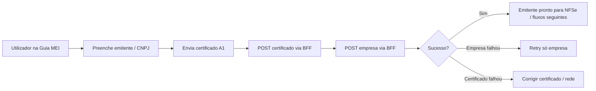

# Especificação de front-end e UX — Paridade **addCompany** (Guia MEI / CNPJ)

**Versão:** 1.0  
**Data:** 2026-04-09  
**Tipo:** Brownfield — evolução da experiência existente na **Guia MEI**, sem exigir novo ecrã dedicado “addCompany”  
**PRD fonte:** [`docs/prd/PRD-plugnotas-addcompany-guia-mei-cnpj-mapeamento-2026-04-09.md`](../prd/PRD-plugnotas-addcompany-guia-mei-cnpj-mapeamento-2026-04-09.md)

---

## 1. Propósito deste documento

Traduzir os requisitos de produto do PRD em **comportamento de interface**, **hierarquia de feedback**, **copy** e **critérios de aceitação UX** para a jornada em que o utilizador regista **CNPJ / dados de emitente** e o produto orquestra **POST certificado → POST empresa** (paridade com **addCompany** / **POST `/empresa`** via BFF).

**Público:** UX, frontend, QA, suporte (narrativa alinhada ao PRD).

---

## 2. Princípios de experiência (derivados do PRD)

1. **Sem jargão de API ao utilizador** — O MEI não precisa de saber “addCompany”; a cópia fala em “configurar a empresa no emissor”, “registar a empresa”, “dados do emitente”.
2. **Sequência canónica visível na mente do sistema** — Certificado antes de empresa quando o fluxo exige certificado; erros devem deixar claro **em que fase** falhou (`certificado` vs `empresa`).
3. **Recuperação sem culpar o utilizador** — Falhas de rede, validação Plugnotas ou ambiente: mensagens acionáveis, com distinção entre “tentar de novo só a empresa” e “rever certificado”.
4. **Continuidade do retry parcial** — Se o certificado foi aceite e a empresa falhou, o utilizador deve encontrar um caminho explícito para **repetir só o registo da empresa** sem novo upload de certificado quando o contexto o permitir (alinhado a `FR-ADDCO-04`).
5. **Governança de copy em erro** — Mensagens densas do provedor são filtradas/formatadas (`formatPlugnotasIntegrationError`, painéis de contexto) sem expor segredos ou dados sensíveis (`NFR-ADDCO-02`, `NFR-ADDCO-03`).

---

## 3. Âmbito de superfície (UI)

| Incluído | Notas |
|----------|--------|
| Aba / área **Guia MEI** onde vivem certificado, DAS e emissão fiscal | Fluxo principal; sem nova rota obrigatória. |
| Formulário e validação de **dados mínimos do emitente** (CNPJ, razão social, endereço, IBGE/prefeitura conforme regras actuais) | Contrato partilhado com `buildNfEmissionEmpresaPayload`. |
| Feedback empilhado junto à emissão (tier 1) e painéis de erro de cadastro | Inclui `GuiaMeiCertificateConnectivityPanel`, `GuiaMeiEmpresaCadastroErrorPanel`, contexto SOL/overlay P0 quando aplicável. |
| Estado de **retry pendente** (`plugnotasPendingRetry`, fase 2 falhou) | CTA e mensagens coerentes com “certificado OK, empresa falhou”. |

| Fora do âmbito UX desta iniciativa (PRD) |
|-------------------------------------------|
| Nova integração browser → Plugnotas. |
| Redesign completo da Guia MEI. |
| Métricas agregadas P1 (podem informar copy futura, não bloqueiam esta spec). |

---

## 4. Jornada do utilizador (mapa conceptual)

**Mensagem mental do utilizador:** “Quero que o app registe a minha empresa no emissor para eu poder emitir.”

---

## 5. Fluxos e estados de interface

### 5.1 Caminho feliz (cadastro completo)

- Após validação local dos dados de emitente e envio do certificado, o cliente invoca `submitPlugnotasEmitenteSetup` com `buildCompanyPayload(certificadoId)` que materializa o corpo alinhado a **POST `/empresa`**.
- **Feedback de sucesso:** deve confirmar conclusão da configuração fiscal / empresa no emissor (copy existente ou evolução mínima — não contradizer “empresa registada” se o backend confirmou).
- **Fase interna:** `onPhaseChange` pode reflectir `certificado` → `empresa` para spinners ou estados desabilitados (já suportado no utilitário).

### 5.2 Falha na fase certificado

- **Causas:** rede, senha inválida, rejeição pelo provedor.
- **UX:** mensagem no painel de erro de cadastro; se certificado foi enviado ao MEI mas falhou a integração fiscal, usar o prefixo contextual já presente no código para não contradizer o que o utilizador viu no portal MEI.
- **Não** misturar com mensagens de “empresa” sem necessidade.

### 5.3 Falha na fase empresa (certificado aceite)

- Disparar fluxo que preenche detalhe de retry (`plugnotasEmpresaRetryDetail`, `plugnotasPendingRetry` com `certificadoId` + CNPJ quando disponível).
- **Copy:** explicar que o certificado foi aceite mas o **registo da empresa** falhou; oferecer **ação de repetir só o registo da empresa** (via `retryPlugnotasEmpresaRegistro`) quando o estado o permitir.
- **Conectividade:** se a falha for de rede (`isFetchConnectivityFailure`), priorizar painel de conectividade em vez de retry de empresa com payload obsoleto sem feedback claro.

### 5.4 Conflito empresa já existente (política backend)

- O PRD exige seguir a política já implementada (tentativa de actualização / fluxo equivalente a `cadastrarEmpresaPlugNotas`).
- **UX:** não exigir ao utilizador um “segundo fluxo paralelo” não documentado na app; mensagens devem reflectir “actualização” ou “sincronização” quando o copy mapping existente (`getPlugnotasEmpresaCadastroErrorUxVariant`, hints) assim o definir.

### 5.5 Ambiente incorrecto (NFR)

- Falhas “estranhas” em massa podem ser ambiente. **UX:** onde já existir indicação de saúde de API (ex.: `DevApiHealthIndicator`), manter; não expandir escopo além do PRD salvo story.

---

## 6. Hierarquia de feedback (emitir NFSe — tier 1)

Ordem conceptual (do mais bloqueante ao menos), alinhada ao empilhamento existente:

1. **Conectividade** — bloqueia tentativas úteis; mensagem curta e acção de rever rede.
2. **Erro de certificado** — antes de empresa; não sugerir “retry empresa” se o certificado não está válido no contexto.
3. **Erro de sincronização / dados emitente** — `nfEmissionCompanySyncError` + painel de contexto SOL quando aplicável.
4. **Ausência de certificado / emitente incompleto** — avisos orientados à aba ou secção certa.

Referência de implementação do empilhamento: `nfseEmitFeedbackTier1` em `GuidesMei.tsx`.

---

## 7. Componentes e responsabilidades UX

| Componente / utilitário | Papel UX |
|-------------------------|----------|
| `submitPlugnotasEmitenteSetup` | Garante sequência canónica e erros tipados por fase (`PlugnotasEmitenteSetupError`). |
| `retryPlugnotasEmpresaRegistro` | CTA “repetir só empresa” sem novo certificado quando o estado o permite. |
| `GuiaMeiEmpresaCadastroErrorPanel` | Apresenta mensagem + metadados fiscais (código / HTTP) de forma legível, sem raw dump excessivo. |
| `GuiaMeiCertificateConnectivityPanel` | Falhas de rede na jornada certificado/empresa. |
| `PlugnotasEmpresaCadastroSolContextPanel` | Contexto adicional quando o mapeamento de erro o exige. |
| Utilitários de hint (`nfseNacionalPlugnotasErrorHints`, `plugnotasEmpresaCadastroSolUx`) | IBGE/prefeitura e requisitos municipais — manter coerência quando o contrato Plugnotas evoluir (`FR-ADDCO-05`). |

---

## 8. Requisitos de UI mapeados aos FRs

| ID PRD | Implicação UX |
|--------|----------------|
| **FR-ADDCO-01** | O utilizador completa o fluxo na Guia MEI; a UI não precisa expor “POST `/empresa`”, mas deve permitir concluir os passos que desencadeiam o BFF. |
| **FR-ADDCO-02** | O formulário de emitente e validações (`getNfEmissionCompanyValidationMessage`, normalização IBGE, documentos activos) são a **única** fonte de verdade visual antes do envio; mensagens de validação consistentes com o BFF. |
| **FR-ADDCO-03** | Copy e CTAs não pedem fluxo alternativo “fora da app”; erros de conflito seguem padrões já mapeados. |
| **FR-ADDCO-04** | Estado de retry parcial visível; botão/fluxo de “tentar novamente o registo da empresa” quando `plugnotasPendingRetry` está definido e política UI o permite. |
| **FR-ADDCO-05** (P1) | Após mudança de contrato Plugnotas, rever **labels**, hints de IBGE/prefeitura e mensagens de erro mapeadas; checklist de paridade documentada na story. |

---

## 9. Acessibilidade e consistência

- **WCAG AA:** painéis de erro com `role="alert"` / `role="status"` conforme já usado; botões com texto explícito (não só ícone) para acções de retry.
- **Foco:** após erro de submissão, foco deve ir para o resumo de erro ou primeiro campo corrigível (evolução incremental — alinhar em story se ainda não estiver garantido em todos os ramos).
- **Tokens:** novas superfícies devem reutilizar classes e padrões existentes (`admin-alert-danger`, `admin-alert-warning`, tipografia `text-xs` / `text-sm` já usada na pilha de feedback).

---

## 10. Conteúdo (copy) — linhas guia

- **Evitar:** “addCompany”, “endpoint”, “Plugnotas API” em texto para utilizador final.
- **Preferir:** “Registar a empresa no emissor”, “Configuração fiscal”, “Dados do emitente”, “Certificado aceite — falhou o registo da empresa”.
- **Erros técnicos:** mostrar mensagem amigável + detalhe opcional (código) como já faz `GuiaMeiEmpresaCadastroErrorPanel`.

---

## 11. Critérios de aceite UX (testáveis)

1. Simular falha só na fase **empresa** com `certificadoId` válido: a UI apresenta caminho de **retry de empresa** sem exigir novo ficheiro de certificado, quando o estado `plugnotasPendingRetry` está activo.
2. Simular falha na fase **certificado**: a UI **não** apresenta CTA de retry de empresa como solução primária.
3. Mensagens de erro distinguem **conectividade** vs **validação do provedor** (comportamento actual preservado ou melhorado, não regressão).
4. Utilizador consegue completar o fluxo feliz com CNPJ válido e dados exigidos, sem referências a APIs internas.
5. Alterações futuras ao contrato **addCompany** disparam revisão de copy/hints listada em **FR-ADDCO-05** antes de release.

---

## 12. Rastreabilidade técnica (ficheiros de referência)

| Área | Ficheiros |
|------|-----------|
| Página Guia MEI | `frontend/src/pages/GuidesMei.tsx` |
| Sequência certificado → empresa | `frontend/src/utils/plugnotasEmitenteSetup.ts` |
| Payload empresa / validação | `frontend/src/utils/nfEmissionCompany.ts` (e utilitários relacionados) |
| Serviço BFF | `frontend/src/services/meiNotasService.ts` (funções `cadastrar*` emissão NF) |
| Backend (paridade serviço) | `backend/src/services/plugnotas/empresa.service.js` |

---

## 13. Histórico

| Data | Versão | Notas |
|------|--------|-------|
| 2026-04-09 | 1.0 | Versão inicial a partir do PRD **PRD-plugnotas-addcompany-guia-mei-cnpj-mapeamento-2026-04-09**. |

---

**Fim da especificação.**
