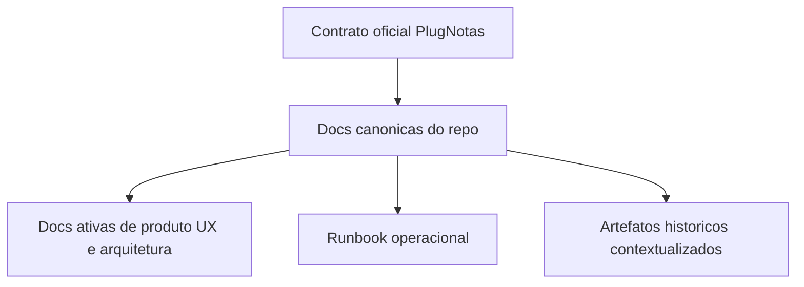
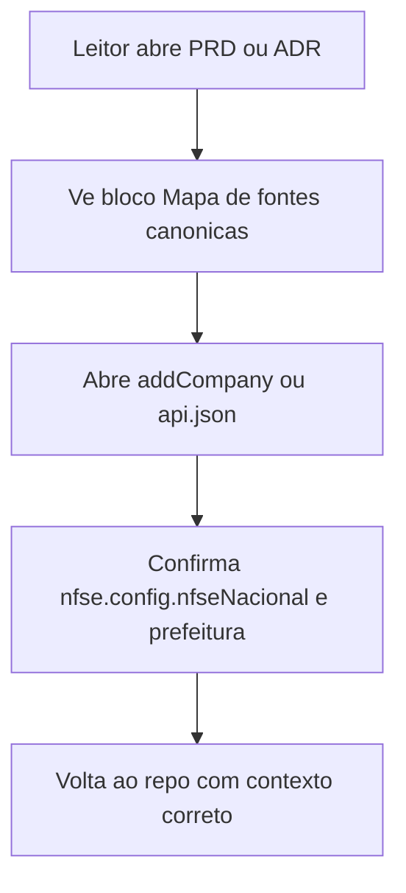
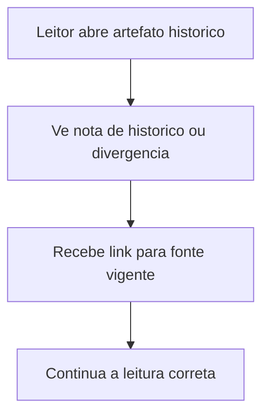

# Especificacao de front-end e UX -- atualizacao das docs canonicas do cadastro de empresa PlugNotas para o contrato oficial

**Versao:** 1.0  
**Data:** 2026-04-14  
**Autoria:** Uma (ux-design-expert, fluxo AIOX)  
**PRD de origem:** [`docs/prd/PRD-atualizacao-docs-contrato-oficial-plugnotas-cadastro-empresa-2026-04-14.md`](../prd/PRD-atualizacao-docs-contrato-oficial-plugnotas-cadastro-empresa-2026-04-14.md)  
**Brief de origem:** [`docs/brief/brief-atualizacao-docs-contrato-oficial-plugnotas-cadastro-empresa-2026-04-14.md`](../brief/brief-atualizacao-docs-contrato-oficial-plugnotas-cadastro-empresa-2026-04-14.md)

**Referencias externas (contrato):**

- [PlugNotas -- Empresa / addCompany](https://docs.plugnotas.com.br/#tag/Empresa/operation/addCompany)
- [PlugNotas -- Consultar disponibilidade do municipio e metadados](https://docs.plugnotas.com.br/#operation/getCidadeById)
- [PlugNotas -- OpenAPI oficial (`api.json`)](https://docs.plugnotas.com.br/api.json)

---

## 1. Objetivo deste documento

Esta spec traduz o PRD em um contrato de UX para **superficies documentais** do repositorio, nao para telas novas do produto.

O objetivo e melhorar a experiencia de leitura, navegacao e interpretacao dos artefatos PlugNotas, para que qualquer pessoa que abra o repo consiga distinguir rapidamente:

1. **contrato oficial do fornecedor**;
2. **politica atual do produto**;
3. **estado atual da implementacao local**;
4. **historico de decisoes antigas**.

**Importante:** esta iniciativa e **docs-first**. Nao existe exigencia de nova UI runtime na Guia MEI nem de novo componente de produto. O "front-end" aqui refere-se a como a documentacao e consumida em Markdown, preview do IDE e navegacao interna por links/ancoras.

---

## 2. Relacao com outros artefatos

| Artefato | Papel |
|---|---|
| [`docs/operacao-mei-nfse.md`](../operacao-mei-nfse.md) | Superficie operacional principal para triagem e troubleshooting. |
| [`docs/architecture.md`](../architecture.md) | Vista consolidada de arquitetura; precisa deixar de comunicar `nfse.nacional` como contrato canonico. |
| [`docs/adr/ADR-plugnotas-nfse-nacional-empresa-spike.md`](../adr/ADR-plugnotas-nfse-nacional-empresa-spike.md) | Artefato historico que precisa ser contextualizado visualmente. |
| [`docs/adr/ADR-plugnotas-empresa-payload-apenas-nfse.md`](../adr/ADR-plugnotas-empresa-payload-apenas-nfse.md) | Documento de politica local do produto. |
| [`docs/prd/PRD-400-nfse-prefeitura-login-obrigatorio-plugnotas-2026-04-09.md`](../prd/PRD-400-nfse-prefeitura-login-obrigatorio-plugnotas-2026-04-09.md) | PRD ativo do cluster PLOGIN; precisa ser alinhado ao contrato oficial. |
| [`docs/specs/ux-spec-400-nfse-prefeitura-login-obrigatorio-plugnotas-2026-04-09.md`](./ux-spec-400-nfse-prefeitura-login-obrigatorio-plugnotas-2026-04-09.md) | Spec UX ativa do mesmo cluster; precisa receber a distincao contrato oficial x politica local. |
| [`docs/technical/architecture-400-nfse-prefeitura-login-obrigatorio-plugnotas-2026-04-09.md`](../technical/architecture-400-nfse-prefeitura-login-obrigatorio-plugnotas-2026-04-09.md) | Arquitetura tecnica ativa para PLOGIN. |
| [`docs/brief/brief-plugnotas-addcompany-guia-mei-cnpj-mapeamento-2026-04-09.md`](../brief/brief-plugnotas-addcompany-guia-mei-cnpj-mapeamento-2026-04-09.md) | Brief ativo de addCompany; precisa refletir o schema oficial atual. |

---

## 3. Principios de UX

| Principio | Aplicacao |
|---|---|
| **Fonte certa para assunto certo** | O leitor deve saber, no topo do artefato, se esta vendo contrato oficial, politica local, runbook ou historico. |
| **Contrato antes da interpretacao** | Quando houver divergencia, a doc deve mostrar primeiro o que o PlugNotas publica oficialmente e depois a politica do produto. |
| **Causa antes do workaround** | Triagem deve mostrar `/nfse/cidades/{codigoIbge}`, `padraoNacional`, `login` e `senha` antes de conclusoes simplistas como "nao suportado" ou "payload errado". |
| **Historico sem ambiguidade** | Artefatos antigos nao devem ser apagados nem continuar parecendo fonte vigente. |
| **Navegacao curta e auditavel** | Links externos e internos devem ser claros, clicaveis e com destino previsivel. |
| **Uma verdade por bloco** | Evitar paragrafo misturando contrato do fornecedor, politica local e shape legado sem rotulos explicitos. |

---

## 4. Personas e necessidades

| Persona | Superficie principal | Necessidade |
|---|---|---|
| **Produto / PO / PM** | PRDs, briefs, ADRs | Entender o que mudou no contrato oficial e o que ainda e apenas politica local ou backlog tecnico. |
| **Frontend / Backend / Architect** | ADR, arquitetura, spec UX, `architecture.md` | Distinguir contrato oficial de shape legado e evitar implementar a partir de premissa errada. |
| **Operacao / QA** | `docs/operacao-mei-nfse.md`, PRD PLOGIN, spec UX PLOGIN | Executar triagem correta com consulta de municipio e sem narrativa errada de endpoint. |
| **Leitor ocasional do repo** | `docs/architecture.md`, docs relacionadas | Chegar ao artefato certo rapido, sem depender de contexto oral do time. |

---

## 5. Escopo UX e front-end

### 5.1 Dentro do escopo

- Estrutura de navegacao e cross-linking entre docs PlugNotas.
- Rotulos e blocos padrao para explicitar contrato oficial, politica local, divergencia atual e historico.
- Ordem de leitura recomendada nas docs vivas.
- Requisitos de escaneabilidade e de links/ancoras.
- Regras de conteudo para o cluster PLOGIN/addCompany.

### 5.2 Fora do escopo

- Alteracao obrigatoria de componentes React do produto.
- Criacao de nova tela para credenciais municipais.
- Mudanca do payload runtime.
- Reescrita integral de todo o historico PlugNotas.

---

## 6. Arquitetura de informacao

### 6.1 Modelo de camadas documentais



<a id="ux-docpn-hierarquia"></a>
### 6.2 Hierarquia de leitura obrigatoria

1. **Contrato oficial atual**
   - `addCompany`
   - `getCidadeById`
   - `api.json`
2. **Docs canonicas do repo**
   - ADR atualizado
   - `docs/architecture.md`
   - `docs/operacao-mei-nfse.md`
3. **Docs ativas derivadas**
   - PRD PLOGIN / addCompany
   - spec UX PLOGIN
   - arquitetura tecnica PLOGIN
4. **Historico**
   - spike antigo
   - evidencias e stories fechadas com a hipotese anterior

<a id="ux-docpn-mapa-fontes"></a>
### 6.3 Mapa de fontes canonicas

As docs ativas do cluster devem expor, perto do topo, um bloco ou tabela curta com:

- contrato oficial `addCompany`;
- contrato oficial `getCidadeById`;
- OpenAPI `api.json`;
- artefato canonico interno equivalente;
- uma linha de proposito por fonte.

Isso atende diretamente `FR-DOCPN-05` e melhora navegabilidade para revisao e auditoria.

---

## 7. Fluxos de usuario

### 7.1 Fluxo A -- leitor quer descobrir o contrato correto

**Goal:** sair de um artefato interno com a fonte oficial certa, sem confundir shape legado com contrato atual.



**Success Criteria**
- o leitor encontra os links oficiais em ate um bloco de scroll;
- o artefato deixa claro se o shape local ainda esta legado.

### 7.2 Fluxo B -- operacao/QA triando um caso real

**Goal:** validar municipio/ambiente antes de concluir causa raiz.

```mermaid
graph TD
  A[Operacao abre runbook] --> B[Ve checklist com /nfse/cidades/{codigoIbge}]
  B --> C[Consulta padraoNacional login senha]
  C --> D[Compara com erro e com politica local]
  D --> E[Registra conclusao correta]
```

**Success Criteria**
- a consulta de municipio aparece antes da conclusao final;
- a doc nao leva o leitor direto a um diagnostico simplista.

<a id="ux-docpn-fluxo-historico"></a>
### 7.3 Fluxo C -- leitor cai em artefato historico

**Goal:** entender que o documento tem valor de rastreabilidade, nao de fonte vigente.



**Success Criteria**
- o documento historico nao parece decisao atual;
- existe link direto para a referencia vigente.

---

## 8. Regras de conteudo e copy

### 8.1 Toda doc ativa deve comunicar

- o que e **contrato oficial do fornecedor**;
- o que e **politica atual do produto**;
- o que e **estado atual da implementacao local**;
- quando um artefato antigo e **historico**.

### 8.2 Toda doc ativa deve evitar

- afirmar `nfse.nacional` como contrato oficial sem ressalva;
- tratar `prefeitura.login` / `senha` como surpresa nao documentada pelo fornecedor;
- omitir `/nfse/cidades/{codigoIbge}` quando a doc falar de triagem municipal;
- misturar em um mesmo paragrafo contrato, politica e backlog sem rotulos.

<a id="ux-docpn-copy-historico"></a>
### 8.3 Copy-modelo recomendado

**Bloco de divergencia atual**

> O contrato oficial atual do PlugNotas documenta `nfse.config.nfseNacional`.  
> O repositorio ainda possui implementacao local legada com `nfse.nacional`.  
> Esta divergencia permanece documentada ate backlog tecnico proprio.

**Bloco de politica local**

> O produto atual continua nacional-first e nao aceita credenciais municipais neste fluxo.  
> Isso e uma politica local do Meu Financeiro, nao uma limitacao do schema oficial do fornecedor.

**Bloco de historico**

> Este artefato permanece no repositorio por rastreabilidade historica.  
> Para a referencia vigente, consultar o ADR/runbook atualizado listado abaixo.

---

## 9. Padroes de interface documental

<a id="ux-docpn-blocos-obrigatorios"></a>
### 9.1 Blocos obrigatorios nas docs vivas

| Bloco | Proposito |
|---|---|
| **Mapa de fontes canonicas** | navegao rapida para fontes oficiais e internas |
| **Estado atual / divergencia** | explicitar o gap contrato oficial x implementacao local |
| **Politica local do produto** | separar decisao do produto da definicao do fornecedor |
| **Historico / contexto** | reclassificar artefatos antigos sem apagar rastreabilidade |

### 9.2 Padrao de titulos

- preferir titulos curtos e funcionais;
- deixar "historico", "canonica", "politica local" ou "divergencia" visivel no titulo da secao quando aplicavel;
- evitar titulos ambivalentes como "modo nacional" sem dizer se se trata de contrato oficial ou hipotese interna.

### 9.3 Padrao de links

- links externos oficiais devem aparecer em lista curta e explodida, nao escondidos no meio do paragrafo;
- links internos devem usar caminho relativo consistente com a pasta do artefato;
- quando houver ancora importante, preferir link por secao/ancora em vez de apenas arquivo generico.

---

## 10. Superficies afetadas

<a id="ux-docpn-superficies-p0"></a>
### 10.1 Prioridade P0

- `docs/adr/ADR-plugnotas-nfse-nacional-empresa-spike.md`
- `docs/architecture.md`
- `docs/operacao-mei-nfse.md`
- `docs/brief/brief-plugnotas-addcompany-guia-mei-cnpj-mapeamento-2026-04-09.md`
- `docs/adr/ADR-plugnotas-empresa-payload-apenas-nfse.md`

<a id="ux-docpn-superficies-p1"></a>
### 10.2 Prioridade P1

- `docs/prd/PRD-400-nfse-prefeitura-login-obrigatorio-plugnotas-2026-04-09.md`
- `docs/specs/ux-spec-400-nfse-prefeitura-login-obrigatorio-plugnotas-2026-04-09.md`
- `docs/technical/architecture-400-nfse-prefeitura-login-obrigatorio-plugnotas-2026-04-09.md`
- outros artefatos ativos addCompany/robustez que ainda citem `nfse.nacional` como shape oficial

<a id="ux-docpn-superficies-p2"></a>
### 10.3 Prioridade P2

- stories, evidencias e briefs historicos que precisem de nota de contexto

---

## 11. Acessibilidade e usabilidade documental

### 11.1 Requisitos

- headings em hierarquia consistente;
- listas curtas e escaneaveis;
- links com rotulos desambiguados;
- sem dependencia de memoria oral do time para entender se um artefato e historico ou vigente;
- textos de aviso e divergencia legiveis em preview Markdown simples.

### 11.2 Recomendacoes

- limitar blocos explicativos longos quando uma tabela resolver melhor;
- usar uma linha de proposito por fonte em vez de paragrafos extensos;
- quando houver nota de historico, posicionar logo acima da secao potencialmente ambigua;
- nao esconder a divergencia contrato x implementacao no change log apenas.

---

## 12. Mapeamento PRD -> UX spec

| PRD | Traducao UX/front-end |
|---|---|
| **FR-DOCPN-01** | Docs vivas precisam sinalizar explicitamente que `nfse.nacional` nao e contrato oficial vigente |
| **FR-DOCPN-02** | ADR + runbook devem expor o contrato oficial atual em bloco legivel |
| **FR-DOCPN-03** | Runbook deve incluir checklist de triagem com `/nfse/cidades/{codigoIbge}`, `padraoNacional`, `login`, `senha` |
| **FR-DOCPN-04** | Docs do cluster PLOGIN precisam distinguir schema oficial de `prefeitura` e politica local do produto |
| **FR-DOCPN-05** | Necessidade do bloco `Mapa de fontes canonicas` |
| **FR-DOCPN-06** | Padrao de nota de historico / contexto em artefatos antigos |
| **FR-DOCPN-07** | Specs e arquiteturas ativas devem mostrar evidencias de contrato, nao apenas parsing textual de erro |
| **FR-DOCPN-08** | Esta spec e docs-only; sem exigir migracao de runtime |

---

## 13. Criterios de aceite UX/front-end

- [ ] Os artefatos P0 expostos ao time passam a mostrar a hierarquia `contrato oficial -> politica local -> estado atual`.
- [ ] Existe `Mapa de fontes canonicas` ou bloco equivalente nas docs ativas do cluster.
- [ ] O runbook passa a orientar consulta de `/nfse/cidades/{codigoIbge}` com `padraoNacional`, `login` e `senha`.
- [ ] Artefatos historicos usados como referencia recebem nota de contexto ou marcador de historico.
- [ ] Nenhuma doc ativa segue tratando `nfse.nacional` como contrato oficial sem ressalva.
- [ ] A spec deixa claro que nao ha nova UI runtime obrigatoria nesta iniciativa.

---

## 14. Handoff

### Proximos passos

1. Atualizar os artefatos P0 conforme esta spec.
2. Repassar o mesmo padrao de bloco/copy para os artefatos ativos P1.
3. Revisar o cluster historico e adicionar notas de contexto onde necessario.
4. Validar com `@qa` a navegabilidade dos links e a ausencia de contradicoes.

### Checklist de handoff

- [ ] PRD e spec alinhados quanto ao escopo docs-only
- [ ] artefatos P0 identificados e priorizados
- [ ] padrao de bloco de divergencia definido
- [ ] padrao de bloco de historico definido
- [ ] referencias externas oficiais consistentes em todos os artefatos ativos

---

## 15. Change log

| Data | Versao | Descricao | Autor |
|---|---|---|---|
| 2026-04-14 | 1.0 | Spec inicial de front-end e UX para a atualizacao das docs canonicas do contrato oficial PlugNotas no cadastro de empresa. | UX Design Expert (Uma) |
