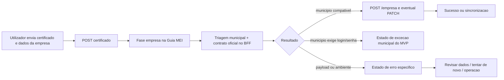

# Especificacao de front-end e UX -- correcao runtime do cadastro de empresa PlugNotas com contrato oficial e triagem municipal

**Versao:** 1.0  
**Data:** 2026-04-14  
**Autoria:** Uma (ux-design-expert, fluxo AIOX)  
**PRD de origem:** [`docs/prd/PRD-correcao-runtime-cadastro-empresa-plugnotas-contrato-oficial-triagem-municipal-2026-04-14.md`](../prd/PRD-correcao-runtime-cadastro-empresa-plugnotas-contrato-oficial-triagem-municipal-2026-04-14.md)  
**Brief de origem:** [`docs/brief/brief-correcao-runtime-cadastro-empresa-plugnotas-contrato-oficial-triagem-municipal-2026-04-14.md`](../brief/brief-correcao-runtime-cadastro-empresa-plugnotas-contrato-oficial-triagem-municipal-2026-04-14.md)

**Referencias externas (contrato):**

- [PlugNotas -- Empresa / addCompany](https://docs.plugnotas.com.br/#tag/Empresa/operation/addCompany)
- [PlugNotas -- Consultar disponibilidade do municipio e metadados](https://docs.plugnotas.com.br/#operation/getCidadeById)
- [PlugNotas -- OpenAPI oficial (`api.json`)](https://docs.plugnotas.com.br/api.json)

---

## 1. Objetivo deste documento

Esta spec traduz o PRD de correcao runtime em comportamento de front-end e UX para a jornada de cadastro da empresa na Guia MEI.

O objetivo do MVP e garantir que a interface:

1. mantenha **NFS-e Nacional** como narrativa padrao;
2. continue a tratar o cadastro da empresa como **uma unica jornada** dentro da Guia MEI;
3. reflita a nova decisao de runtime baseada em **contrato oficial + triagem municipal**;
4. deixe de depender apenas de heuristica textual depois de um `POST /empresa` falho;
5. nao introduza recolha de `login`/`senha` de prefeitura no MVP.

Esta spec tambem separa claramente:

- o que entra no **Epic 1 / MVP**;
- o que fica reservado para a **fase 2 condicional** de suporte municipal com credenciais.

---

## 2. Relacao com outros artefatos

| Artefato | Papel |
|---|---|
| [`ux-spec-cadastro-empresa-plugnotas-robusto-cenarios-nacional-fallback-excecao-2026-04-10.md`](./ux-spec-cadastro-empresa-plugnotas-robusto-cenarios-nacional-fallback-excecao-2026-04-10.md) | Base de cenarios de jornada para cadastro da empresa; esta spec atualiza o cluster com preflight municipal e contrato oficial. |
| [`ux-spec-400-nfse-prefeitura-login-obrigatorio-plugnotas-2026-04-09.md`](./ux-spec-400-nfse-prefeitura-login-obrigatorio-plugnotas-2026-04-09.md) | Subcaso em que o emissor exige `prefeitura.login` / `senha`; esta spec move esse diagnostico para antes do cadastro cego sempre que o BFF conseguir classificar o municipio. |
| [`ux-spec-tratativa-operacional-prefeitura-login-required-blocked-2026-04-13.md`](./ux-spec-tratativa-operacional-prefeitura-login-required-blocked-2026-04-13.md) | Mantem a tratativa operacional do codigo atual; esta spec prepara a UX para uma classificacao mais precoce e estavel. |
| [`ux-spec-resolucao-governada-prefeitura-login-required-blocked-2026-04-13.md`](./ux-spec-resolucao-governada-prefeitura-login-required-blocked-2026-04-13.md) | Governanca e escalonamento para recorrencia do caso municipal. |
| [`docs/operacao-mei-nfse.md`](../operacao-mei-nfse.md) | Runbook canonico da triagem e da causalidade `POST` -> `PATCH` -> `GET`. |
| [`docs/technical/architecture-400-nfse-prefeitura-login-obrigatorio-plugnotas-2026-04-09.md`](../technical/architecture-400-nfse-prefeitura-login-obrigatorio-plugnotas-2026-04-09.md) | Fronteiras tecnicas do BFF e pontos de extensao para municipios que exigem autenticacao. |

---

## 3. Principios de UX

| Principio | Aplicacao |
|---|---|
| **Uma unica experiencia** | O utilizador continua na Guia MEI. Nao existe rota nova para "preflight municipal" nem ecran separado de cadastro da empresa. |
| **Preflight invisivel, decisao visivel** | A verificacao do municipio acontece no backend, mas a UI deve refletir claramente o resultado dessa decisao quando ela bloquear ou destravar o cadastro. |
| **Contrato estavel acima de heuristica textual** | Sempre que o BFF devolver classificacao/codigo estavel, o frontend deve preferi-lo em vez de inferir estado apenas pela mensagem crua. |
| **Causa antes da consequencia** | O erro principal continua sendo o do cadastro da empresa; `GET` negativo posterior nao deve assumir protagonismo sobre a falha anterior. |
| **Nacional-first com honestidade** | O fluxo continua nacional-first, mas sem fingir que todos os municipios aceitam o mesmo caminho. |
| **Sem credenciais municipais no MVP** | Nao ha campos, CTA ou microcopy que pecam `login`/`senha` de prefeitura nesta fase. |
| **Retry so quando fizer sentido** | Se o problema for classificacao municipal nao suportada no MVP, a UI nao deve encorajar retry cego como acao principal. |

---

## 4. Personas e superficies

| Persona | Superficie | Necessidade principal |
|---|---|---|
| **MEI** | `GuidesMei.tsx` | Entender se o cadastro falhou por dados, ambiente, sincronizacao ou limite municipal do fluxo atual. |
| **Frontend** | `GuidesMei.tsx`, `FiscalIntegrationErrorAlert.tsx`, `fiscalUserError.ts`, `nfseNacionalPlugnotasErrorHints.ts` | Classificar corretamente os estados sem depender so de substring da mensagem. |
| **Operacao / QA** | UI + runbook + metadados do erro | Distinguir municipio compativel, rejeicao de contrato e caso que exige autenticacao municipal. |
| **Produto** | PRD + spec + telemetria operacional | Decidir se a fase 2 municipal deve entrar em roadmap. |

**Superficies afetadas no MVP:**

- `frontend/src/pages/GuidesMei.tsx`
- `frontend/src/utils/plugnotasEmitenteSetup.ts`
- `frontend/src/utils/nfEmissionCompany.ts`
- `frontend/src/components/FiscalIntegrationErrorAlert.tsx`
- `frontend/src/lib/fiscalUserError.ts`
- `frontend/src/utils/nfseNacionalPlugnotasErrorHints.ts`

---

## 5. Escopo UX e front-end

### 5.1 Dentro do escopo do MVP

- copy, estados e CTA do cadastro da empresa;
- contrato minimo de classificacao entre BFF e frontend;
- comportamento do painel de erro e do painel de retry;
- preservacao do fluxo `certificado -> empresa`;
- diferenciacao entre:
  - municipio compativel com padrao nacional,
  - municipio que exige autenticacao municipal,
  - erro de payload/contrato,
  - erro de ambiente/gateway,
  - `GET` negativo posterior.

### 5.2 Fora do escopo do MVP

- formulario de `login`/`senha` municipal;
- persistencia local ou remota de credenciais municipais;
- nova rota visual municipal-first;
- redesign completo da Guia MEI;
- expor detalhes tecnicos como `/nfse/cidades/{codigoIbge}` ou `POST /empresa` como narrativa principal ao utilizador.

---

## 6. Jornada e arquitetura de experiencia

### 6.1 Regra principal da jornada

No MVP, a UI continua a expor apenas duas fases de alto nivel:

1. `certificado`
2. `empresa`

A triagem municipal faz parte da fase `empresa` e **nao exige** uma terceira fase visual obrigatoria. O utilizador deve perceber que esta a configurar a empresa no emissor, nao a executar uma sequencia tecnica de APIs.

### 6.2 Copy de carregamento

**Permitido no MVP:**

- `Cadastrando a empresa no emissor...`
- `Validando o municipio e concluindo o cadastro...`
- `Sincronizando o cadastro da empresa...`

**Evitar:**

- `Consultando /nfse/cidades/{codigoIbge}...`
- `Chamando POST /empresa...`
- `Executando fallback PATCH...`

---

## 7. Modelo de estados UX

### 7.1 RTCAD-UX-L0 -- estado neutro

**Objetivo:** sustentar a narrativa de NFS-e Nacional como caminho principal.

**Callout sugerido:**

**Titulo:** `NFS-e Nacional como padrao`  
**Texto:** `Esta etapa configura o cadastro da empresa no emissor fiscal para o fluxo nacional. Em alguns municipios, o sistema pode precisar validar regras adicionais antes de concluir o cadastro.`

**Regra:** nao mencionar `login`/`senha` de prefeitura nem transformar a excecao municipal em requisito default.

### 7.2 RTCAD-UX-L1 -- fase empresa em processamento

**Objetivo:** comunicar que a aplicacao esta a tentar concluir o cadastro da empresa.

**Regra UX:**

- a fase `empresa` cobre preflight municipal, cadastro e eventual sincronizacao;
- enquanto esta fase corre, a UI nao deve insinuar erro municipal antes de uma classificacao estavel;
- spinners e disabled states existentes podem ser mantidos.

### 7.3 RTCAD-UX-L2 -- sucesso no caminho nacional

**Titulo sugerido:** `Empresa configurada com sucesso`  
**Texto sugerido:** `O cadastro da empresa no emissor fiscal foi concluido com sucesso.`  
**CTA sugerido:** `Continuar`

**Aplicacao:** quando o municipio e compativel com o padrao nacional e o cadastro conclui sem desvio municipal.

### 7.4 RTCAD-UX-L3 -- sincronizacao/fallback bem-sucedido

**Titulo sugerido:** `Empresa sincronizada com sucesso`  
**Texto sugerido:** `A empresa ja existia no emissor fiscal e foi sincronizada com os dados atuais.`  
**CTA sugerido:** `Continuar`

**Aplicacao:** quando o backend concluir com `updated` ou `existing`.

### 7.5 RTCAD-UX-L4 -- erro de payload ou contrato apos triagem valida

**Titulo sugerido:** `Revise os dados do cadastro`  
**Texto sugerido:** `O emissor fiscal recusou os dados enviados para cadastrar a empresa. Revise CNPJ, endereco e demais campos obrigatorios e tente de novo.`  
**CTA sugerido:** `Editar dados`

**Regra:** aqui faz sentido manter CTA de correcao de formulario e eventualmente novo submit.

### 7.6 RTCAD-UX-L5 -- municipio exige autenticacao municipal no MVP

**Titulo sugerido:** `Este municipio exige uma configuracao fora do fluxo atual`  
**Texto sugerido:** `Antes de concluir o cadastro, o sistema identificou que este municipio exige autenticacao no portal da prefeitura. O fluxo atual da Guia MEI segue NFS-e Nacional e nao recolhe esse tipo de credencial.`  
**CTA sugerido:** `Ver guia de operacao`

**Regras obrigatorias:**

- este estado deve ter prioridade sobre copy generica de payload;
- a UI **nao** deve pedir `login`/`senha`;
- o painel de retry nao deve sugerir retry cego como acao principal;
- `Editar dados` pode existir como acao secundaria, nao como promessa de resolucao garantida.

### 7.7 RTCAD-UX-L6 -- erro de ambiente ou indisponibilidade do emissor

**Titulo sugerido:** manter copy canonica de `fiscalUserError.ts`  
**Texto base:** configuracao do emissor ou indisponibilidade temporaria  
**CTA sugerido:** `Tentar novamente` ou `Ver guia de operacao`

**Regra:** nao misturar ambiente/gateway com excecao municipal.

### 7.8 RTCAD-UX-L7 -- consulta negativa apos falha anterior

**Titulo sugerido:** `Cadastro da empresa ainda nao concluido`  
**Texto sugerido:** `A consulta nao encontrou a empresa no emissor porque o cadastro anterior ainda nao foi concluido com sucesso.`  
**CTA sugerido:** `Rever erro anterior`

**Regra:** esse estado e consequencia da falha anterior e nao deve substituir a causa raiz no topo da experiencia.

---

## 8. Contrato minimo frontend -> BFF

Para cumprir `FR-RTCAD-07`, o frontend precisa receber um contrato minimo estavel para classificar o estado da jornada.

### 8.1 Campos minimos

- `errors.plugnotasCode` ou campo estavel equivalente;
- `errors.httpStatus`;
- `errors.plugnotasRequest.method`;
- `errors.plugnotasRequest.path`;
- resultado operacional quando houver sucesso ou fallback (`created`, `updated`, `existing` ou equivalente).

### 8.2 Metadados desejaveis para o MVP

- indicacao estavel de que a triagem municipal encontrou exigencia de `login` ou `senha`;
- indicacao sanitizada do ambiente avaliado (`producao` ou `homologacao`);
- se houver campo adicional de classificacao do municipio, ele deve ser usado para logica interna/telemetria e **nao** como texto cru ao utilizador.

### 8.3 Ordem de prioridade na classificacao UX

1. **codigo/classificacao estavel do BFF**
2. **resultado operacional de sucesso/fallback**
3. **`plugnotasRequest` + `httpStatus`**
4. **heuristica textual** em `nfseNacionalPlugnotasErrorHints.ts`

**Regra:** as heuristicas textuais passam a ser fallback e camada secundaria de ajuda, nao o decisor principal do estado.

---

## 9. Regras de componentes e comportamento

### 9.1 `GuidesMei.tsx`

- manter a jornada numa unica area da Guia MEI;
- manter `certificado` e `empresa` como fases visiveis;
- o bloco de retry de empresa so deve aparecer quando houver acao de retry plausivel;
- se a classificacao do BFF indicar `RTCAD-UX-L5`, suprimir o tom de "tente registrar a empresa novamente sem enviar o arquivo outra vez" como mensagem principal.

### 9.2 `plugnotasEmitenteSetup.ts`

- a fase `empresa` continua encapsulando a operacao apos o certificado;
- o utilitario nao precisa expor fase `municipio` separada no MVP;
- se no futuro houver evolucao de progresso granular, ela deve continuar semanticamente subordinada a `empresa`.

### 9.3 `nfEmissionCompany.ts`

- o payload precisa migrar de `nfse.nacional` para o contrato oficial em `nfse.config.*`;
- o MVP nao adiciona campos de credenciais municipais ao formulario;
- validacoes de formulario continuam focadas em dados cadastrais corrigiveis pelo utilizador.

### 9.4 `fiscalUserError.ts`

- deve priorizar codigo estavel do BFF para o caso municipal classificado;
- a copy de excecao municipal precisa refletir deteccao mais precoce, nao apenas erro textual tardio;
- `payload_contrato`, `ambiente_configuracao`, `fallback_sync` e `empresa_nao_cadastrada` continuam relevantes.

### 9.5 `nfseNacionalPlugnotasErrorHints.ts`

- continua como camada de hint e desambiguacao;
- deve preservar prioridade de `prefeitura-login-required` sobre `prefeitura-config` quando a mensagem ainda vier crua;
- no MVP, o hint nao deve contradizer o codigo estavel vindo do BFF.

### 9.6 `FiscalIntegrationErrorAlert.tsx`

- `GuiaMeiEmpresaCadastroErrorPanel` continua sendo o alerta principal;
- hints municipais e operacionais devem ser secundarios;
- evitar dois alertas com a mesma conclusao principal.

---

## 10. Regras de copy

### 10.1 Copy permitida

- `cadastrar a empresa no emissor`
- `sincronizar cadastro`
- `validar o municipio`
- `revisar dados`
- `ver guia de operacao`
- `o cadastro ainda nao foi concluido`

### 10.2 Copy a evitar

- `endpoint errado`
- `rota errada`
- `POST /empresa`
- `PATCH /empresa/:cnpj`
- `GET /empresa/:cnpj`
- `consultar /nfse/cidades/{codigoIbge}`
- `informe login da prefeitura`
- `informe senha da prefeitura`

### 10.3 Regra de hierarquia textual

Ordem recomendada em qualquer estado de erro:

1. titulo orientado a tarefa;
2. descricao curta do que aconteceu;
3. proximo passo seguro;
4. detalhe tecnico opcional, se a superficie ja suportar isso.

---

## 11. Acessibilidade e privacidade

- manter `role="alert"` apenas para o alerta principal do erro;
- direcionar foco para o primeiro bloco relevante apos falha de submissao;
- CTA devem ter rotulo explicito e orientado a acao;
- nao expor `login`, `senha`, token, certificado ou payload bruto em copy;
- quando houver detalhe tecnico visivel, ele deve permanecer redigido e secundario.

---

## 12. Fase 2 condicional

Se o **Epic 2** for aprovado, esta spec passa a servir como base de transicao, nao como estado final.

### 12.1 O que muda na fase 2

- o fluxo pode ganhar coleta controlada de credenciais municipais;
- a classificacao do municipio continua a nascer no preflight do BFF;
- a UI so deve abrir campos municipais quando o caso for elegivel e a feature flag estiver ativa.

### 12.2 O que nao muda

- o BFF continua como fronteira unica;
- a regra de classificacao estavel continua acima de heuristica textual;
- a causalidade `POST` -> `PATCH` -> `GET` continua valida;
- a experiencia padrao da Guia MEI continua nacional-first.

---

## 13. Criterios de aceite UX/front-end

- [ ] A Guia MEI continua a apresentar o cadastro da empresa como uma unica jornada, sem rota nova para preflight municipal.
- [ ] A fase `empresa` acomoda a triagem municipal sem exigir nova etapa visual obrigatoria.
- [ ] O frontend passa a priorizar classificacao estavel do BFF sobre substring da mensagem.
- [ ] Municipios compativeis com `padraoNacional` e sem exigencia de `login` / `senha` concluem no caminho principal com narrativa de sucesso nacional.
- [ ] Casos classificados como exigencia municipal no MVP nao mostram formulario de credenciais nem retry cego como acao principal.
- [ ] `payload_contrato`, `ambiente_configuracao`, `fallback_sync` e `empresa_nao_cadastrada` continuam distinguiveis na experiencia.
- [ ] O `GET` negativo posterior nao apaga a causa raiz do cadastro mal sucedido.
- [ ] Nao ha copy de `endpoint`, `rota`, `POST /empresa` ou `login da prefeitura` como narrativa principal ao utilizador.

---

## 14. Referencia de ficheiros para implementacao futura

| Area | Ficheiros provaveis |
|---|---|
| Pagina principal | `frontend/src/pages/GuidesMei.tsx` |
| Sequencia certificado -> empresa | `frontend/src/utils/plugnotasEmitenteSetup.ts` |
| Payload e validacao da empresa | `frontend/src/utils/nfEmissionCompany.ts` |
| Mapeamento de copy | `frontend/src/lib/fiscalUserError.ts` |
| Heuristicas/hints | `frontend/src/utils/nfseNacionalPlugnotasErrorHints.ts` |
| Painel de erro | `frontend/src/components/FiscalIntegrationErrorAlert.tsx` |

---

## 15. Change log

| Data | Versao | Descricao | Autor |
|---|---|---|---|
| 2026-04-14 | 1.0 | Spec inicial de front-end e UX para a correcao runtime do cadastro de empresa PlugNotas com contrato oficial e triagem municipal. | UX Design Expert (Uma) |

---

*Spec brownfield -- Guia MEI / cadastro da empresa -- MVP com contrato oficial + triagem municipal; fase 2 municipal apenas por decisao explicita.*
