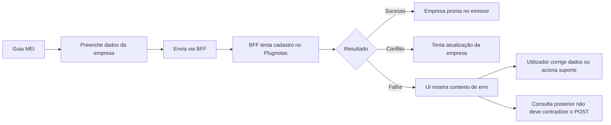

# Especificação de front-end e UX — fix cadastro de empresa Plugnotas no endpoint canónico `POST /empresa`

**Versão:** 1.0  
**Data:** 2026-04-09  
**Autoria:** Uma (UX design expert, fluxo AIOX)  
**PRD fonte:** [docs/prd/PRD-fix-cadastro-empresa-plugnotas-endpoint-canonico-2026-04-09.md](../prd/PRD-fix-cadastro-empresa-plugnotas-endpoint-canonico-2026-04-09.md)

**Brief de origem:** [docs/brief/brief-fix-cadastro-empresa-plugnotas-endpoint-canonico-2026-04-09.md](../brief/brief-fix-cadastro-empresa-plugnotas-endpoint-canonico-2026-04-09.md)

**Referência externa:** [Documentação Plugnotas (Postman) — Empresa](https://documenter.getpostman.com/view/3720339/2sB3WpSh1R?version=latest#54bcc736-6cd3-4e96-bc51-cab153c2f976)

---

## 1. Objetivo deste documento

Traduzir o PRD brownfield em comportamento de front-end e UX para a correção do cadastro de empresa no Plugnotas, garantindo que a interface:

1. preserve o BFF como única fronteira com o Plugnotas;
2. não induza o time nem o utilizador a interpretar o problema como “nova rota de cadastro”;
3. ajude a distinguir erro de ambiente/configuração de erro de payload/contrato;
4. mantenha a narrativa operacional correta entre `POST` cadastro, `PATCH` fallback e `GET` consulta.

---

## 2. Princípios de UX

| Princípio | Aplicação |
|-----------|-----------|
| **Sem jargão de infraestrutura para o utilizador** | A UI fala em “cadastrar a empresa no emissor” ou “configuração fiscal”; não fala em `POST /empresa`, `path prefix` ou `addCompany`. |
| **Uma fronteira clara** | O frontend sempre trata o backend como única integração externa; não há affordance nem copy sugerindo acesso direto ao Plugnotas. |
| **Diagnóstico sem ambiguidade** | O utilizador e o suporte devem conseguir perceber se a falha parece ser de conectividade/ambiente ou de dados enviados. |
| **Causalidade correta** | Se o `POST` falha e o `GET` posterior retorna ausência, a interface não deve inverter causa e consequência. |
| **Correção sem redesign** | A experiência se apoia na Guia MEI existente; não abrir nova rota visual nem nova jornada paralela. |

---

## 3. Escopo de interface

### 3.1 Dentro do escopo

- fluxo da Guia MEI que cadastra a empresa no emissor;
- mensagens de erro e estados de carregamento relacionados ao cadastro da empresa;
- indicação contextual para suporte/usuário quando a falha decorre de ambiente/configuração ou de payload;
- compatibilidade com o fluxo de fallback quando a empresa já existe;
- compatibilidade com a consulta posterior do cadastro.

### 3.2 Fora do escopo

- criação de nova tela “addCompany”;
- exposição de host/token Plugnotas na UI;
- chamada browser → Plugnotas;
- redesign visual amplo da Guia MEI;
- criação de novos campos além do que já estiver coberto por artefatos existentes.

---

## 4. Jornada do utilizador

**Mensagem mental que a interface deve sustentar:**  
“Estou configurando minha empresa no emissor pela Guia MEI. Se falhar, preciso entender se o problema é ambiente/configuração ou dados enviados.”

---

## 5. Arquitetura de feedback na UI

### 5.1 Estado neutro

- A interface mantém a narrativa atual de configuração fiscal/cadastro no emissor.
- Não introduz rótulos novos de rota, endpoint ou operação técnica.

### 5.2 Estado de carregamento

- Durante o envio, a UI deve indicar que está “cadastrando/configurando a empresa no emissor”.
- O estado carregando não deve insinuar mais de uma integração externa.

### 5.3 Estado de sucesso

- A confirmação deve afirmar que a empresa foi cadastrada/sincronizada no emissor.
- Se o backend resolver via fallback de atualização, a UX pode continuar tratando como sucesso operacional, sem abrir uma nova narrativa para o utilizador final.

### 5.4 Estado de erro — classe A: ambiente/configuração

Usar quando a falha indicar sintomas compatíveis com:

- ambiente inconsistente;
- host/token sandbox/produção misturados;
- path prefix incompatível;
- indisponibilidade de integração;
- gateway/upstream.

**Mensagem esperada:** orientar que a integração com o emissor não conseguiu concluir o cadastro naquele ambiente, sem atribuir imediatamente culpa aos dados da empresa.

### 5.5 Estado de erro — classe B: payload/contrato

Usar quando a falha indicar sintomas compatíveis com:

- validação do JSON da empresa;
- campos obrigatórios ausentes;
- regras municipais/contratuais do Plugnotas;
- inconsistência de dados do emitente.

**Mensagem esperada:** orientar revisão dos dados enviados ou encaminhamento operacional apropriado, sem sugerir que o problema é “rota errada”.

### 5.6 Estado derivado: POST falhou e GET posterior não encontra empresa

- O `GET` negativo deve ser tratado como consequência provável de o cadastro não ter sido persistido.
- A UI não deve traduzir isso como “a rota de consulta está errada” nem “a empresa sumiu”.

---

## 6. Requisitos de UX mapeados aos FRs do PRD

| ID | Implicação UX/front-end |
|----|--------------------------|
| **FR-ENDP-01** | A interface continua representando uma única ação de cadastro de empresa no emissor, sem segunda rota visual concorrente. |
| **FR-ENDP-02** | O frontend não deve expor comportamento, copy ou affordance que sugira chamada direta ao Plugnotas. |
| **FR-ENDP-03** | A UX de erro deve suportar diagnóstico de ambiente/configuração sem exigir conhecimento técnico do utilizador final. |
| **FR-ENDP-04** | As mensagens devem diferenciar “problema na integração/ambiente” de “problema nos dados enviados”. |
| **FR-ENDP-05** | Quando o backend resolver conflito com atualização, o front deve manter narrativa única de conclusão/sincronização. |
| **FR-ENDP-06** | A consulta posterior não pode contradizer a mensagem anterior; se o cadastro falhou, o estado consultado deve ser contextualizado. |

---

## 7. Comportamentos específicos de interface

### 7.1 Copy permitida

Preferir:

- “Cadastrar a empresa no emissor”
- “Configuração fiscal”
- “Dados do emitente”
- “Não foi possível concluir o cadastro da empresa no emissor”
- “Revise os dados ou confirme a configuração do ambiente”

Evitar:

- “endpoint errado”
- “rota errada”
- “POST /empresa”
- “addCompany”
- “o frontend chama a API do Plugnotas”

### 7.2 Hierarquia de mensagens

Ordem sugerida:

1. título curto e orientado a tarefa;
2. explicação resumida da classe do erro;
3. próximo passo seguro;
4. detalhe técnico opcional para suporte/diagnóstico, se já existir no padrão atual.

### 7.3 Comportamento em conflito

- Se a empresa já existir e o backend tratar via `PATCH`, a UI deve preferir linguagem de “sincronização/atualização concluída” em vez de “cadastro falhou”.

### 7.4 Comportamento em consulta negativa após falha

- Quando houver falha recente no cadastro e depois o sistema consultar a empresa sem encontrá-la, a mensagem deve manter a sequência causal:
  - primeiro: o cadastro não concluiu;
  - depois: por isso a empresa ainda não aparece na consulta.

---

## 8. Acessibilidade

- Alertas de erro continuam com semântica clara (`role="alert"` ou equivalente conforme padrão atual).
- O bloco principal de erro deve ser suficiente por si só; evitar duplicar alertas com o mesmo conteúdo.
- Títulos e descrições precisam permanecer legíveis e objetivos.
- A ação primária após erro deve ter rótulo explícito.

---

## 9. Conteúdo operacional e suporte

A UX deve permanecer coerente com o material de operação:

- erro de ambiente/configuração remete à verificação do ambiente;
- erro de payload/contrato remete à revisão dos dados ou runbook adequado;
- `GET` negativo após `POST` falho é consequência esperada, não um novo incidente isolado.

Se houver link para documentação operacional, ele deve apontar para a documentação do produto e não para a API do Plugnotas como primeira ação do utilizador final.

---

## 10. Critérios de aceite UX

- [ ] A especificação preserva a Guia MEI como superfície única de cadastro.
- [ ] A especificação não introduz nova rota visual de cadastro.
- [ ] A especificação distingue erro de ambiente/configuração de erro de payload/contrato.
- [ ] A especificação preserva a causalidade entre `POST` cadastro e `GET` consulta.
- [ ] A especificação não sugere integração direta browser → Plugnotas.
- [ ] A copy evita jargão técnico desnecessário para o utilizador final.

---

## 11. Referência de ficheiros para implementação futura

| Área | Ficheiros prováveis |
|------|---------------------|
| Página principal | `frontend/src/pages/GuidesMei.tsx` |
| Serviço BFF | `frontend/src/services/meiNotasService.ts` |
| Orquestração do cadastro | `frontend/src/utils/plugnotasEmitenteSetup.ts` |
| Componentes de erro/feedback | `frontend/src/components/FiscalIntegrationErrorAlert.tsx` e afins |
| Backend espelho | `backend/src/services/plugnotas/empresa.service.js` |

---

## 12. Change log

| Versão | Data | Alteração |
|--------|------|-----------|
| 1.0 | 2026-04-09 | Spec inicial derivada do PRD de fix do endpoint canónico de cadastro de empresa Plugnotas |

---

*Especificação brownfield de front-end e UX para correção do cadastro de empresa Plugnotas no fluxo Guia MEI.*
