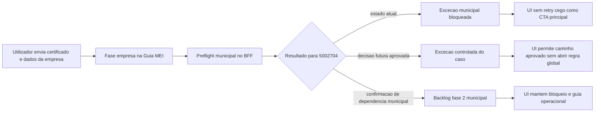

# Especificacao de front-end e UX -- recorrencia `prefeitura_login_required_blocked` no municipio `5002704`

**Versao:** 1.0  
**Data:** 2026-04-14  
**Autoria:** Uma (ux-design-expert, fluxo AIOX)  
**PRD de origem:** [`docs/prd/PRD-recorrencia-prefeitura-login-required-blocked-5002704-2026-04-14.md`](../prd/PRD-recorrencia-prefeitura-login-required-blocked-5002704-2026-04-14.md)  
**Brief de origem:** [`docs/brief/brief-recorrencia-prefeitura-login-required-blocked-5002704-2026-04-14.md`](../brief/brief-recorrencia-prefeitura-login-required-blocked-5002704-2026-04-14.md)

**Referencias externas (contrato):**

- [PlugNotas -- Empresa / addCompany](https://docs.plugnotas.com.br/#tag/Empresa/operation/addCompany)
- [PlugNotas -- Consultar disponibilidade do municipio e metadados](https://docs.plugnotas.com.br/#operation/getCidadeById)
- [PlugNotas -- OpenAPI oficial (`api.json`)](https://docs.plugnotas.com.br/api.json)

---

## 1. Objetivo deste documento

Esta spec traduz o PRD da recorrencia `5002704` em comportamento de front-end e UX para a Guia MEI.

O objetivo nao e redesenhar o fluxo de cadastro da empresa. O objetivo e fechar como a experiencia deve se comportar em tres momentos:

1. **agora:** manter narrativa correta para um caso ainda bloqueado no BFF;
2. **descoberta dirigida:** produzir superfícies e evidencias que permitam decidir o caso;
3. **condicionalmente depois:** acomodar uma excecao controlada sem abrir inversao global da UX do cluster RTCAD.

Esta spec tambem protege a experiencia atual contra dois erros:

- narrar `5002704` como "bug de endpoint";
- ou abrir expectativa de credenciais municipais na UI antes de decisao formal.

---

## 2. Relacao com outros artefatos

| Artefato | Papel |
|---|---|
| [`docs/specs/ux-spec-correcao-runtime-cadastro-empresa-plugnotas-contrato-oficial-triagem-municipal-2026-04-14.md`](./ux-spec-correcao-runtime-cadastro-empresa-plugnotas-contrato-oficial-triagem-municipal-2026-04-14.md) | Spec ampla do cluster RTCAD. Este documento nao a substitui; ele detalha o subcaso recorrente `5002704`. |
| [`docs/specs/ux-spec-resolucao-governada-prefeitura-login-required-blocked-2026-04-13.md`](./ux-spec-resolucao-governada-prefeitura-login-required-blocked-2026-04-13.md) | Regras de governanca e escalonamento do codigo `prefeitura_login_required_blocked`. |
| [`docs/specs/ux-spec-400-nfse-prefeitura-login-obrigatorio-plugnotas-2026-04-09.md`](./ux-spec-400-nfse-prefeitura-login-obrigatorio-plugnotas-2026-04-09.md) | Semantica original do caso de credenciais municipais obrigatorias. |
| [`docs/operacao-mei-nfse.md`](../operacao-mei-nfse.md) | Runbook canonico de triagem, classificacao e causalidade. |
| [`docs/qa/qa-matriz-rtcad-cadastro-empresa-plugnotas-2026-04-14.md`](../qa/qa-matriz-rtcad-cadastro-empresa-plugnotas-2026-04-14.md) | Matriz QA do cluster RTCAD; esta spec orienta a linha dedicada para `5002704`. |

---

## 3. Principios de UX

| Principio | Aplicacao |
|---|---|
| **Decisao visivel, preflight invisivel** | O utilizador nao precisa ver `GET /nfse/cidades/{codigoIbge}`. Ele precisa perceber o resultado da decisao do BFF. |
| **Causa antes da consequencia** | Se o cadastro falhou antes do upstream final, a UI nao deve deixar o `GET` posterior tomar protagonismo. |
| **Excecao dirigida nao vira regra geral** | Mesmo se `5002704` ganhar tratamento especial, isso nao deve insinuar que todos os municipios com `login`/`senha` seguem o mesmo caminho. |
| **Sem credenciais municipais no estado atual** | O fluxo atual nao recolhe `login`/`senha`; a UX nao pode prometer essa capacidade antes da decisao de produto. |
| **Retry apenas quando for plausivel** | Enquanto o caso estiver classificado como bloqueio municipal, retry cego nao deve ser a acao principal. |
| **Narrativa de produto acima de detalhe tecnico** | Evitar copy com `POST /empresa`, `GET /nfse/cidades` ou "precedencia do motor de decisao" como texto ao utilizador. |

---

## 4. Personas e superficies

| Persona | Superficie | Necessidade principal |
|---|---|---|
| **MEI** | `GuidesMei.tsx` | Entender se o cadastro falhou por limitacao atual do fluxo ou por algo que ainda pode ser revisto. |
| **Operacao / QA** | UI + runbook + matriz QA | Capturar o caso `5002704` com evidencia redigida e sem reabrir o falso bug de endpoint. |
| **Produto** | PRD + spec + QA | Fechar se `5002704` vira excecao controlada ou backlog fase 2 municipal. |
| **Frontend** | `fiscalUserError.ts`, `GuidesMei.tsx`, `nfseNacionalPlugnotasErrorHints.ts` | Priorizar classificacao estavel e nao deixar heuristica textual contradizer a decisao do BFF. |

**Superficies afetadas:**

- `frontend/src/pages/GuidesMei.tsx`
- `frontend/src/lib/fiscalUserError.ts`
- `frontend/src/utils/nfseNacionalPlugnotasErrorHints.ts`
- `frontend/src/components/FiscalIntegrationErrorAlert.tsx`
- `docs/operacao-mei-nfse.md`
- `docs/qa/qa-matriz-rtcad-cadastro-empresa-plugnotas-2026-04-14.md`

---

## 5. Escopo UX e front-end

### 5.1 Dentro do escopo obrigatorio

- estados e copy do cadastro da empresa para a recorrencia `5002704`;
- regras de classificacao entre frontend e BFF;
- comportamento do painel de erro e do painel de retry;
- narrativa operacional para descoberta dirigida por ambiente;
- alinhamento de UX com `manter bloqueio`, `correcao controlada` ou `fase 2 municipal`.

### 5.2 Dentro do escopo condicional

Somente se a decisao do PRD for por `correcao controlada`:

- ajustar copy/estado para permitir o caminho aprovado;
- rever o painel de retry para o caso governado;
- introduzir uma linha propria para `5002704` na experiencia QA/runbook.

### 5.3 Fora do escopo

- formulario geral de credenciais municipais;
- persistencia de `login`/`senha`;
- terceira fase visual obrigatoria entre `certificado` e `empresa`;
- abrir uma "rota municipal" na Guia MEI;
- UX que normalize um comportamento especial de `5002704` para todos os municipios.

---

## 6. Jornada e arquitetura de experiencia

### 6.1 Regra principal da jornada

A Guia MEI continua a expor apenas duas fases visiveis:

1. `certificado`
2. `empresa`

O caso `5002704` nao cria uma terceira fase visual. O que muda e a semantica do estado da fase `empresa`.

### 6.2 Copy de carregamento

**Permitido:**

- `Validando o municipio e concluindo o cadastro da empresa...`
- `Configurando a empresa no emissor fiscal...`
- `Sincronizando o cadastro da empresa...`

**Evitar:**

- `Consultando /nfse/cidades/5002704...`
- `Executando regra especial para 5002704...`
- `Tentando POST /empresa...`

---

## 7. Modelo de estados UX

### 7.1 REC500-UX-L0 -- estado padrao

**Objetivo:** manter a narrativa nacional-first sem insinuar que o caso `5002704` ja foi resolvido.

**Callout base sugerido:**

**Titulo:** `Cadastro da empresa no emissor`  
**Texto:** `Esta etapa configura a empresa no emissor fiscal para o fluxo NFS-e Nacional. Em alguns municipios, o sistema pode validar regras adicionais antes de concluir o cadastro.`

### 7.2 REC500-UX-L1 -- estado atual do caso recorrente

**Aplicacao:** enquanto `5002704` continuar classificado como `prefeitura_login_required_blocked`.

**Titulo sugerido:** `Este municipio exige uma validacao fora do fluxo atual`  
**Texto sugerido:** `Antes de concluir o cadastro, o sistema identificou uma exigencia municipal que o fluxo atual da Guia MEI ainda nao trata automaticamente.`  
**CTA principal sugerido:** `Ver guia de operacao`  
**CTA secundaria opcional:** `Editar dados`

**Regras obrigatorias:**

- este estado tem prioridade sobre copy generica de payload;
- nao pedir `login`/`senha`;
- nao apresentar retry cego como CTA principal;
- nao falar em "endpoint errado".

### 7.3 REC500-UX-L2 -- descoberta dirigida em andamento

**Aplicacao:** superfícies internas, runbook e QA, nao necessariamente copy nova ao MEI.

**Objetivo:** permitir que operacao/QA registem que o caso esta em reavaliacao controlada, sem prometer mudanca ao utilizador final.

**Regras:**

- a UI ao utilizador pode permanecer igual a `REC500-UX-L1`;
- documentos de QA/runbook devem marcar `5002704` como caso recorrente em avaliacao;
- qualquer detalhe adicional fica fora da copy principal ao MEI.

### 7.4 REC500-UX-L3 -- excecao controlada aprovada

**Aplicacao:** somente se o PRD aprovar `correcao controlada`.

**Titulo sugerido:** `Empresa configurada com sucesso`  
**Texto sugerido:** `O cadastro da empresa foi concluido para este municipio no fluxo atual.`  
**CTA sugerido:** `Continuar`

**Regras obrigatorias:**

- nao comunicar isto como "municipio especial desbloqueado";
- nao sugerir que outros municipios com a mesma classe agora tambem funcionam;
- manter a linguagem de sucesso nacional/sincronizacao conforme o resultado operacional final.

### 7.5 REC500-UX-L4 -- backlog fase 2 municipal confirmado

**Aplicacao:** se a descoberta confirmar que `5002704` realmente depende de autenticacao municipal no cadastro.

**Titulo sugerido:** `Este municipio continua fora do fluxo atual`  
**Texto sugerido:** `A validacao do caso confirmou que este municipio depende de uma etapa municipal que o fluxo atual da Guia MEI ainda nao suporta.`  
**CTA principal sugerido:** `Ver guia de operacao`

**Regras obrigatorias:**

- reforcar continuidade do bloqueio com honestidade;
- nao criar expectativa de resolucao imediata por novo submit;
- permitir acao secundaria de `Editar dados`, mas sem prometer desfecho.

---

## 8. Contrato minimo frontend -> BFF

### 8.1 Campos minimos

- `errors.plugnotasCode`
- `errors.httpStatus`
- `errors.plugnotasRequest.method`
- `errors.plugnotasRequest.path`
- `errors.runtimeDecision.codigoIbge`
- `errors.runtimeDecision.environment`
- `errors.runtimeDecision.padraoNacionalEnabled`
- `errors.runtimeDecision.requiresLogin`
- `errors.runtimeDecision.requiresSenha`
- `errors.runtimeDecision.upstreamCallSkipped`

### 8.2 Regra de consumo

Para o caso `5002704`, o frontend deve:

1. priorizar o codigo estavel do BFF;
2. usar `runtimeDecision` para suporte interno, QA e desambiguacao;
3. nao transformar `runtimeDecision` em corpo tecnico de copy ao utilizador.

### 8.3 Ordem de prioridade na classificacao UX

1. `errors.plugnotasCode`
2. `errors.runtimeDecision`
3. `httpStatus` + `plugnotasRequest`
4. heuristica textual em `nfseNacionalPlugnotasErrorHints.ts`

**Regra:** a heuristica textual continua secundaria e nao pode contradizer a classificacao governada do caso.

---

## 9. Regras de componentes e comportamento

### 9.1 `GuidesMei.tsx`

- manter `certificado` e `empresa` como fases visiveis;
- quando o caso for `REC500-UX-L1` ou `REC500-UX-L4`, o CTA principal nao deve ser retry cego;
- se a decisao evoluir para `REC500-UX-L3`, o fluxo deve parecer sucesso normal do cadastro, nao "modo especial".

### 9.2 `fiscalUserError.ts`

- deve continuar a mapear `prefeitura_login_required_blocked` como excecao municipal;
- para `5002704`, a evolucao de comportamento deve depender de classificacao adicional governada, nao de substring na mensagem;
- se houver correcao controlada, ela nao deve quebrar os outros ramos `prefeitura_login_required_blocked`.

### 9.3 `nfseNacionalPlugnotasErrorHints.ts`

- manter hints como fallback secundario;
- nao criar heuristica global que faca `padraoNacional=true` vencer sempre;
- qualquer ajuste para `5002704` so entra com governanca explicita e cobertura de teste.

### 9.4 `FiscalIntegrationErrorAlert.tsx`

- um unico alerta principal por estado;
- `Ver guia de operacao` como CTA principal nos estados bloqueados;
- `Editar dados` como CTA secundaria quando fizer sentido;
- sem duplicar alertas com a mesma conclusao.

---

## 10. Regras de copy

### 10.1 Copy permitida

- `validar o municipio`
- `configurar a empresa no emissor`
- `este municipio exige uma validacao fora do fluxo atual`
- `ver guia de operacao`
- `editar dados`
- `o cadastro ainda nao foi concluido`

### 10.2 Copy a evitar

- `erro de endpoint`
- `rota errada`
- `POST /empresa`
- `GET /nfse/cidades/5002704`
- `informe login da prefeitura`
- `informe senha da prefeitura`
- `agora todos os municipios semelhantes estao suportados`

### 10.3 Regra de hierarquia textual

1. titulo orientado a tarefa;
2. explicacao curta do que aconteceu;
3. proximo passo seguro;
4. detalhe tecnico opcional apenas em superficie interna/QA.

---

## 11. Acessibilidade e privacidade

- manter `role="alert"` apenas no alerta principal;
- foco deve ir para o primeiro bloco relevante apos falha;
- CTAs devem ser explicitos e orientados a acao;
- sem exibir `login`, `senha`, token, certificado ou payload bruto;
- quando houver detalhe tecnico, ele deve ser redigido e secundario.

---

## 12. QA, operacao e runbook

### 12.1 Requisitos para `docs/qa/qa-matriz-rtcad-cadastro-empresa-plugnotas-2026-04-14.md`

Adicionar linha dedicada para `5002704` com:

- ambiente;
- resultado do preflight;
- classificacao BFF esperada;
- estado UX esperado;
- decisao atual do caso (`em descoberta`, `excecao controlada`, `fase 2 municipal`).

### 12.2 Requisitos para `docs/operacao-mei-nfse.md`

O runbook deve:

- tratar `5002704` como caso recorrente conhecido;
- explicar se ele segue bloqueado ou se ganhou excecao controlada;
- deixar claro que a decisao vale para este caso governado e nao automaticamente para todos os municipios.

---

## 13. Fase 2 condicional

Se o resultado final for backlog fase 2 municipal:

### 13.1 O que muda

- este spec passa a servir como base historica da decisao;
- um novo spec devera cobrir coleta controlada de credenciais, se aprovada;
- a UX atual continua em `REC500-UX-L4`.

### 13.2 O que nao muda

- o BFF continua como fronteira unica;
- a causalidade `POST` -> `PATCH` -> `GET` continua valida;
- `5002704` nao passa a ser tratado como simples erro tecnico.

---

## 14. Criterios de aceite UX/front-end

- [ ] A Guia MEI continua a tratar o cadastro da empresa como uma unica jornada.
- [ ] `5002704` deixa de ser narrado como bug de endpoint.
- [ ] O frontend prioriza classificacao estavel do BFF sobre heuristica textual.
- [ ] Enquanto o caso estiver bloqueado, a UI nao oferece retry cego como CTA principal.
- [ ] Se houver correcao controlada, ela nao abre linguagem ou expectativa de regra global.
- [ ] QA e runbook passam a ter linha explicita para `5002704`.
- [ ] Nao ha copy pedindo `login`/`senha` na UI atual.

---

## 15. Referencia de ficheiros para implementacao futura

| Area | Ficheiros provaveis |
|---|---|
| Pagina principal | `frontend/src/pages/GuidesMei.tsx` |
| Mapeamento de copy | `frontend/src/lib/fiscalUserError.ts` |
| Heuristicas/hints | `frontend/src/utils/nfseNacionalPlugnotasErrorHints.ts` |
| Painel de erro | `frontend/src/components/FiscalIntegrationErrorAlert.tsx` |
| Runbook | `docs/operacao-mei-nfse.md` |
| Matriz QA | `docs/qa/qa-matriz-rtcad-cadastro-empresa-plugnotas-2026-04-14.md` |

---

## 16. Change log

| Data | Versao | Descricao | Autor |
|---|---|---|---|
| 2026-04-14 | 1.0 | Spec inicial de front-end e UX para a recorrencia `5002704`, com foco em descoberta dirigida, estado bloqueado atual e eventual excecao controlada. | UX Design Expert (Uma) |

---

*Spec brownfield -- Guia MEI / cadastro da empresa -- caso recorrente `5002704`; sem UI municipal nova no estado atual.*
