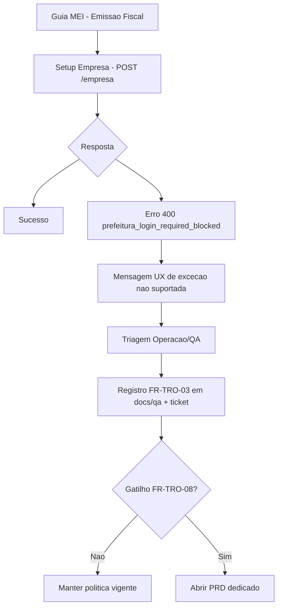
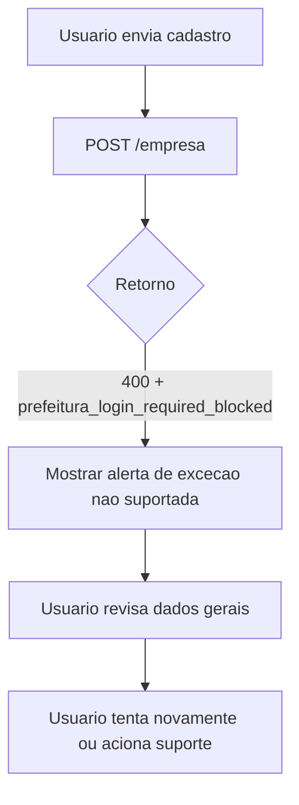
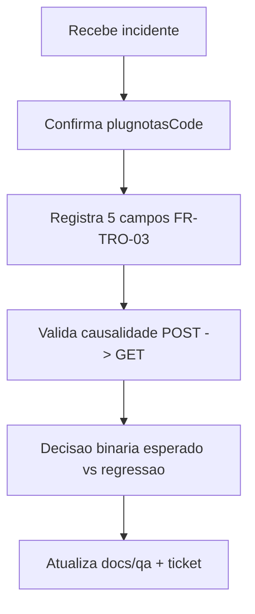
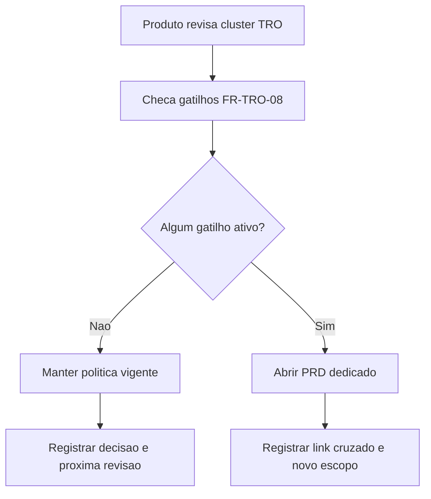

# Especificacao de front-end e UX — resolucao governada `prefeitura_login_required_blocked`

**Versao:** 1.0  
**Data:** 2026-04-13  
**Autoria:** Uma (ux-design-expert, fluxo AIOX)  
**PRD de origem:** [`docs/prd/PRD-resolucao-governada-prefeitura-login-required-blocked-2026-04-13.md`](../prd/PRD-resolucao-governada-prefeitura-login-required-blocked-2026-04-13.md)  
**Brief de origem:** [`docs/brief/brief-resolucao-governada-prefeitura-login-required-blocked-2026-04-13.md`](../brief/brief-resolucao-governada-prefeitura-login-required-blocked-2026-04-13.md)

---

## 1. Introducao e objetivo

Este documento define o contrato de UX/front-end para o cenario `HTTP 400` com `errors.plugnotasCode = prefeitura_login_required_blocked`, seguindo o modelo governado do PRD:

- **Trilho A (agora):** tratativa operacional padronizada;
- **Trilho B (condicional):** escalonamento para iniciativa nova somente por gatilho FR-TRO-08.

Objetivo UX: garantir narrativa consistente para evitar falso diagnostico de "erro de endpoint", manter clareza para usuario e operacao, e preservar rastreabilidade para decisao de produto.

---

## 2. Relacao com artefatos existentes

| Artefato | Papel |
|---|---|
| [`docs/specs/ux-spec-tratativa-operacional-prefeitura-login-required-blocked-2026-04-13.md`](./ux-spec-tratativa-operacional-prefeitura-login-required-blocked-2026-04-13.md) | Base operacional de triagem/evidencia; esta spec amplia para governanca A/B e handoff de decisao. |
| [`docs/specs/ux-spec-nfse-nacional-padrao-bloqueio-excecao-credenciais-prefeitura-plugnotas-2026-04-10.md`](./ux-spec-nfse-nacional-padrao-bloqueio-excecao-credenciais-prefeitura-plugnotas-2026-04-10.md) | Politica nacional-first e bloqueio da excecao municipal sem coletar credenciais no fluxo atual. |
| [`docs/operacao-mei-nfse.md`](../operacao-mei-nfse.md) | Fonte canonica do protocolo operacional TRO. |
| [`docs/architecture/project-decisions/tro-governanca-gatilhos-escalonamento-prefeitura-login-required-blocked-2026-04-13.md`](../architecture/project-decisions/tro-governanca-gatilhos-escalonamento-prefeitura-login-required-blocked-2026-04-13.md) | Registro de gatilhos FR-TRO-08 e decisao por cluster. |

---

## 3. Personas e metas de usabilidade

### 3.1 Personas alvo

- **MEI (usuario final):** precisa entender bloqueio do fluxo sem linguagem tecnica e sem ser induzido a preencher dados nao suportados.
- **Operacao/QA:** precisa classificar rapidamente, coletar evidencia minima FR-TRO-03 e fechar com decisao binaria.
- **Produto/PO:** precisa receber evidencias consistentes para decidir manter politica vigente ou abrir PRD dedicado.

### 3.2 Metas de usabilidade

- **Clareza diagnostica:** reduzir confusao entre excecao municipal e erro tecnico de rota.
- **Consistencia operacional:** repetir o mesmo protocolo de triagem para todas as ocorrencias do codigo.
- **Rastreabilidade:** cada caso vinculado a ticket, evidencia redigida e decisao final.
- **Baixa friccao:** evitar criar fluxo novo de UI para resolver problema operacional atual.

### 3.3 Principios de design

1. **Narrativa certa para erro certo** - `prefeitura_login_required_blocked` nao deve ser comunicado como endpoint incorreto.
2. **Causa antes da consequencia** - `POST` falho e causa, `GET` negativo posterior e efeito.
3. **Nao prometer suporte inexistente** - sem campos/acoes de credencial municipal no fluxo atual.
4. **Evidencia sem exposicao sensivel** - redaction obrigatoria em logs/capturas/tickets.
5. **Governanca explicita** - escalonamento so com gatilho FR-TRO-08.

---

## 4. Escopo UX e front-end

### 4.1 Dentro do escopo

- Padrao de mensagem e classificacao para o erro no frontend.
- Regras de estado para triagem operacional.
- Mapeamento de evidencias obrigatorias para operacao/QA.
- Criterio de decisao e handoff para produto (trilho B).

### 4.2 Fora do escopo

- Formulario para `login`/`senha` de prefeitura.
- Redesign completo da Guia MEI.
- Mudanca contratual do endpoint para "resolver" este caso.
- Implementacao de suporte municipal sem iniciativa nova aprovada.

---

## 5. Arquitetura de informacao (IA)

### 5.1 Site map / inventario de telas afetadas

### 5.2 Estrutura de navegacao

**Primary navigation:** permanece no fluxo atual da Guia MEI (sem nova secao de credenciais municipais).  
**Secondary navigation:** links de ajuda/runbook/ticket interno para operacao, sem exposicao ao usuario final.  
**Breadcrumb strategy:** nao requer mudanca estrutural; foco em estados de erro e comunicacao.

---

## 6. Fluxos de usuario

### 6.1 Fluxo A - usuario final encontra bloqueio municipal

**User Goal:** entender porque nao foi possivel concluir cadastro sem ser induzido a acao invalida.  
**Entry Points:** tentativa de cadastro no setup fiscal da Guia MEI.  
**Success Criteria:** usuario compreende limite do fluxo e recebe orientacao de proximo passo.

**Edge Cases & Error Handling:**
- erro 400 com outro codigo deve usar narrativa especifica daquele codigo;
- erro de ambiente (host/token) nao deve usar narrativa de excecao municipal;
- se nao houver `plugnotasCode`, exibir fallback generico sem afirmar causa endpoint/prefeitura.

### 6.2 Fluxo B - operacao/QA executa triagem TRO

**User Goal:** classificar ocorrencia e fechar com decisao binaria rastreavel.  
**Entry Points:** ticket interno de incidente + evidencias de UI/Network.  
**Success Criteria:** caso encerrado com FR-TRO-03 + causalidade + decisao final.

### 6.3 Fluxo C - produto decide escalonamento por gatilho

**User Goal:** decidir abertura de iniciativa nova com criterio objetivo.  
**Entry Points:** cluster de ocorrencias com rastreabilidade completa.  
**Success Criteria:** decisao formal registrada em artefato de governanca.

---

## 7. Regras de copy e conteudo

### 7.1 Deve comunicar

- fluxo padrao continua NFS-e Nacional;
- excecao municipal nao suportada no fluxo vigente;
- orientacao clara de proximo passo (`revisar dados`, `consultar suporte/runbook`, `tentar novamente`);
- linguagem nao culpabilizadora para o usuario.

### 7.2 Nao deve comunicar

- "endpoint errado", "rota incorreta" ou "bug de endpoint" para este codigo;
- pedido de `login`/`senha` municipal na UI atual;
- promessa de suporte municipal sem iniciativa nova aprovada.

### 7.3 Exemplo de mensagem recomendada

**Titulo:** `Nao foi possivel concluir este cadastro no fluxo atual`  
**Corpo:** `O emissor informou uma exigencia municipal fora da politica NFS-e Nacional deste fluxo. Revise os dados e, se o erro persistir, acione o suporte com o protocolo da ocorrencia.`

---

## 8. Componentes e estados de interface

### 8.1 Abordagem de design system

Reutilizar componentes existentes (alertas, callouts, feedback de erro) sem criar biblioteca nova.

### 8.2 Componentes centrais

| Componente | Proposito | Variantes/estados |
|---|---|---|
| Alert principal de erro | Comunicar bloqueio `prefeitura_login_required_blocked` | `erro-excecao-municipal`, `erro-generico`, `erro-ambiente` |
| Callout informativo nacional | Reforcar politica padrao NFS-e Nacional | `informativo-padrao`, `informativo-retry` |
| Acoes de recuperacao | Direcionar proximo passo | `revisar-dados`, `tentar-novamente`, `abrir-suporte` |

### 8.3 Arquivos provaveis de ajuste

- `frontend/src/pages/GuidesMei.tsx`
- `frontend/src/lib/fiscalUserError.ts`
- `frontend/src/utils/apiClientError.ts`

Observacao: este documento nao exige alteracao de codigo obrigatoria; os caminhos acima sao pontos de verificacao se houver necessidade de ajuste narrativo.

---

## 9. Acessibilidade

**Padrao alvo:** WCAG AA.

**Requisitos chave:**
- contraste minimo AA em alertas e callouts;
- foco visivel na primeira mensagem de erro relevante;
- suporte a leitor de tela com `role="alert"` nos erros principais;
- textos acionaveis claros para botoes/links de proximo passo;
- evitar duplicidade de alertas com mesmo conteudo.

**Estrategia de validacao:**
- checagem manual de fluxo com teclado;
- leitura de erro em leitor de tela;
- revisao de contraste e ordem semantica da mensagem.

---

## 10. Responsividade, motion e performance

### 10.1 Responsividade

- breakpoints seguem padrao atual do projeto;
- mensagens de erro devem manter legibilidade e hierarquia em mobile;
- CTAs de recuperacao devem ficar visiveis sem scroll excessivo.

### 10.2 Motion e microinteracoes

- manter animacoes discretas ja existentes;
- nao usar motion que esconda ou atrase feedback de erro;
- prioridade para feedback imediato apos retorno da API.

### 10.3 Metas de performance UX

- resposta visual de erro em ate 300ms apos retorno da API;
- nenhuma adicao de componente pesado para este fluxo;
- manter experiencia atual sem regressao percebida de navegacao.

---

## 11. Mapeamento PRD -> UX spec

| PRD | Traducao UX/front-end |
|---|---|
| FR-TRO-01/02 | Classificacao narrativa fixa: excecao nao suportada, sem "endpoint errado". |
| FR-TRO-03 | Checklist operacional exige 5 campos minimos de evidencia por ocorrencia. |
| FR-TRO-04 | Fluxo de triagem documenta causalidade `POST` falho -> `GET` consequente. |
| FR-TRO-05/06 | Encerramento obrigatorio com ticket + decisao binaria rastreavel. |
| FR-TRO-07/08 | Escalonamento condicional por gatilho, sem extensao ad hoc. |
| NFR-TRO-01/02/05 | Redaction, ambiente identificado, auditoria por data/ticket/responsavel. |
| NFR-TRO-03/04 | Sem remendo funcional de endpoint e com fonte canonica unica. |

---

## 12. Criterios de aceite UX/front-end

- [ ] O erro `prefeitura_login_required_blocked` e narrado como excecao nao suportada no fluxo nacional.
- [ ] A UI e a documentacao operacional nao classificam esse caso como erro de endpoint.
- [ ] Protocolo de triagem registra FR-TRO-03 completo com redaction.
- [ ] Causalidade `POST` -> `GET` aparece explicitamente nos registros da ocorrencia.
- [ ] Cada ocorrencia fecha com decisao binaria e vinculo de ticket/evidencia.
- [ ] Escalonamento para iniciativa nova acontece apenas com gatilho FR-TRO-08.
- [ ] Nenhum elemento de UI solicita credenciais municipais no fluxo atual.

---

## 13. Proximos passos e handoff

1. Revisar esta spec com Produto, Operacao/QA e Frontend.
2. Confirmar aderencia de copy/estado no fluxo atual da Guia MEI.
3. Validar checklist FR-TRO-03 em pelo menos uma ocorrencia recente.
4. Atualizar stories derivadas com referencia explicita a esta spec.
5. Se gatilho FR-TRO-08 ativar, abrir PRD dedicado e criar spec complementar.

### Checklist de handoff

- [ ] Fluxos A/B/C aprovados pelos stakeholders
- [ ] Regras de copy aprovadas
- [ ] Criterios de acessibilidade validados
- [ ] Criterios de aceite mapeados para QA
- [ ] Referencias cruzadas PRD/spec/governanca atualizadas

---

## 14. Change log

| Data | Versao | Descricao | Autor |
|---|---|---|---|
| 2026-04-13 | 1.0 | Spec inicial de front-end e UX baseada no PRD de resolucao governada (`trilho A/B`) para `prefeitura_login_required_blocked`. | UX Design Expert (Uma) |
