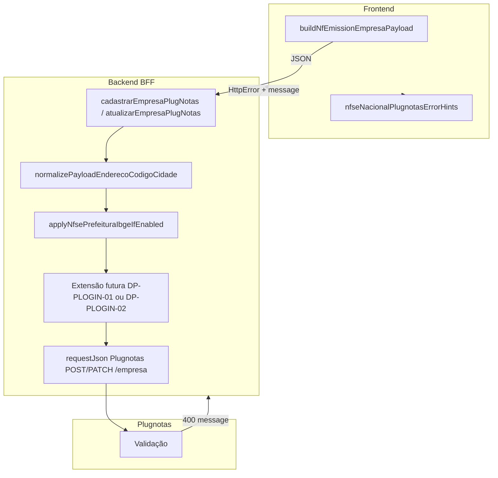

# Arquitetura técnica — **400** `nfse.config.prefeitura.login` obrigatório (Plugnotas) e decisões **DP-PLOGIN-0***

**Versão:** 1.0  
**Data:** 2026-04-09  
**Autoria:** Aria (architect / AIOX)  
**Requisitos de origem:** [`docs/prd/PRD-400-nfse-prefeitura-login-obrigatorio-plugnotas-2026-04-09.md`](../prd/PRD-400-nfse-prefeitura-login-obrigatorio-plugnotas-2026-04-09.md) (**FR-PLOGIN-***, **NFR-PLOGIN-***, **DP-PLOGIN-***)  
**UX de origem:** [`docs/specs/ux-spec-400-nfse-prefeitura-login-obrigatorio-plugnotas-2026-04-09.md`](../specs/ux-spec-400-nfse-prefeitura-login-obrigatorio-plugnotas-2026-04-09.md) (**PLOGIN-UX-L1/L2**, variante **`prefeitura-login-required`**)

Este documento fixa **fronteiras em camadas**, **fluxo de dados**, **pontos de extensão** e **requisitos de segurança** quando o emissor Plugnotas valida o JSON de empresa e exige **`nfse.config.prefeitura.login`** (e possivelmente **`senha`**), tipicamente **depois** do trilho B ter preenchido **`codigoIbge`** sem credenciais — **trilho B insuficiente** para esse município.

**Contrato externo:** [Documentação da API PlugNotas (Postman)](https://documenter.getpostman.com/view/3720339/2sB3WpSh1R?version=latest)

**Artefactos relacionados:**

| Artefacto | Papel |
|-----------|--------|
| [`architecture-correcao-400-nfse-config-prefeitura-derive-ibge-2026-04-09.md`](architecture-correcao-400-nfse-config-prefeitura-derive-ibge-2026-04-09.md) | Trilho B — ordem `normalizePayloadEnderecoCodigoCidade` → `applyNfsePrefeituraIbgeIfEnabled`; **este** doc trata do **caso residual** após B. |
| [`architecture-plugnotas-nfse-config-prefeitura-payload-2026-04-08.md`](architecture-plugnotas-nfse-config-prefeitura-payload-2026-04-08.md) | Trilhos A–D, extensões de payload `prefeitura`. |
| [`architecture-correcao-ibge-tabela-plugnotas-400-get-404-2026-04-09.md`](architecture-correcao-ibge-tabela-plugnotas-400-get-404-2026-04-09.md) | Erro **tabela IBGE** — **distinto** de `prefeitura.login` obrigatório. |
| [`docs/adr/ADR-plugnotas-empresa-payload-apenas-nfse.md`](../adr/ADR-plugnotas-empresa-payload-apenas-nfse.md) | Política de payload NFS-e. |
| `backend/src/services/plugnotas/nfsePrefeituraPayload.js` | `applyNfseConfigPrefeituraDeriveIbge` — não adiciona `login`/`senha`. |
| `backend/src/services/plugnotas/empresa.service.js` | `cadastrarEmpresaPlugNotas` / `atualizarEmpresaPlugNotas`, `applyNfsePrefeituraIbgeIfEnabled`. |
| `frontend/src/utils/nfseNacionalPlugnotasErrorHints.ts` | Heurísticas de mensagem; extensão **PLOGIN-UX-L1** por story. |

---

## 1. Visão de contexto

### 1.1 Problema técnico

O Plugnotas é a **autoridade de validação** do JSON de empresa. O trilho B pode produzir:

```text
nfse.config.prefeitura = { codigoIbge: "1234567" }
```

Para alguns municípios / perfis de integração, o validador upstream **ainda** exige **`prefeitura.login`** (e possivelmente **`senha`**). O resultado é **HTTP 400** com mensagem de validação; o **GET** `…/empresa?cpfCnpj=` pode responder **404** porque o cadastro **não** persistiu — alinhar causalidade **POST → GET** (arquitectura briefing / **SOL**).

Isto **não** é tratável apenas com “activar trilho B” ou “corrigir IBGE de 7 dígitos” quando a mensagem cita explicitamente **login** da prefeitura.

### 1.2 Pré-requisito de implementação (**DP-PLOGIN-03**)

Qualquer alteração de código que adicione campos sensíveis ou lógica nova de bloqueio **deve** ser precedida de **FR-PLOGIN-01** (evidência de payload/mensagem em ambiente controlado, **sem** secrets em artefactos públicos).

---

## 2. Fronteiras por camada

| Camada | Responsabilidade (PLOGIN) |
|--------|---------------------------|
| **Plugnotas API** | Schema e regras por município; mensagens de validação; **fonte da verdade** para “login obrigatório”. |
| **Backend (BFF)** | Montagem final do `POST/PATCH /empresa` para o emissor; trilho B; futura **fusão** de `nfse.config.prefeitura` com credenciais se **DP-PLOGIN-01**; futura **política** de não enviar `prefeitura` incompleta se **DP-PLOGIN-02** — **sempre** em código servidor. |
| **Frontend** | Formulário Guia MEI e `buildNfEmissionEmpresaPayload` (`nfEmissionCompany.ts`); **não** persiste segredos Plugnotas no `localStorage` por padrão; heurísticas UX em `nfseNacionalPlugnotasErrorHints.ts` (**PLOGIN-UX-L1**). |
| **Configuração** | `PLUGNOTAS_*` e chaves de API **apenas** no backend; **nunca** expor `x-api-key` ou credenciais de prefeitura ao cliente. |

**Regra:** credenciais de **portal municipal** (se alguma vez forem recolhidas) transitam **HTTPS** para o **BFF** e só depois para Plugnotas em **TLS**; não documentar caminhos alternativos sem revisão de ameaças.

---

## 3. Fluxo de dados (as-is + pontos de extensão)



**Ordem actual no hot path** (inalterada por este doc): **normalizar endereço** → **derivar IBGE em `prefeitura`** (se env) → **request**.

**Extensão futura (placeholder):**

- **DP-PLOGIN-01:** após derivação (ou em merge explícito), permitir que o payload inclua `nfse.config.prefeitura.login` / `senha` vindos do **body** autenticado do `POST /api/mei-notas/setup/emissao-fiscal/empresa`, com **validação** e **sanitização** no controller/service — **story** define campos exactos e regras de omissão em logs.  
- **DP-PLOGIN-02:** ramo que **não** chama o upstream com `prefeitura` só-IBGE quando a política de produto o proíbe (ex.: feature flag, lista de municípios, ou abortar derivação se faltarem credenciais obrigatórias) — **story** + critérios de negócio.

---

## 4. Mapeamento PRD/spec → componentes técnicos

| ID | Realização técnica |
|----|---------------------|
| **FR-PLOGIN-01** | Processo manual ou script interno: comparar body **redigido** enviado ao Plugnotas (logs de debug não-prod, ou captura segura) com mensagem **400**; **não** novo módulo obrigatório na v1 desta arquitectura. |
| **FR-PLOGIN-02**–**03** | `docs/operacao-mei-nfse.md` — conteúdo; link Postman; sem credenciais no repo (**NFR-PLOGIN-02**). |
| **FR-PLOGIN-04** (**DP-PLOGIN-01**) | Extensão do **contrato** do body `POST …/emissao-fiscal/empresa` (validação Joi/Zod ou equivalente no BFF), merge em `nfse.config.prefeitura` antes de `requestJson`; persistência **se** existir — **@data-engineer** para schema/armazenamento; **nunca** logar valores em claro. |
| **FR-PLOGIN-05** (**DP-PLOGIN-02**) | Lógica condicional em `empresa.service.js` ou módulo auxiliar **após** `applyNfsePrefeituraIbgeIfEnabled` (ou dentro do hook de derivação com flag de produto) — story define. |
| **NFR-PLOGIN-01** | Política de logs alinhada a **NFR-BRIEF-OP-01**; mascarar `prefeitura.*` em traces se necessário. |
| **NFR-PLOGIN-02** | CI/docs: grep preventivo opcional em PRs para padrões de segredo (recomendação, não gate automático obrigatório neste doc). |

---

## 5. UX técnica (superfície FE)

| Elemento | Implementação sugerida |
|-----------|-------------------------|
| **Detecção PLOGIN-UX-L1** | Função pura em `nfseNacionalPlugnotasErrorHints.ts` (variante `prefeitura-login-required` ou nome acordado na story), **após** normalização da mensagem; testes em `nfseNacionalPlugnotasErrorHints.test.ts`. |
| **Prioridade vs outros hints** | Se mensagem combinar “tabela IBGE” e “login”, a story fixa **precedência** (alinhado à ux-spec secção 5.1). |
| **GuidesMei / alertas** | Um `role="alert"` principal; *hints* secundários sem duplicar o mesmo texto — **ux-spec** §2. |
| **DP-PLOGIN-03** | Sem novos campos de formulário até decisão PO + evidência **FR-PLOGIN-01**. |

---

## 6. API e contrato BFF (âncoras)

| Rota | Papel |
|------|--------|
| `POST /api/mei-notas/setup/emissao-fiscal/empresa` | Entrada actual: payload empresa + certificado; resposta **400** ecoa validação Plugnotas. Extensões futuras **DP-PLOGIN-01** documentam novos campos opcionais no mesmo body (nested `nfse.config.prefeitura`). |
| `GET …/empresa?cpfCnpj=` | **404** esperado se **POST** nunca teve **2xx** — não “corrigir” só com retry de GET. |

**Controller de referência:** `backend/src/controllers/mei-notas.controller.js` → serviço `mei-notas.service.js` / `empresa.service.js`.

---

## 7. Observabilidade e diagnóstico

| Objectivo | Mecanismo |
|-----------|-----------|
| Confirmar se `prefeitura` foi enviada só com `codigoIbge` | Logs existentes de cadastro **400** em `empresa.service.js` / utilitários de log Plugnotas (ambiente não-prod); seguir redacção existente. |
| Distinguir **PLOGIN** vs **TIBGE** vs **PREFB genérico** | Texto da mensagem + classificação em `nfseNacionalPlugnotasErrorHints.ts`. |
| Escalação | **FR-PREFB-ESC-01** / **FR-BRIEF-OP-06** — operação, PRD PREF payload, suporte Plugnotas. |

---

## 8. Segurança (resumo)

1. **Minimização:** não pedir nem persistir credenciais de prefeitura sem decisão **DP-PLOGIN-01** e desenho **@data-engineer** / revisão de ameaças.  
2. **Trânsito:** apenas **HTTPS** browser→BFF; BFF→Plugnotas com credenciais já suportadas pelo cliente HTTP actual.  
3. **Logs:** proibir valores de `login`/`senha` em `console` / agregadores em produção; reutilizar padrões de mascaramento do projecto para erros Plugnotas.  
4. **Frontend:** evitar `autocomplete="username"` em campos sensíveis até política explícita (ux-spec §6).

---

## 9. Testes e regressão

| Área | Ficheiros |
|------|-----------|
| Heurísticas PLOGIN-UX-L1 | `frontend/src/utils/nfseNacionalPlugnotasErrorHints.test.ts` |
| Trilho B inalterado salvo story | `backend/tests/nfsePrefeituraPayload.test.js`, `backend/tests/plugnotas-empresa.test.js` |
| Rotas MEI | `backend/tests/mei-notas-routes.test.js` (smoke) |

**Gate:** `npm run lint`, `npm run typecheck`, `npm run test` na raiz (**AGENTS.md**).

---

## 10. Decisão de produto → ramo técnico (resumo)

| Decisão | Implicação arquitectural |
|---------|---------------------------|
| **DP-PLOGIN-01** | Novo fluxo dados credenciais: FE → BFF merge → Plugnotas; persistência opcional; auditoria de segurança. |
| **DP-PLOGIN-02** | Ramo servidor que evita **400** “surpresa” (bloqueio ou não-derivação); copy/UX alinhada; sem armazenamento de segredos municipais. |
| **DP-PLOGIN-03** | Nenhuma extensão obrigatória do §3 até evidência **FR-PLOGIN-01**. |

---

## 11. Matriz de requisitos PRD → artefactos técnicos

| ID | Realização |
|----|------------|
| **FR-PLOGIN-01** | Evidência operacional / debug controlado (não necessariamente código). |
| **FR-PLOGIN-02**–**03** | Documentação em `docs/operacao-mei-nfse.md`. |
| **FR-PLOGIN-04** | Stories: API + FE + testes + possivelmente migração BD. |
| **FR-PLOGIN-05** | Stories: alteração `empresa.service.js` / `nfsePrefeituraPayload.js` com testes. |
| **FR-PLOGIN-06** | Processo PO + ligação a PRD PREF payload; sem componente único no repo. |

---

## 12. Change log

| Versão | Data | Notas |
|--------|------|--------|
| 1.0 | 2026-04-09 | Versão inicial: fronteiras, fluxo, extensões condicionais **DP-PLOGIN-0***, segurança, mapeamento PRD/UX. |

---

*Arquitetura brownfield — Meu Financeiro / BFF Plugnotas — `prefeitura.login` obrigatório e decisões de produto **PLOGIN**.*
