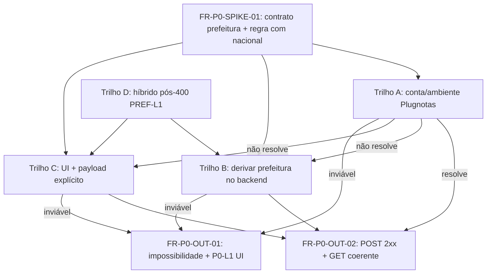
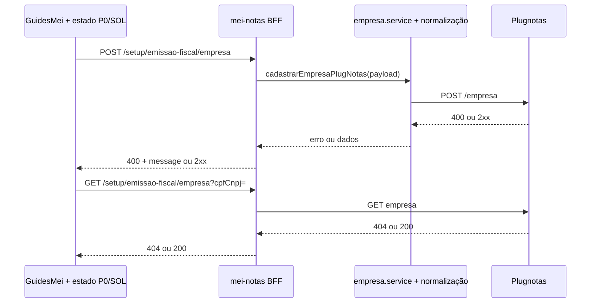

# Arquitetura técnica — Acção **P0**: fechar cadastro empresa (400 `prefeitura` + cadeia 404)

**Versão:** 1.0  
**Data:** 2026-04-08  
**Autoria:** Aria (architect / AIOX)  
**Requisitos de origem:** [`docs/prd/PRD-acao-p0-cadastro-empresa-prefeitura-400-get-404-2026-04-08.md`](../prd/PRD-acao-p0-cadastro-empresa-prefeitura-400-get-404-2026-04-08.md) (**FR-P0-***, **NFR-P0-***)  
**UX de origem:** [`docs/specs/ux-spec-acao-p0-cadastro-empresa-prefeitura-400-get-404-2026-04-08.md`](../specs/ux-spec-acao-p0-cadastro-empresa-prefeitura-400-get-404-2026-04-08.md) (**P0-L0…L4**)

Este documento fixa **orquestração técnica** para fechar o incidente P0: **spike → trilho A–D → entrega mensurável** (**POST** 2xx **ou** ramo “impossibilidade” com UX honesta). **Complementa** (não substitui):

- [`architecture-plugnotas-nfse-config-prefeitura-payload-2026-04-08.md`](architecture-plugnotas-nfse-config-prefeitura-payload-2026-04-08.md) — payload `nfse.config`, trilhos B/C/D, **NFR-PREF-EV-01**.  
- [`architecture-solucao-400-prefeitura-404-get-empresa-mei-2026-04-08.md`](architecture-solucao-400-prefeitura-404-get-empresa-mei-2026-04-08.md) — estados **SOL-L***, *cache*, 404 causal.  
- [`architecture-nfse-nacional-sem-im-prefeitura-mei-2026-04-08.md`](architecture-nfse-nacional-sem-im-prefeitura-mei-2026-04-08.md) — baseline nacional, **NFR-N04**.

**Invariante:** **não** mascarar **404** do `GET` como **200** no BFF; a correção é **cadastro bem-sucedido** ou **expectativa alinhada** (PRD **FR-P0-OUT-01**).

---

## 1. Visão de contexto

### 1.1 Problema de sistema

O validador Plugnotas recusa o **`POST /empresa`** enquanto `nfse.config` não satisfizer a regra da conta (ex.: **`prefeitura` obrigatória**). O **`GET` empresa** retorna **404** enquanto não existir registo — **efeito**, não causa. O P0 exige **fecho** via **trilho** explícito após **FR-P0-SPIKE-01**.

### 1.2 Diagrama de decisão (produto → engenharia)



### 1.3 Fluxo de dados (brownfield)



**Ponto de extensão P0 (trilhos B/C/D):** imediatamente **antes** da chamada Plugnotas em `cadastrarEmpresaPlugNotas`, o payload deve poder ser enriquecido por **função pura** ou **módulo dedicado** (ver secção 4), **sem** duplicar lógica entre `POST` composto e `POST` simples — reutilizar o mesmo *pipeline* de normalização já usado hoje.

---

## 2. Saídas obrigatórias do spike (**FR-P0-SPIKE-01**)

Antes de merge que altere `nfse.config.prefeitura`, o spike deve produzir artefacto interno (template existente: `docs/evidence/NFR-PREF-EV-01-plugnotas-nfse-config-prefeitura-TEMPLATE.md` ou equivalente) com **sem PII** (**NFR-P0-EV-01**), respondendo no mínimo a:

1. **Schema mínimo** aceite por Plugnotas para `nfse.config.prefeitura` (tipo, chaves, exemplos redigidos).  
2. **Condicionalidade** com `nfse.nacional: true` — quando o campo é obrigatório vs dispensável.  
3. **Lookup** — existe endpoint/lista oficial para mapear município → valor de `prefeitura`?  
4. **Compatibilidade** — enviar `nacional: true` + `prefeitura` preenchida: suportado ou conflito?

**Travão de merge:** **FR-PREF-API-01** / **NFR-PREF-EV-01** alinhados; **ADR** nacional ou payload apenas-NFS-e **actualizado** quando o JSON canónico mudar (**FR-NA02** / política ADR existente).

---

## 3. Fronteiras por camada (P0)

| Camada | Responsabilidade P0 |
|--------|---------------------|
| **Frontend** | Resolver **P0-L0…L4** (spec UX) com base em: último resultado **POST** fase 2, último **GET** (404 vs dados), flags **SOL-L2** (secção 3 da arquitetura SOL), **e** sinal **P0-L1** (impossibilidade) vindo de configuração (secção 5). Estender `NfEmissionCompanyForm` / payload **só** no trilho **C/D** conforme spike. Manter **NFR-P0-REG-01**: sem campos novos quando trilho **A** ou baseline nacional. |
| **Backend** | Manter propagação fiel de `message` Plugnotas para classificação **PREF-L1**; em **B**, derivar `nfse.config.prefeitura` **só** com regra documentada no spike; **não** adicionar valores inventados. **NFR-P0-GATE-01** nos *tests* existentes de `plugnotas-empresa`. |
| **Plugnotas** | Autoridade de validação; **trilho A** pode eliminar exigência sem mudança de código. |
| **Config / Operação** | Documentar trilho fechado (**FR-P0-DOC-01**); opcionalmente activar **P0-L1** via variável de ambiente ou *feature flag* (secção 5). |

---

## 4. Extensão do payload (trilhos **B**, **C**, **D**)

### 4.1 Trilho **B** — derivação server-side

- **Local sugerido:** `backend/src/services/plugnotas/empresa.service.js` — após `normalizeEmpresaInput` (ou equivalente) e **antes** do *HTTP client* Plugnotas.  
- **Função:** `applyNfseConfigPrefeituraFromSpikeRule(payload, ctx)` — **purificável** para testes unitários; entrada: payload já com `endereco.codigoCidade`; saída: clone com `nfse.config.prefeitura` **só** se regras do spike e PO o exigirem.  
- **Frontend:** sem alteração de formulário (**NFR-P0-REG-01** para UX); opcional *toast* de sucesso (spec UX trilho B).

### 4.2 Trilho **C** — campos UI

- **Frontend:** estender `NfEmissionCompanyForm` + `buildNfEmissionEmpresaPayload` com campos nomeados no spike; validação local mínima (formato obrigatório).  
- **Backend:** aceitar chaves no JSON do `getEmpresaPayloadFromRequest`; **não** *strip* desconhecido sem revisão — validar *whitelist* se necessário para evitar injecção de estrutura arbitrária em `nfse`.  
- **TipoScript:** tipo discriminado ou campos opcionais `nfsePrefeitura?: …` até estabilizar schema.

### 4.3 Trilho **D** — híbrido

- **Estado UI:** após deteção **PREF-L1** + decisão PO, mostrar *step* (spec UX 8.3); subfluxo **C** ou retry após **A**.  
- **Técnico:** combinar módulos das secções 4.1 e 4.2 **sem** segundo *endpoint* BFF — mesmo `POST …/empresa`.

### 4.4 Trilho **A** apenas

- **Sem** alteração obrigatória em `nfEmissionCompany.ts` / `empresa.service.js` para o P0; **obrigatório** **FR-P0-DOC-01** + testes de regressão **NFR-P0-REG-01**.

---

## 5. Configuração: ramo “impossibilidade” (**P0-L1**, **FR-P0-OUT-01**)

Quando PO documentar que o app **não** pode concluir o cadastro automaticamente para um cenário (conta/plano/ambiente), a UI deve activar **P0-L1** sem *hardcode* de CNPJ.

**Opções (escolher uma na story; preferência: 1):**

1. **Variável de ambiente (build/runtime):** ex.: `VITE_MEI_PLUGNOTAS_EMPRESA_CADASTRO_MODE=auto|blocked_externally` (nome final @dev + PO). **blocked_externally** → mostrar painel P0-L1 e desactivar CTA de retry cego conforme spec UX.  
2. **Remote config** (Supabase ou similar): registo por *tenant* ou global, **sem** PII — só se já existir padrão no projeto; caso contrário, preferir (1) no P0.  
3. **Resposta BFF:** campo opcional `cadastroEmpresaBloqueado: true` **apenas** se o backend puder inferir com segurança (evitar falso positivo); requer desenho adicional — **não** recomendado como única solução no P0 sem spike de API.

**Segurança:** valores de config **não** devem conter CNPJ de utilizadores; cenários específicos ficam em runbook interno, não em *env* público.

---

## 6. Modelo de estado: composição **SOL** + **P0**

A função pura `resolvePlugnotasEmpresaCadastroSolUxState` (arquitetura SOL) permanece a base para **SOL-L0…L3**. A camada P0 **sobrepõe** apenas:

| Prioridade | Condição | Resultado UX |
|------------|----------|--------------|
| 1 | Config **P0-L1** (impossibilidade) activa | Renderizar painel secção 6 da spec UX **depois** do erro 400 se ainda existir; suprimir CTA “tentar de novo” como primário. |
| 2 | **POST** 2xx e **GET** com dados | **P0-L2**: *toast*/*banner* sucesso (spec UX 7); limpar painéis erro; **SOL-L0**. |
| 3 | Caso contrário | Resolver **SOL-L1/L2/L3** como hoje + **PREF-L1** copy. |

**Tipo sugerido (extensão):**

```ts
export type PlugnotasEmpresaP0UxOverlay =
  | { kind: 'none' }
  | { kind: 'impossibility' }      // P0-L1
  | { kind: 'phaseSuccess' };     // P0-L2

export function resolvePlugnotasEmpresaP0Overlay(input: {
  configuracaoCadastroBloqueadoExternamente: boolean;
  lastPostEmpresaPhase2Ok: boolean | null;
  lastGetEmpresaHasData: boolean;
}): PlugnotasEmpresaP0UxOverlay;
```

A composição final na página: `overlay = resolveP0Overlay(...)` + `sol = resolveSolState(...)` com regras da spec UX secção 5.

---

## 7. Cache e invalidação (**FR-P0-OUT-02**)

- Após **POST** 2xx, manter padrão actual: `invalidateMeiEmpresaGetCache` / *mutations* já usadas em `GuidesMei` e `guiaMeiEmpresaGetCache.ts`.  
- Garantir que o **próximo** `GET` não sirva *stale* “404” de tentativa anterior — alinhar TTL e chaves de cache ao CNPJ normalizado.  
- Limpar flag **SOL-L2** (`mei:empresaFase2Fail:…`) no mesmo momento do sucesso (**architecture SOL**).

---

## 8. Testes (NFR-P0-GATE-01 + regressão)

| Área | Casos mínimos |
|------|----------------|
| **Backend** | `plugnotas-empresa.test.js`: *mock* Plugnotas aceita payload com `nfse.config.prefeitura` quando trilho **B**; regressão: payload sem `prefeitura` continua válido quando *fixture* Plugnotas não exige. |
| **Frontend** | `nfEmissionCompany.test.ts`: snapshot de payload trilho **C**; `nfseNacionalPlugnotasErrorHints.test.ts`: sem regressão **PREF-L1**. |
| **Integração / QA manual** | Matriz PRD §11: POST 2xx + GET 200; P0-L1 com config; reload com SOL-L2 + mensagem causal. |

---

## 9. Observabilidade

- **Logs servidor:** manter *correlation id* se existir; **não** logar corpo completo do payload com PII (**NFR-P0-EV-01**).  
- **Métrica opcional (futuro):** contador `mei_empresa_post_400_prefeitura` vs `mei_empresa_post_2xx` — fora do mínimo P0 salvo PO pedir.

---

## 10. Rastreabilidade PRD/spec → arquitectura

| ID | Secção |
|----|--------|
| **FR-P0-SPIKE-01** | 2 |
| **FR-P0-OUT-01** (sucesso técnico) | 1, 4, 7 |
| **FR-P0-OUT-01** (impossibilidade) | 5, 6 |
| **FR-P0-OUT-02** | 1, 7 |
| **FR-P0-DOC-01** | 2, 4 (ADR), `operacao-mei-nfse.md` |
| **NFR-P0-REG-01** | 3, 4.4, 8 |
| **NFR-P0-EV-01** | 2, 9 |
| **P0-L0…L4** (UX) | 4, 5, 6 |

---

## 11. Entregáveis para @dev

1. Story com **trilho** PO (**FR-P0-DEC-01**) e ligação ao artefacto spike.  
2. Lista de ficheiros: `GuidesMei.tsx`, `nfEmissionCompany.ts`, `empresa.service.js`, possível `mei-notas.controller.js` (só se *whitelist*), módulo novo `nfsePrefeituraPayload.js` (nome livre), testes.  
3. Checklist **NFR-P0-GATE-01** no CI.  
4. Actualização **ADR** se `nfse` mudar.

---

## 12. Change log

| Data | Nota |
|------|------|
| 2026-04-08 | Versão inicial: orquestração P0 sobre arquitecturas PREF + SOL; spike, trilhos A–D, config P0-L1, composição de estado, pontos de extensão backend/frontend. |
