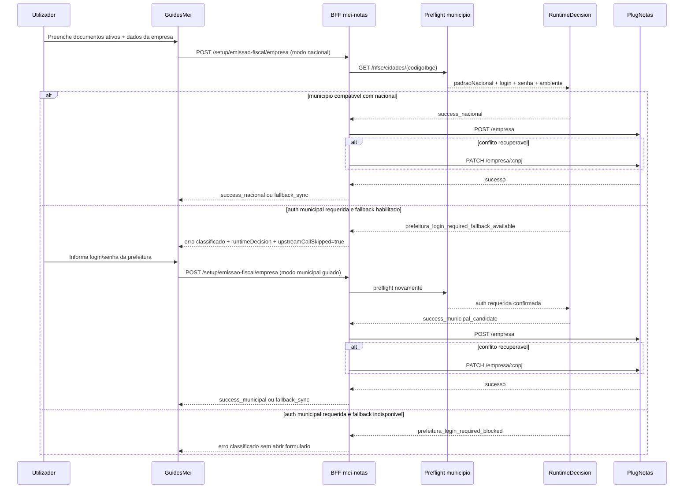

# Arquitetura tecnica -- alinhamento do payload local de empresa PlugNotas com documentos ativos e fallback municipal condicionado

**Versao:** 1.0  
**Data:** 2026-04-15  
**Autoria:** Aria (architect / AIOX)  
**PRD de origem:** [`docs/prd/PRD-alinhamento-payload-local-empresa-plugnotas-documentos-ativos-fallback-municipal-2026-04-15.md`](../prd/PRD-alinhamento-payload-local-empresa-plugnotas-documentos-ativos-fallback-municipal-2026-04-15.md)  
**UX de origem:** [`docs/specs/ux-spec-alinhamento-payload-local-empresa-plugnotas-documentos-ativos-fallback-municipal-2026-04-15.md`](../specs/ux-spec-alinhamento-payload-local-empresa-plugnotas-documentos-ativos-fallback-municipal-2026-04-15.md)

**Referencias externas de contrato:**

- [PlugNotas -- Empresa / addCompany](https://docs.plugnotas.com.br/#tag/Empresa/operation/addCompany)
- [PlugNotas -- OpenAPI oficial (`api.json`)](https://docs.plugnotas.com.br/api.json)
- [PlugNotas -- colecao Postman / Empresa](https://documenter.getpostman.com/view/3720339/2sB3WpSh1R?version=latest#54bcc736-6cd3-4e96-bc51-cab153c2f976)

---

## Relacao com outros artefatos

| Artefato | Papel |
|---|---|
| [`architecture-cadastro-empresa-documentos-ativos-plugnotas-2026-04-07.md`](./architecture-cadastro-empresa-documentos-ativos-plugnotas-2026-04-07.md) | Base tecnica de `documentosAtivos`. Esta arquitetura preserva esse baseline e o estende com o segundo passo municipal. |
| [`architecture-correcao-runtime-cadastro-empresa-plugnotas-contrato-oficial-triagem-municipal-2026-04-14.md`](./architecture-correcao-runtime-cadastro-empresa-plugnotas-contrato-oficial-triagem-municipal-2026-04-14.md) | Base do preflight municipal e de `runtimeDecision`. Esta arquitetura reaproveita esse motor, mas troca o bloqueio puro por fallback guiado quando permitido. |
| [`architecture-nfse-nacional-padrao-bloqueio-excecao-credenciais-prefeitura-plugnotas-2026-04-10.md`](./architecture-nfse-nacional-padrao-bloqueio-excecao-credenciais-prefeitura-plugnotas-2026-04-10.md) | Arquitetura historica de bloqueio puro. Este documento substitui essa politica por `national-first + fallback municipal condicionado`. |
| [`docs/stories/story-fr-plogin-backlog-dp01-credenciais-portal-prefeitura.md`](../stories/story-fr-plogin-backlog-dp01-credenciais-portal-prefeitura.md) | Backlog historico do trilho municipal. Esta arquitetura o reutiliza como implementacao guiada, atras de flag e classificacao estavel. |
| [`backend/src/services/plugnotas/empresa.service.js`](../../backend/src/services/plugnotas/empresa.service.js) | Orquestrador atual do cadastro da empresa, ja com preflight municipal, `runtimeDecision` e fallback `POST -> PATCH`. |
| [`backend/src/services/plugnotas/empresa-cadastro-runtime-decision.js`](../../backend/src/services/plugnotas/empresa-cadastro-runtime-decision.js) | Motor atual de triagem municipal. Sera estendido para diferenciar `fallback disponivel` de `fallback bloqueado`. |
| [`backend/src/services/plugnotas/prefeituraPortalCredentials.js`](../../backend/src/services/plugnotas/prefeituraPortalCredentials.js) | Policy atual que bloqueia qualquer `login` / `senha`. Sera convertida em policy de validacao condicionada. |
| [`frontend/src/pages/GuidesMei.tsx`](../../frontend/src/pages/GuidesMei.tsx) | Tela atual que ja tem estado de retry e variante de erro municipal; sera ajustada para abrir o segundo passo. |

---

## 1. Resumo executivo

O brownfield atual ja tem tres pecas relevantes:

1. o frontend ja mantem `documentosAtivos` coerente com `nfse`, `nfe` e `nfce` no payload local;
2. o backend ja executa preflight municipal e produz `runtimeDecision` antes do `POST /empresa`;
3. o sistema ja possui flags e artefatos historicos para credenciais municipais, mas o runtime efetivo ainda bloqueia qualquer `login` / `senha`.

Esta arquitetura nao cria uma nova jornada nem uma nova rota. Ela redefine o mesmo fluxo `frontend -> BFF -> PlugNotas` como uma maquina de dois passos:

- **passo 1:** tentativa nacional (`nfseNacional=true`);
- **passo 2:** retry municipal guiado (`nfseNacional=false` + `prefeitura.login/senha`) somente quando o preflight indicar exigencia municipal e a governanca permitir.

### O que permanece

- `POST /api/mei-notas/setup/emissao-fiscal/empresa` continua sendo a rota publica;
- o browser continua sem chamar o PlugNotas diretamente;
- `POST /empresa` continua sendo a operacao canonica de cadastro;
- `PATCH /empresa/:cnpj` continua sendo o fallback de sincronizacao;
- `documentosAtivos` continua sendo a selecao canonica da UI.

### O que muda

1. o BFF deixa de tratar `prefeitura_login_required_blocked` sempre como terminal;
2. passa a existir um estado tecnico diferente para `fallback municipal disponivel`;
3. `applyPrefeituraPortalCredentialsPolicy` deixa de ser bloqueio absoluto e passa a ser validacao condicionada por preflight e flag;
4. o builder frontend e a normalizacao backend passam a suportar **modo nacional** e **modo municipal** sem ambiguidades;
5. a resposta BFF -> frontend passa a diferenciar claramente:
   - municipio incompativel com nacional, mas retry municipal disponivel;
   - municipio incompativel e retry municipal indisponivel;
   - sucesso nacional;
   - sucesso municipal.

---

## 2. Estado brownfield atual

### 2.1 Frontend

| Componente | Estado atual |
|---|---|
| `nfEmissionCompany.ts` | Ja deriva `nfse`, `nfe` e `nfce` de `documentosAtivos`, mas assume que `NFS-e` ativa implica `nfseNacional=true`. |
| `GuidesMei.tsx` | Ja possui `plugnotasPendingRetry`, `empresaRegistroRetryBusy` e um painel de retry; hoje ele bloqueia justamente os cenarios `prefeitura_login_required_blocked` e `prefeitura_ibge_apenas_insuficiente_dp02`. |
| `fiscalUserError.ts` | Ja distingue `prefeitura_login_required_blocked` e `prefeitura_ibge_apenas_insuficiente_dp02`, mas como estados terminais. |
| `prefeituraPortalCredentialsUi.ts` | Ja expoe a flag `VITE_PLUGNOTAS_NFSE_PREFEITURA_CREDENCIAIS_ENABLED`, sem hoje ser a fonte final da decisao. |

### 2.2 Backend

| Componente | Estado atual |
|---|---|
| `empresa.service.js` | Ja orquestra normalizacao, `documentosAtivos`, preflight e fallback `POST -> PATCH`. |
| `empresa-cadastro-runtime-decision.js` | Ja executa preflight municipal e produz `runtimeDecision`, mas retorna bloqueio direto quando `requiresLogin` ou `requiresSenha` vem `true`. |
| `prefeituraPortalCredentials.js` | Bloqueia qualquer payload com `nfse.config.prefeitura.login` / `senha`, sem considerar flag nem elegibilidade do caso. |
| `plugnotas-empresa-documentos-ativos.js` | Ja monta os blocos `nfse/nfe/nfce`, mas assume que `nfse` ativa sempre usa a policy nacional. |
| `env.js` | Ja possui `PLUGNOTAS_NFSE_PREFEITURA_CREDENCIAIS_ENABLED`, que hoje nao governa o bloqueio real. |

### 2.3 Conclusao do estado atual

O repositorio ja contem a maior parte das pecas estruturais. O problema nao e falta de infraestrutura; e conflito de politica entre:

- um preflight que ja detecta a exigencia municipal;
- uma UX que ja tem estado de retry;
- uma policy de credenciais que ainda age como bloqueio absoluto.

---

## 3. Decisao arquitetural

**Decisao principal:** transformar o cadastro da empresa em uma **saga curta de dois modos** dentro da mesma rota e da mesma tela:

1. **modo nacional**
2. **modo municipal guiado**

### Invariantes

- a rota publica nao muda;
- o preflight continua no BFF;
- o frontend nao decide sozinho se abre o segundo passo;
- `documentosAtivos` continua sendo a selecao canonica;
- `nfseNacional=true` e `prefeitura.login/senha` nao coexistem no mesmo retry;
- flags de rollout existem, mas o backend continua sendo a autoridade final da elegibilidade.

### Fora da decisao

- nova rota de cadastro da empresa;
- fluxo municipal-first;
- persistencia de credenciais municipais;
- chamada direta browser -> PlugNotas;
- extensao irrestrita do trilho municipal para todos os municipios.

---

## 4. Visao de contexto alvo



---

## 5. Fronteiras por camada

| Camada | Responsabilidade |
|---|---|
| **Frontend** | Expressar intencao do utilizador, manter `documentosAtivos`, abrir o passo municipal apenas com sinal estavel do BFF e nunca persistir credenciais sensiveis. |
| **BFF** | Validar payload, executar preflight, decidir `attemptMode`, aceitar ou bloquear credenciais, montar o payload final do PlugNotas e classificar resposta/erro. |
| **PlugNotas** | Validacao final do cadastro da empresa, tanto no caminho nacional quanto no municipal. |
| **Operacao / QA** | Distinguir sucesso nacional, fallback disponivel, fallback bloqueado, erro de contrato e erro de ambiente. |

---

## 6. Contrato publico e contrato interno

### 6.1 Rota publica

Permanece sem alteracao:

- `POST /api/mei-notas/setup/emissao-fiscal/empresa`
- `PATCH /api/mei-notas/setup/emissao-fiscal/empresa`
- `GET /api/mei-notas/setup/emissao-fiscal/empresa?cpfCnpj=...`

O controller continua aceitando o envelope atual `{ payload }` ou o objeto direto.

### 6.2 Contrato do payload FE -> BFF

O payload continua brownfield-compatible, com estes pontos:

1. `documentosAtivos` permanece opcional, mas continua sendo a selecao canonica quando presente;
2. `nfse`, `nfe` e `nfce` continuam sendo enviados, porque a UI ja os constroi de forma coerente;
3. o retry municipal reutiliza o mesmo payload de empresa, com a diferenca de que:
   - `nfse.config.nfseNacional=false`
   - `nfse.config.consultaNfseNacional=false`
   - `nfse.config.prefeitura.login`
   - `nfse.config.prefeitura.senha`

### 6.3 Contrato de resposta BFF -> frontend

O BFF deve continuar devolvendo:

- `cnpj`
- `message`
- `operation`
- `raw`

**Extensao nao-breaking obrigatoria:** adicionar `runtimeDecision` tanto em sucesso quanto em erro.

Formato recomendado:

```ts
type EmpresaCadastroRuntimeDecision = {
  scenario:
    | 'success_nacional'
    | 'success_municipal'
    | 'fallback_sync'
    | 'prefeitura_login_required_fallback_available'
    | 'prefeitura_login_required_blocked'
    | 'prefeitura_ibge_apenas_insuficiente_dp02'
    | 'payload_contrato'
    | 'ambiente_configuracao'
    | 'empresa_nao_cadastrada';
  attemptMode?: 'nacional' | 'municipal';
  consultedMunicipio: boolean;
  codigoIbge?: string;
  environment?: 'producao' | 'homologacao';
  padraoNacionalEnabled?: boolean | null;
  requiresLogin?: boolean;
  requiresSenha?: boolean;
  upstreamCallSkipped?: boolean;
};
```

### 6.4 Codigo estavel novo

Para separar os estados "abrir formulario" e "continuar bloqueado", esta arquitetura introduz:

- `prefeitura_login_required_fallback_available`

Regras:

- quando o preflight indicar `requiresLogin` ou `requiresSenha` e o fallback municipal estiver elegivel, o BFF responde com esse codigo estavel;
- quando a mesma condicao ocorrer sem elegibilidade ou sem flag, o codigo continua sendo `prefeitura_login_required_blocked`.

Isto preserva compatibilidade operacional e da QA, sem reaproveitar `blocked` para um estado que agora abre segundo passo.

---

## 7. Maquina de decisao do BFF

### 7.1 Entradas da decisao

- `documentosAtivos`
- `nfse.config.*`
- `nfse.config.prefeitura.login/senha` quando presentes
- `codigoIbge`
- ambiente alvo
- flags de rollout

### 7.2 Tabela de decisao

| Preflight | Credenciais no payload | Flag backend | Resultado | Acao |
|---|---|---|---|---|
| `requiresLogin=false` e `requiresSenha=false` e `padraoNacional=true` | nao | qualquer | `success_nacional_candidate` | seguir no caminho nacional |
| `requiresLogin=true` ou `requiresSenha=true` | nao | `false` | `prefeitura_login_required_blocked` | bloquear antes do upstream |
| `requiresLogin=true` ou `requiresSenha=true` | nao | `true` | `prefeitura_login_required_fallback_available` | bloquear antes do upstream e instruir a UI a abrir o segundo passo |
| `requiresLogin=true` ou `requiresSenha=true` | sim | `true` | `success_municipal_candidate` | validar credenciais e seguir no caminho municipal |
| `requiresLogin=true` ou `requiresSenha=true` | sim | `false` | `prefeitura_login_required_blocked` | rejeitar |
| `requiresLogin=false` e `requiresSenha=false` | sim | qualquer | `payload_contrato` | rejeitar credenciais fora do caso elegivel |
| `padraoNacional=false/null` e sem auth explicita | nao | qualquer | `prefeitura_ibge_apenas_insuficiente_dp02` | bloquear antes do upstream |

### 7.3 Consequencia arquitetural

O preflight continua a ser executado **antes** do `POST /empresa`, mas o seu papel muda:

- antes: bloquear ou liberar o caminho nacional;
- agora: decidir entre **nacional**, **municipal guiado** ou **bloqueio terminal**.

---

## 8. Backend alvo por modulo

### 8.1 `empresa-cadastro-runtime-decision.js`

Responsabilidades novas:

- adicionar o scenario `prefeitura_login_required_fallback_available`;
- adicionar o scenario `success_municipal`;
- separar `auth requerida + flag on` de `auth requerida + flag off`.

Responsabilidade que permanece:

- normalizar o resultado do preflight;
- anexar `runtimeDecision` ao erro.

### 8.2 `prefeituraPortalCredentials.js`

Estado atual:

- bloqueia qualquer `login` / `senha`.

Estado alvo:

- extrai e valida credenciais do payload;
- aceita credenciais somente quando:
  - a flag `PLUGNOTAS_NFSE_PREFEITURA_CREDENCIAIS_ENABLED` estiver `true`;
  - `NFS-e` estiver ativa;
  - o preflight confirmar que o municipio exige auth municipal;
  - o retry estiver no modo municipal.

Decisao:

- o modulo deixa de ser "policy de bloqueio absoluto";
- passa a ser "policy de validacao e redaction condicionada".

### 8.3 `plugnotas-empresa-documentos-ativos.js`

Estado atual:

- `assignDocumentBlocksFromSelection()` assume que `nfse` ativa usa sempre `applyNfseNationalContractPolicy()`.

Estado alvo:

- a montagem dos blocos passa a aceitar um `nfseMode`:

```ts
'nacional' | 'municipal'
```

Regras:

- `nacional` -> `nfse.config.nfseNacional=true` e `consultaNfseNacional=true`
- `municipal` -> `nfse.config.nfseNacional=false` e `consultaNfseNacional=false`

Consequencia:

- o helper continua sendo a fonte unica de montagem de `nfse/nfe/nfce`, mas agora sem acoplamento obrigatorio entre `NFS-e ativa` e `modo nacional`.

### 8.4 `plugnotas-mei-empresa-policy.js`

Estado alvo:

- evoluir de policy apenas nacional para policy orientada por `attemptMode`;
- preservar compatibilidade de entrada com shape legado;
- garantir que `nfse.nacional` nunca volte a ser enviado ao upstream.

### 8.5 `empresa.service.js`

Responsabilidade alvo:

1. normalizar payload;
2. resolver `documentosAtivos`;
3. resolver `attemptMode` inicial;
4. executar preflight;
5. decidir se:
   - libera o caminho nacional,
   - devolve `fallback_available`,
   - aceita o caminho municipal,
   - bloqueia o caso;
6. montar payload final coerente com o `attemptMode`;
7. executar `POST /empresa` e eventual `PATCH /empresa/:cnpj`;
8. devolver `runtimeDecision` em sucesso e erro.

### 8.6 `mei-notas.controller.js`

Sem mudanca de rota nem de envelope.

Observacao importante:

- `persistDocumentosAtivosMirrorAfterEmpresa()` continua ocorrendo apenas apos sucesso;
- quando o BFF devolve `fallback_available`, nao ha persistencia do mirror nem side-effect de sucesso.

---

## 9. Frontend alvo por modulo

### 9.1 `GuidesMei.tsx`

Decisao:

- reutilizar `plugnotasPendingRetry` e o painel atual de retry;
- enriquecer esse estado com `runtimeDecision` e `retryKind`.

Estado alvo recomendado:

```ts
type PlugnotasPendingRetry =
  | { retryKind: 'generic'; certificadoId: string; cnpj: string; runtimeDecision?: EmpresaCadastroRuntimeDecision }
  | { retryKind: 'municipal'; certificadoId: string; cnpj: string; runtimeDecision: EmpresaCadastroRuntimeDecision };
```

Mudanca principal:

- `plugnotasRetryBlockedByScenario` deixa de bloquear o caso `prefeitura_login_required_fallback_available`;
- passa a bloquear apenas `prefeitura_login_required_blocked` e `prefeitura_ibge_apenas_insuficiente_dp02`.

### 9.2 Estado de credenciais municipais

Decisao:

- manter `login` e `senha` fora de `NfEmissionCompanyForm`;
- usar um sidecar state dedicado ao bloco municipal.

Motivo:

- evita persistencia acidental;
- facilita invalidacao quando `NFS-e`, municipio ou `codigoIbge` mudarem;
- impede que o formulario base de empresa passe a carregar dado sensivel por default.

Estrutura recomendada:

```ts
type PrefeituraPortalCredentialsForm = {
  login: string;
  senha: string;
};
```

### 9.3 `nfEmissionCompany.ts`

Evolucao recomendada:

- aceitar `attemptMode?: 'nacional' | 'municipal'`;
- aceitar `prefeituraPortalCredentials?: { login: string; senha: string } | null`;
- montar `nfse.config` conforme o modo.

Regras:

- `attemptMode='nacional'` -> comportamento atual;
- `attemptMode='municipal'` -> `nfseNacional=false`, `consultaNfseNacional=false` e `prefeitura.login/senha`;
- se `NFS-e` estiver desligada, o builder nao emite o bloco municipal.

### 9.4 `meiNotasService.ts`

Evolucao recomendada:

- adicionar `runtimeDecision?: EmpresaCadastroRuntimeDecision` a `CadastrarEmissaoNfEmpresaResponse`;
- isso elimina dependencia exclusiva de heuristica textual para abrir o segundo passo.

### 9.5 `fiscalUserError.ts` e `nfseNacionalPlugnotasErrorHints.ts`

Decisao:

- `runtimeDecision.scenario` passa a ter precedencia sobre `plugnotasCode`;
- heuristicas textuais continuam apenas como fallback e enriquecimento.

Novo mapeamento necessario:

- `prefeitura_login_required_fallback_available` -> estado de UX que abre o bloco municipal;
- `prefeitura_login_required_blocked` -> estado terminal bloqueado;
- `success_municipal` -> copy especifica de sucesso municipal.

---

## 10. Seguranca e privacidade

| Tema | Decisao |
|---|---|
| Coleta | `login` e `senha` so existem no segundo passo e somente quando o BFF autorizar |
| Persistencia local | proibida para browser storage, querystring e caches manuais |
| Logs backend | obrigatoriamente redigidos |
| Logs frontend | nenhum `console.log` ou telemetria com valores dos campos |
| Response BFF | nunca devolve `login` / `senha` ao frontend depois do submit |
| Flags | backend continua sendo a autoridade final; frontend flag apenas habilita a renderizacao do bloco |

---

## 11. Rollout e compatibilidade

### 11.1 Flags

Backend:

- `PLUGNOTAS_NFSE_PREFEITURA_CREDENCIAIS_ENABLED`

Frontend:

- `VITE_PLUGNOTAS_NFSE_PREFEITURA_CREDENCIAIS_ENABLED`

### 11.2 Semantica das flags

- **flag backend off:** qualquer auth municipal continua bloqueada; `prefeitura_login_required_blocked`
- **flag backend on + flag frontend off:** o BFF pode sinalizar `fallback_available`, mas a UX nao abre o bloco; por isso este estado nao deve ser ativado em producao antes do deploy frontend
- **flag backend on + flag frontend on:** fallback guiado completo

### 11.3 Ordem segura de rollout

1. deploy do backend com codigo novo, mantendo flag off;
2. deploy do frontend com suporte aos novos cenarios, mantendo flag off;
3. habilitar a flag frontend;
4. habilitar a flag backend;
5. monitorar `runtimeDecision.scenario` e regressao do caminho nacional.

### 11.4 Compatibilidade brownfield

- rotas nao mudam;
- envelope `{ payload }` nao muda;
- `documentosAtivos` continua valido;
- old frontends continuam funcionando enquanto a flag backend estiver off.

---

## 12. Observabilidade e QA

### 12.1 Sinais minimos

- `runtimeDecision.scenario`
- `runtimeDecision.attemptMode`
- `runtimeDecision.consultedMunicipio`
- `runtimeDecision.upstreamCallSkipped`
- `operation`
- `plugnotasRequest.method/path` quando houver upstream

### 12.2 Matriz minima

| Cenario | Resultado esperado |
|---|---|
| nacional puro | `success_nacional` |
| auth municipal com flag off | `prefeitura_login_required_blocked` |
| auth municipal com flag on e sem credenciais | `prefeitura_login_required_fallback_available` |
| auth municipal com flag on e credenciais validas | `success_municipal` ou `fallback_sync` |
| credenciais presentes fora de caso elegivel | `payload_contrato` |

### 12.3 Regressao obrigatoria

- `documentosAtivos` coerente no builder;
- caminho nacional sem credenciais intacto;
- `POST -> PATCH -> GET` com causalidade preservada;
- nenhum vazamento de credenciais em logs ou fixtures.

---

## 13. Arquivos provaveis impactados

| Arquivo | Papel provavel |
|---|---|
| `backend/src/services/plugnotas/empresa.service.js` | Orquestracao do `attemptMode`, preflight e retry guiado |
| `backend/src/services/plugnotas/empresa-cadastro-runtime-decision.js` | Novos scenarios e decisao `available` vs `blocked` |
| `backend/src/services/plugnotas/prefeituraPortalCredentials.js` | Refactor de bloqueio absoluto para validacao condicionada |
| `backend/src/services/plugnotas/plugnotas-empresa-documentos-ativos.js` | Suporte a `nfseMode='municipal'` |
| `backend/src/config/env.js` | Semantica definitiva da flag ja existente |
| `frontend/src/pages/GuidesMei.tsx` | Abertura do segundo passo, invalidacao de estado e novo CTA |
| `frontend/src/utils/nfEmissionCompany.ts` | Builder mode-aware (`nacional` x `municipal`) |
| `frontend/src/services/meiNotasService.ts` | Tipagem de `runtimeDecision` |
| `frontend/src/lib/fiscalUserError.ts` | Novos cenarios e copy de sucesso/erro municipal |
| `frontend/src/utils/prefeituraPortalCredentialsUi.ts` | Helpers de flag/renderizacao e nao persistencia |

---

## 14. Mapeamento PRD / UX -> arquitetura

| Origem | Realizacao arquitetural |
|---|---|
| **DP-ALNFB-01** | `attemptMode='nacional'` como default e callout nacional preservado |
| **DP-ALNFB-03** | `prefeitura_login_required_fallback_available` abre o segundo passo apenas com classificacao estavel |
| **DP-ALNFB-04** | `nfseMode='municipal'` no builder frontend e no normalizador backend |
| **FR-ALNFB-04** | preflight municipal continua sendo a origem da decisao |
| **FR-ALNFB-05** | frontend so abre `login`/`senha` quando receber o scenario novo |
| **FR-ALNFB-06** | retry usa a mesma rota e o mesmo BFF, com payload municipal guiado |
| **FR-ALNFB-09** | `prefeitura_login_required_blocked` permanece como estado terminal quando o fallback nao estiver elegivel |
| **UX ALNFB-UX-L3 / L7** | separacao tecnica entre `fallback disponivel` e `fallback indisponivel` |
| **CR-ALNFB-03** | flags e rollout evitam friccao extra no caminho nacional existente |

---

## 15. Change log

| Versao | Data | Notas |
|---|---|---|
| 1.0 | 2026-04-15 | Arquitetura inicial para substituir o bloqueio puro por `national-first + fallback municipal condicionado`, reaproveitando o brownfield ja existente no repo. |

---

— Aria, arquitetando o futuro 🏗️
