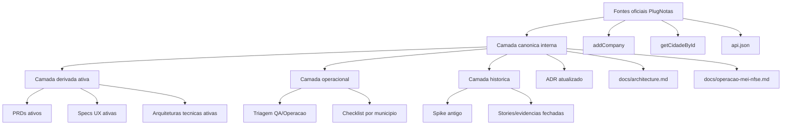
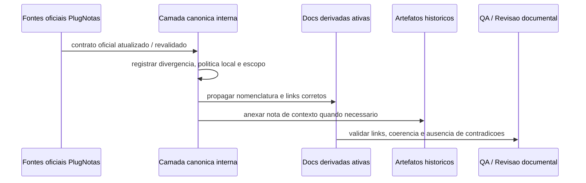

# Arquitetura tecnica -- atualizacao das docs canonicas do cadastro de empresa PlugNotas para o contrato oficial

**Versao:** 1.0  
**Data:** 2026-04-14  
**Autoria:** Aria (architect / AIOX)  
**PRD de origem:** [`docs/prd/PRD-atualizacao-docs-contrato-oficial-plugnotas-cadastro-empresa-2026-04-14.md`](../prd/PRD-atualizacao-docs-contrato-oficial-plugnotas-cadastro-empresa-2026-04-14.md)  
**UX de origem:** [`docs/specs/ux-spec-atualizacao-docs-contrato-oficial-plugnotas-cadastro-empresa-2026-04-14.md`](../specs/ux-spec-atualizacao-docs-contrato-oficial-plugnotas-cadastro-empresa-2026-04-14.md)

**Referencias externas (contrato):**

- [PlugNotas -- Empresa / addCompany](https://docs.plugnotas.com.br/#tag/Empresa/operation/addCompany)
- [PlugNotas -- Consultar disponibilidade do municipio e metadados](https://docs.plugnotas.com.br/#operation/getCidadeById)
- [PlugNotas -- OpenAPI oficial (`api.json`)](https://docs.plugnotas.com.br/api.json)

---

## 1. Decisao arquitetural

**Decisao principal:** tratar esta iniciativa como **arquitetura de governanca documental**, e nao como mudanca de runtime.

O sistema tecnico a ser desenhado aqui nao e um novo servico ou componente executavel. E um arranjo controlado de:

- **fontes de verdade externas**;
- **artefatos canonicos internos**;
- **artefatos ativos derivados**;
- **artefatos historicos contextualizados**;
- **regras de sincronizacao entre essas camadas**.

### 1.1 Invariantes

- A OpenAPI e a documentacao oficial PlugNotas passam a ser a fonte primaria para contrato externo.
- `docs/operacao-mei-nfse.md`, `docs/architecture.md` e ADRs PlugNotas permanecem como superficies canonicas do repo.
- O produto atual continua com implementacao legada em runtime e politica nacional-first local, sem migracao automatica nesta iniciativa.
- Qualquer diferenca entre contrato oficial e runtime atual deve ser **explicitada**, nao ocultada.

### 1.2 Fora da decisao

- Nao migrar `nfse.nacional` para `nfse.config.nfseNacional` nesta rodada.
- Nao abrir novo endpoint, novo componente React ou nova tela.
- Nao revisar o backlog tecnico de implementacao alem de registrá-lo como desdobramento futuro.

---

## 2. Problema arquitetural

Hoje o cluster PlugNotas sofre de uma falha tipica de arquitetura de conhecimento: a mesma informacao aparece em varias camadas com niveis diferentes de confianca e sem hierarquia explicita.

| Camada | Problema atual |
|---|---|
| Fonte externa | contrato oficial atual existe, mas nem sempre esta refletido nas docs internas |
| Docs canonicas | algumas ainda tratam `nfse.nacional` como referencia principal |
| Docs derivadas | PRD/spec/arquitetura ativos podem herdar a premissa antiga |
| Historico | artefatos antigos continuam uteis, mas sem marcador claro de historicidade |

O efeito arquitetural e **deriva semantica**: diferentes membros do time constroem solucoes sobre bases diferentes.

---

## 3. Modelo de arquitetura

### 3.1 Camadas

### 3.2 Regras de propagacao

1. **Contrato oficial -> canonico interno**
   - toda informacao nova ou corrigida do fornecedor entra primeiro em ADR/runbook/arquitetura consolidada;
   - essa camada canonica registra o contrato, a politica local e a divergencia atual.

2. **Canonico interno -> docs derivadas**
   - PRDs, specs UX e arquiteturas ativas nao devem reinterpretar o fornecedor diretamente sem apontar para a camada canonica;
   - quando precisarem citar o contrato externo, devem expor o mesmo conjunto de fontes e a mesma nomenclatura.

3. **Canonico interno -> historico**
   - artefatos antigos nao sao reescritos como se a decisao nunca tivesse existido;
   - eles recebem nota de contexto ou marcador de historico apontando para a referencia vigente.

---

## 4. Fronteiras e responsabilidades

| Camada | Responsabilidade |
|---|---|
| **Fontes oficiais PlugNotas** | fonte de verdade do schema e dos metadados de municipio |
| **ADR atualizado** | registrar divergencia contrato oficial x implementacao local e reclassificar hipoteses antigas |
| **`docs/architecture.md`** | consolidar a narrativa arquitetural vigente do repo |
| **`docs/operacao-mei-nfse.md`** | fixar o fluxo de triagem operacional, incluindo `/nfse/cidades/{codigoIbge}` |
| **PRDs e specs ativas** | traduzir o contrato e a politica local para produto, UX e backlog |
| **Artefatos historicos** | preservar rastreabilidade, nunca atuar como fonte vigente sem nota de contexto |

### 4.1 Limite da arquitetura docs-first

Esta arquitetura define **como o conhecimento tecnico deve ser organizado**.  
Ela nao redefine **como o backend deve montar payload** neste mesmo ciclo.

Quando a camada canonica disser:

- "contrato oficial atual documenta `nfse.config.nfseNacional`",

isso nao significa automaticamente que:

- "o runtime ja foi migrado".

Essa separacao precisa aparecer em toda camada ativa.

---

## 5. Estrutura dos artefatos

### 5.1 Artefatos P0

| Arquivo | Papel arquitetural |
|---|---|
| `docs/adr/ADR-plugnotas-nfse-nacional-empresa-spike.md` | registrar a divergencia historica e supersedencia parcial do spike |
| `docs/architecture.md` | atualizar visao consolidada com o contrato oficial e a divergencia local |
| `docs/operacao-mei-nfse.md` | tornar a consulta de municipio etapa canonica da triagem |
| `docs/brief/brief-plugnotas-addcompany-guia-mei-cnpj-mapeamento-2026-04-09.md` | alinhar o mapeamento addCompany ao schema oficial atual |
| `docs/adr/ADR-plugnotas-empresa-payload-apenas-nfse.md` | separar claramente "politica local" de "capacidade do fornecedor" |

### 5.2 Artefatos P1

| Arquivo | Papel arquitetural |
|---|---|
| `docs/prd/PRD-400-nfse-prefeitura-login-obrigatorio-plugnotas-2026-04-09.md` | atualizar a base de requisitos ativos do cluster PLOGIN |
| `docs/specs/ux-spec-400-nfse-prefeitura-login-obrigatorio-plugnotas-2026-04-09.md` | atualizar a narrativa UX ativa do cluster |
| `docs/technical/architecture-400-nfse-prefeitura-login-obrigatorio-plugnotas-2026-04-09.md` | atualizar a fronteira tecnica ativa do cluster |

### 5.3 Artefatos P2

| Tipo | Tratamento |
|---|---|
| stories fechadas | marcar contexto historico quando ainda usadas como referencia |
| evidencias antigas | manter como prova de contexto, nao como schema vigente |
| briefs antigos | adicionar ponte para a referencia atual quando continuarem relevantes |

---

## 6. Padroes arquiteturais de conteudo

### 6.1 Padrao "Mapa de fontes canonicas"

Toda doc ativa relevante do cluster deve ter um bloco curto com:

- link para `addCompany`;
- link para `getCidadeById`;
- link para `api.json`;
- link para o artefato interno canonico equivalente;
- uma linha de proposito por fonte.

**Funcao arquitetural:** reduzir dependencia de contexto oral e manter sincronizacao entre camadas.

### 6.2 Padrao "Divergencia atual"

Toda doc ativa que tocar no shape de payload precisa expor:

1. o contrato oficial atual;
2. o shape legado ainda usado pelo runtime;
3. a afirmacao de que migracao de runtime e backlog separado.

### 6.3 Padrao "Politica local"

Toda doc ativa que citar `prefeitura.login` / `senha` precisa distinguir:

- **schema oficial do fornecedor**;
- **politica local do Meu Financeiro**, que hoje bloqueia credenciais municipais no fluxo nacional-first.

### 6.4 Padrao "Historico"

Toda doc antiga ainda relevante deve:

- indicar explicitamente que e historica;
- apontar para a referencia vigente;
- manter change log e contexto originais.

---

## 7. Fluxo arquitetural de manutencao

### 7.1 Ordem de atualizacao obrigatoria

1. atualizar camada canonica;
2. propagar para docs ativas;
3. contextualizar historico;
4. validar navegabilidade e consistencia.

Essa ordem evita que PRD/spec/arquitetura ativa passem a citar um contrato novo sem que o repositório tenha definido primeiro sua fonte interna de verdade.

---

## 8. Integracao com a operacao

### 8.1 Triagem por municipio

O runbook precisa consolidar como etapa arquitetural obrigatoria:

1. identificar `codigoIbge` usado no caso;
2. consultar `/nfse/cidades/{codigoIbge}`;
3. ler:
   - `padraoNacional.producao`
   - `padraoNacional.homologacao`
   - `login`
   - `senha`
4. comparar resultado com:
   - contrato oficial;
   - politica local do produto;
   - shape legado do runtime.

### 8.2 Causalidade minima da analise

Ao lidar com `prefeitura_login_required_blocked`, a arquitetura documental precisa sustentar duas hipoteses tecnicas possiveis sem confundi-las:

- o municipio realmente exige autenticacao municipal conforme schema/metadados do fornecedor;
- o produto pode estar agravando a situacao por ainda usar um shape legado.

Essa distincao nao pode depender apenas de parsing textual do erro.

---

## 9. Seguranca e compliance

### 9.1 Segredos

Nenhum artefato gerado por esta iniciativa deve conter:

- credenciais reais de prefeitura;
- tokens PlugNotas;
- payload bruto com dados sensiveis;
- dumps integrais de requests/responses com material identificavel.

### 9.2 Politica de exposicao

Mesmo quando a documentacao oficial citar `login` e `senha` como campos do schema:

- a camada canonica deve tratar isso como **capacidade do fornecedor**;
- a camada ativa do produto deve tratar isso como **politica local bloqueada** no fluxo atual.

---

## 10. Observabilidade documental

### 10.1 O que precisa ser observavel

- quais docs sao fonte vigente;
- quais docs sao historicas;
- onde existe divergencia contrato x runtime;
- quais referencias externas sustentam a decisao.

### 10.2 O que nao pode ficar escondido

- a divergencia entre `nfse.nacional` e `nfse.config.nfseNacional`;
- a existencia da rota `/nfse/cidades/{codigoIbge}`;
- a diferenca entre schema oficial e politica local.

---

## 11. Testabilidade

### 11.1 Validacoes manuais minimas

- abrir links externos oficiais a partir das docs ativas;
- verificar consistencia do `Mapa de fontes canonicas`;
- verificar que runbook, ADR e arquitetura consolidada usam a mesma nomenclatura;
- verificar que artefatos historicos tem nota de contexto quando necessario.

### 11.2 Validacoes arquiteturais

- nenhuma doc ativa afirma que o runtime ja foi migrado se isso nao ocorreu;
- nenhuma doc ativa trata shape legado como contrato oficial;
- nenhuma doc operacional ignora a consulta de municipio quando estiver analisando excecao municipal.

---

## 12. Mapeamento PRD/spec -> realizacao tecnica

| ID | Realizacao arquitetural |
|---|---|
| **FR-DOCPN-01** | camada canonica + docs ativas com bloco de divergencia |
| **FR-DOCPN-02** | ADR atualizado + `docs/operacao-mei-nfse.md` |
| **FR-DOCPN-03** | checklist arquitetural de triagem no runbook |
| **FR-DOCPN-04** | separacao entre schema oficial e politica local em ADR/PRD/spec ativa |
| **FR-DOCPN-05** | padrao `Mapa de fontes canonicas` |
| **FR-DOCPN-06** | marcador de historico em artefatos antigos |
| **FR-DOCPN-07** | atualizar docs ativas do cluster PLOGIN para basear evidencias em schema + rota de municipio |
| **FR-DOCPN-08** | epico/story apenas documental; backlog runtime explicitamente fora da arquitetura desta iniciativa |

---

## 13. Backlog tecnico explicito

Esta arquitetura deixa pronto o terreno para um backlog tecnico futuro, mas **nao o executa**.

### 13.1 Futuro possivel A -- migracao de contrato runtime

- rever `frontend/src/utils/nfEmissionCompany.ts`
- rever `backend/src/services/plugnotas/empresa.service.js`
- rever testes de contrato em `backend/tests/plugnotas-empresa.test.js`

### 13.2 Futuro possivel B -- governanca automatizada

- script/checklist automatica para detectar `nfse.nacional` em docs ativas;
- verificacao de links oficiais;
- validacao de marcador de historico em artefatos antigos.

### 13.3 Regra

Qualquer um desses futuros exige novo PRD, epic tecnico ou story propria. Nao fazem parte desta entrega.

---

## 14. Criterios de aceite arquiteturais

- [ ] A arquitetura docs-first separa claramente fonte oficial, camada canonica, camada derivada e camada historica.
- [ ] O runbook passa a tratar `/nfse/cidades/{codigoIbge}` como dependencia arquitetural da triagem.
- [ ] A camada canonica registra explicitamente a divergencia contrato oficial x runtime legado.
- [ ] A arquitetura deixa explicito que politica local do produto nao equivale a limitacao do fornecedor.
- [ ] O backlog de migracao de runtime permanece separado desta iniciativa documental.

---

## 15. Change log

| Versao | Data | Notas |
|---|---|---|
| 1.0 | 2026-04-14 | Arquitetura tecnica inicial para a iniciativa docs-first de alinhamento do contrato oficial PlugNotas no cadastro de empresa. |
