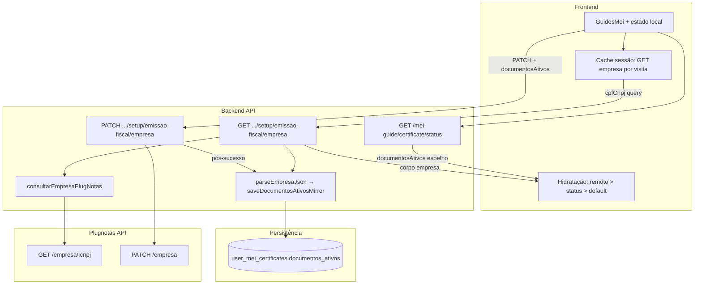
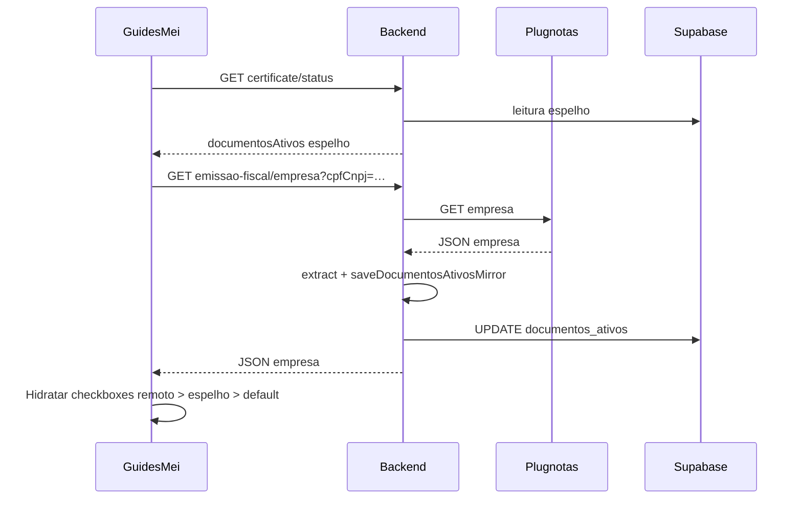
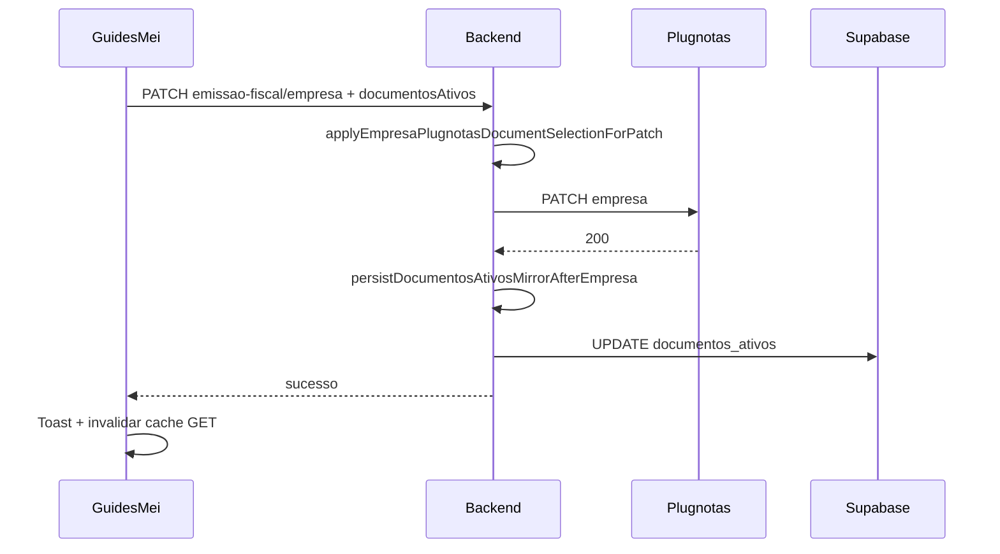

# Arquitetura técnica — **Atualização posterior** de documentos ativos (Plugnotas + Supabase)

**Versão:** 1.0  
**Data:** 2026-04-07  
**Autoria:** Aria (architect / AIOX)  
**Requisitos de origem:** [`docs/prd/PRD-atualizacao-posterior-documentos-ativos-plugnotas-supabase-2026-04-07.md`](../prd/PRD-atualizacao-posterior-documentos-ativos-plugnotas-supabase-2026-04-07.md)  
**UX de origem:** [`docs/specs/ux-spec-atualizacao-posterior-documentos-ativos-plugnotas-supabase-2026-04-07.md`](../specs/ux-spec-atualizacao-posterior-documentos-ativos-plugnotas-supabase-2026-04-07.md)

**Relacionado (não substituído):**

- [`docs/technical/architecture-cadastro-empresa-documentos-ativos-plugnotas-2026-04-07.md`](architecture-cadastro-empresa-documentos-ativos-plugnotas-2026-04-07.md) — policy POST/PATCH, `documentosAtivos` → blocos `nfse`/`nfe`/`nfce`.  
- [`docs/operacao-mei-nfse.md`](../operacao-mei-nfse.md) — semântica de `PATCH` e omissão de blocos.

Este documento fixa **fluxos de dados**, **fronteiras API**, **reconciliação GET → espelho**, **cache no cliente**, **detecção de deriva (P1)** e **ficheiros tocados**. Não substitui story nem contrato campo-a-campo com o Plugnotas.

---

## 1. Visão de contexto

**Princípios:**

1. **Escrita do espelho** continua **só no backend** (Supabase service role), nunca no browser direto sobre a tabela (**NFR-UPD-DOC-05**).  
2. **Leitura para UI:** ordem **GET empresa (normalizado)** → **`documentosAtivos` em certificate/status** → **`DOCUMENTOS_ATIVOS_DEFAULT`** (**FR-UPD-DOC-04**).  
3. **Reconciliação inbound:** após **GET empresa bem-sucedido**, derivar `{ nfse, nfe, nfce }` do JSON e chamar **`saveDocumentosAtivosMirror(userId, selection)`** quando aplicável (**FR-UPD-DOC-05**).  
4. **Uma rede GET “pesada” por visita** (ou TTL) — **NFR-UPD-DOC-01**.

---

## 2. Estado actual do código (brownfield)

| Peça | Comportamento relevante |
|------|-------------------------|
| `mei-notas.controller.js` | `consultarPlugNotasEmpresa` → `consultarEmpresaPlugNotas(cpfCnpj)`; **não** persiste espelho hoje. |
| `mei-notas.controller.js` | `atualizarPlugNotasEmpresa` → `persistDocumentosAtivosMirrorAfterEmpresa` após sucesso se `documentosAtivos` no body. |
| `mei-notas-documentos-mirror.js` | `persistDocumentosAtivosMirrorAfterEmpresa` — normaliza, valida ≥1 tipo, chama `saveDocumentosAtivosMirror`. |
| `mei-certificate-store.js` | `saveDocumentosAtivosMirror` — UPDATE `documentos_ativos` + `updated_at` se existir linha; `getDocumentosAtivosMirror` — leitura. |
| `mei-guide.service.js` | `getCertificateStatus` expõe `documentosAtivos` via `getDocumentosAtivosMirror` (espelho). |
| `plugnotas/empresa.service.js` | `atualizarEmpresaPlugNotas`: se `resolveDocumentosAtivosForPatch` indica `present`, aplica `applyEmpresaPlugnotasDocumentSelectionForPatch` antes do fetch ao Plugnotas. |
| `plugnotas-empresa-documentos-ativos.js` | Normalização **entrada** (`documentosAtivos` no POST/PATCH); **falta** (para este PRD) extracção **saída** a partir do JSON de **GET empresa**. |

**Lacuna a implementar:** função única e testável **`extractDocumentosAtivosFromEmpresaResponse(empresaJson)`** (ou nome equivalente) que mapeia `nfse` / `nfe` / `nfce` (tipicamente `ativo` booleano) → `{ nfse, nfe, nfce }`, com comportamento **defensivo** se a forma do Plugnotas variar (ver §4.2).

---

## 3. Decisões arquitecturais

### 3.1 Onde executar GET → espelho (reconciliação)

**Opção recomendada (MVP):** no **handler HTTP** de consulta de empresa **após** `consultarEmpresaPlugNotas` retornar sucesso:

1. Resolver `userId` a partir de `req.user.id`.  
2. Passar o **corpo** (ou parte relevante) da resposta Plugnotas a `extractDocumentosAtivosFromEmpresaResponse`.  
3. Se o resultado for não-nulo **e** `assertAtLeastOneDocumentoAtivo` passar, chamar `saveDocumentosAtivosMirror(userId, selection)`.  
4. Erros de espelho **engolidos** (comportamento actual); **P2:** log `warn` estruturado (**FR-UPD-DOC-09**).

**Alternativa:** serviço dedicado `reconcileDocumentosAtivosMirrorFromRemote(userId, empresaJson)` em `mei-notas-documentos-mirror.js` (ou `mei-certificate-store.js`) invocado pelo controller — **preferível** para testes unitários sem HTTP.

**Não** introduzir novo endpoint **obrigatório** para MVP se o fluxo acima cumprir **FR-UPD-DOC-05**; um endpoint explícito `POST …/empresa/reconcile` só se o PO quiser separar “consultar sem gravar” de “consultar e gravar espelho” (fora do MVP do PRD).

### 3.2 Contrato da resposta GET ao cliente

Manter **corpo actual** da consulta Plugnotas (transparência para debug e “Consultar cadastro”). Opcional (story): acrescentar campo **`documentosAtivosNormalizados`** na resposta **envelope** do `sendSuccess` **apenas** se o produto quiser evitar duplicar parsing no cliente — **não obrigatório** se o frontend já parsear o mesmo JSON; alinhar com duplicação mínima.

**Recomendação:** **um** parser partilhado no **backend** para espelho + (opcional) campo derivado na API; no **frontend**, reutilizar utilitário espelhado em `plugnotasEmpresaDocumentosAtivos.ts` **ou** consumir campo derivado se existir — **uma** fonte de verdade para “o que mostrar nos checkboxes” após GET.

### 3.3 PATCH com edição posterior (**FR-UPD-DOC-02** / **CR-UPD-DOC-04**)

- O corpo do `PATCH` deve incluir **`documentosAtivos`** quando o utilizador confirmar a secção (PRD §6.3).  
- O serviço **`atualizarEmpresaPlugNotas`** já encaminha para `applyEmpresaPlugnotasDocumentSelectionForPatch` quando `documentosAtivos` está presente (`resolveDocumentosAtivosForPatch`).  
- **Merge** dos restantes campos do formulário (razão social, endereço, etc.) mantém-se como hoje: o cliente envia o **payload completo** que o `buildNfEmissionEmpresaPayload` (ou equivalente) já monta; apenas garantir que **`documentosAtivos` não é omitido** após edição dos checkboxes.

### 3.4 Cache e deduplicação no frontend (**NFR-UPD-DOC-01**)

| Mecanismo | Sugestão |
|-----------|----------|
| **Chave** | `userId` + CNPJ normalizado (somente dígitos). |
| **TTL** | 2–5 minutos em `sessionStorage` ou módulo em memória (React não persiste entre tabs — aceitável; opcional `BroadcastChannel` fora MVP). |
| **Invalidação** | Após `PATCH`/`POST` empresa bem-sucedido; após clique “Sincronizar” (P1). |
| **Duplo mount (Strict Mode)** | `useRef` *guard* “já pedi GET nesta montagem” ou debounce 0 ms único por chave. |

### 3.5 Detecção de deriva espelho vs remoto (**FR-UPD-DOC-08**, P1)

Condições:

1. `GET empresa` OK e `extract…` produziu `selectionRemote`.  
2. `getDocumentosAtivosMirror` (ou campo em certificate/status) produziu `selectionMirror`.  
3. Comparação **tri-boolean** estrita; se diferente → flag `divergence: true` para a UX (banner).

**Onde calcular:** preferencialmente **backend** num único `GET /mei-guide/certificate/status` enriquecido **ou** resposta agregada “status + último remoto”; **alternativa MVP:** cliente compara dois pedidos (GET empresa + GET status) — mais simples, duas chamadas (aceitável se cache aplicado ao GET empresa).

---

## 4. Componentes e responsabilidades

### 4.1 Backend

| Componente | Responsabilidade |
|------------|------------------|
| `plugnotas-empresa-documentos-ativos.js` | Adicionar **`extractDocumentosAtivosFromEmpresaResponse`**, reutilizável em testes; opcionalmente reutilizar `toBool` interno. |
| `mei-notas-documentos-mirror.js` | **`reconcileMirrorFromEmpresaJson(userId, empresaJson)`** — extrai, valida ≥1 tipo, chama `saveDocumentosAtivosMirror`; *no-op* se extract null ou sem linha certificado. |
| `mei-notas.controller.js` | `consultarPlugNotasEmpresa`: após sucesso Plugnotas, invocar reconciliação; não alterar status HTTP se espelho falhar. |
| `mei-guide.service.js` (opcional P1) | Incluir `divergence` ou campos paralelos em `getCertificateStatus` se a comparação for centralizada no servidor. |

### 4.2 Frontend

| Componente | Responsabilidade |
|------------|------------------|
| `GuidesMei.tsx` (ou sub-componente) | Máquina de estados UX S0–S5 (spec); **não** mostrar defaults antes da primeira hidratação quando possível. |
| `guidesMeiService.ts` | Orquestrar chamadas: `GET …/empresa` (com cache), `GET …/certificate/status`; fundir precedência (**FR-UPD-DOC-04**). |
| `guiaMeiCadastroDocumentosAtivos.ts` / `plugnotasEmpresaDocumentosAtivos.ts` | Helpers de merge, comparação e defaults; **evitar** divergência de regra com backend (preferir campo derivado da API se existir). |

### 4.3 Supabase

- Sem migração nova para este pacote (**PRD §10**).  
- RLS inalterado; escritas via backend com credencial elevada.

---

## 4.2 Parser GET — regras mínimas

1. Ler `empresa.nfse`, `empresa.nfe`, `empresa.nfce` como objectos com `ativo` (fallback: tipo inexistente → `false` para esse tipo).  
2. Se **nenhum** `ativo === true`, retornar `null` (não gravar espelho inválido) ou mapear para política de produto — **alinhar com PO** (PRD §6.4: preferir preencher só se ≥1 tipo).  
3. **Não** lançar excepção para formas inesperadas; degradar para `null` e deixar UI usar fallback (**FR-UPD-DOC-06**).

---

## 5. Sequências

### 5.1 Carregamento do ecrã (MVP)

**Nota:** a ordem **status antes vs depois** do GET empresa pode ser paralela (`Promise.all`) com cuidado para **precedência final** sempre **remoto > espelho** quando GET OK (**FR-UPD-DOC-04**).

### 5.2 Guardar alteração (PATCH)

---

## 6. Segurança e observabilidade

| Tópico | Tratamento |
|--------|------------|
| **Segredos** | Não logar corpo completo de GET/PATCH em produção sem flag de debug existente (**NFR-UPD-DOC-02**). |
| **Auth** | `requireAuth` + `requireMeiEnabled` nas rotas actuais. |
| **Rate limit** | Cache cliente + uma reconciliação por request GET no servidor (não loop). |
| **P2 logs** | `saveDocumentosAtivosMirror` falhou após Plugnotas OK → `logger.warn` com `userId` hash ou id interno, sem PII excessiva. |

---

## 7. Testes (alinhamento **NFR-UPD-DOC-04**)

| Camada | Casos mínimos |
|--------|----------------|
| **Unitário** | `extractDocumentosAtivosFromEmpresaResponse` — vários shapes de JSON (só `nfse`, todos inactivos, campos ausentes). |
| **Unitário** | `reconcileMirrorFromEmpresaJson` — chama `saveDocumentosAtivosMirror` com mock; não chama se extract null. |
| **Integração** | Controller consulta: mock Plugnotas + mock Supabase; verificar ordem save após GET. |
| **Frontend** | Teste de hook ou serviço: precedência remoto > espelho; cache não duplica GET em duplo mount simulado. |

---

## 8. Riscos técnicos e mitigação

| Risco | Mitigação |
|-------|-----------|
| JSON Plugnotas muda formato | Parser defensivo; testes de regressão com *fixtures*. |
| GET empresa lento bloqueia UI | Loading não bloqueante (spec); mostrar espelho enquanto aguarda (**S2**). |
| `saveDocumentosAtivosMirror` sem linha UMC | Comportamento actual (no-op); documentar (**CR-UPD-DOC-02**). |
| Duplicação lógica FE/BE | Campo derivado `documentosAtivosNormalizados` opcional na resposta GET interna. |

---

## 9. Mapeamento PRD / UX → entregáveis técnicos

| ID | Entregável |
|----|------------|
| FR-UPD-DOC-01 | Secção sempre acessível + fluxo PATCH (já roteado); copy em UI. |
| FR-UPD-DOC-02 / 03 | Garantir `documentosAtivos` no PATCH + espelho pós-sucesso (já ligado). |
| FR-UPD-DOC-04 / 05 | Extract + `save` no GET; hidratação + cache FE. |
| FR-UPD-DOC-06 | GET falha → não quebrar; parser null-safe. |
| FR-UPD-DOC-07 | Copy apenas frontend. |
| FR-UPD-DOC-08 | Flag `divergence` + banner (P1). |
| FR-UPD-DOC-09 | Logger `warn` backend (P2). |
| NFR-UPD-DOC-01 | Cache §3.4. |

---

## 10. Lista de ficheiros prováveis (orientação story)

| Área | Ficheiros |
|------|-----------|
| Backend | `mei-notas.controller.js`, `mei-notas-documentos-mirror.js`, `plugnotas/plugnotas-empresa-documentos-ativos.js` |
| Frontend | `GuidesMei.tsx`, `guidesMeiService.ts`, `guiaMeiCadastroDocumentosAtivos.ts`, `plugnotasEmpresaDocumentosAtivos.ts` |
| Testes | `mei-notas-documentos-mirror.test.js`, `plugnotas-empresa.test.js` ou novo ficheiro para extract, testes FE do serviço |

---

## 11. Change log

| Versão | Data | Notas |
|--------|------|-------|
| 1.0 | 2026-04-07 | Versão inicial a partir do PRD e UX spec de atualização posterior. |

---

— Aria, arquitetando o futuro 🏗️
