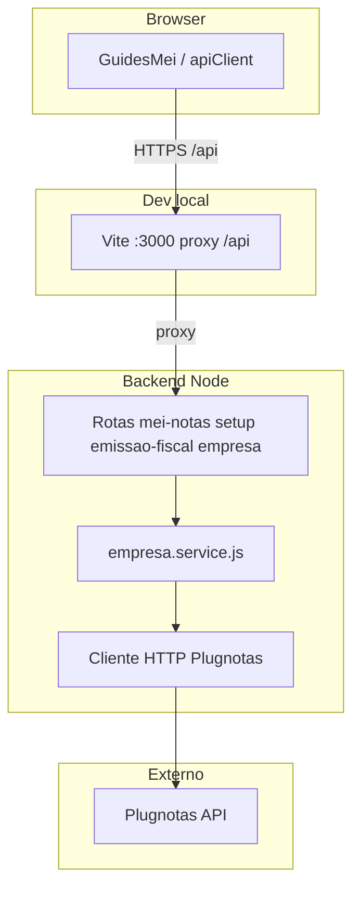
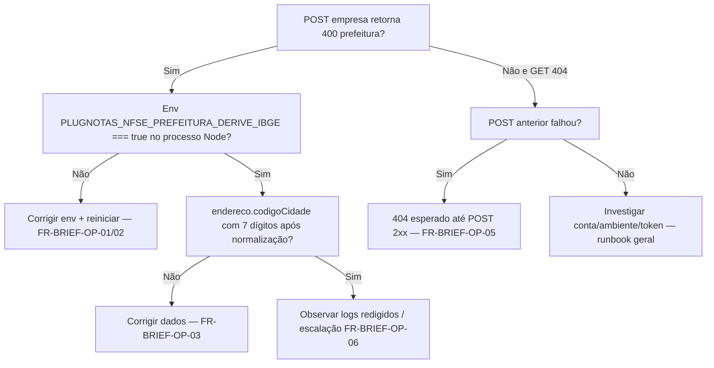

# Arquitetura técnica — Briefing de ação (**400** prefeitura / **404** GET): triagem, superfícies e observabilidade

**Versão:** 1.0  
**Data:** 2026-04-09  
**Autoria:** Aria (architect / AIOX)  
**Requisitos de origem:** [`docs/prd/PRD-briefing-acao-correcao-prefeitura-400-get-404-guia-mei-2026-04-09.md`](../prd/PRD-briefing-acao-correcao-prefeitura-400-get-404-guia-mei-2026-04-09.md) (**FR-BRIEF-OP-01** a **FR-BRIEF-OP-06**, **NFR-BRIEF-OP-01**–**02**)  
**UX de origem:** [`docs/specs/ux-spec-briefing-acao-prefeitura-400-get-404-guia-mei-2026-04-09.md`](../specs/ux-spec-briefing-acao-prefeitura-400-get-404-guia-mei-2026-04-09.md) (**BRIEF-OP-UX-L0/L1**)

Este documento define a **arquitectura de triagem e superfícies** para a camada **operacional** do briefing (PM ↔ operações ↔ suporte) e os **guardrails técnicos** alinhados à spec UX briefing — **sem** duplicar o desenho de **implementação do trilho B** (derivação `prefeitura`), que permanece canónico em [`architecture-correcao-400-nfse-config-prefeitura-derive-ibge-2026-04-09.md`](architecture-correcao-400-nfse-config-prefeitura-derive-ibge-2026-04-09.md).

---

## 1. Relação entre artefactos

| Artefacto | Conteúdo |
|-----------|-----------|
| **Arquitectura canónica trilho B** | Fluxo de dados BFF → Plugnotas, `nfsePrefeituraPayload.js`, ordem **normalizar → derivar**, env `=== 'true'`. |
| **Este documento** | Ordem **diagnóstica** POST vs GET, **superfícies** (browser, API Node, deploy), **observabilidade** para **FR-BRIEF-OP-06**, **fronteira FE** para **FR-BRIEF-OP-05** / **BRIEF-OP-UX**. |
| **PRD briefing** | IDs **FR-BRIEF-OP-*** — checklist operacional. |
| **Spec UX briefing** | Estados **BRIEF-OP-UX-L0/L1**, causalidade na experiência. |

**Regra:** alterações de **código** da derivação IBGE seguem a arquitectura **PREFB** canónica; alterações de **copy**, ordem de mensagens ou **runbook** seguem PRD/spec **briefing** + este documento.

---

## 2. Contexto do sistema (brownfield)

- **400** no cadastro: origem **Plugnotas** (validação), repassada pelo BFF como **400** JSON ao cliente.  
- **404** na consulta: BFF consulta `GET /empresa/:cnpj` upstream; se o registo **não existir** na conta, **404** — **não** implica bug na rota Express se o **POST** anterior falhou (**FR-BRIEF-OP-05**).

---

## 3. Plano de configuração (**FR-BRIEF-OP-01**, **FR-BRIEF-OP-02**, **NFR-BRIEF-OP-02**)

| Aspécto | Decisão arquitectural |
|---------|------------------------|
| **Onde vive a flag** | Apenas **processo Node** do backend (`backend/.env`, variáveis do deploy). **Não** existe equivalente `VITE_*` para trilho B. |
| **Semântica** | `PLUGNOTAS_NFSE_PREFEITURA_DERIVE_IBGE === 'true'` (string literal). Valores `True`, `1`, `yes` **não** activam o ramo — documentação e *playbooks* devem usar `=true` minúsculo (**NFR-BRIEF-OP-02**). |
| **Aplicação** | Após alterar `.env` local: **reiniciar** o processo `node` (**FR-BRIEF-OP-02**). Em Vercel/host: novo deploy ou restart conforme plataforma. |
| **Produção** | Opt-in (**FR-BRIEF-OP-04**, **DP-PREFB-01**) — pipeline de release separado da UI. |

---

## 4. Plano de dados (referência à implementação)

O enriquecimento do payload **antes** do wire upstream é **idêntico** ao descrito na arquitectura canónica PREFB: `normalizePayloadEnderecoCodigoCidade` → `applyNfsePrefeituraIbgeIfEnabled`.  

**Implicação para triagem:** se o **400** citar `nfse.config.prefeitura` e a equipa confirmar env `true` + IBGE 7 dígitos no **request** ao BFF, o próximo passo é **observabilidade** (secção 6) ou escalação a **contrato alargado** (**FR-BRIEF-OP-06**), **não** assumir falha só do `GET`.

---

## 5. Plano de apresentação (frontend) — **FR-BRIEF-OP-05**, **BRIEF-OP-UX**

| Camada | Responsabilidade |
|--------|------------------|
| **Transporte** | `apiClient` expõe `status` e corpo JSON; **não** interpreta causalidade POST/GET. |
| **Domínio UI** | `meiNotasService`, `plugnotasEmitenteSetup`, `GuidesMei.tsx` orquestram certificado → POST → eventual GET. |
| **Heurísticas de mensagem** | `nfseNacionalPlugnotasErrorHints.ts` — variantes **PREF** / **SOL**; a spec UX briefing exige que estados **SOL** (POST falho → consulta sem empresa) **não** invertam a narrativa (**404** como causa primeira). |
| **Configuração visível ao MEI** | **Proibido** pedir ao utilizador para “ligar” `PLUGNOTAS_NFSE_PREFEITURA_DERIVE_IBGE` na UI — variável **só servidor** (spec UX §2). |

**Ficheiros de referência** (ajuste **só** com story explícita): `GuidesMei.tsx`, `nfseNacionalPlugnotasErrorHints.ts`, painéis SOL / PREF já existentes.

---

## 6. Plano de observabilidade e escalação (**FR-BRIEF-OP-06**)

| Passo | Ferramenta / artefacto | Notas |
|-------|------------------------|--------|
| 1. Confirmar **POST** falhou antes do **404** | DevTools → Network — ordem temporal das chamadas `…/emissao-fiscal/empresa` (POST vs GET). |
| 2. Inspeccionar corpo enviado ao BFF | Request payload (sem partilhar PII em canais públicos — **NFR-BRIEF-OP-01**). |
| 3. Payload upstream redigido | `PLUGNOTAS_DEBUG` / política de logs em `plugnotas-empresa-cadastro-debug.js` (não-prod ou opt-in prod). |
| 4. Escalação | **FR-PREFB-ESC-01** — PRD PREF / P0; contrato oficial Plugnotas. |

**NFR-BRIEF-OP-01:** runbooks e tickets **não** devem exigir colar payloads completos com PII; usar redacção e políticas já definidas no backend.

---

## 7. Fluxo de decisão técnica (triagem)

---

## 8. Rastreio FR-BRIEF-OP → artefactos técnicos

| ID | Artefacto / sistema |
|----|---------------------|
| **FR-BRIEF-OP-01** | `backend/.env` (efectivo), não só `.env.example`. |
| **FR-BRIEF-OP-02** | Processo Node / plataforma de deploy. |
| **FR-BRIEF-OP-03** | Payload JSON `endereco.codigoCidade`; normalização em `empresa.service.js` + cliente `nfEmissionCompany.ts`. |
| **FR-BRIEF-OP-04** | Pipeline deploy / política operação. |
| **FR-BRIEF-OP-05** | UI: fluxo `GuidesMei` + hints SOL; **não** atributo HTTP isolado. |
| **FR-BRIEF-OP-06** | Logs Plugnotas redigidos, documentação PRD PREF/P0, API externa. |
| **NFR-BRIEF-OP-01** | Política de redacção em módulos `plugnotas-*-debug`. |
| **NFR-BRIEF-OP-02** | `applyNfsePrefeituraIbgeIfEnabled` em `empresa.service.js` (comparação estrita). |

---

## 9. Fora do escopo desta arquitectura

- Novo endpoint BFF **só** para triagem do briefing — **não** requerido; triagem usa ferramentas existentes (Network, logs).  
- Alteração do contrato **Plugnotas** — fornecedor.  
- Schema de base de dados — não aplicável.

---

## 10. Change log

| Versão | Data | Notas |
|--------|------|--------|
| 1.0 | 2026-04-09 | Versão inicial a partir do **PRD briefing** e **spec UX briefing**; complementa **architecture-correcao-400-nfse-config-prefeitura-derive-ibge-2026-04-09**. |

---

*Arquitectura técnica — Meu Financeiro — camada operacional / triagem; implementação trilho B canónica em **architecture-correcao-400-nfse-config-prefeitura-derive-ibge-2026-04-09**.*
