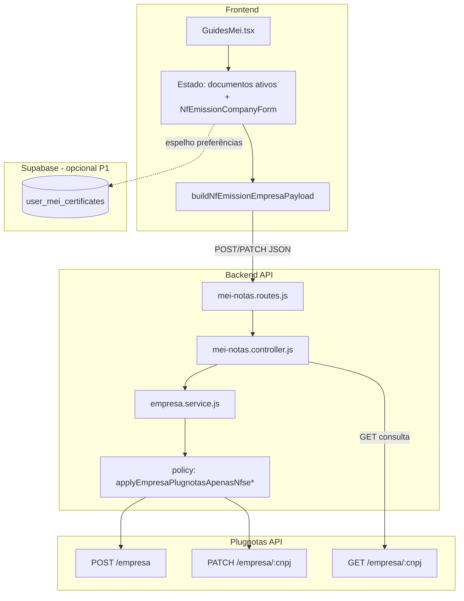

# Arquitetura técnica — Cadastro emitente: **documentos ativos** (Plugnotas)

**Versão:** 1.0  
**Data:** 2026-04-07  
**Autoria:** Aria (architect / AIOX)  
**Requisitos de origem:** [`docs/prd/PRD-cadastro-empresa-documentos-ativos-plugnotas-2026-04-07.md`](../prd/PRD-cadastro-empresa-documentos-ativos-plugnotas-2026-04-07.md)  
**UX de origem:** [`docs/specs/ux-spec-cadastro-empresa-documentos-ativos-plugnotas-2026-04-07.md`](../specs/ux-spec-cadastro-empresa-documentos-ativos-plugnotas-2026-04-07.md)

Este documento fixa **fronteiras de sistema**, **estado atual do código brownfield**, **decisões técnicas** para cumprir **FR-CAD-DOC-**\* e **implicações no ADR** de payload apenas NFS-e. Não substitui story nem contrato fino campo-a-campo com o Plugnotas (validação contra documentação oficial continua obrigatória).

---

## 1. Visão de contexto

**Princípio:** a UX introduz **seleção explícita**; a arquitetura deve garantir **uma única fonte de verdade** para o mapeamento `UI → blocos nfse | nfe | nfce` **sem** contradição entre cliente e servidor. Hoje o servidor **aplica política “apenas NFS-e” depois** do corpo recebido — isto é o principal ponto de mudança (§3).

---

## 2. Estado atual (brownfield) — comportamento crítico

### 2.1 `cadastrarEmpresaPlugNotas` (POST)

Ficheiro: `backend/src/services/plugnotas/empresa.service.js`

- Antes de `POST /empresa`, chama-se **`applyEmpresaPlugnotasApenasNfseForPost(payload)`**, que:
  - força **`nfe`** e **`nfce`** para `{ ativo: false, tipoContrato: 0 }` **sem** `config`;
  - normaliza IE vazia para `ISENTO`;
  - garante **`nfse`** com default **NFS-e Nacional** (`plugnotas-mei-empresa-policy.js`).

**Consequência:** qualquer intenção do cliente de enviar `nfe`/`nfce` activos **é sobrescrita**. O frontend atual (`buildNfEmissionEmpresaPayload` em `nfEmissionCompany.ts`) já envia NF-e/NFC-e inactivos — coerente com a política, mas **impede** cumprir **FR-CAD-DOC-04** sem alteração de policy.

### 2.2 `atualizarEmpresaPlugNotas` (PATCH)

- Chama-se **`applyEmpresaPlugnotasApenasNfseForPatch(payload)`**, que:
  - se o corpo **incluir** chaves `nfe` ou `nfce`, **substitui** o valor por blocos **inactivos** (mesmo shape que POST);
  - se **não** incluir `nfe`/`nfce`, **não** toca nesses blocos no objecto (comportamento documentado em `docs/operacao-mei-nfse.md` — evitar reactivar NFC-e legada por engano).

**Consequência:** não é possível **activar** NF-e/NFC-e via PATCH com a implementação atual **se** o cliente enviar esses blocos — seriam forçados a inactivos. Para **alterar** documentos ativos de forma explícita, a policy precisa de **ramo novo** (§4).

### 2.3 `consultarEmpresaPlugNotas` (GET)

- Retorna o JSON bruto do Plugnotas para `GET /empresa/:cnpj`.
- O frontend deve **derivar** o estado dos checkboxes com um **parser defensivo** (§5.2); a forma exacta dos campos `nfe`/`nfce`/`nfse` depende do contrato do provedor.

### 2.4 Rotas HTTP

| Rota | Método | Handler empresa |
|------|--------|-----------------|
| `…/setup/emissao-fiscal/empresa` | GET | `consultarEmpresaPlugNotas` |
| | POST | `cadastrarEmpresaPlugNotas` |
| | PATCH | `atualizarEmpresaPlugNotas` |

Controller: `backend/src/controllers/mei-notas.controller.js` (payload repassado do `req.body` após validações existentes).

---

## 3. Decisão arquitetural: evoluir a policy sem quebrar NFS-e-only

### 3.1 Objectivo

- **CR-CAD-DOC-01:** utilizador **só com NFS-e** continua com payload equivalente ao atual (NF-e/NFC-e inactivos, `nfse` com regras atuais).
- **FR-CAD-DOC-04 / 05:** quando o utilizador selecciona combinações com NF-e e/ou NFC-e, o **servidor** deve montar blocos `nfe`/`nfce` com `ativo: true` **e** estrutura mínima exigida pelo Plugnotas (incl. `config` se necessário — **a validar** com documentação e testes sandbox).

### 3.2 Abordagem recomendada: **selecção canónica no corpo** + normalização central

1. **Contrato API (interno):** o cliente envia, além dos campos cadastrais atuais, um campo explícito de intenção, por exemplo:
   - `documentosAtivos: { nfse: boolean, nfe: boolean, nfce: boolean }`  
   **ou**  
   - `activeDocumentTypes: ('NFSE' | 'NFE' | 'NFCE')[]` com regra “pelo menos um”.

   **Regra:** o backend **não** confia apenas em `payload.nfe.ativo` enviado pelo cliente sem validação — o cliente pode estar desatualizado; a normalização final deve ser **função pura** testada (`documentosAtivos` + política MEI + pré-requisitos).

2. **Substituir ou ramificar** `applyEmpresaPlugnotasApenasNfseForPost` por algo como:
   - `applyEmpresaPlugnotasDocumentSelectionForPost(payload, selection)`  
   que:
   - mantém `applyNfseNacionalDefaultForPost` quando `nfse` activo;
   - define `nfse.ativo` conforme `selection.nfse` (se `false`, definir bloco inactivo ou erro de negócio antes de enviar — alinhar PRD §6.4);
   - define `nfe` / `nfce` com `ativo: true` **ou** inactivos **sem** `config` quando inactivos (ADR existente);
   - quando `ativo: true`, preencher `tipoContrato` e **`config`** mínimos exigidos pelo Plugnotas (placeholder na story até confirmação API).

3. **PATCH:** substituir o comportamento que **inactiva sempre** que `nfe`/`nfce` aparecem por:
   - se `documentosAtivos` presente no corpo → aplicar a mesma lógica de seleção que no POST (respeitando `nfse.nacional` só quando `nfse` presente — já coberto por `applyNfseNacionalDefaultForPatch`);
   - **ou** manter compatibilidade: se `documentosAtivos` **ausente**, preservar comportamento atual de PATCH (não enviar `nfe`/`nfce` se não for para mudar documentos).

   Isto resolve **PRD §6.5** (“sempre poder expressar alteração num fluxo guardar”) sem reintroduzir reactivação NFC-e acidental: o utilizador **declara** intenção via `documentosAtivos`, não via blocos soltos.

### 3.3 ADR

- Actualizar ou criar **ADR complementar** a [`docs/adr/ADR-plugnotas-empresa-payload-apenas-nfse.md`](../adr/ADR-plugnotas-empresa-payload-apenas-nfse.md) documentando o modo **multi-documento** e os invariantes de segurança (sem `config` em blocos inactivos).

### 3.4 Testes backend

- Estender `backend/tests/plugnotas-empresa.test.js` com casos:
  - POST com só NFS-e → igual ao comportamento atual;
  - POST com NFE activo → corpo enviado ao `fetch` mock contém `nfe.ativo: true` (e estrutura esperada);
  - PATCH com `documentosAtivos` alterando só NFC-e → não inactivar por engano.

---

## 4. Camada frontend

### 4.1 Estado e formulário

- **Estado local** em `GuidesMei.tsx` (ou componente extraído):  
  `documentosAtivos: { nfse: boolean; nfe: boolean; nfce: boolean }` com default **PRD §6.2** (`nfse: true`, `nfe: false`, `nfce: false`).
- **Validação cliente:** pelo menos um `true` (**FR-CAD-DOC-03**); modal ao desmarcar NFS-e (**UX spec §6.3**).
- **Extensão de `buildNfEmissionEmpresaPayload`** (`nfEmissionCompany.ts`):
  - aceitar `documentosAtivos` (ou derivar até deprecar blocos hardcoded);
  - enviar campo canónico acordado no §3.2 **e** manter compatibilidade até o backend exigir só o novo campo.

### 4.2 Consulta GET / hidratação

- Função **`mapPlugnotasEmpresaToDocumentSelection(raw: unknown)`** em `frontend/src/utils/` (ex.: `plugnotasEmpresaDocumentosAtivos.ts`):
  - tentar ler `nfse.ativo`, `nfe.ativo`, `nfce.ativo` (ou caminhos documentados após spike);
  - se ambíguo, retornar `{ partial: true }` e deixar a UX mostrar mensagem honesta (**FR-CAD-DOC-06**).

### 4.3 Copy dinâmica

- Derivar booleanos `multiplo = count(active) >= 2` para título do bloco (**FR-CAD-DOC-07/08**) — lógica pura, testável.

---

## 5. Segurança e validação

| Camada | Responsabilidade |
|--------|------------------|
| **Cliente** | UX + bloqueios óbvios (zero tipos; confirmação NFS-e); **não** é fonte de verdade fiscal. |
| **Servidor** | Rejeitar combinações inválidas; validar campos obrigatórios quando NFE/NFC-e activos (CSC, etc.) **antes** do Plugnotas; nunca logar certificado/senha (**NFR-CAD-DOC-02**). |
| **Plugnotas** | Validação final; erros mapeados via `fiscalUserError` / integração existente (**NFR-CAD-DOC-05**). |

---

## 6. Persistência Supabase (P1)

- **PRD:** flags em `user_mei_certificates` ou JSON de preferências.
- **Recomendação técnica:** coluna `documentos_ativos` tipo `jsonb` com `{ nfse, nfe, nfce }` **ou** três colunas booleanas; migrar com default alinhado ao remoto na próxima consulta bem-sucedida.
- **Delegação:** modelo de dados detalhado com **@data-engineer** se houver RLS/migrações complexas.

---

## 7. Observabilidade

- Manter opt-in `PLUGNOTAS_DEBUG` para cadastro empresa; novos ramos não devem logar PII adicional.
- Opcional: código de negócio novo (ex.: `documentos_ativos_invalido`) para erros de validação **antes** do Plugnotas — documentar em `fiscalUserError` se exposto ao cliente.

---

## 8. Riscos e dependências

| Risco | Mitigação |
|-------|-----------|
| Contrato Plugnotas para `nfe`/`nfce` com `config` incompleto | Sandbox + testes; mensagens 400 mapeadas; spike curto antes de P0 se necessário. |
| Regressão NFS-e Nacional | `applyNfseNacionalDefaultForPost/Patch` permanecem aplicáveis quando `nfse` presente/activo; testes de regressão. |
| Divergência GET vs UI | Parser defensivo + copy de limitação (**FR-CAD-DOC-06**). |

---

## 9. Checklist de implementação (síntese)

1. Definir e documentar campo **`documentosAtivos`** (ou equivalente) no `POST`/`PATCH` empresa.  
2. Refactor `applyEmpresaPlugnotasApenasNfseForPost/Patch` → seleção condicional (**§3**).  
3. Frontend: estado + payload + parser GET + testes unitários.  
4. ADR complementar + atualizar `operacao-mei-nfse.md` se o fluxo PATCH mudar.  
5. `npm run lint`, `typecheck`, `test` no backend e frontend.

---

## 10. Change log

| Versão | Data | Notas |
|--------|------|-------|
| 1.0 | 2026-04-07 | Versão inicial a partir do PRD e UX spec. |

---

— Aria, arquitetando o futuro 🏗️
