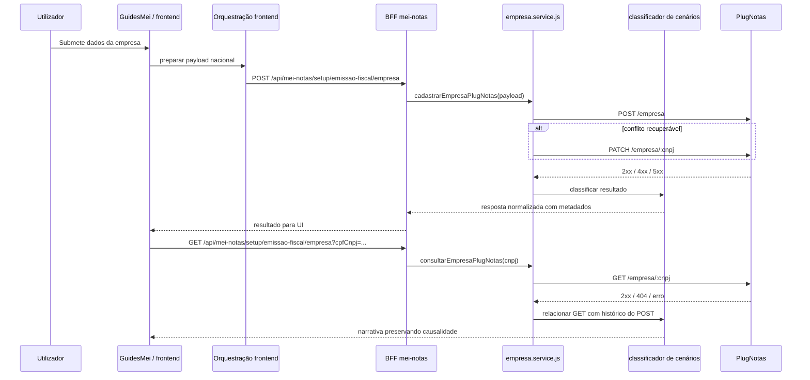

# Arquitetura técnica — cadastro de empresa PlugNotas robusto para cenários de NFS-e Nacional, fallback e exceções municipais

**Versão:** 1.0  
**Data:** 2026-04-10  
**Autoria:** Aria (architect / AIOX)  
**PRD de origem:** [docs/prd/PRD-cadastro-empresa-plugnotas-robusto-cenarios-nacional-fallback-excecao-2026-04-10.md](../prd/PRD-cadastro-empresa-plugnotas-robusto-cenarios-nacional-fallback-excecao-2026-04-10.md)  
**UX de origem:** [docs/specs/ux-spec-cadastro-empresa-plugnotas-robusto-cenarios-nacional-fallback-excecao-2026-04-10.md](../specs/ux-spec-cadastro-empresa-plugnotas-robusto-cenarios-nacional-fallback-excecao-2026-04-10.md)

**Referências complementares:**

- [docs/technical/architecture-fix-cadastro-empresa-plugnotas-endpoint-canonico-2026-04-09.md](./architecture-fix-cadastro-empresa-plugnotas-endpoint-canonico-2026-04-09.md)
- [docs/technical/architecture-nfse-nacional-padrao-bloqueio-excecao-credenciais-prefeitura-plugnotas-2026-04-10.md](./architecture-nfse-nacional-padrao-bloqueio-excecao-credenciais-prefeitura-plugnotas-2026-04-10.md)
- [docs/operacao-mei-nfse.md](../operacao-mei-nfse.md)

---

## 1. Resumo executivo

O cadastro de empresa no PlugNotas deve continuar com a arquitetura já validada:

- frontend chama o BFF em `POST /api/mei-notas/setup/emissao-fiscal/empresa`;
- backend chama o PlugNotas em `POST /empresa`;
- em conflito, pode usar `PATCH /empresa/:cnpj`;
- a consulta posterior usa `GET /empresa/:cnpj`.

Esta arquitetura não cria novo fluxo. Ela formaliza uma **máquina de decisão robusta por cenários** para que o sistema:

1. classifique corretamente sucesso, ambiente, payload, fallback, exceção municipal e `GET` negativo posterior;
2. preserve a causalidade entre operações;
3. entregue metadados estáveis ao frontend, operação e QA;
4. mantenha **NFS-e Nacional** como padrão e a exceção municipal como caso explicitamente bloqueado.

---

## 2. Decisão arquitetural principal

**Decisão:** manter a arquitetura atual baseada em **frontend orquestrador + BFF + serviço PlugNotas server-side**, adicionando uma camada explícita de **classificação de cenários** e **preservação de causalidade**.

### Invariantes

- O frontend continua chamando apenas o BFF.
- O BFF continua sendo a única fronteira com o PlugNotas.
- O endpoint upstream principal continua sendo `POST /empresa`.
- O fallback continua sendo `PATCH /empresa/:cnpj`.
- O fluxo continua **NFS-e Nacional por padrão**.
- O produto não reabre `login`/`senha` de prefeitura neste ciclo.

### Não decisões

- Não criar nova rota visual de cadastro.
- Não mover regras de integração para o frontend.
- Não tratar toda falha como “endpoint errado”.
- Não transformar a exceção municipal em contrato padrão.

---

## 3. Visão de contexto

---

## 4. Fronteiras por camada

| Camada | Responsabilidade |
|--------|------------------|
| Frontend (`GuidesMei`, serviços e mappers) | capturar a intenção do utilizador, orquestrar a chamada ao BFF, interpretar o cenário e apresentar a narrativa UX correta |
| BFF / controller | fronteira autenticada e estável para o produto |
| Serviço PlugNotas (`empresa.service.js`) | normalização do payload, composição do endpoint, fallback e classificação do resultado |
| Classificador de cenário | transformar respostas técnicas do upstream em categorias de negócio consumíveis pela UI e operação |
| PlugNotas | fonte externa de verdade para cadastro e consulta da empresa |
| Runbook / QA / operação | interpretar evidência redigida segundo a taxonomia de cenários |

**Princípio de anticorrupção:**  
O frontend conhece a jornada de negócio; o backend conhece o contrato externo. Host, token, prefixo, regras de fallback e parsing de erro do emissor não devem vazar como responsabilidade de UI.

---

## 5. Contrato técnico das rotas

### 5.1 Frontend -> BFF

- `POST /api/mei-notas/setup/emissao-fiscal/empresa`
- `PATCH /api/mei-notas/setup/emissao-fiscal/empresa`
- `GET /api/mei-notas/setup/emissao-fiscal/empresa?cpfCnpj=...`

### 5.2 BFF -> PlugNotas

- `POST /empresa`
- `PATCH /empresa/:cnpj`
- `GET /empresa/:cnpj`

### 5.3 Composição do endpoint

O endpoint final do PlugNotas continua derivado de:

- `PLUGNOTAS_API_BASE_URL`
- `PLUGNOTAS_API_PATH_PREFIX`
- path lógico da operação

Regra:

`<PLUGNOTAS_API_BASE_URL><PLUGNOTAS_API_PATH_PREFIX>/empresa`

O path funcional de cadastro permanece `POST /empresa`, independentemente do host do ambiente.

---

## 6. Modelo de cenários

### 6.1 Taxonomia canónica

| Código lógico | Cenário | Fonte primária |
|---------------|---------|----------------|
| `success_nacional` | cadastro nacional bem-sucedido | `POST /empresa` 2xx |
| `ambiente_configuracao` | erro de ambiente/configuração | host/token/prefixo/upstream/gateway |
| `payload_contrato` | rejeição de dados/contrato | `400` de validação ou contrato |
| `fallback_sync` | empresa existente com resolução por fallback | `POST` conflito + `PATCH` satisfatório |
| `prefeitura_login_required_blocked` | exceção municipal bloqueada | erro explícito de `prefeitura.login` / `senha` |
| `empresa_nao_cadastrada` | consulta sem empresa após falha anterior | `GET /empresa/:cnpj` negativo em continuidade causal |

### 6.2 Prioridade de classificação

Quando múltiplos sinais coexistirem, a ordem de precedência deve ser:

1. exceção municipal bloqueada;
2. ambiente/configuração;
3. conflito resolvido por fallback;
4. payload/contrato;
5. `GET` negativo posterior como consequência;
6. sucesso nacional.

Essa precedência evita que o sistema degrade um erro útil de maior valor diagnóstico em uma categoria genérica.

---

## 7. Comportamento do backend

### 7.1 Hot path de cadastro

O fluxo de cadastro continua:

1. validar input atual;
2. normalizar dados do emitente e endereço;
3. aplicar política nacional vigente;
4. rejeitar campos proibidos para o fluxo nacional, se presentes;
5. chamar `POST /empresa`;
6. se houver conflito recuperável, tentar `PATCH /empresa/:cnpj`;
7. classificar o resultado final para o frontend.

### 7.2 Política de fallback

O fallback continua encapsulado no backend:

1. tentar `POST /empresa`;
2. se o retorno indicar conflito/empresa existente, tentar `PATCH /empresa/:cnpj`;
3. se o `PATCH` resolver, devolver resultado operacional de sincronização;
4. se não resolver, devolver erro classificável sem apagar a tentativa de fallback.

### 7.3 Política da exceção municipal

O backend continua tratando `prefeitura.login` / `senha` como **exceção municipal bloqueada**.

Isso implica:

- não aceitar esses campos no contrato do fluxo nacional;
- não encaminhá-los ao PlugNotas;
- classificar erro explícito do upstream como `prefeitura_login_required_blocked`;
- manter `plugnotasRequest` e `httpStatus` para suporte e UI.

### 7.4 Política de causalidade

Quando o `POST` falha e um `GET` posterior retorna ausência:

- o backend deve preservar a causa raiz do `POST`;
- o `GET` negativo não substitui a classificação anterior;
- a resposta à UI deve permitir narrativa de “a empresa ainda não aparece porque o cadastro não concluiu”.

---

## 8. Contrato de resposta para o frontend

O backend deve continuar expondo, quando aplicáveis:

- `plugnotasRequest.method`
- `plugnotasRequest.path`
- `plugnotasCode`
- `httpStatus`

### Regras arquiteturais para esse contrato

1. Esses metadados são a base do classificador de cenário no frontend.
2. O contrato deve ser estável o suficiente para evitar heurística textual dispersa.
3. A UI pode usar texto do `message` como apoio, mas a classificação deve priorizar os metadados estáveis.
4. A operação e o QA podem usar esses mesmos campos para triagem e evidência redigida.

---

## 9. Comportamento do frontend

### 9.1 Ponto único de interpretação

O frontend deve manter um ponto central de mapping entre:

- resposta do BFF;
- classe do cenário;
- variante de UI.

Essa lógica não deve ficar espalhada em múltiplas branches ad hoc.

### 9.2 Mapeamento esperado

| Cenário | Resultado UX |
|---------|--------------|
| `success_nacional` | sucesso de cadastro |
| `ambiente_configuracao` | alerta de ambiente/configuração |
| `payload_contrato` | alerta de revisão de dados/contrato |
| `fallback_sync` | sucesso de sincronização/atualização |
| `prefeitura_login_required_blocked` | alerta de exceção municipal não suportada |
| `empresa_nao_cadastrada` | ausência tratada como consequência do `POST` falho |

### 9.3 Restrição de narrativa

Mesmo quando o frontend conhece:

- `plugnotasRequest.method`
- `plugnotasRequest.path`

esses valores não devem se tornar a narrativa principal para o utilizador final.

---

## 10. Observabilidade e diagnóstico

### 10.1 Objetivo

Permitir que suporte, QA e dev respondam rapidamente:

- foi ambiente?
- foi payload?
- foi conflito com fallback?
- foi exceção municipal?
- o `GET` negativo é causa ou consequência?

### 10.2 Fontes mínimas

- resposta JSON do BFF;
- `plugnotasRequest`;
- `plugnotasCode`;
- `httpStatus`;
- logs redigidos do backend;
- runbook operacional.

### 10.3 Regra de redaction

Não registrar:

- token PlugNotas;
- certificado;
- payload bruto completo;
- credenciais municipais;
- PII além do mínimo necessário e redigido.

---

## 11. Segurança

- segredos PlugNotas permanecem apenas no backend;
- o browser nunca recebe credenciais do provedor;
- o frontend não persiste `login`/`senha` de prefeitura;
- o backend mantém políticas de redaction e classificação sem expor segredo.

---

## 12. Mapeamento PRD -> arquitetura

| ID | Resposta arquitetural |
|----|------------------------|
| **FR-ROB-01** | frontend permanece restrito ao BFF |
| **FR-ROB-02** | `empresa.service.js` mantém `POST /empresa` como operação principal |
| **FR-ROB-03** | fallback `POST` -> `PATCH` encapsulado no backend |
| **FR-ROB-04** | taxonomia explícita de seis cenários |
| **FR-ROB-05** | contrato mínimo com `plugnotasRequest`, `plugnotasCode`, `httpStatus` |
| **FR-ROB-06** | classificador central e narrativa sem endpoint errado |
| **FR-ROB-07** | causalidade preservada entre `POST`, `PATCH` e `GET` |
| **FR-ROB-08** | exceção municipal segue bloqueada no fluxo nacional |
| **FR-ROB-09** | runbook e QA usam a mesma taxonomia operacional |
| **NFR-ROB-01/02/03** | segredos apenas no backend, logs redigidos e BFF preservado |
| **NFR-ROB-04/06** | distinção operacional de categorias com evidência mínima |

---

## 13. Critérios de aceite arquiteturais

- [ ] A arquitetura documenta `POST /empresa` como endpoint upstream canónico.
- [ ] A arquitetura documenta o BFF como única fronteira externa.
- [ ] A arquitetura formaliza a taxonomia dos seis cenários do PRD.
- [ ] A arquitetura define o contrato mínimo backend -> frontend/operação.
- [ ] A arquitetura preserva o fallback `POST` -> `PATCH`.
- [ ] A arquitetura preserva a causalidade entre falha no cadastro e `GET` posterior.
- [ ] A arquitetura mantém a exceção municipal como caso bloqueado no fluxo nacional.

---

## 14. Ficheiros de referência

| Área | Ficheiros |
|------|-----------|
| Frontend principal | `frontend/src/pages/GuidesMei.tsx` |
| Serviços frontend | `frontend/src/services/meiNotasService.ts`, `frontend/src/utils/plugnotasEmitenteSetup.ts` |
| Mapping de erro | `frontend/src/lib/fiscalUserError.ts`, `frontend/src/utils/nfseNacionalPlugnotasErrorHints.ts` |
| BFF/controller | `backend/src/controllers/mei-notas.controller.js`, `backend/src/routes/mei-notas.routes.js` |
| Serviço PlugNotas | `backend/src/services/plugnotas/empresa.service.js` |
| Operação | `docs/operacao-mei-nfse.md` |

---

## 15. Change log

| Versão | Data | Alteração |
|--------|------|-----------|
| 1.0 | 2026-04-10 | Arquitetura inicial derivada do PRD de robustez do cadastro de empresa PlugNotas por cenários. |

---

*Arquitetura brownfield para tornar robusto o cadastro de empresa PlugNotas na Guia MEI, preservando NFS-e Nacional como padrão, fallback operacional, taxonomia de cenários e exceção municipal bloqueada.*
