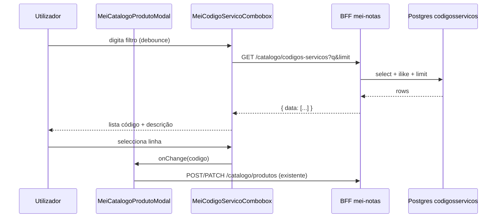

# Arquitetura técnica — combobox **Código interno** (`codigosservicos`)

**Versão:** 1.0  
**Data:** 2026-04-16  
**Autoria:** Aria (architect / AIOX)  
**Requisitos de origem:** [`docs/prd/PRD-catalogo-mei-codigo-interno-combobox-codigosservicos-2026-04-16.md`](../prd/PRD-catalogo-mei-codigo-interno-combobox-codigosservicos-2026-04-16.md) (FR-CAT-COD-*, NFR-CAT-*)  
**UX de origem:** [`docs/specs/ux-spec-catalogo-mei-codigo-interno-combobox-codigosservicos-2026-04-16.md`](../specs/ux-spec-catalogo-mei-codigo-interno-combobox-codigosservicos-2026-04-16.md)

Este documento fixa a **fronteira BFF ↔ Postgres**, o **contrato HTTP**, o **padrão de dados e segurança**, e o **encaixe no frontend**, alinhados ao código brownfield existente (`mei-notas`, Supabase **service role**, `parseCatalogLimit`). **Não** substitui migrações ou desenho de índices detalhado — ver nota para `@data-engineer`.

---

## 1. Decisões de arquitetura (resumo)

| Decisão | Escolha | Racional |
|---------|---------|----------|
| **Leitura da referência** | **Apenas via BFF** (`backend` Express) | Chave `service role` permanece no servidor; um único modelo de auth (`requireAuth` + `requireMeiEnabled`) alinhado a `GET /catalogo/produtos` (**NFR-CAT-02**). Evita expor `codigosservicos` ao cliente Supabase com políticas duplicadas. |
| **Cliente DB no BFF** | Reutilizar `getDb()` → `createSupabaseClient({ useServiceRole: true })` | Mesmo padrão que `listarCatalogoProdutos` em `mei-notas.service.js`; a tabela de referência **não** tem `user_id` — o isolamento por utilizador é **só** na camada HTTP. |
| **Contrato de listagem** | `GET` com `q` opcional + `limit` com teto | Paridade com catálogo MEI existente e com o PRD §9. |
| **Limite máximo** | `parseCatalogLimit` (`backend/src/utils/mei-catalog-query.js`, `max` default **50**) | Consistência com clientes/produtos; cumpre FR-CAT-COD-09 e NFR de abuso. |
| **Pesquisa SQL** | `ilike` em `codigo` **ou** `descricao` com termo sanitizado | Reutilizar a mesma ideia de `applyCatalogSearch` + `sanitizeSearchTerm` já presentes em `mei-notas.service.js` (evitar duplicar semântica; extrair helper partilhado **se** reduzir risco de divergência). |
| **Ordenação** | `order('codigo', { ascending: true })` | Lista previsível (PRD: ordenação estável). |
| **Frontend** | Novo método em `meiNotasService.ts` + componente tipo combobox | Reaproveitar padrão de `AdminMeiCatalogProdutoCombobox` (debounce, lista, teclado); dados `{ codigo, descricao }` em vez de `NfseCatalogProduto`. |
| **Resolução “legado” na edição** | Preferir **pesquisa com `q = codigo`** ao montar o modal | Evita segundo endpoint; se `q` vazio devolver primeiras linhas, com `q` igual ao código guardado deve devolver a linha se existir (**FR-CAT-COD-06**). Se o match for ambíguo, a UI mostra o primeiro resultado na lista — aceitável se PK for `codigo`; caso contrário, validar com QA. |

---

## 2. Contexto brownfield (código actual)

| Peça | Função |
|------|--------|
| `backend/src/routes/mei-notas.routes.js` | Rotas `/catalogo/*` com `requireAuth` + `requireMeiEnabled`. |
| `backend/src/controllers/mei-notas.controller.js` | `listarCatalogoProdutos` usa `parseCatalogLimit`, `q`, `documentType`. |
| `backend/src/services/mei-notas.service.js` | `getDb()`, `applyCatalogSearch`, `sanitizeSearchTerm`, `toCatalogLimit` (interno), tabelas `mei_nfse_clientes` / `mei_nfse_produtos`. |
| `frontend/src/services/meiNotasService.ts` | `apiClient` + paths `/mei-notas/...`. |
| `frontend/src/components/MeiCatalogoProdutoModal.tsx` | Campo `codigo` → substituir por combobox. |
| `frontend/src/components/admin/AdminMeiCatalogProdutoCombobox.tsx` | Referência de interacção (debounce 300 ms, listbox). |

---

## 3. Modelo de dados (referência)

Tabela **`public.codigosservicos`** (já definida no PRD/brief):

- `codigo` `varchar(10)` PK  
- `descricao` `text` nullable  

**RLS:** A leitura para o browser **não** depende de RLS se toda a leitura passar pelo BFF com service role. Se no futuro existir leitura directa pelo PostgREST, será necessária política separada — **fora do desenho mínimo actual**.

**Povoamento:** pré-requisito operacional; tabela vazia → API devolve `[]` sem erro 500 (comportamento degradado, PRD).

---

## 4. API HTTP (BFF)

### 4.1 Rota

| Método | Path proposto | Middlewares |
|--------|----------------|---------------|
| `GET` | `/api/mei-notas/catalogo/codigos-servicos` | `requireAuth`, `requireMeiEnabled` |

**Nota:** Montagem global do router já prefixa `/api/mei-notas` (confirmar em `app`); no código interno do router use **`/catalogo/codigos-servicos`** para ficar agrupado com `/catalogo/produtos`.

**Ordenação no ficheiro de rotas:** Declarar **antes** de rotas parametrizadas tipo `/:id` que possam capturar segmentos (o ficheiro actual já coloca rotas específicas primeiro — manter disciplina).

### 4.2 Query parameters

| Parâmetro | Tipo | Obrigatório | Default | Validação |
|-----------|------|-------------|---------|-----------|
| `q` | string | Não | `''` | `trim`; pesquisa vazia = primeiros registos até `limit`. |
| `limit` | number | Não | `20` | `parseCatalogLimit(req.query?.limit)` — **máx. 50**. |

Sem `documentType` (não aplicável à referência nacional).

### 4.3 Resposta JSON

Reutilizar o envelope existente `sendSuccess` (forma habitual: `{ success, data, message, errors }`).

- **`data`:** `Array<{ codigo: string; descricao: string | null }>`  
- Mensagem de sucesso: texto curto em PT (ex.: *Códigos de serviço listados*) — alinhado aos outros `listarCatalogo*`.

### 4.4 Erros

| Código | Situação |
|--------|----------|
| `401` | Sem sessão (middleware auth). |
| `403` | MEI não habilitado (`requireMeiEnabled`). |
| `400` | Erro Supabase mapeado (padrão `badRequest` já usado no serviço). |
| `5xx` | Falha infra; frontend: copy da UX spec (erro inline no combobox). |

---

## 5. Camada de serviço (backend)

### 5.1 Função sugerida

Nome sugerido: `listarCodigosServicosReferencia({ q = '', limit = 20 })`.

**Implementação lógica:**

1. `safeLimit = parseCatalogLimit(limit)` (import de `mei-catalog-query.js`).  
2. `search = sanitizeSearchTerm(q)` — **reutilizar** a mesma função usada no catálogo (ou extrair para util partilhado no mesmo PR).  
3. `db = getDb()` (já existente no módulo; **não** introduzir segundo cliente).  
4. Query base:  
   `from('codigosservicos').select('codigo, descricao').order('codigo', { ascending: true }).limit(safeLimit)`  
5. Se `search` não vazio: aplicar filtro `or('codigo.ilike.%term%,descricao.ilike.%term%')` com `%` escapado se necessário — seguir o padrão de `applyCatalogSearch` (PostgREST).  
6. Em erro de Supabase: `throw badRequest(...)` como nas outras listagens.

**Nota:** Nomes de tabela/campos em **snake_case** no Postgres; resposta API pode manter snake_case para paridade com outras rotas mei-notas ou camelCase se o projeto normalizar noutro sítio — **seguir o padrão actual de `listarCatalogoProdutos`** (ver resposta real no frontend).

### 5.2 Testes (alinhamento ao repositório)

- Estender `backend/tests/mei-notas-routes.test.js` com o novo path.  
- Estender `mei-notas-catalog-auth-http.test.js` (401 sem `Authorization`).  
- Teste unitário ou integrado do serviço com `__setGetDbForTests` mockando `from().select()...` — padrão já usado em testes de catálogo.

---

## 6. Frontend

### 6.1 Serviço

Ficheiro: `frontend/src/services/meiNotasService.ts`.

- Tipos: `CodigoServicoReferencia { codigo: string; descricao: string | null }`.  
- Função: `listarCodigosServicosReferencia(params?: { q?: string; limit?: number }): Promise<CodigoServicoReferencia[]>`  
- Chamada: `GET` com query string; base path `/mei-notas/catalogo/codigos-servicos` (respeitar prefixo já usado por `apiClient`).

### 6.2 Componente

- Novo ficheiro sugerido: `frontend/src/components/MeiCodigoServicoCombobox.tsx` (ou nome equivalente), encapsulando:  
  - estado do filtro, debounce **300 ms** (UX spec);  
  - pedidos à API;  
  - estados loading / empty / erro inline;  
  - selecção e limpar (**FR-CAT-COD-04**, **FR-CAT-COD-05**).  
- Integração em `MeiCatalogoProdutoModal.tsx`: substituir o bloco do `input` `mei-cat-prod-cod`; manter `label` e ids acessíveis conforme UX spec.

### 6.3 Edição com código legado

- Ao abrir com `editing.codigo` preenchido: opcionalmente disparar uma pesquisa com `q = editing.codigo.trim()` para obter `descricao` se existir; caso `data.length === 0`, mostrar estado UX §4.4 da spec (**FR-CAT-COD-06**).

---

## 7. Segurança e conformidade

| Tópico | Tratamento |
|--------|------------|
| **Auth** | Igual ao restante catálogo MEI: JWT + MEI habilitado. |
| **Dados sensíveis** | Tabela de referência pública fiscal; sem PII. |
| **Injection** | Apenas cliente Supabase com parâmetros; `sanitizeSearchTerm` reduz caracteres problemáticos; evitar concatenar SQL cru (não aplicável ao client JS). |
| **Rate limiting** | Não introduzido neste desenho mínimo; debounce no cliente + `limit` no servidor. Se necessário, middleware global existente no `app` aplica-se automaticamente. |

---

## 8. Performance e dados (encaminhamento)

| Tópico | Responsável | Notas |
|--------|-------------|--------|
| Índice em `descricao` / extensão `pg_trgm` | `@data-engineer` | Avaliar após volume real e planos de `EXPLAIN`; PRD já antecipa. |
| **Alinhamento emissão NFS-e** | Engenharia + QA | `NFSE_SERVICO_CODIGO_MIN_LENGTH` e `normalizeNfseServicoCodigoForLength` em `mei-notas.service.js` aplicam-se na **emissão**, não na listagem. Validar que a lista de referência não induz códigos que falhem na emissão — **risco** já no PRD §11. |

---

## 9. Diagrama de sequência (síntese)

---

## 10. Matriz PRD / UX → entregáveis técnicos

| ID | Entregável |
|----|------------|
| FR-CAT-COD-01–02, 07–09 | Rota GET + `listarCodigosServicosReferencia` + combobox com debounce e `limit`. |
| FR-CAT-COD-03 | UI: duas colunas lógicas na linha (código + descrição). |
| FR-CAT-COD-04–06, 10 | Modal continua a enviar `codigo`; combobox não altera outros campos. |
| NFR-CAT-03–04 | Classes e a11y conforme UX spec; componente base alinhado a `AdminMeiCatalogProdutoCombobox`. |

---

## 11. Referências

- [`docs/prd/PRD-catalogo-mei-codigo-interno-combobox-codigosservicos-2026-04-16.md`](../prd/PRD-catalogo-mei-codigo-interno-combobox-codigosservicos-2026-04-16.md)  
- [`docs/specs/ux-spec-catalogo-mei-codigo-interno-combobox-codigosservicos-2026-04-16.md`](../specs/ux-spec-catalogo-mei-codigo-interno-combobox-codigosservicos-2026-04-16.md)  
- `backend/src/routes/mei-notas.routes.js`  
- `backend/src/services/mei-notas.service.js`  
- `backend/src/utils/mei-catalog-query.js`  
- `frontend/src/components/admin/AdminMeiCatalogProdutoCombobox.tsx`  
- `frontend/src/components/MeiCatalogoProdutoModal.tsx`  

---

— *Arquitetura pronta para story técnica, implementação e revisão por `@data-engineer` em índices.*
