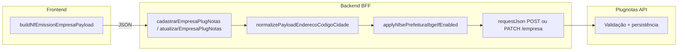

# Arquitetura técnica — Trilho B: derivação **`nfse.config.prefeitura.codigoIbge`** (`PLUGNOTAS_NFSE_PREFEITURA_DERIVE_IBGE`)

**Versão:** 1.0  
**Data:** 2026-04-09  
**Autoria:** Aria (architect / AIOX)  
**Requisitos de origem:** [`docs/prd/PRD-correcao-400-nfse-config-prefeitura-derive-ibge-2026-04-09.md`](../prd/PRD-correcao-400-nfse-config-prefeitura-derive-ibge-2026-04-09.md) (**FR-PREFB-***, **NFR-PREFB-***, **DP-PREFB-***)  
**UX de origem:** [`docs/specs/ux-spec-correcao-400-nfse-config-prefeitura-derive-ibge-2026-04-09.md`](../specs/ux-spec-correcao-400-nfse-config-prefeitura-derive-ibge-2026-04-09.md)

Este documento fixa o **fluxo de dados**, **ponto de extensão no BFF**, **governança de configuração** e **critérios de diagnóstico** para o **trilho B**: preenchimento opcional de `nfse.config.prefeitura` no servidor a partir de `endereco.codigoCidade` (7 dígitos), **sem** novo contrato no cliente na v1 do PRD.

**Artefactos relacionados:**

- [`docs/technical/architecture-plugnotas-nfse-config-prefeitura-payload-2026-04-08.md`](architecture-plugnotas-nfse-config-prefeitura-payload-2026-04-08.md) — ecossistema `nfse.config.prefeitura`, trilhos A–D; **B** aqui é a **instanciação** da derivação IBGE.  
- [`docs/technical/architecture-correcao-ibge-tabela-plugnotas-400-get-404-2026-04-09.md`](architecture-correcao-ibge-tabela-plugnotas-400-get-404-2026-04-09.md) — erro **tabela IBGE** no emissor (**distinto** de “falta `prefeitura`” por ausência de trilho B).  
- [`backend/src/services/plugnotas/nfsePrefeituraPayload.js`](../../backend/src/services/plugnotas/nfsePrefeituraPayload.js) — `applyNfseConfigPrefeituraDeriveIbge`.  
- [`backend/src/services/plugnotas/empresa.service.js`](../../backend/src/services/plugnotas/empresa.service.js) — `applyNfsePrefeituraIbgeIfEnabled`, ordem com `normalizePayloadEnderecoCodigoCidade`.  
- [`docs/adr/ADR-plugnotas-empresa-payload-apenas-nfse.md`](../adr/ADR-plugnotas-empresa-payload-apenas-nfse.md) — política apenas NFS-e.  
- [`docs/operacao-mei-nfse.md`](../operacao-mei-nfse.md) — **FR-PREFB-DOC-01**.

---

## 1. Visão de contexto

### 1.1 Problema técnico

O Plugnotas pode exigir **`nfse.config.prefeitura`** no JSON de empresa. O cliente envia `nfse.config: { producao: true }` sem `prefeitura` (`frontend/src/utils/nfEmissionCompany.ts`). O BFF pode **enriquecer** o payload **antes** do `POST/PATCH /empresa` upstream quando:

1. `process.env.PLUGNOTAS_NFSE_PREFEITURA_DERIVE_IBGE === 'true'` (opt-in explícito).  
2. `nfse.ativo !== false` e existe `endereco.codigoCidade` normalizável para **exactamente 7 dígitos**.  
3. A função pura `applyNfseConfigPrefeituraDeriveIbge` consegue fundir ou criar `nfse.config.prefeitura` (ver regras no módulo).

Se qualquer pré-requisito falhar, o payload segue **sem** `prefeitura` → resposta **400** do Plugnotas com mensagem de validação; o **GET** subsequente por CNPJ pode devolver **404** porque a empresa **não** foi criada.

### 1.2 Fluxo lógico (as-is + governança)

**Ordem obrigatória no BFF** (já implementada): primeiro **normalizar** `endereco.codigoCidade`, depois **derivar** `prefeitura` — garante que `onlyDigits(endereco.codigoCidade)` na derivação vê o mesmo valor que segue para o wire.

---

## 2. Fronteiras por camada

| Camada | Responsabilidade (trilho B) |
|--------|-----------------------------|
| **Frontend** | Continua a enviar `endereco.codigoCidade` via `normalizeIbgeMunicipioCodigo` no payload; **não** envia `nfse.config.prefeitura` na v1 do PRD. Opcional (fase 2 UX): texto de ajuda ou validação de comprimento — **não** substitui a derivação no servidor. |
| **Backend** | **Único** local que adiciona `nfse.config.prefeitura` por trilho B; lê `process.env.PLUGNOTAS_NFSE_PREFEITURA_DERIVE_IBGE` em tempo de chamada (testes podem mutar env). Aplica em **`cadastrarEmpresaPlugNotas`** e **`atualizarEmpresaPlugNotas`** após normalização do endereço. |
| **Plugnotas** | Autoridade de validação final; pode exigir campos adicionais em `prefeitura` (ex.: credenciais) — **fora** do trilho B; ver **FR-PREFB-ESC-01**. |
| **Configuração** | Variável **só** no processo Node do API (Vercel / host backend); **não** exposta ao browser. Produção: **NFR-PREFB-01** / **DP-PREFB-01**. |

---

## 3. Comportamento do módulo `nfsePrefeituraPayload.js`

Resumo para arquitetura (detalhe canónico no ficheiro):

| Entrada | Efeito |
|---------|--------|
| `derivePrefeituraIbge !== true` | No-op (`applyNfsePrefeituraIbgeIfEnabled` retorna cedo). |
| `endereco.codigoCidade` com ≠ 7 dígitos após dígitos-only | No-op — **não** cria `prefeitura`. |
| `nfse.config.prefeitura` já é objeto com `codigoIbge` preenchido | Merge conservador; não sobrescreve IBGE existente não vazio. |
| `nfse.config.prefeitura` ausente ou objeto sem `codigoIbge` útil | Define `prefeitura: { codigoIbge: "<7 dígitos>" }`. |
| `prefeitura` não-object (ex.: string legada) | No-op — não sobrescrever. |

**Implicação:** “Trilho B activo” no env **não garante** mutação se IBGE inválido — diagnóstico **DP-PREFB-02**(2).

---

## 4. Pontos de integração no `empresa.service.js`

| Função | Após normalizar endereço | Chamada |
|--------|--------------------------|---------|
| `cadastrarEmpresaPlugNotas` | Sim | `normalizePayloadEnderecoCodigoCidade(payload)` → `applyNfsePrefeituraIbgeIfEnabled(payload)` → `requestJson('POST', '/empresa', payload)` |
| `atualizarEmpresaPlugNotas` | Sim | Mesma sequência antes de `tryUpdateEmpresa` / fluxo PATCH |

Conflitos **409** → caminho de retry/update já existente reutiliza o **mesmo** payload enriquecido na medida em que o fluxo actual o faz (ver código de `cadastrarEmpresaPlugNotas` após `catch`).

---

## 5. Configuração e ambientes

| Variável | Semântica |
|----------|-----------|
| `PLUGNOTAS_NFSE_PREFEITURA_DERIVE_IBGE` | `'true'` activa derivação; qualquer outro valor → desligada. |
| `PLUGNOTAS_DEBUG` | Opcional; em não-prod pode ajudar a inspeccionar payloads (respeitar **NFR-PREFB-03** — não vazar segredos). |

**Snapshot em `env.js`:** `PLUGNOTAS_NFSE_PREFEITURA_DERIVE_IBGE` pode existir para leitura noutros módulos; a **decisão** do trilho B no hot path usa **`process.env`** directamente em `applyNfsePrefeituraIbgeIfEnabled` (paridade com testes que alteram `process.env`).

**Deploy:** alteração da env exige **redeploy ou restart** do runtime Node para garantir leitura actualizada.

---

## 6. Observabilidade e diagnóstico

| Objectivo | Mecanismo |
|-----------|-----------|
| Confirmar se o payload saiu com `prefeitura` | Logs existentes de cadastro 400 (`plugnotas-empresa-cadastro-debug`, etc.) quando activos; **não** duplicar pipelines sem **NFR-PREFB-03**. |
| Distinguir falha B vs tabela IBGE | Mensagem Plugnotas: **prefeitura obrigatória** vs **cidade não encontrada na tabela** — classificação UX em `nfseNacionalPlugnotasErrorHints.ts` (ver PRD TIBGE vs PREF). |
| Ordem **DP-PREFB-02** | (1) env + restart → (2) 7 dígitos no request → (3) debug → (4) escalação PRD PREF/P0. |

---

## 7. Testes e regressão (**FR-PREFB-QA-01**)

| Área | Ficheiros |
|------|-----------|
| Unidade derivação | `backend/tests/nfsePrefeituraPayload.test.js` |
| Integração serviço empresa com env | `backend/tests/plugnotas-empresa.test.js` (POST/PATCH com `PLUGNOTAS_NFSE_PREFEITURA_DERIVE_IBGE=true`) |
| Frontend | Sem alteração obrigatória de contrato na v1; hints **PREF-L1** permanecem testados em `nfseNacionalPlugnotasErrorHints.test.ts` |

**Gate:** `npm run test` no repo conforme **NFR-PREFB-02**.

---

## 8. Extensões futuras (fora da v1 PRD PREFB)

| Extensão | Impacto arquitetural |
|----------|----------------------|
| UI fase 2 (hint IBGE 7 dígitos) | Apenas apresentação + opcional validação em `getNfEmissionCompanyValidationMessage` — **não** remove necessidade do BFF para `prefeitura`. |
| Trilho C (credenciais em `prefeitura`) | Novos campos no formulário e no payload; ADR/update contrato; **não** confundir com trilho B. |
| Default `true` em dev | Decisão PO/DevEx — manter prod opt-in (**DP-PREFB-01**). |

---

## 9. Matriz de requisitos → artefactos técnicos

| ID | Realização técnica |
|----|---------------------|
| **FR-PREFB-DOC-01** | Conteúdo em `docs/operacao-mei-nfse.md` (não código). |
| **FR-PREFB-ENV-01** | `backend/.env.example` + comentários alinhados ao §5 deste doc. |
| **FR-PREFB-ESC-01** | Links em doc operacional para PRDs PREF/P0 (não código). |
| **FR-PREFB-QA-01** | Manter testes listados em §7 verdes. |
| **NFR-PREFB-01** | Processo de deploy + registo de decisão (fora do repositório ou `docs/evidence/`). |
| **NFR-PREFB-03** | Reutilizar redacção de logs Plugnotas existente; não logar corpo completo em prod sem flag explícita. |

---

## 10. Change log

| Versão | Data | Notas |
|--------|------|-------|
| 1.0 | 2026-04-09 | Versão inicial: trilho B as-is, ordem hooks, env, fronteiras, ligação PRD/UX. |

---

*Arquitetura brownfield — Meu Financeiro / BFF Plugnotas — derivação `nfse.config.prefeitura` por IBGE do endereço.*
