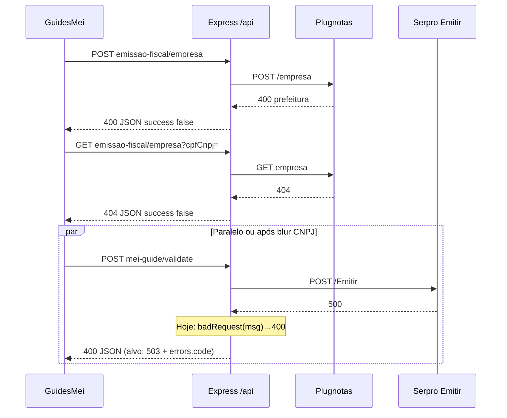

# Arquitetura técnica — Correção integrada: cadastro Plugnotas e triagem de erros na consola (Guia MEI)

**Versão:** 1.0  
**Data:** 2026-04-08  
**Autoria:** Aria (architect / AIOX)  
**Requisitos de origem:** [`docs/prd/PRD-correcao-cadastro-plugnotas-erros-console-mei-2026-04-08.md`](../prd/PRD-correcao-cadastro-plugnotas-erros-console-mei-2026-04-08.md) (**FR-CONS-***, **NFR-CONS-***)  
**UX de origem:** [`docs/specs/ux-spec-correcao-cadastro-plugnotas-erros-console-mei-2026-04-08.md`](../specs/ux-spec-correcao-cadastro-plugnotas-erros-console-mei-2026-04-08.md) (gatilhos **CONS-A/B/C**)

Este documento fixa **fronteiras entre integrações**, **contrato de erro HTTP/JSON** entre BFF e frontend, **estado de UI** para encadeamento POST→GET, e **pontos de extensão** sem duplicar o núcleo **PRD-PREF** (payload `nfse.config.prefeitura`). **Não** substitui ADRs Plugnotas nem `docs/operacao-mei-nfse.md`.

**Artefactos relacionados:**

- [`docs/brief/brief-correcao-cadastro-plugnotas-erros-console-2026-04-08.md`](../brief/brief-correcao-cadastro-plugnotas-erros-console-2026-04-08.md) — cadeia causal na consola.  
- [`docs/prd/PRD-plugnotas-empresa-nfse-config-prefeitura-payload-2026-04-08.md`](../prd/PRD-plugnotas-empresa-nfse-config-prefeitura-payload-2026-04-08.md) — trilhos payload **FR-PREF-***.  
- [`docs/specs/ux-spec-solucao-400-prefeitura-404-get-empresa-mei-2026-04-08.md`](../specs/ux-spec-solucao-400-prefeitura-404-get-empresa-mei-2026-04-08.md) — **SOL-L***.  
- [`docs/technical/architecture-nfse-nacional-sem-im-prefeitura-mei-2026-04-08.md`](architecture-nfse-nacional-sem-im-prefeitura-mei-2026-04-08.md) — nacional / hints.

---

## 1. Visão de contexto

### 1.1 Três integrações, um ecrã

O Guia MEI orquestra **dois upstreams distintos** expostos via o mesmo BFF (`/api`), o que na consola do browser aparece como sequência de pedidos independentes:

| Integração | Rotas BFF (prefixo típico) | Upstream | Responsabilidade de negócio |
|------------|----------------------------|----------|-----------------------------|
| **Emissor fiscal** | `mei-notas/setup/emissao-fiscal/empresa` (GET/POST/…) | Plugnotas | Registo da empresa para NFS-e (e documentos activos). |
| **Guia MEI / DAS** | `mei-guide/validate` (POST), entre outras | Serpro (`/Emitir`) | Validação que dispara emissão/consulta de fluxo PGMEI no `validateGuide`. |

**Regra de fronteira:** mensagens e códigos HTTP do BFF devem permitir ao **frontend** classificar **CONS-A** (Plugnotas cadastro), **CONS-B** (GET empresa 404), **CONS-C** (validate / Serpro) sem inferir origem só pela *substring* da mensagem (**FR-CONS-SERPRO-01**).

### 1.2 Diagrama de sequência (erro típico)



---

## 2. Decisões de arquitectura

### 2.1 Contrato de erro BFF → cliente (canónico)

O **`errorHandler`** actual serializa:

```json
{
  "success": false,
  "data": null,
  "message": "<texto utilizador ou técnico>",
  "errors": <objeto ou null>
}
```

**Decisão (NFR-CONS-SERPRO-01):** para falhas **Serpro** no caminho `validateGuide` → `emitirServico`, quando `response.status >= 500` (e, por simetria, **502** de *gateway* se algum dia aparecer no `fetch`):

1. Lançar **`HttpError` com `status: 503`** e terceiro argumento `errors`. Hoje `serviceUnavailable(message)` em `backend/src/utils/errors.js` **não** aceita `errors`; **opções:** (a) `throw new HttpError(503, message, errorsObject)` importando `HttpError`; ou (b) refactor mínimo `serviceUnavailable(message, errors = null)` para espelhar `badRequest` — preferível (b) para consistência da API de helpers.  
2. Preencher `message` com texto **controlado em português** (não propagar *raw* `"Internal Server Error"` como única mensagem ao utilizador).  
3. Preencher `errors` com um objeto **estável** para o frontend:

| Chave | Tipo | Valor | Uso |
|-------|------|-------|-----|
| `code` | string | `MEI_GUIDE_SERPRO_UNAVAILABLE` (constante exportada num módulo partilhado backend, opcional) | Ramo de copy **CONS-C** sem depender de `plugnotasCode`. |
| `integration` | string | `serpro` | Filtros, métricas, logs. |
| `upstreamStatus` | number | status HTTP Serpro | Suporte / debug (não mostrar PII). |

**4xx Serpro** (se o contrato distingue validação de negócio): manter **400** com `message` específica; opcionalmente `code: MEI_GUIDE_SERPRO_REJECT` para não confundir com validação local de CNPJ.

**Excepção NFR-CONS-SERPRO-02:** se for necessário manter **HTTP 400** por compatibilidade com clientes legados, **obrigatório** incluir o mesmo bloco `errors.code` + `integration` para o frontend aplicar a spec UX; documentar deprecação e prazo de remoção do 400.

### 2.2 Onde implementar o mapeamento Serpro

**Ficheiro único de decisão:** `backend/src/services/gestao/emitir.service.js`, ramo `if (!result.response.ok)` de **`emitirServico`** (aprox. linhas 158–159).

- **Hoje:** `throw badRequest(result.message || 'Falha ao emitir serviço')` — força **400** para qualquer falha, incluindo **5xx** upstream.  
- **Alvo:** ramificar por `result.response.status`:  
  - `status >= 500` → **503** com `errors` conforme 2.1 (via `HttpError` ou `serviceUnavailable` estendido — ver decisão 2.1).  
  - `status === 401 || 403` → manter política actual de *retry* token; após esgotar, erro **401/403** explícito (já alinhado a `isAuthTokenError`).  
  - restantes **4xx** → `badRequest` com mensagem saneada ou mapeada.

**Chamadores:** `mei-guide.service.js` (`validateGuide`, `createGuide`, `createGuideByCnpj`, …) **não** precisam de `try/catch` novo se o erro já transporta `status` e `errors`; o `errorHandler` propaga.

**Testes (NFR-CONS-03):** teste unitário ou de integração com `emitirServico` mockado (Response 500) → resposta HTTP **503** e corpo com `errors.code`.

### 2.3 Contrato frontend: consumo de `errors.code`

**Estado actual:** `ApiClientError` expõe `plugnotasCode`, `httpStatus`, `payload` (`frontend/src/utils/apiClientError.ts`). Não há campo genérico `integration` ou `code` de primeiro nível.

**Decisão:**

1. Estender **`getPlugnotasCodeFromApiErrors`** ou criar **`getApiErrorCode(payload)`** que leia `errors.code` (string) quando `errors` for object — **sem** conflito com `errors.plugnotasRequest`.  
2. Opcionalmente acrescentar a **`ApiClientError`** propriedade `apiErrorCode: string | null` preenchida em `apiClientErrorFromPayload` a partir de `payload.errors`.  
3. Em **`GuidesMei.tsx`** (`handleValidateBlur`), substituir `error.message` nu por um **mapper** `mapMeiGuideValidateErrorToUserMessage(err)` que:  
   - se `httpStatus === 503` ou `apiErrorCode === 'MEI_GUIDE_SERPRO_UNAVAILABLE'` → copy da spec UX secção 6;  
   - se mensagem genérica “Internal Server Error” **e** *path* conhecido validate → mesma copy (fallback até backend deployado).

Isto cumpre **FR-CONS-SERPRO-01** e desacopla copy de texto livre do Serpro.

### 2.4 Estado para CONS-B / SOL-L1–L3 (POST falho → GET 404)

**Problema:** o **404** do GET é semanticamente correcto; a UI precisa de **memória de sessão** (ou equivalente) para não tratar como **SOL-L3** (primeira visita) quando houve **POST** falho (**FR-CONS-UX-01**, **FR-CONS-UX-02**).

**Decisão técnica (brownfield):**

- Reutilizar ou estender o mecanismo já previsto na spec **SOL** / código existente em `GuidesMei.tsx` (ex.: flags de fase 2, `solFase2SessionFlagRevalidateTick`, *cache* `invalidateMeiEmpresaGetCache`).  
- Introduzir um **estado mínimo** persistido em `sessionStorage` (preferível a `localStorage` para não vazar entre sessões):  
  - chave namespaced, ex.: `guiaMei:lastEmpresaPostOutcome` com valores `{ ok: boolean, at: number }` ou `{ lastFailure: 'plugnotas_empresa', at: number }`.  
- Ao **sucesso** de `POST` empresa, limpar ou marcar `ok: true`.  
- Ao **render** de mensagem derivada de GET 404, ler flag: se `lastFailure` recente (< TTL opcional, ex. 24h), mostrar bloco **SOL-L1**; senão **SOL-L2/L3** conforme spec.

**Alternativa:** só estado React (perde-se no *refresh*) — **rejeitada** como única solução, pois o utilizador recarrega precisamente quando vê erros na consola.

### 2.5 Observabilidade (NFR-CONS-01)

- **Backend:** em `NODE_ENV !== 'production'`, o `errorHandler` já regista `method`, `url`, `body` resumido; garantir que falhas `emitirServico` loguem **`upstreamStatus`** e **`integration: serpro`** sem CNPJ completo (mascarar como noutros módulos Serpro).  
- **Produção:** não ampliar PII; opcional `PLUGNOTAS_DEBUG` não aplica a Serpro — se necessário, flag distinta futura `SERPRO_DEBUG` (fora do MVP desta arquitectura).

### 2.6 Payload Plugnotas (`prefeitura`)

**Delegação explícita (FR-CONS-PREF-DELEG-01):** alterações a `nfse.config.prefeitura`, trilhos **B/C/D**, e normalização em `empresa.service.js` seguem **PRD-PREF** e ADRs; **esta arquitetura não define** o shape de `prefeitura`.

---

## 3. Mapa de componentes e ficheiros

| Camada | Ficheiro / símbolo | Alteração esperada |
|--------|-------------------|-------------------|
| Serpro | `backend/src/services/gestao/emitir.service.js` | Mapear 5xx → `serviceUnavailable` + `errors` estável. |
| Erros HTTP | `backend/src/utils/errors.js` | Estender `serviceUnavailable(message, errors?)` **ou** usar `HttpError(503, …, errors)` até refactor. |
| Guia | `backend/src/services/mei-guide.service.js` | Sem mudança obrigatória se erros propagam. |
| Controller | `backend/src/controllers/mei-guide.controller.js` | Idem. |
| Testes | `backend/tests/…` (novo ou existente mei-guide) | Caso 503 + `errors.code`. |
| Cliente | `frontend/src/utils/apiClientError.ts` | Opcional `apiErrorCode`; helper de leitura. |
| UI | `frontend/src/pages/GuidesMei.tsx` | `mapMeiGuideValidateErrorToUserMessage`, `sessionStorage` p/ SOL, blocos a11y. |
| Doc | `docs/operacao-mei-nfse.md` | Secção “tríade” (**FR-CONS-MAP-01**) — entrega cruzada PM/operação. |

---

## 4. Matriz de rastreabilidade PRD/UX → técnica

| ID | Realização técnica |
|----|---------------------|
| **FR-CONS-MAP-01** | Doc operação + diagrama brief; opcional link no UI “Ajuda”. |
| **FR-CONS-UX-01 / 02** | `sessionStorage` + copy SOL; não alterar GET 404 do BFF. |
| **FR-CONS-SERPRO-01** | `errors.code` + mapper frontend + mensagem PT no BFF. |
| **NFR-CONS-SERPRO-01** | `emitirServico` → 503 para 5xx Serpro. |
| **NFR-CONS-02** | Sem stack em JSON; mensagens sanitizadas. |
| **NFR-CONS-03** | Testes backend (e opcional teste unitário mapper frontend). |
| **CONS-A/B/C (UX)** | Ver 2.3 e 2.4; hints Plugnotas **não** disparam em `errors.integration === 'serpro'`. |

---

## 5. Riscos e mitigação

| Risco | Mitigação |
|-------|-----------|
| Clientes externos parseiam só `400` no validate | **NFR-CONS-SERPRO-02:** manter 400 temporariamente com `errors.code` idêntico; *feature flag* `MEI_GUIDE_VALIDATE_LEGACY_STATUS` se necessário. |
| Duplicação de constantes `code` | Um módulo `backend/src/constants/mei-guide-error-codes.js` re-exportado ou espelhado em comentário no frontend (até *shared package* existir). |
| Falso positivo CONS-C | Garantir que **apenas** rotas `mei-guide` que chamam `emitirServico` usam o novo mapeamento; outros erros do guia mantêm códigos distintos. |

---

## 6. Critérios de prontidão para @dev

1. **Serpro 500** simulado → resposta **503** + `errors: { code: 'MEI_GUIDE_SERPRO_UNAVAILABLE', integration: 'serpro', upstreamStatus: 500 }`.  
2. Frontend: utilizador vê copy **CONS-C** (spec UX), não só “Internal Server Error”.  
3. Após **POST** empresa falhar, **GET** 404 + refresh: UI ainda sugere contexto **SOL-L2** (ou L1 se painel visível), não **SOL-L3** puro.  
4. `npm run lint`, `npm run typecheck`, `npm test` verdes.

---

## 7. Change log

| Data | Versão | Nota |
| --- | --- | --- |
| 2026-04-08 | 1.0 | Versão inicial a partir do PRD CONS e spec UX; decisão 503 + `errors.code` Serpro; estado sessão SOL. |

---

*Aria — arquitectura alinhada ao BFF actual; evolução do payload **PREF** permanece em PRD/ADR dedicados.*
