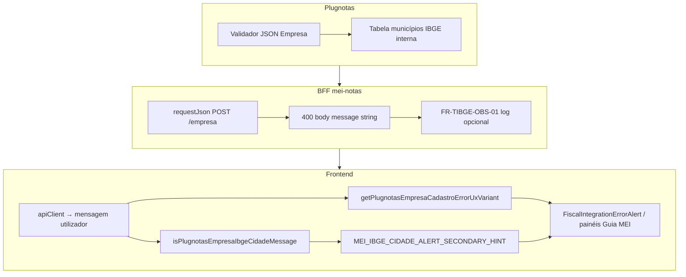

# Arquitetura técnica — **Tabela IBGE** (`codigoIBGECidade` na mensagem), hints **FR-CID-UX-02** e **404** no `GET` empresa

**Versão:** 1.0  
**Data:** 2026-04-09  
**Autoria:** Aria (architect / AIOX)  
**Requisitos de origem:** [`docs/prd/PRD-correcao-ibge-tabela-plugnotas-400-get-404-2026-04-09.md`](../prd/PRD-correcao-ibge-tabela-plugnotas-400-get-404-2026-04-09.md) (**FR-TIBGE-***, **NFR-TIBGE-***)  
**UX de origem:** [`docs/specs/ux-spec-correcao-ibge-tabela-plugnotas-400-get-404-2026-04-09.md`](../specs/ux-spec-correcao-ibge-tabela-plugnotas-400-get-404-2026-04-09.md) (**TIBGE-L1**, prioridade §3.2)

Este documento fixa a **camada de classificação de mensagens** para erros de **tabela IBGE** (incluindo o nome **`codigoIBGECidade`** nas mensagens do Plugnotas), a **ortogonalidade** face às variantes **PREF** / municipal, o **contrato de payload** (**NFR-TIBGE-02**), o **gancho de observabilidade** opcional (**FR-TIBGE-OBS-01**) e a **matriz de testes**. **Complementa** a arquitetura de **normalização** [`architecture-plugnotas-empresa-codigo-cidade-ibge-2026-04-08.md`](architecture-plugnotas-empresa-codigo-cidade-ibge-2026-04-08.md) (**FR-CID-***): não redefinir `normalizeIbgeMunicipioCodigo` nem o fluxo `POST`/`PATCH` além do que já está documentado para CID.

**Artefactos relacionados:**

- [`docs/brief/brief-correcao-ibge-cidade-plugnotas-400-e-get-404-2026-04-09.md`](../brief/brief-correcao-ibge-cidade-plugnotas-400-e-get-404-2026-04-09.md) — diagnóstico causa/efeito.  
- [`docs/technical/architecture-plugnotas-empresa-codigo-cidade-ibge-2026-04-08.md`](architecture-plugnotas-empresa-codigo-cidade-ibge-2026-04-08.md) — formato e defesa em profundidade **FR-CID-BE-01**.  
- [`docs/technical/architecture-solucao-400-prefeitura-404-get-empresa-mei-2026-04-08.md`](architecture-solucao-400-prefeitura-404-get-empresa-mei-2026-04-08.md) — encadeamento HTTP **SOL** (se existir; caso contrário **PRD SOL** + **ux-spec SOL**).  
- **Código âncora:** `frontend/src/utils/nfseNacionalPlugnotasErrorHints.ts`, `frontend/src/components/FiscalIntegrationErrorAlert.tsx`, `frontend/src/pages/GuidesMei.tsx`, `backend/src/services/plugnotas/empresa.service.js`, `backend/src/services/plugnotas/plugnotas-empresa-cadastro-debug.js`.

**Não exige novo ADR** — trata-se de **heurística de mensagem** + **logging operacional** sobre o mesmo contrato de empresa já coberto pelo **ADR apenas NFS-e**.

---

## 1. Visão de contexto

### 1.1 Duas camadas independentes

| Camada | Responsabilidade | PRD |
|--------|------------------|-----|
| **CID (formato)** | Garantir `endereco.codigoCidade` como string só dígitos antes do upstream; evitar crash `.trim`. | **FR-CID-***, [`architecture-plugnotas-empresa-codigo-cidade-ibge`](architecture-plugnotas-empresa-codigo-cidade-ibge-2026-04-08.md) |
| **TIBGE (semântica / UX)** | Quando o emissor devolve 400 porque o código **não existe na tabela** (mensagem pode citar `codigoIBGECidade`), **classificar** a *string* de erro e mostrar **hint FR-CID-UX-02**; **404** no `GET` permanece efeito de **cadastro não criado**. | **FR-TIBGE-***, este documento |

**Invariante:** a normalização CID **não** elimina 400 por código IBGE **factually** errado ou **desactualizado** na fonte CNPJ — o TIBGE trata **percepção**, **detecção** e **operação**, não “inventar” código válido.

### 1.2 Fluxo lógico (brownfield)

**Sequência típica:** `POST` 400 (mensagem com `codigoIBGECidade` ou tabela IBGE) → utilizador vê alerta + hint TIBGE → `GET` 404 se a UI consultar empresa → copy **SOL** (cadastro não concluído), **sem** alterar rotas novas.

---

## 2. Contrato de payload (**NFR-TIBGE-02**)

| Regra | Detalhe |
|-------|---------|
| **Campo canónico** | Continuar a enviar apenas **`endereco.codigoCidade`** no JSON para o Plugnotas (BFF → upstream). |
| **Não adicionar** | **`endereco.codigoIBGECidade`** ou duplicado semântico — o nome `codigoIBGECidade` aparece **só** na **mensagem de erro** devolvida pelo provedor. |
| **Paridade** | Se no futuro o Plugnotas documentar mudança de contrato, actualizar via **ADR** ou addendum; até lá, tratar `codigoIBGECidade` como **alias lexical na mensagem**, não como chave de pedido. |

---

## 3. Camada de classificação (cliente)

### 3.1 Função `isPlugnotasEmpresaIbgeCidadeMessage`

**Local:** `frontend/src/utils/nfseNacionalPlugnotasErrorHints.ts`

**Extensão mínima (FR-TIBGE-UX-01):** após `normalizeForMatch` (minúsculas, sem acentos), considerar **TIBGE-L1** verdadeiro se:

1. `m.includes('codigoibgecidade')` **ou** `m.includes('fields.endereco.codigoibgecidade')` — cobre a mensagem observada *«fields.endereco.codigoIBGECidade: …»*;  
2. **Ou** manter as condições já existentes (`endereco.codigocidade`, `tabela`+`ibge`+`cidades`, etc.) — ver implementação actual e spec UX §3.1.

**Exclusões (regressão):** não usar substring genérica `municip` isolada (comentários existentes — `inscricaoMunicipal`). Mensagens **apenas** **PREF-L1** (`nfse.config.prefeitura` obrigatório) **sem** sinais TIBGE **não** devem ser classificadas como IBGE cidade **só** por conterem “municipal” — o hint IBGE é **ortogonal** à variante `getPlugnotasEmpresaCadastroErrorUxVariant` (PREF continua a mandar na **variant**; o hint usa `isPlugnotasEmpresaIbgeCidadeMessage` em **e** lógico separado no componente, conforme spec UX §3.2).

### 3.2 Ortogonalidade: variant PREF vs hint IBGE

| Mecanismo | Função | Efeito |
|-----------|--------|--------|
| **Variante de cadastro** | `getPlugnotasEmpresaCadastroErrorUxVariant` | `prefeitura-config` \| `municipal-generic` \| `generic` — **ordem inalterada** (PREF-L1 primeiro). |
| **Hint linha secundária** | `isPlugnotasEmpresaIbgeCidadeMessage` + constante `MEI_IBGE_CIDADE_ALERT_SECONDARY_HINT` | Mostrar **segunda** linha de ajuda quando a mensagem completa satisfaz TIBGE-L1. |

**Implementação:** os componentes que já renderizam o hint (**`FiscalIntegrationErrorAlert`**, painéis em **`GuidesMei`**) devem continuar a usar **duas decisões independentes**: (1) variant para bloco principal municipal/prefeitura; (2) hint IBGE se **CID/TIBGE**. Caso híbrido raro (mensagem com PREF **e** tabela IBGE), a spec UX fixa: **priorizar** copy PREF no bloco principal; hint IBGE **se** TIBGE-L1 for verdadeiro (validar com QA de conteúdo).

### 3.3 Encadeamento **404**

**Sem nova rota.** Reutilizar `isPlugnotasEmpresaConsultNotFoundMessage` e prefixos **SOL** já definidos (`PLUGNOTAS_EMPRESA_CONSULT_PENDENTE_CADASTRO_PREFIX` ou equivalente na página) quando o fluxo mostrar **GET** após **POST** falhado — lógica alinhada a **ux-spec SOL** e **PRD SOL**.

---

## 4. Backend — observabilidade (**FR-TIBGE-OBS-01**, **NFR-TIBGE-03**)

### 4.1 Objectivo

Permitir à operação correlacionar **400** “cidade IBGE / tabela” com **ambiente** e **tentativa** sem vazar PII nem payload completo em produção.

### 4.2 Ponto de integração sugerido

| Opção | Descrição | Risco |
|-------|-----------|-------|
| **A (preferida)** | Após receber corpo de erro **400** do `requestJson` em **`cadastrarEmpresaPlugNotas`** / **`atualizarEmpresaPlugNotas`**, se `message` (string) passar heurística **espelhada** da mesma família que `isPlugnotasEmpresaIbgeCidadeMessage` **no servidor** (função pura partilhada ou duplicado mínimo em `.js` para não importar TS), registar **uma linha estruturada** (`logger.info`/`debug` conforme padrão do repo) com: `plugnotasEmpresaIbgeTableReject: true`, `codigoCidadeLen` = comprimento de `normalizeIbgeMunicipioCodigo(payload?.endereco?.codigoCidade)`, `nodeEnv`, **sem** CNPJ completo (últimos 4 dígitos ou hash se já existir helper). | Baixo — só metadados. |
| **B** | Estender **`logPlugnotasEmpresaCadastro400Request`** (`plugnotas-empresa-cadastro-debug.js`) apenas quando debug explícito já está ligado — **não** substituir **A** para operação geral. | Opt-in |

**NFR-TIBGE-03:** Reutilizar políticas **NFR-CID-03**; não logar `razaoSocial`, `logradouro` completo, etc.; máscaras já existentes em **`applyEmpresaCadastroPiiMaskForLog`** quando qualquer payload for tocado para debug.

### 4.3 Duplicação cliente/servidor da heurística

**Trade-off:** Duplicar uma função `isPlugnotasEmpresaIbgeTableErrorMessage(message: string): boolean` em **`backend/src/utils/`** (ESM) **ou** extrair para pacote partilhado — neste repositório o padrão é **espelhar** regra mínima no backend (comentário “manter alinhado a `nfseNacionalPlugnotasErrorHints.ts`”). Evita dependência do frontend no worker Node.

---

## 5. Matriz de testes (alinhamento **FR-TIBGE-QA-01**)

| Camada | Ficheiro(s) sugeridos | Casos mínimos |
|--------|----------------------|---------------|
| **Unitário** | `frontend/src/utils/nfseNacionalPlugnotasErrorHints.test.ts` | Mensagem com `fields.endereco.codigoIBGECidade` e “tabela de cidades” → `isPlugnotasEmpresaIbgeCidadeMessage` **true**; mensagem só `nfse.config.prefeitura` obrigatório **sem** TIBGE → **false** para IBGE hint (negativo). |
| **Componente** | `frontend/src/components/FiscalIntegrationErrorAlert.test.tsx`, testes do painel cadastro em `GuidesMei` | Hint `MEI_IBGE_CIDADE_ALERT_SECONDARY_HINT` visível quando mensagem injectada contém substring do brief. |
| **Backend (opcional)** | Novo teste em `backend/tests/` se **FR-TIBGE-OBS-01** implementar função pura no servidor | Entrada mensagem + payload parcial → flag de log ou função `shouldLogIbgeTableReject`. |

**Gates:** **NFR-TIBGE-04** — `npm run lint`, `npm run typecheck`, `npm test` (**`AGENTS.md`**).

---

## 6. Fronteiras e responsabilidades

| Camada | Responsabilidade TIBGE |
|--------|------------------------|
| **Frontend** | Estender **só** classificação e UI de hint; **não** alterar `buildNfEmissionEmpresaPayload` salvo bug encontrado (fora deste PRD). |
| **Backend** | Payload **inalterado** quanto a chaves; logging opcional §4; **não** validar tabela IBGE localmente (**NFR-TIBGE-01**). |
| **Plugnotas** | Autoridade final sobre tabela; escalação **FR-TIBGE-OPS-01** é processo humano + ticket. |

---

## 7. Riscos técnicos

| Risco | Mitigação |
|-------|-----------|
| Regex IBGE demasiado larga | Testes negativos PREF puro; revisão em PR; alinhar comentários `isPlugnotasEmpresaIbgeCidadeMessage`. |
| Divergência heurística FE vs BE | Comentário cruzado nos dois ficheiros; testes espelhados com as mesmas *strings* de exemplo. |
| Dois `role="alert"` | Spec UX §4.2 — manter hierarquia acessível. |

---

## 8. Rastreabilidade PRD → arquitetura

| ID PRD | Secção deste documento |
|--------|-------------------------|
| **FR-TIBGE-UX-01** | §3.1, §3.2 |
| **FR-TIBGE-QA-01** | §5 |
| **FR-TIBGE-OBS-01** | §4 |
| **FR-TIBGE-DOC-01** | Fora de código — `docs/operacao-mei-nfse.md` |
| **NFR-TIBGE-01** | §6 |
| **NFR-TIBGE-02** | §2 |
| **NFR-TIBGE-03** | §4.2 |

---

## 9. Change log

| Versão | Data | Notas |
|--------|------|--------|
| 1.0 | 2026-04-09 | Versão inicial a partir do **PRD-correcao-ibge-tabela-plugnotas-400-get-404** e **ux-spec** homónima. |

---

*Arquitetura técnica brownfield — Meu Financeiro / BFF Plugnotas / Guia MEI — classificação erro tabela IBGE.*
