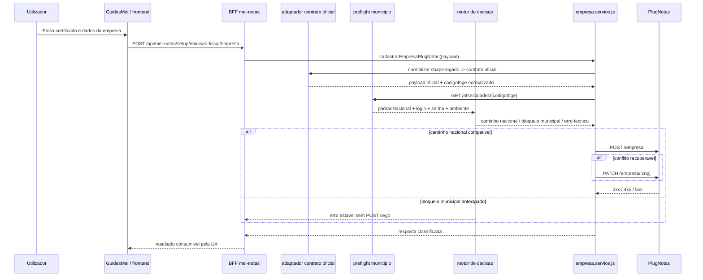

# Arquitetura tecnica -- correcao runtime do cadastro de empresa PlugNotas com contrato oficial e triagem municipal

**Versao:** 1.0  
**Data:** 2026-04-14  
**Autoria:** Aria (architect / AIOX)  
**PRD de origem:** [`docs/prd/PRD-correcao-runtime-cadastro-empresa-plugnotas-contrato-oficial-triagem-municipal-2026-04-14.md`](../prd/PRD-correcao-runtime-cadastro-empresa-plugnotas-contrato-oficial-triagem-municipal-2026-04-14.md)  
**UX de origem:** [`docs/specs/ux-spec-correcao-runtime-cadastro-empresa-plugnotas-contrato-oficial-triagem-municipal-2026-04-14.md`](../specs/ux-spec-correcao-runtime-cadastro-empresa-plugnotas-contrato-oficial-triagem-municipal-2026-04-14.md)

**Referencias externas (contrato):**

- [PlugNotas -- Empresa / addCompany](https://docs.plugnotas.com.br/#tag/Empresa/operation/addCompany)
- [PlugNotas -- Consultar disponibilidade do municipio e metadados](https://docs.plugnotas.com.br/#operation/getCidadeById)
- [PlugNotas -- OpenAPI oficial (`api.json`)](https://docs.plugnotas.com.br/api.json)

---

## 1. Resumo executivo

Esta arquitetura mantem a forma geral do sistema e muda o **hot path interno** do cadastro da empresa no BFF.

### O que permanece

- frontend continua a chamar `POST /api/mei-notas/setup/emissao-fiscal/empresa`;
- backend continua a ser a unica fronteira com o PlugNotas;
- `POST /empresa` continua canonicamente o cadastro;
- `PATCH /empresa/:cnpj` continua como fallback e rota de atualizacao;
- `GET /empresa/:cnpj` continua como consulta posterior.

### O que muda

1. o payload deixa de sair para o PlugNotas no shape legado `nfse.nacional`;
2. o BFF passa a consultar `/nfse/cidades/{codigoIbge}` antes de decidir se segue pelo caminho nacional;
3. a decisao do fluxo deixa de depender apenas do texto do `400` posterior;
4. o fluxo nacional deixa de depender de `nfse.config.prefeitura.codigoIbge` como via principal;
5. os codigos estaveis devolvidos ao frontend passam a poder nascer do **preflight municipal**, e nao apenas do erro do `POST /empresa`.

### Decisao central

**Arquitetura alvo do MVP:** `adaptador de contrato oficial + preflight municipal + motor de decisao no BFF`, preservando a rota publica e a jornada atual da Guia MEI.

---

## 2. Decisao arquitetural

**Decisao principal:** manter a arquitetura brownfield baseada em `frontend -> BFF -> PlugNotas`, substituindo o hot path atual por uma maquina de decisao explicita para o cadastro da empresa.

### Invariantes

- o browser nao chama o PlugNotas diretamente;
- o BFF continua a centralizar segredo, root URL, classificacao de erro e fallback;
- o frontend continua a modelar apenas duas fases de alto nivel: `certificado` e `empresa`;
- o MVP nao reabre `login`/`senha` de prefeitura na UI;
- o fallback `POST` -> `PATCH` continua a existir, mas passa a depender da mesma decisao municipal calculada antes do primeiro upstream call.

### Fora da decisao

- nao criar nova rota visual municipal-first;
- nao persistir credenciais municipais;
- nao introduzir schema de banco novo;
- nao tratar a fase 2 municipal como parte do MVP.

---

## 3. Contexto brownfield

### 3.1 Estado atual

| Camada | Estado atual |
|---|---|
| Frontend | `buildNfEmissionEmpresaPayload` ainda envia `nfse.nacional` como chave principal |
| Backend | `empresa.service.js` normaliza endereco, aplica `applyNfsePrefeituraIbgeIfEnabled` e bloqueia `login` / `senha` |
| Fluxo municipal | nao existe consulta dinamica a `/nfse/cidades/{codigoIbge}` antes do cadastro |
| Retry | `GuidesMei.tsx` ja suporta retry parcial de empresa apos certificado |
| Contrato de erro | `plugnotasCode`, `plugnotasRequest` e `httpStatus` ja chegam ao frontend |

### 3.2 Restricoes

- a rota publica precisa continuar a mesma;
- o frontend e o backend devem poder coexistir durante rollout sem deploy atomico perfeito;
- a UX nao pode depender de novas credenciais municipais no MVP;
- a solucao precisa preservar a causalidade `POST` -> `PATCH` -> `GET`.

---

## 4. Visao de contexto alvo



---

## 5. Componentes e responsabilidades

| Componente | Responsabilidade arquitetural |
|---|---|
| `frontend/src/utils/nfEmissionCompany.ts` | montar o payload do formulario no contrato oficial da app, sem logica de integracao externa |
| `frontend/src/utils/plugnotasEmitenteSetup.ts` | continuar a orquestrar `certificado -> empresa`, sem conhecer preflight municipal |
| `frontend/src/lib/fiscalUserError.ts` | priorizar codigos estaveis do BFF e manter copy por cenario |
| `frontend/src/utils/nfseNacionalPlugnotasErrorHints.ts` | manter hints como fallback secundario |
| `backend/src/controllers/mei-notas.controller.js` | manter a mesma borda HTTP e propagar resposta/erro classificado |
| `backend/src/services/plugnotas/empresa.service.js` | orquestrar adaptacao do contrato, preflight, decisao e chamada ao PlugNotas |
| **novo helper recomendado** `backend/src/services/plugnotas/plugnotas-cidades.service.js` | encapsular `GET /nfse/cidades/{codigoIbge}` |
| **novo helper recomendado** `backend/src/services/plugnotas/empresa-cadastro-runtime-decision.js` | centralizar a maquina de decisao do fluxo |
| `backend/src/services/plugnotas/prefeituraPortalCredentials.js` | continuar a bloquear credenciais no MVP |
| `backend/src/services/plugnotas/prefeituraIbgeOnlyBlock.js` | deixar de ser a fonte primaria da decisao municipal; manter apenas como fallback de rollout/deprecacao, se necessario |
| `backend/src/services/plugnotas/nfsePrefeituraPayload.js` | deixar de ser hot path principal do nacional; permanecer apenas como legado controlado ate remocao |

### Regra de design

O frontend continua a expressar **intencao de negocio**.  
O backend continua a expressar **contrato externo e decisao tecnica**.

---

## 6. Estrategia de normalizacao do contrato

### 6.1 Problema

Hoje frontend e backend propagam `nfse.nacional` como sinal principal, enquanto o contrato oficial atual do PlugNotas documenta:

- `nfse.config.nfseNacional`
- `nfse.config.consultaNfseNacional`

### 6.2 Decisao

O BFF passa a operar com um **contrato oficial canonico de saida**, aceitando temporariamente tanto o shape legado quanto o oficial na entrada.

### 6.3 Regras

1. **Entrada tolerante**
   - aceitar `nfse.nacional` durante a janela de migracao;
   - aceitar `nfse.config.nfseNacional` e `nfse.config.consultaNfseNacional`;
   - se ambos vierem, o shape oficial tem precedencia.

2. **Saida oficial**
   - qualquer chamada ao PlugNotas deve sair com `nfse.config.nfseNacional`;
   - `nfse.nacional` deixa de ser enviado ao upstream;
   - `nfse.config.consultaNfseNacional` passa a ser escrito explicitamente.

3. **Regra do MVP para consulta**
   - `consultaNfseNacional` acompanha `nfseNacional` no MVP;
   - em termos práticos: se o caminho nacional estiver habilitado para o cadastro, ambos saem `true`.

4. **Reuso no backend**
   - `plugnotas-mei-empresa-policy.js`
   - `plugnotas-empresa-documentos-ativos.js`
   - `empresa.service.js`
   precisam convergir para o mesmo shape oficial.

### 6.4 Beneficio

Isto reduz risco de deploy desalinhado entre frontend e backend e garante que o outbound contract para o PlugNotas seja unico.

---

## 7. Estrategia de preflight municipal

### 7.1 Entrada do preflight

O preflight usa como base:

- `endereco.codigoCidade` normalizado para 7 digitos;
- ambiente alvo do cadastro (`producao` ou `homologacao`);
- somente quando `nfse` estiver ativo.

### 7.2 Chamada externa

**Endpoint:** `GET /nfse/cidades/{codigoIbge}`

### 7.3 Saida normalizada do preflight

Formato logico recomendado:

```ts
type MunicipioPreflightResult = {
  consulted: true;
  codigoIbge: string;
  environment: 'producao' | 'homologacao';
  padraoNacionalEnabled: boolean | null;
  requiresLogin: boolean;
  requiresSenha: boolean;
};
```

### 7.4 Regras de execucao

- o preflight acontece **antes** de qualquer `POST /empresa`;
- no fluxo de `PATCH /empresa` explicito, o preflight tambem ocorre antes do update;
- no fluxo `POST` com fallback para `PATCH`, o resultado do preflight e calculado uma vez e reutilizado;
- o frontend nao chama esse endpoint diretamente.

### 7.5 Politica de disponibilidade

**Decisao do MVP:** se a chamada ao preflight falhar tecnicamente, o sistema **nao** segue para `POST /empresa` cego.

Mapeamento recomendado:

- `401` / `403` no preflight -> `ambiente_configuracao`
- `502` / `503` / `504` / timeout -> codigos gateway/ambiente ja existentes
- `codigoCidade` invalido antes do preflight -> `payload_contrato`

Isto satisfaz o requisito de que a decisao do fluxo passe primeiro pela triagem municipal.

### 7.6 Cache

**P0 recomendado:** sem cache distribuido nem persistente.  
**Reuso minimo:** reutilizar o resultado da mesma request para `POST` e eventual `PATCH`.  
**Otimizacao futura opcional:** cache em memoria com TTL curto, se a latencia se mostrar material.

---

## 8. Maquina de decisao do BFF

### 8.1 Estados logicos

| Estado logico | Fonte | Acao |
|---|---|---|
| `payload_invalido_local` | codigo IBGE ausente/invalido ou contrato incompleto antes do preflight | bloquear como `payload_contrato` |
| `preflight_tecnico_falhou` | erro tecnico em `/nfse/cidades/{codigoIbge}` | bloquear como `ambiente_configuracao` ou gateway |
| `municipio_nacional_compativel` | `padraoNacionalEnabled = true` e `login = false` e `senha = false` | seguir para `POST /empresa` |
| `municipio_municipal_auth_required` | `login = true` ou `senha = true` | bloquear antes do `POST`, reutilizando `prefeitura_login_required_blocked` |
| `municipio_municipal_additional_data` | `padraoNacionalEnabled != true` e sem auth explicita | bloquear antes do `POST`, reutilizando `prefeitura_ibge_apenas_insuficiente_dp02` |
| `empresa_conflito_recuperavel` | `POST` retorna conflito | tentar `PATCH /empresa/:cnpj` |
| `empresa_consulta_negativa` | `GET` posterior retorna 404 apos falha anterior | manter causalidade como consequencia |

### 8.2 Tabela de decisao

| Preflight | Login/Senha | Padrao nacional no ambiente | Acao | Codigo estavel |
|---|---|---|---|---|
| nao consultado por dado invalido | n/a | n/a | bloquear antes do upstream | `payload_contrato` |
| falhou tecnicamente | n/a | n/a | bloquear antes do upstream | `ambiente_configuracao` ou gateway existente |
| consultado | `true` em qualquer um | qualquer | bloquear antes do upstream | `prefeitura_login_required_blocked` |
| consultado | `false` | `true` | seguir por contrato oficial nacional | sem codigo de erro; sucesso ou fallback |
| consultado | `false` | `false` ou `null` | bloquear antes do upstream | `prefeitura_ibge_apenas_insuficiente_dp02` |

### 8.3 Reaproveitamento de codigos existentes

Para reduzir churn na UI e em QA, o MVP deve reaproveitar:

- `prefeitura_login_required_blocked`
- `prefeitura_ibge_apenas_insuficiente_dp02`
- `payload_contrato`
- `ambiente_configuracao`
- `empresa_nao_cadastrada`

O que muda e **a origem** desses codigos: eles passam a poder nascer do preflight e nao apenas do erro textual do `POST /empresa`.

---

## 9. Contrato BFF -> frontend

### 9.1 Preservar o contrato atual

O BFF deve continuar a devolver, quando aplicavel:

- `operation` em sucesso (`created`, `updated`, `existing`);
- `errors.plugnotasCode`;
- `errors.plugnotasRequest`;
- `errors.httpStatus`.

### 9.2 Extensao nao-breaking recomendada

Adicionar opcionalmente um objeto de decisao sanitizado:

```ts
type EmpresaCadastroRuntimeDecision = {
  scenario:
    | 'success_nacional'
    | 'fallback_sync'
    | 'payload_contrato'
    | 'ambiente_configuracao'
    | 'prefeitura_login_required_blocked'
    | 'prefeitura_ibge_apenas_insuficiente_dp02'
    | 'empresa_nao_cadastrada';
  consultedMunicipio: boolean;
  codigoIbge?: string;
  environment?: 'producao' | 'homologacao';
  padraoNacionalEnabled?: boolean | null;
  requiresLogin?: boolean;
  requiresSenha?: boolean;
  upstreamCallSkipped?: boolean;
};
```

### 9.3 Regra de exposicao

- em **sucesso**, o objeto pode ir em `data.runtimeDecision`;
- em **erro**, o objeto pode ir em `errors.runtimeDecision`;
- nenhum dado sensivel municipal deve ser devolvido;
- `plugnotasRequest` continua obrigatorio apenas quando houve chamada externa relevante.

### 9.4 Caso especial de bloqueio antecipado

Quando o BFF bloquear o cadastro com base no preflight bem-sucedido:

- `plugnotasCode` deve existir;
- `runtimeDecision.upstreamCallSkipped = true` e recomendado;
- `plugnotasRequest` pode ser omitido para nao sugerir falha em `POST /empresa` que nunca ocorreu.

---

## 10. Impacto no frontend

### 10.1 `nfEmissionCompany.ts`

- migrar builder para o contrato oficial;
- deixar de depender de `PLUGNOTAS_NFSE_NACIONAL_PAYLOAD_KEY = 'nacional'`;
- manter foco da validacao em dados editaveis pelo utilizador.

### 10.2 `GuidesMei.tsx`

- continuar a tratar a fase `empresa` como unica etapa visual;
- usar `plugnotasCode` / `runtimeDecision` para decidir se existe retry plausivel;
- em casos municipais bloqueados antecipadamente, remover o tom de "tentar novamente sem enviar o arquivo outra vez" como mensagem principal.

### 10.3 `fiscalUserError.ts`

- preservar mapeamento por `plugnotasCode`;
- manter prioridade de classificacao estavel sobre mensagem crua;
- aceitar, opcionalmente, `runtimeDecision` em evolucao posterior sem quebrar o contrato atual.

### 10.4 `nfseNacionalPlugnotasErrorHints.ts`

- continuar a servir como hint secundario;
- manter `prefeitura-login-required` como fallback textual quando nao houver codigo estavel;
- deixar de ser a unica base de classificacao municipal.

### 10.5 `meiNotasService.ts` e `apiClientError.ts`

- manter tipos atuais de sucesso e erro;
- se a extensao `runtimeDecision` for adotada, ela deve ser opcional e nao-breaking.

---

## 11. Compatibilidade brownfield e destino dos modulos legados

### 11.1 `applyNfsePrefeituraIbgeIfEnabled`

**Decisao:** sai do caminho principal do nacional.

No MVP alvo:

- o preflight usa `endereco.codigoCidade` para consultar o municipio;
- o payload nacional oficial nao precisa de `nfse.config.prefeitura.codigoIbge`;
- `applyNfsePrefeituraIbgeIfEnabled` fica apenas como legado controlado durante a transicao ou rollback.

### 11.2 `applyPrefeituraIbgeOnlyBlockPolicy`

**Decisao:** deixa de ser motor primario da classificacao municipal.

No MVP alvo:

- a decisao municipal nasce do preflight dinamico;
- o bloqueio por lista estatica de IBGE pode permanecer apenas como guarda emergencial de rollout, nao como regra principal.

### 11.3 `PLUGNOTAS_NFSE_PREFEITURA_CREDENCIAIS_ENABLED`

Permanece reservado para **Epic 2**.  
No MVP deve continuar desligado.

### 11.4 Sem mudanca de banco

Nao ha migracao de schema no MVP, porque:

- nao existe persistencia nova;
- nao existe credencial municipal a armazenar;
- a mudanca e de orquestracao e contrato externo.

---

## 12. Seguranca e observabilidade

### 12.1 Seguranca

- nenhuma credencial municipal entra no MVP;
- o browser nao recebe segredo PlugNotas;
- o preflight so manipula `codigoIbge`, ambiente e booleanos de capacidade municipal.

### 12.2 Observabilidade

Devem ser observaveis:

- resultado do preflight;
- codigo IBGE normalizado;
- ambiente considerado;
- se o cadastro foi bloqueado antes do `POST`;
- se houve `POST`, `PATCH` ou apenas classificacao antecipada.

### 12.3 Redaction

Nao logar:

- token PlugNotas;
- senha do certificado;
- payload bruto completo;
- qualquer credencial municipal futura.

---

## 13. Testabilidade

### 13.1 Backend

Cobertura recomendada:

- adaptador legado -> oficial;
- preflight com `padraoNacional=true` e sem auth;
- preflight com `login=true` ou `senha=true`;
- preflight com `padraoNacional=false`;
- falha tecnica em `/nfse/cidades/{codigoIbge}`;
- `POST` + conflito + `PATCH`;
- `GET` posterior mantendo causalidade.

### 13.2 Frontend

Cobertura recomendada:

- payload builder oficial;
- copy e classificacao para `prefeitura_login_required_blocked`;
- copy e classificacao para `prefeitura_ibge_apenas_insuficiente_dp02`;
- supressao de retry cego em bloqueio municipal antecipado;
- manutencao dos cenarios `payload_contrato`, `ambiente_configuracao`, `fallback_sync` e `empresa_nao_cadastrada`.

### 13.3 Ficheiros provaveis

| Area | Ficheiros |
|---|---|
| Backend principal | `backend/src/services/plugnotas/empresa.service.js` |
| Novo preflight | `backend/src/services/plugnotas/plugnotas-cidades.service.js` |
| Nova decisao | `backend/src/services/plugnotas/empresa-cadastro-runtime-decision.js` |
| Controller | `backend/src/controllers/mei-notas.controller.js` |
| Frontend payload | `frontend/src/utils/nfEmissionCompany.ts` |
| Frontend UX | `frontend/src/pages/GuidesMei.tsx` |
| Copy | `frontend/src/lib/fiscalUserError.ts` |
| Hints | `frontend/src/utils/nfseNacionalPlugnotasErrorHints.ts` |

---

## 14. Mapeamento PRD/spec -> realizacao tecnica

| ID | Resposta arquitetural |
|---|---|
| **FR-RTCAD-01** | adaptador de contrato oficial no backend + builder frontend oficial |
| **FR-RTCAD-02** | politica unica: `consultaNfseNacional = nfseNacional` no MVP |
| **FR-RTCAD-03** | preflight obrigatorio `GET /nfse/cidades/{codigoIbge}` antes de `POST` e `PATCH` |
| **FR-RTCAD-04** | motor de decisao usa `padraoNacional`, `login`, `senha` e ambiente |
| **FR-RTCAD-05** | caminho nacional executa `POST /empresa` e eventual `PATCH` com contrato oficial |
| **FR-RTCAD-06** | bloqueio antecipado com codigos estaveis para fluxo municipal nao suportado no MVP |
| **FR-RTCAD-07** | preservar `plugnotasCode`, `plugnotasRequest`, `httpStatus` e opcional `runtimeDecision` |
| **FR-RTCAD-08** | `GET` posterior continua classificado como consequencia, nao causa |
| **FR-RTCAD-09** | fase 2 reutiliza o mesmo preflight e o mesmo motor de decisao |
| **NFR-RTCAD-01/02** | segredos e credenciais continuam server-side |
| **NFR-RTCAD-03** | preflight e decisao sempre usam ambiente explicito |
| **NFR-RTCAD-04** | fallback `PATCH` e retry parcial permanecem intactos |
| **CR-RTCAD-01/02** | rota publica e contrato canonicamente preservados |
| **UX-RTCAD** | frontend continua com fase `empresa` unica, sem rota nova e com copy estavel |

---

## 15. Criterios de aceite arquiteturais

- [ ] A arquitetura mantem `frontend -> BFF -> PlugNotas` como fronteira oficial.
- [ ] O contrato oficial de saida usa `nfse.config.nfseNacional` e `nfse.config.consultaNfseNacional`.
- [ ] O BFF consulta `/nfse/cidades/{codigoIbge}` antes de qualquer `POST`/`PATCH` relevante.
- [ ] A decisao do fluxo e tomada antes do cadastro cego no upstream.
- [ ] O caminho nacional deixa de depender de `nfse.config.prefeitura.codigoIbge` como hot path principal.
- [ ] Os codigos estaveis reutilizam o contrato ja conhecido pelo frontend e por QA.
- [ ] A fase 2 de credenciais municipais continua claramente fora do MVP.
- [ ] Nao ha mudanca de schema nem exposicao de credenciais no MVP.

---

## 16. Change log

| Versao | Data | Notas |
|---|---|---|
| 1.0 | 2026-04-14 | Arquitetura tecnica inicial para a correcao runtime do cadastro de empresa PlugNotas com contrato oficial e triagem municipal. |

---

*Arquitetura brownfield -- Meu Financeiro / Guia MEI -- MVP com contrato oficial de cadastro empresa, preflight municipal obrigatorio e maquina de decisao no BFF; fase 2 municipal apenas por decisao explicita.*
