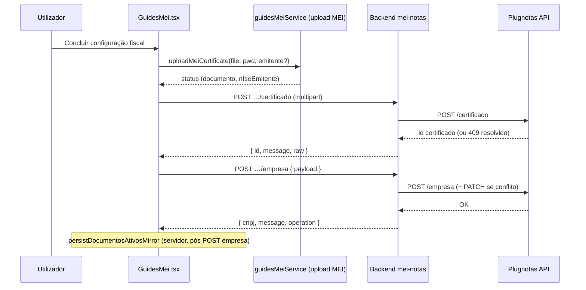

# Arquitetura técnica — **Empresa Plugnotas orquestrada** no cadastro de certificado

**Versão:** 1.0  
**Data:** 2026-04-07  
**Autoria:** Aria (architect / AIOX)  
**Requisitos de origem:** [`docs/prd/PRD-empresa-plugnotas-orquestrada-cadastro-certificado-2026-04-07.md`](../prd/PRD-empresa-plugnotas-orquestrada-cadastro-certificado-2026-04-07.md)  
**UX de origem:** [`docs/specs/ux-spec-empresa-plugnotas-orquestrada-cadastro-certificado-2026-04-07.md`](../specs/ux-spec-empresa-plugnotas-orquestrada-cadastro-certificado-2026-04-07.md)

Este documento fixa **fronteiras**, **estado actual do brownfield**, **lacunas face ao PRD/UX** e **decisões técnicas** para **FR-ORQ-CERT-***, **NFR-ORQ-CERT-*** e **CR-ORQ-CERT-***. Não substitui story, testes nem contrato fino com o Plugnotas.

---

## 1. Visão de contexto



**Princípio:** o **marco de utilizador** é uma intenção; a **execução** permanece **duas operações HTTP** no MVP (PRD §6.5), sobre rotas **existentes** (**CR-ORQ-CERT-01**). O Plugnotas continua com recursos `/certificado` e `/empresa` separados.

---

## 2. Estado actual do código (brownfield)

### 2.1 Frontend — `GuidesMei.tsx`

O handler `handleCertificateUpload` (por volta das linhas 1341–1497) **já encadeia**:

1. Validação local: ficheiro, senha, `getNfEmissionCompanyValidationMessage`, `getDocumentosAtivosValidationMessage` (quando `canViewNfse`).  
2. `uploadMeiCertificate` — persistência MEI / Supabase (domínio separado do Plugnotas).  
3. `cadastrarCertificadoEmissaoNf` → lê `certificateResponse.id`.  
4. `buildNfEmissionEmpresaPayload({ cnpj, certificadoId, form, documentosAtivos })` → `cadastrarEmpresaEmissaoNf(companyPayload)`.

**Conclusão:** a **orquestração funcional** P0 (certificado → empresa) **já existe** para utilizadores com `canViewNfse`. O trabalho arquitetural principal é **alinhar UX e resiliência** ao PRD, não inventar a sequência do zero.

### 2.2 Contratos de cliente (`meiNotasService.ts`)

| Tipo | Campos relevantes |
|------|-------------------|
| `CadastrarEmissaoNfCertificadoResponse` | `id: string \| null`, `message`, `raw` |
| `cadastrarEmpresaEmissaoNf` | Corpo `{ payload }` — igual ao fluxo manual |

**Extração do ID:** `String(certificateResponse.id \|\| '').trim()` — suficiente para **FR-ORQ-CERT-02** desde que o backend mantenha `sendSuccess(res, data)` com `data.id` estável (**CR-ORQ-CERT-02**).

### 2.3 Backend — rotas e handlers

| Rota | Handler | Notas |
|------|---------|--------|
| `POST /mei-notas/setup/emissao-fiscal/certificado` | `cadastrarPlugNotasCertificado` | Devolve `{ id, message, raw }`; 409 com resolução de ID no serviço. |
| `POST /mei-notas/setup/emissao-fiscal/empresa` | `cadastrarPlugNotasEmpresa` | Chama `cadastrarEmpresaPlugNotas` + `persistDocumentosAtivosMirrorAfterEmpresa`. |

**MVP:** nenhuma alteração obrigatória no backend para cumprir a sequência (PRD §5.1, §6.5).

### 2.4 Tratamento de erros hoje

- Um único `try/catch` envolve MEI + certificado + empresa.  
- Mensagem genérica quando `uploadedToMei === true` mas falha a seguir: *“Certificado enviado no MEI, mas falhou a configuração automática…”* — **não** distingue falha **só no Plugnotas certificado** vs **só na empresa**, nem oferece **retry só empresa** com `certificadoId` em memória (**lacuna vs FR-ORQ-CERT-05**).  
- **NFR-ORQ-CERT-02:** o cliente pode inferir a fase pelo *stack* de `await`, mas não há campo estável `phase` na resposta de erro do servidor para ambas as rotas.

---

## 3. Lacunas PRD/UX → engenharia

| Requisito | Situação actual | Direcção técnica |
|-----------|-----------------|------------------|
| **FR-ORQ-CERT-03** | Um flag `isUploadingCert` + texto *“Enviando e configurando…”* | Introduzir estado explícito de submissão (`idle` / `plugnotas_cert` / `plugnotas_empresa` / `retry_empresa`) e *live region* com copy por fase (spec UX §5.1). |
| **FR-ORQ-CERT-04** | Mensagem concatena várias frases + `MSG_SUCESSO_PATCH_…` | Unificar numa **única** string canónica (ou *toast* único) pós-sucesso, mantendo detalhe opcional colapsável se PO quiser. |
| **FR-ORQ-CERT-05** | Sem CTA *retry empresa*; sem guardar `certificadoId` para retry | Após sucesso de `cadastrarCertificadoEmissaoNf`, persistir `lastPlugnotasCertificadoId` em estado React até sucesso de empresa ou abandono; em falha na segunda chamada, mostrar UI E5 e chamar **apenas** `cadastrarEmpresaEmissaoNf`. |
| **FR-ORQ-CERT-06** | 409 já tratado no backend; sequência continua no mesmo `try` | Garantir que, após resposta 200 do certificado (incl. ramo recuperado), **não** se mostre copy “certificado criado” se `raw.recoveredFrom409` (alinhar copy com **PRD §6.4** — lógica condicional no cliente a partir de `certificateResponse.raw`). |
| **FR-ORQ-CERT-07** | `handleAtualizarCadastroEmissor` separado | Não fundir handlers; manter rotas `PATCH` independentes. |
| **NFR-ORQ-CERT-01** | Senha em estado React; certificado ID não em `localStorage` por omissão | Manter; **não** adicionar persistência de ID em armazenamento persistente no P0. |
| **NFR-ORQ-CERT-04** | Parcial | Adicionar `aria-busy` / `aria-live` conforme spec UX §6. |

---

## 4. Decisão arquitetural: camada de orquestração no cliente (MVP)

### 4.1 Extrair lógica de “setup Plugnotas” do handler monolítico

**Recomendação:** criar módulo puro ou *hook* `usePlugnotasEmitenteSetup` (nome final na story) em `frontend/src/` (ex.: `hooks/usePlugnotasEmitenteSetup.ts` ou `utils/plugnotasEmitenteSetup.ts`) que exporte:

```text
submitFullSetup(input) → Promise<FullSetupResult>
retryEmpresaRegistro() → Promise<...>  // usa lastCertificadoId + último payload empresa
```

**Responsabilidades:**

- Orquestrar `cadastrarCertificadoEmissaoNf` → `cadastrarEmpresaEmissaoNf`.  
- Emitir transições de fase para a UI (`onPhaseChange`).  
- Guardar `lastCertificadoId` e *snapshot* imutável do payload de empresa (ou parâmetros para `buildNfEmissionEmpresaPayload`) para **retry**.  
- **Não** incluir `uploadMeiCertificate` dentro deste módulo **ou** recebê-lo por injeção — evita acoplar MEI ao contrato Plugnotas; o `GuidesMei` permanece como compositor: primeiro MEI, depois `submitFullSetup`.

**Benefício:** testes unitários da máquina de estados sem montar `GuidesMei` inteiro; **CR-ORQ-CERT-01** preservado (serviços HTTP não mudam).

### 4.2 Composição no `GuidesMei.tsx`

```text
handleCertificateUpload:
  1) validações locais (PRD §6.1)
  2) uploadMeiCertificate (inalterado)
  3) await submitFullSetup({ file, password, cnpj, form, documentosAtivos })
  4) tratamento de sucesso (limpar ficheiro, mensagem única, invalidar caches)
```

**Erros:** o módulo de setup deve propagar erros com **metadado opcional** `{ phase: 'certificado' | 'empresa' }` (classe de erro local ou `cause`) para o *catch* do pai decidir copy e se mostrar retry.

---

## 5. Erros e observabilidade

### 5.1 MVP só frontend (**NFR-ORQ-CERT-02** — mínimo)

- **Custom error** `PlugnotasSetupError` (ou equivalente) com `{ phase, cause }`.  
- O `catch` em `GuidesMei` usa `phase === 'empresa'` **e** `lastCertificadoId` definido → UI **FR-ORQ-CERT-05**.

### 5.2 P1 opcional — eco do servidor

Estender o objecto `errors` JSON (terceiro argumento de `sendError` / `badRequest`) com chave estável:

```json
{ "orchestrationPhase": "certificado" }
```

ou reutilizar prefixo em `plugnotasCode` (ex.: `empresa_*` vs `certificado_*`) **já parcialmente** existente. **Requisito:** documentar no `apiClientError` / `getPlugnotasCodeFromApiErrors` se novos códigos forem adicionados.

### 5.3 Logs servidor (sem PII excessivo)

Manter `[plugnotas] METHOD path` existente; P1: correlacionar com `X-Request-Id` se middleware existir.

---

## 6. Endpoint composto (P1 — PRD §5.3)

**Nome candidato:** `POST /mei-notas/setup/emissao-fiscal/emitente`

**Corpo:** `multipart/form-data` (certificado + senha + campos de emitente em JSON serializado **ou** campos *flat* — decisão na story; preferir **um** campo `payload` JSON + ficheiro para espelhar validação actual).

**Handler:** servidor executa `cadastrarCertificadoPlugNotas` → `cadastrarEmpresaPlugNotas` → *mirror*; devolve `{ certificado: { id }, empresa: { cnpj, operation } }` e **um** código de erro com fase se falhar a meio.

**Quando adoptar:** mobile nativo, reduzir *round-trips*, ou exigência forte de telemetria única por submissão. **Não** remover rotas antigas (**CR-ORQ-CERT-01**).

---

## 7. Segurança e dados sensíveis (**NFR-ORQ-CERT-01**)

| Dado | Armazenamento P0 |
|------|------------------|
| Senha `.pfx` | Só em estado React durante o fluxo; limpar após sucesso como hoje. |
| `certificadoId` | `useState` / `useRef` na sessão do ecrã; limpar ao sucesso completo ou ao “abandonar” explícito. |
| Payload empresa | Reconstruído de `nfEmissionCompanyForm` no retry — evita duplicar grande JSON em *ref* salvo que desvie do formulário editado. **Excepção:** se o utilizador editar o formulário após falha, retry deve usar **valores actuais** do form (recomendado) — documentar na story. |

---

## 8. Integração com documentos ativos e espelho Supabase

- `buildNfEmissionEmpresaPayload` já deve incluir `documentosAtivos` quando a UI os expuser (**FR-ORQ-CERT-08**).  
- **Persistência:** continua **só** no servidor (`persistDocumentosAtivosMirrorAfterEmpresa`) — sem mudança arquitectural.  
- Ver [`docs/technical/architecture-cadastro-empresa-documentos-ativos-plugnotas-2026-04-07.md`](architecture-cadastro-empresa-documentos-ativos-plugnotas-2026-04-07.md) e [`docs/technical/architecture-atualizacao-posterior-documentos-ativos-plugnotas-supabase-2026-04-07.md`](architecture-atualizacao-posterior-documentos-ativos-plugnotas-supabase-2026-04-07.md) para evoluções da policy `nfe`/`nfce`/`nfse`.

---

## 9. Testes recomendados

| Camada | Foco |
|--------|------|
| **Unit** | Máquina `submitFullSetup` / retry com *mocks* de `cadastrarCertificadoEmissaoNf` e `cadastrarEmpresaEmissaoNf`. |
| **Componente** | Estados E1–E6 (spec UX §4.1) com RTL: *live region*, botão *busy*, CTA retry. |
| **Integração** | Já existente em `GuidesMei.certificate-connectivity.test.tsx` — estender com falha simulada na segunda chamada e *assert* de retry só empresa. |
| **Backend** | Sem novos testes obrigatórios no MVP; P1 endpoint composto exige testes HTTP em `backend/tests/`. |

---

## 10. Critérios de aceite arquitecturais

- [ ] Rotas `POST …/certificado` e `POST …/empresa` permanecem funcionais isoladamente (**CR-ORQ-CERT-01**).  
- [ ] Resposta de certificado mantém `data.id` para cliente (**CR-ORQ-CERT-02**).  
- [ ] Fluxo `PATCH` consulta/atualização não partilha estado com o *retry empresa* (**CR-ORQ-CERT-04**).  
- [ ] UI distingue fases e suporta retry empresa sem novo ficheiro quando ID conhecido (**FR-ORQ-CERT-03**, **FR-ORQ-CERT-05**).  
- [ ] Documentação `operacao-mei-nfse.md` actualizada se novos códigos de erro ou fluxo forem expostos ao utilizador.

---

## 11. Ficheiros prováveis (file list — proposta)

| Área | Ficheiros |
|------|-----------|
| **Novo** | `frontend/src/utils/plugnotasEmitenteSetup.ts` (ou `hooks/usePlugnotasEmitenteSetup.ts`), testes espelhados. |
| **Alterado** | `frontend/src/pages/GuidesMei.tsx` — composição, estados de fase, UI retry. |
| **Opcional** | `frontend/src/lib/fiscalUserError.ts` — mapeamento de copy para erro fase 2. |
| **P1 BE** | `backend/src/routes/mei-notas.routes.js`, `mei-notas.controller.js`, novo serviço fino `plugnotas-emitente-setup.service.js`. |

---

## 12. Change log

| Versão | Data | Autor | Notas |
|--------|------|-------|-------|
| 1.0 | 2026-04-07 | Aria | Versão inicial; alinhada ao código actual `GuidesMei` + PRD ORQ-CERT + spec UX. |

---

*Handoff: **@dev** — implementar secções 3–4; **@qa** — secção 9; **@pm** — fechar se P1 endpoint composto entra no scope da sprint.*
