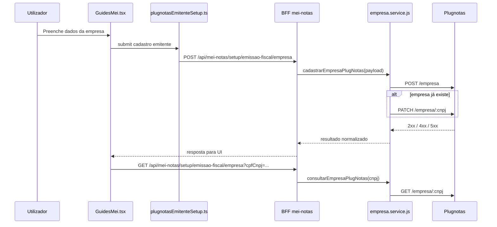

# Arquitetura técnica — fix cadastro de empresa Plugnotas no endpoint canónico `POST /empresa`

**Versão:** 1.0  
**Data:** 2026-04-09  
**Autoria:** Aria (architect / AIOX)  
**Requisitos de origem:** [docs/prd/PRD-fix-cadastro-empresa-plugnotas-endpoint-canonico-2026-04-09.md](../prd/PRD-fix-cadastro-empresa-plugnotas-endpoint-canonico-2026-04-09.md)  
**UX de origem:** [docs/specs/ux-spec-fix-cadastro-empresa-plugnotas-endpoint-canonico-2026-04-09.md](../specs/ux-spec-fix-cadastro-empresa-plugnotas-endpoint-canonico-2026-04-09.md)

Este documento fixa a arquitetura técnica brownfield para a correção do cadastro de empresa Plugnotas no fluxo Guia MEI. O objetivo não é criar novo fluxo de cadastro, mas consolidar tecnicamente o desenho correto já validado: **frontend → BFF → Plugnotas `POST /empresa`**, com fallback `PATCH` e leitura coerente do `GET` posterior.

---

## 1. Decisão arquitetural

**Decisão principal:** manter a arquitetura atual baseada em **frontend orquestrador + BFF + serviço Plugnotas server-side**, usando **`POST /empresa`** como endpoint upstream canónico para cadastro de empresa.

### 1.1 Invariantes

- O frontend continua chamando apenas o BFF.
- O BFF continua como única fronteira com o Plugnotas.
- O backend continua responsável por:
  - `base URL`
  - `path prefix`
  - `x-api-key`
  - normalização do payload
  - fallback `POST` → `PATCH`
  - classificação dos erros upstream
- O `GET` posterior continua sendo interpretado à luz do resultado anterior do `POST`.

### 1.2 Não decisões

- Não criar nova rota visual “addCompany”.
- Não permitir browser → Plugnotas.
- Não mover regras de integração do backend para o frontend.
- Não tratar toda falha como se fosse apenas “rota errada”.

---

## 2. Contexto do sistema

---

## 3. Fronteiras por camada

| Camada | Responsabilidade |
|--------|------------------|
| `frontend/src/pages/GuidesMei.tsx` | capturar intenção do utilizador, exibir estado, erro e sucesso |
| `frontend/src/utils/plugnotasEmitenteSetup.ts` | orquestrar a jornada do emitente no cliente |
| `frontend/src/services/meiNotasService.ts` | contrato HTTP frontend → BFF |
| `backend/src/controllers/mei-notas.controller.js` | borda autenticada do BFF |
| `backend/src/services/plugnotas/empresa.service.js` | integração Plugnotas, normalização, fallback, mapeamento de erro |
| Plugnotas | fonte externa de verdade para cadastro/consulta da empresa |

**Princípio de anticorrupção:**  
O frontend conhece a tarefa de negócio; o backend conhece o contrato externo. Host, token, prefixo, fallback e parsing da resposta do provedor não devem vazar para a UI.

---

## 4. Contrato técnico das rotas

### 4.1 Fronteira frontend → BFF

- `POST /api/mei-notas/setup/emissao-fiscal/empresa`
  - objetivo: cadastrar/sincronizar empresa no emissor
- `PATCH /api/mei-notas/setup/emissao-fiscal/empresa`
  - objetivo: atualizar empresa já existente quando aplicável
- `GET /api/mei-notas/setup/emissao-fiscal/empresa?cpfCnpj=...`
  - objetivo: consultar empresa no emissor

### 4.2 Fronteira BFF → Plugnotas

- `POST /empresa`
  - operação principal de cadastro
- `PATCH /empresa/:cnpj`
  - fallback de atualização quando houver conflito/empresa existente
- `GET /empresa/:cnpj`
  - consulta de presença da empresa

---

## 5. Configuração e resolução de endpoint

### 5.1 Fonte de verdade

O endpoint final Plugnotas é derivado de:

- `PLUGNOTAS_API_BASE_URL`
- `PLUGNOTAS_API_PATH_PREFIX`
- path lógico da operação (`/empresa`)

### 5.2 Regra arquitetural

O sistema deve compor o endpoint upstream como:

`<PLUGNOTAS_API_BASE_URL><PLUGNOTAS_API_PATH_PREFIX>/empresa`

onde:

- `PLUGNOTAS_API_BASE_URL` define o ambiente real;
- `PLUGNOTAS_API_PATH_PREFIX` é opcional e não deve contradizer a documentação pública;
- o path funcional da operação continua sendo `POST /empresa`.

### 5.3 Risco principal

Se `base URL` e token pertencerem a ambientes diferentes, ou se o prefixo estiver incorreto, o sistema pode parecer “apontar para a rota errada” mesmo quando o path lógico `/empresa` está correto.

---

## 6. Fluxo de erro e classificação

### 6.1 Classe A — ambiente/configuração

Sinais típicos:

- upstream/gateway;
- indisponibilidade do provedor;
- inconsistência sandbox/produção;
- prefixo/host incompatível.

**Resposta arquitetural:**  
o backend preserva metadados suficientes para a UI classificar o incidente como integração/ambiente, sem expor segredo nem detalhes brutos desnecessários.

### 6.2 Classe B — payload/contrato

Sinais típicos:

- validação do JSON de empresa;
- obrigatoriedade de campos;
- regras municipais/contratuais;
- falhas de shape do payload.

**Resposta arquitetural:**  
o backend continua sendo a camada que recebe a resposta do Plugnotas, normaliza a mensagem e a propaga para a UI.

### 6.3 Consulta posterior

Se o `POST` falhou e depois o `GET` retorna ausência:

- isso deve ser interpretado como **efeito de persistência não concluída**;
- não como evidência de rota de consulta errada.

---

## 7. Política de fallback

### 7.1 Regra

`cadastrarEmpresaPlugNotas(...)` continua sendo a política principal:

1. tentar `POST /empresa`;
2. se a resposta indicar conflito/empresa já existente, tentar `PATCH /empresa/:cnpj`;
3. devolver sucesso operacional coerente quando a atualização resolver o caso.

### 7.2 Motivação

Essa política:

- preserva o contrato canónico do Plugnotas;
- evita expor ao utilizador um “segundo fluxo” manual;
- mantém a UI com narrativa única de cadastro/sincronização.

---

## 8. Observabilidade mínima

### 8.1 Backend

Manter:

- `method`
- `path`
- `status`
- `plugnotasCode` quando houver
- mensagens redigidas

### 8.2 Frontend

Manter separação entre:

- erro de integração/ambiente;
- erro de dados/payload;
- ausência de empresa após falha anterior de cadastro.

### 8.3 Regra de privacidade

Não registrar:

- token Plugnotas;
- payload completo sensível;
- credenciais municipais;
- certificado ou dados secretos em claro.

---

## 9. Segurança

- Segredos Plugnotas permanecem apenas no backend.
- O navegador nunca recebe credenciais de integração do provedor.
- O backend centraliza políticas de normalização e acesso ao provedor.
- A UI consome apenas resultados normalizados do BFF.

---

## 10. Mapeamento PRD → arquitetura

| ID | Resposta arquitetural |
|----|------------------------|
| **FR-ENDP-01** | `empresa.service.js` mantém `POST /empresa` como operação principal |
| **FR-ENDP-02** | frontend permanece restrito ao BFF |
| **FR-ENDP-03** | resolução do endpoint concentrada em config backend |
| **FR-ENDP-04** | classificação técnica entre ambiente/configuração e payload |
| **FR-ENDP-05** | fallback `POST` → `PATCH` encapsulado no backend |
| **FR-ENDP-06** | `GET` interpretado em continuidade com o resultado do cadastro |
| **NFR-ENDP-01** | nenhum segredo Plugnotas no browser |
| **NFR-ENDP-02** | logs redigidos |
| **NFR-ENDP-03** | preservação do BFF |
| **NFR-ENDP-04** | coerência entre ambientes e validação local/teste |

---

## 11. Critérios de aceite arquiteturais

- [ ] A arquitetura documenta `POST /empresa` como endpoint upstream canónico.
- [ ] A arquitetura documenta o BFF como única fronteira externa.
- [ ] A arquitetura define a composição `base URL + prefix + /empresa` sem ambiguidade.
- [ ] A arquitetura diferencia problema de configuração/ambiente de problema de payload.
- [ ] A arquitetura preserva o fallback `POST` → `PATCH`.
- [ ] A arquitetura preserva a causalidade entre falha no cadastro e consulta posterior.

---

## 12. Ficheiros de referência

| Área | Ficheiros |
|------|-----------|
| UI | `frontend/src/pages/GuidesMei.tsx` |
| Orquestração FE | `frontend/src/utils/plugnotasEmitenteSetup.ts` |
| Serviço FE → BFF | `frontend/src/services/meiNotasService.ts` |
| Controller BFF | `backend/src/controllers/mei-notas.controller.js` |
| Serviço Plugnotas | `backend/src/services/plugnotas/empresa.service.js` |
| Configuração | `backend/src/config/env.js` |

---

## 13. Change log

| Versão | Data | Alteração |
|--------|------|-----------|
| 1.0 | 2026-04-09 | Arquitetura inicial derivada do PRD e da spec UX do fix do endpoint canónico |

---

*Arquitetura brownfield para alinhamento técnico do cadastro de empresa Plugnotas no fluxo Guia MEI.*
