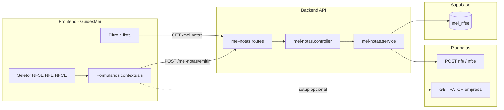

# Arquitetura técnica — Guia MEI: emissão NFS-e / NF-e / NFC-e (Plugnotas)

**Versão:** 1.0  
**Data:** 2026-04-06  
**Autoria:** Aria (architect / AIOX)  
**Requisitos de origem:** [`docs/prd/PRD-mei-emissao-nfe-nfce-plugnotas-guia-2026-04-06.md`](../prd/PRD-mei-emissao-nfe-nfce-plugnotas-guia-2026-04-06.md)  
**UX de origem:** [`docs/specs/ux-spec-guia-mei-emissao-nfe-nfce-2026-04-06.md`](../specs/ux-spec-guia-mei-emissao-nfe-nfce-2026-04-06.md)

Este documento fixa **fronteiras de sistema**, **contratos HTTP já existentes**, **lacunas brownfield** (cadastro empresa Plugnotas) e **recomendações de implementação**. Não substitui ADRs nem stories.

---

## 1. Visão de contexto

**Princípio:** a funcionalidade é **majoritariamente front-end + UX** sobre rotas **`mei-notas`** já implementadas; o risco arquitetural principal é a **política de empresa Plugnotas** (“apenas NFS-e”), documentada no ADR abaixo.

---

## 2. Rotas e autenticação (inalteradas na visão base)

| Rota | Método | Middleware | Função |
|------|--------|------------|--------|
| `/mei-notas/emitir` | POST | `requireAuth`, `requireMeiEnabled` | `emitirNota(userId, body)` |
| `/mei-notas` | GET | idem | `listarNotas` — query `documentType`, `includeArchived`, `limit` |
| `/mei-notas/setup/emissao-fiscal/empresa` | GET | idem | `consultarPlugNotasEmpresa` → Plugnotas `GET /empresa/:cnpj` |
| `/mei-notas/setup/emissao-fiscal/empresa` | POST/PATCH | idem | Cadastro/atualização empresa (normalização **apenas NFS-e** hoje) |
| `/mei-notas/setup/emissao-fiscal/certificado` | POST | idem | Certificado A1 |

**Prefixo real:** o frontend usa `apiClient` com base que já inclui `/api` ou equivalente — manter paridade com chamadas actuais em `meiNotasService.ts`.

**Segurança (NFR-GUIA-FISC-01):** sem novos endpoints públicos; `user_id` vem sempre de `req.user.id` no serviço.

---

## 3. Contrato de emissão — `POST /mei-notas/emitir`

### 3.1 Normalização de `documentType`

No serviço `mei-notas.service.js`, o tipo é normalizado para **`NFSE`**, **`NFE`**, **`NFCE`** (e `CTE` no conjunto suportado). O cliente deve enviar **`documentType`** coerente com a escolha do seletor UX (**FR-GUIA-FISC-04**).

### 3.2 Formas de corpo aceites (brownfield)

O `buildPayloadByDocumentType` aceita:

1. **Corpo com `payload` object** — preferido para NF-e/NFC-e:  
   `{ "documentType": "NFE" | "NFCE", "payload": { ... } }`  
   O objeto `payload` segue a forma validada por `validateNfeLikePayload` (emitente, destinatário, itens, modelo 55 ou 65 coerente com o tipo).

2. **Corpo “achatado”** — o serviço constrói o objecto interno via `buildNfeLikePayloadFromInput` quando **não** há `payload` aninhado: aceita aliases como `emitenteCpfCnpj`, `destinatarioCpfCnpj`, `tomadorCpfCnpj`, `itens`, etc. (útil para integrações legadas ou admin).

**Recomendação para o Guia MEI (novo UI):** usar **`documentType` + `payload`** alinhado ao tipo TypeScript `NfeLikePayloadInput` em `frontend/src/services/meiNotasService.ts`, chamando os helpers já existentes:

- `emitirNfe(payload)` → `{ documentType: 'NFE', payload }`
- `emitirNfce(payload)` → `{ documentType: 'NFCE', payload }`
- `emitirNfse(input)` → `{ documentType: 'NFSE', ...input }` (forma actual NFS-e)

Isto evita duplicar lógica de montagem e espelha os testes em `meiNotasService.test.ts`.

### 3.3 Validação servidor (fonte de verdade)

Para **NFE** / **NFCE**, após normalização do modelo (`55` vs `65`), aplicam-se as regras em `validateNfeLikePayload` (resumo para alinhamento UI ↔ API):

- Emitente: CNPJ 14 dígitos.  
- Destinatário: CPF/CNPJ válido + razão social.  
- `itens[]`: cada item com código, descrição, NCM (8), CFOP (4), unidade, quantidade &gt; 0, valor unitário &gt; 0, tributos ICMS (CST ou CSOSN), PIS CST, COFINS CST.

**Regra de modelo:** se o cliente enviar `modelo` explícito, tem de coincidir com o tipo; caso contrário o servidor preenche o default correcto.

### 3.4 Persistência e resposta

- O serviço grava em **`mei_nfse`** (nome histórico da tabela) com `document_type` normalizado.  
- A resposta segue o mesmo envelope de sucesso que hoje (`NfseRecord` no cliente TS — manter tipo ou renomear em story de refactors menores).

---

## 4. Listagem e filtros — `GET /mei-notas`

**Query suportada (já implementada):** `documentType=NFSE|NFE|NFCE`, `includeArchived`, `limit` (clamp no servidor).

**Implementação:** `mei-notas.controller.js` → `listarNotas` com `.eq('document_type', normalizeDocumentType(documentType))` quando o parâmetro existe.

**Implicação UX (FR-GUIA-FISC-05):** o filtro “Todas | NFS-e | NF-e | NFC-e” mapeia para:

- **Todas** — omitir `documentType` (ou valor acordado se o produto quiser filtro explícito no cliente).  
- **Por tipo** — `documentType=NFE`, etc.

**Nota:** `agregarLimiteFaturamento` continua a restringir a NFSE (e `null`) por regra de negócio MEI — **NFE/NFCE não entram no somatório de limite** salvo decisão futura explícita; não misturar na UI de limite sem PRD.

---

## 5. Integração Plugnotas — emissão

| Tipo | Serviço | Endpoint Plugnotas (via `requestJson`) |
|------|---------|----------------------------------------|
| NFE | `nfe.service.js` → `emitirNfe` | `POST /nfe` |
| NFCE | `nfce.service.js` → `emitirNfce` | `POST /nfce` |
| NFSE | `nfse.service.js` | fluxo existente |

O ramo em `emitirNota` escolhe o *adapter* pelo `documentType` normalizado — **sem novo serviço** para este epic.

---

## 6. Lacuna crítica: cadastro de empresa (“apenas NFS-e”)

### 6.1 Estado actual

O ADR [`docs/adr/ADR-plugnotas-empresa-payload-apenas-nfse.md`](../adr/ADR-plugnotas-empresa-payload-apenas-nfse.md) e `empresa.service.js` garantem:

- **POST** empresa: `nfe` e `nfce` enviados como **`{ ativo: false, tipoContrato: 0 }` sem `config`**.  
- **PATCH** empresa: se o corpo incluir chaves `nfe` / `nfce`, são **substituídas** pelos mesmos blocos inactivos (`applyEmpresaPlugnotasApenasNfseForPatch`).

**Consequência:** mesmo que a UI envie emissão correcta, o Plugnotas pode **rejeitar** ou não emitir NFE/NFC-e até a empresa ter **blocos activos e `config`** válidos no **lado Plugnotas** — típico CSC/ambiente NFC-e, dados SEFAZ, etc.

### 6.2 Direcções arquiteturais (escolher na story com PO)

| Opção | Descrição | Impacto em código |
|-------|-----------|---------------------|
| **A — Novo modo de PATCH** | Variável de ambiente ou *feature flag* que, quando activa, **não** aplica `applyEmpresaPlugnotasApenasNfseForPatch` para um *path* dedicado (ex.: `PATCH` com header ou rota `.../empresa/fiscal-completa`). | `empresa.service.js` + possivelmente rota dedicada no controller; **novo ADR** ou revisão do ADR actual. |
| **B — Payload condicional no PATCH existente** | Se o corpo contiver `nfce.config` / `nfe.config` válidos **e** flag de produto, aplicar *merge* real em vez de bloco inactivo. | Maior cuidado com NFR “não reactivar NFC-e legada” — exigir *opt-in* explícito no JSON. |
| **C — Sem alteração backend** | Utilizador habilita NFE/NFC-e **fora** da app (console Plugnotas/suporte); a app só **consulta** estado via `GET /empresa/:cnpj` e mostra *callout* UX. | Frontend + possivelmente mapeamento de erros Plugnotas na emissão; zero mudança em `applyEmpresaPlugnotasApenasNfseForPatch`. |

**Recomendação pragmática:** começar com **C** para *time-to-value* + *callout* **FR-GUIA-FISC-07**, e planear **A** ou **B** se o produto exigir *self-service* completo.

### 6.3 *Capability check* no frontend

**Fonte de dados:** `consultarEmpresaEmissaoNf(cnpj)` já devolve a resposta do Plugnotas (campo `raw` ou estrutura exposta pelo backend — validar tipo `ConsultarEmissaoNfEmpresaResponse` no frontend).

**Heurística sugerida (implementação):** interpretar `raw.nfe?.ativo`, `raw.nfce?.ativo` (ou caminhos documentados após inspecção real do JSON Plugnotas) para:

- Mostrar / ocultar bloqueio na UX spec §9.  
- **Não** substituir validação na emissão: o servidor e o Plugnotas continuam autoritários.

Se a forma do JSON variar por ambiente, encapsular num utilitário `parsePlugnotasEmpresaCapabilities(response)`.

---

## 7. Front-end — fronteiras de componentes

Alinhado à UX spec §12 e ao risco de tamanho de `GuidesMei.tsx`:

| Módulo sugerido | Responsabilidade |
|-----------------|------------------|
| `MeiFiscalDocumentTypeSegmented` | Estado controlado `DocumentType`, a11y radiogroup, eventos `onChange`. |
| `MeiNfeLikeEmitForm` | Montagem de `NfeLikePayloadInput`, validação espelhada ao servidor, linhas de item. |
| `MeiNfseEmitSection` | Extrair blocos actuais NFS-e sem alterar comportamento (**CR-GUIA-FISC-01**). |
| `MeiFiscalNotesToolbar` | Filtro `ListarNotasInput` → `buildListSuffix`. |
| `useMeiPlugnotasFiscalCapability` (*hook*) | `consultarEmpresaEmissaoNf` + parsing para NFE/NFCE disponíveis. |

**Estado:** manter **um** estado de formulário por “modo” (NFSE vs NFE/NFCE) ou resetar ao mudar tipo conforme UX spec §5 — evitar *single* objeto com campos de ambos simultaneamente preenchidos.

---

## 8. Catálogos (`mei_nfse_clientes` / produtos)

- Listagens actuais filtram por `document_type` na tabela; default **NFSE**.  
- **Reutilizar clientes para destinatário NFE/NFC-e** implica ou **registos duplicados** por tipo ou **extensão do modelo** para aceitar NFE/NFCE no mesmo catálogo — decisão de **@data-engineer** / story **FR-GUIA-FISC-09** / **CR-GUIA-FISC-04**.  
- Arquitectura de aplicação: qualquer reutilização passa pelas rotas existentes `GET /mei-notas/catalogo/clientes` com `documentType` query.

---

## 9. Webhooks e pós-emissão

Sem alteração arquitetural prevista: webhooks Plugnotas continuam a actualizar registos por `plugnotas_id` / `id_integracao`. Garantir que `document_type` na linha permanece **NFE** / **NFCE** após *sync* (já suportado pelo modelo).

---

## 10. Observabilidade e erros

- Manter *logging* existente em `mei-notas` e flags `PLUGNOTAS_DEBUG`.  
- Erros ao utilizador: continuar a usar `formatPlugnotasIntegrationError` / códigos (`getPlugnotasCodeFromUnknownError`) no frontend; prefixar mensagem com o tipo de documento activo no *store* local (**FR-GUIA-FISC-06**).

---

## 11. Mapeamento PRD / UX → decisões técnicas

| ID | Decisão técnica |
|----|-----------------|
| **FR-GUIA-FISC-01–04** | Seletor + `emitirNfe` / `emitirNfce` / `emitirNfse` com `documentType` + `payload` coerente. |
| **FR-GUIA-FISC-05** | `listarNotas({ documentType })` — sem mudança de rota. |
| **FR-GUIA-FISC-07** | §6 deste doc + *hook* de consulta empresa; possível evolução PATCH/ADR. |
| **NFR-GUIA-FISC-02** | Validação cliente como *early feedback*; servidor permanece fonte de verdade. |
| **CR-GUIA-FISC-03** | Qualquer novo caminho PATCH empresa deve ser **aditivo** e documentado (revisão ADR). |

---

## 12. Checklist para a story / *dev*

- [ ] Confirmar formato exacto do JSON de `consultarEmpresaPlugNotas` em *staging* para `nfe`/`nfce`.  
- [ ] Testes: estender `meiNotasService.test.ts` / e2e smoke para fluxo NFE/NFC-e no Guia MEI.  
- [ ] Se optar por **A** ou **B** no §6.2: atualizar ADR, testes `plugnotas-empresa.test.js`, e `nfEmissionCompany.ts` (paridade frontend).  
- [ ] Gates: `npm run lint`, `typecheck`, `test` (`AGENTS.md`).

---

## 13. Change log

| Versão | Data | Notas |
|--------|------|--------|
| 1.0 | 2026-04-06 | Versão inicial (PRD + UX spec + código `mei-notas` / Plugnotas empresa). |

---

*Próximo passo AIOX: **@sm** — story com *file list* referenciando este doc; **@dev** — implementação; revisão de ADR se PO fechar opção **A** ou **B** em §6.2.*

— Aria, arquitetando o futuro 🏗️
