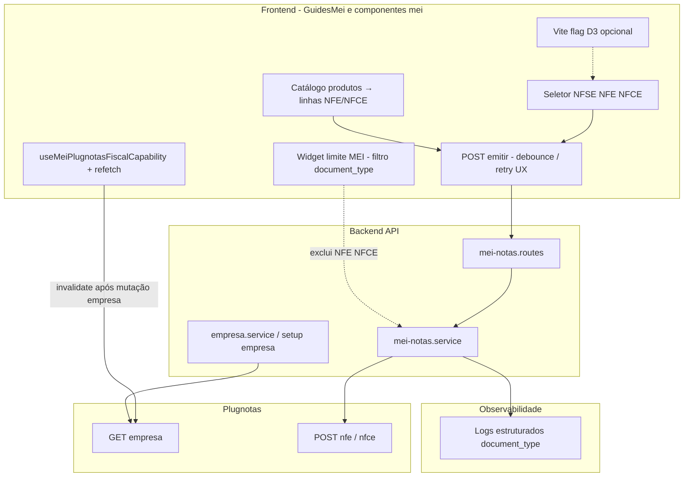

# Arquitetura técnica — Guia MEI: incrementos **pós-brainstorm** (capacidade, catálogo, confiabilidade, limite, pós-emissão)

**Versão:** 1.0  
**Data:** 2026-04-16  
**Autoria:** Aria (architect / AIOX)  
**Requisitos de origem:** [`docs/prd/PRD-implementacao-nfe-nfce-pos-brainstorm-2026-04-16.md`](../prd/PRD-implementacao-nfe-nfce-pos-brainstorm-2026-04-16.md)  
**UX de origem:** [`docs/specs/ux-spec-guia-mei-nfe-nfce-pos-brainstorm-2026-04-16.md`](../specs/ux-spec-guia-mei-nfe-nfce-pos-brainstorm-2026-04-16.md)

**Baseline (não revogado):** [`docs/technical/architecture-mei-emissao-nfe-nfce-guia-2026-04-06.md`](architecture-mei-emissao-nfe-nfce-guia-2026-04-06.md) — rotas `mei-notas`, validação, Plugnotas `POST /nfe` e `POST /nfce`, listagem, lacuna empresa “apenas NFS-e”.  
**ADR:** [`docs/technical/adr-empresa-plugnotas-nfe-nfce-d1-2026-04-07.md`](adr-empresa-plugnotas-nfe-nfce-d1-2026-04-07.md) (**D1**); evolução **D2** conforme §6 abaixo.

Este documento fixa **decisões técnicas incrementais** para **FR-GUIA-FISC-11** a **17** e **NFR-POST-01** a **03**. Não substitui ADRs nem stories.

---

## 1. Visão de contexto (extensão ao diagrama baseline)

**Princípio:** continuar a **orquestrar** sobre as rotas existentes; novos comportamentos são **aditivos** (refetch, mapeamento de dados, política de retry, métricas).

---

## 2. FR-GUIA-FISC-11 — Sincronização da capacidade fiscal após cadastro

### 2.1 Estado actual

O hook [`frontend/src/hooks/useMeiPlugnotasFiscalCapability.ts`](../../frontend/src/hooks/useMeiPlugnotasFiscalCapability.ts) dispara `consultarEmpresaEmissaoNf` apenas quando mudam `cnpjDigits`, `emissionDocumentType` ou `fetchEnabled`. **Não** reexecuta após **PATCH/POST** de empresa ou certificado concluídos no mesmo ecrã.

### 2.2 Direcção técnica recomendada

| Opção | Descrição | Preferência |
|-------|-----------|-------------|
| **A — Chave de invalidação** | Adicionar ao hook um parâmetro **`capabilityRefetchKey: number`** (ou `refetchToken`) incrementado pelo pai quando `onEmpresaSaved` / `onCertificadoUploaded` / fluxo equivalente resolver com sucesso. O `useEffect` do hook inclui esta dependência. | **P0** — mínima superfície, explícita na `GuidesMei.tsx`. |
| **B — Query library** | Migrar a consulta para TanStack Query (ou equivalente já no repo) com **`queryKey`** `['mei-plugnotas-capability', cnpj, documentType]` e **`invalidateQueries`** após mutações. | Só se o projeto já standardizar *data fetching* assim. |
| **C — Evento global** | *Bus* de eventos no cliente — evitar salvo padrão existente. | Não recomendado como default. |

**Contrato HTTP:** inalterado — continua **`GET …/mei-notas/setup/emissao-fiscal/empresa`** (ou função `consultarEmpresaEmissaoNf` no cliente que o encapsula).

**Backend:** sem novo endpoint obrigatório; garantir que o GET devolve estado **após** o backend ter persistido/sincronizado com Plugnotas (se a mutação for assíncrona, a story deve definir *polling* ou espera — fora do mínimo FR-11 se GET já for consistente).

---

## 3. FR-GUIA-FISC-12 — Catálogo de produtos → linhas NF-e / NFC-e

### 3.1 Fronteiras

- **Leitura:** reutilizar rotas de catálogo já expostas para MEI (ex.: listagem de produtos com `documentType` / contexto NFS-e conforme [`docs/technical/catalogo-mei-persistencia-e-api-2026-03-30.md`](catalogo-mei-persistencia-e-api-2026-03-30.md) e implementação em `mei-notas` *catalog*).  
- **Mapeamento:** função pura no cliente (ex. `mapCatalogProdutoToNfeItemRow`) que converte registo de catálogo → campos exigidos por `validateNfeLikePayload` (código, descrição, NCM, CFOP, unidade, quantidade default, tributos default ou vazios com validação na UI).

### 3.2 Regras

- **NFS-e:** fluxos existentes do catálogo **não** devem passar a exigir campos de produto; seleccionar produto só em modo **NFE** / **NFCE** na emissão.  
- **Fonte de verdade:** validação permanece no servidor ao *emitir*; o mapeamento cliente é *conveniência*.

### 3.3 Onde implementar

- Componente de itens (extraído ou em `GuidesMei.tsx`) chama modal/lista já usada por [`MeiCatalogoProdutoModal.tsx`](../../frontend/src/components/MeiCatalogoProdutoModal.tsx) ou endpoint equivalente, filtrando itens **compatíveis** com nota de produto (definir critério na story: coluna `document_type` / tipo de catálogo).

---

## 4. FR-GUIA-FISC-13 — `idIntegração` e retry (sem fila obrigatória)

### 4.1 Servidor (fonte de verdade)

Em [`mei-notas.service.js`](../../backend/src/services/mei-notas.service.js), `emitirNota` já define `payload.idIntegracao = mei-${userId}-${Date.now()}` quando ausente — **um id novo por pedido HTTP**.

### 4.2 Cliente

- **Não** reutilizar o mesmo `idIntegracao` em “retry” manual: cada novo `POST /emitir` deve ser tratado como **nova tentativa**; o servidor gera novo id.  
- **Anti-duplicação UX:** *debouncing* do botão Emitir (*pending* state) até resposta; alinha à UX spec §5.  
- **Retry transitório:** se a story listar códigos HTTP / mensagens Plugnotas *retryable*, o cliente pode repetir **um** `POST` com o **mesmo** corpo de negócio — o servidor gera **novo** `idIntegracao`, o que é **correcto** para evitar colisão no integrador.

### 4.3 Backend opcional

- Classificar erros na resposta (`retryable: boolean`) — **opcional**; senão, tabela acordada na story (ex.: 5xx e timeouts = retry; 4xx validação = não retry).

**Proibido neste incremento (PRD):** fila obrigatória ou worker sem ADR.

---

## 5. FR-GUIA-FISC-14 — D2 (habilitação guiada no Plugnotas)

### 5.1 Dependência de produto e ADR

- **D1** mantém-se: consulta + bloqueio honesto.  
- **D2** implica alterar a política actual de `applyEmpresaPlugnotasApenasNfseForPatch` em [`empresa.service.js`](../../backend/src/services/plugnotas/empresa.service.js) — rever opções **A / B / C** em [architecture baseline §6.2](architecture-mei-emissao-nfe-nfce-guia-2026-04-06.md#62-direcções-arquitecturais-escolher-na-story-com-po) e **novo ADR** ou revisão do ADR de empresa.

### 5.2 Superfície API (padrão)

- **Preferência:** **rota dedicada** ou sub-recurso explícito (ex. `PATCH …/setup/emissao-fiscal/empresa/modalidades`) com corpo validado e *feature flag* servidor, em vez de alterar silenciosamente o PATCH genérico.  
- **Segurança:** mesmo middleware `requireAuth` + `requireMeiEnabled`; validação de schema *strict* dos blocos `nfe`/`nfce` enviados ao Plugnotas.

### 5.3 Frontend

- *Wizard* chama o endpoint após checklist; em sucesso, incrementa **`capabilityRefetchKey`** (§2.2).

---

## 6. FR-GUIA-FISC-15 — Pós-emissão (ondas)

### 6.1 Já existente no serviço

`mei-notas.service.js` referencia `consultarPorIntegracao`, `downloadPdfPorIntegracao`, `downloadXmlPorIntegracao` e `refreshWithPlugNotas` — **capacidade parcial** para sincronizar / descarregar conforme *adapters* NFe/NFCe/NFSe.

### 6.2 Expor na API (a fechar na story)

| Capacidade | Mecânismo provável | Nota |
|------------|-------------------|------|
| Refrescar status | `POST` ou `GET` por `id` de registo que invoca *refresh* já existente | Evitar expor credenciais Plugnotas ao cliente. |
| PDF / XML | Rotas autenticadas que *stream* ficheiro ou URL assinada | Já há campos `pdf_url` / `xml_url` na listagem — validar se são preenchidos por webhook vs download *on-demand*. |

**Primeira onda:** uma única capacidade (ex.: *refresh* de status) para reduzir superfície; restante em épico filho.

---

## 7. FR-GUIA-FISC-16 — Feature flag D3

### 7.1 Implementação recomendada

- **Cliente:** variável `import.meta.env.VITE_MEI_NFE_NFCE_EMIT_ENABLED` (nome exacto na story) — quando `false` / indefinido, o *segmented control* mostra apenas **NFS-e** (ou esconde segmentos NF-e/NFC-e).  
- **Servidor (opcional):** se o produto exigir *defence in depth*, `emitir` rejeita `NFE`/`NFCE` com **403** quando flag *off* — alinhar com PO (pode ser overkill se só há UI pública).

### 7.2 Documentação

- Variável listada em `.env.example` e na story; sem *secrets*.

---

## 8. FR-GUIA-FISC-17 — Limite MEI (exclusão NFE / NFCE)

### 8.1 Backend

- Manter [`agregarLimiteFaturamento`](../../backend/src/services/mei-notas.service.js) (ou função equivalente) **restringindo** o somatório a **`NFSE`** (e `null` se aplicável), conforme nota já presente no [architecture baseline §4](architecture-mei-emissao-nfe-nfce-guia-2026-04-06.md#4-listagem-e-filtros--get-mei-notas).  
- **Não** incluir `NFE` / `NFCE` até PRD futuro explícito.

### 8.2 Frontend

- Qualquer *widget* que calcule limite a partir da lista de notas deve filtrar por `document_type === 'NFSE'` (ou usar endpoint que já devolve agregado correcto).  
- Evitar duplicar lógica: preferir **uma** função utilitária `isDocumentTypeMeiLimiteRelevante(docType)`.

---

## 9. NFR-POST-01 — Observabilidade

### 9.1 Backend

- Logs estruturados em `emitirNota` com campos **não-PII:** `document_type`, `duration_ms`, `outcome` (*success* / *validation_error* / *plugnotas_error*), código Plugnotas quando existir.  
- **Não** logar CPF/CNPJ completos nem payload integral em nível `info` em produção (**NFR-POST-02**).

### 9.2 Frontend

- Eventos analíticos (se existirem): apenas tipo agregado e resultado; ver UX spec §10.

### 9.3 Métricas

- Se o stack suportar contadores (Prometheus, etc.), *labels* limitados a `document_type` e `route` — sem `user_id` em *labels* públicos.

---

## 10. Segurança e autenticação (inalterado)

- Todas as rotas referidas mantêm `requireAuth` + `requireMeiEnabled` onde já aplicável.  
- Novas rotas D2 / pós-emissão seguem o mesmo padrão.

---

## 11. Mapeamento FR / NFR → componentes e módulos

| ID | Módulo / ficheiro provável (brownfield) |
|----|----------------------------------------|
| **FR-GUIA-FISC-11** | `useMeiPlugnotasFiscalCapability.ts` + `GuidesMei.tsx` (handlers pós-save); opcionalmente `MeiFiscalCapabilityCallout.tsx` |
| **FR-GUIA-FISC-12** | Secção de itens NF-e/NFC-e + `MeiCatalogoProdutoModal.tsx` / serviço catálogo |
| **FR-GUIA-FISC-13** | Estado *pending* no submit em `GuidesMei` ou componente de emissão; `mei-notas.service.js` (já gera id) |
| **FR-GUIA-FISC-14** | `empresa.service.js`, `mei-notas.routes.js` / controller, novo fluxo UI |
| **FR-GUIA-FISC-15** | `mei-notas.service.js` (*refresh*/download), rotas novas finas |
| **FR-GUIA-FISC-16** | *Env* Vite + condicional no seletor |
| **FR-GUIA-FISC-17** | Função agregação limite + *widget* no Guia MEI |
| **NFR-POST-01** | *Middleware* ou *helpers* de log em `emitirNota` |

---

## 12. Riscos técnicos e mitigações

| Risco | Mitigação |
|-------|-----------|
| GET empresa *stale* imediatamente após PATCH | Retry leve (1×) no cliente após save ou pequeno *delay* antes do refetch — só se observado em *staging*. |
| D2 altera estado fiscal real | ADR + testes `plugnotas-empresa` + sandbox obrigatório antes de produção. |
| Dupla emissão por duplo clique | *Disabled* + *idempotency* mental via novo `idIntegracao` por request (servidor). |

---

## 13. Checklist para story / dev

- [ ] **FR-11:** `capabilityRefetchKey` (ou equivalente) ligado a mutações de empresa/certificado.  
- [ ] **FR-12:** mapeamento catálogo → item validado contra `validateNfeLikePayload` (teste unitário do mapper).  
- [ ] **FR-13:** contrato de retry documentado; sem reutilizar `idIntegracao` no cliente para “replays”.  
- [ ] **FR-17:** teste de regressão: limite não soma NFE/NFCE.  
- [ ] **NFR-POST-01:** amostra de log sem PII em *code review*.  
- [ ] Gates: `npm run lint`, `typecheck`, `test` (`AGENTS.md`).

---

## 14. Change log

| Versão | Data | Notas |
|--------|------|--------|
| 1.0 | 2026-04-16 | Versão inicial (PRD + UX pós-brainstorm + código `mei-notas` / hooks actuais). |

---

*Próximo passo AIOX: **@sm** — stories com *file list*; **@data-engineer** se o catálogo exigir colunas novas; **@dev** — implementação com gates.*

— Aria, arquitetando o futuro
