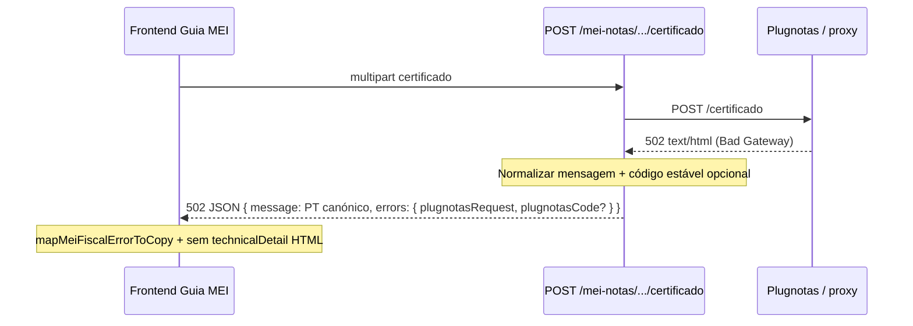

# Arquitetura técnica — **Gateway upstream (502/503/504) e HTML** no fluxo certificado Plugnotas

**Versão:** 1.0  
**Data:** 2026-04-08  
**Autoria:** Aria (architect / AIOX)  
**Requisitos de origem:** [`docs/prd/PRD-mei-plugnotas-certificado-gateway-upstream-502-2026-04-08.md`](../prd/PRD-mei-plugnotas-certificado-gateway-upstream-502-2026-04-08.md)  
**UX de origem:** [`docs/specs/ux-spec-mei-plugnotas-certificado-gateway-upstream-502-2026-04-08.md`](../specs/ux-spec-mei-plugnotas-certificado-gateway-upstream-502-2026-04-08.md)

Este documento fixa **fronteiras**, **fluxo de dados de erro**, **ponto único de normalização no backend**, **dupla defesa no frontend**, **contrato JSON opcional** e **testes**. Complementa [`architecture-empresa-plugnotas-orquestrada-cadastro-certificado-2026-04-07.md`](architecture-empresa-plugnotas-orquestrada-cadastro-certificado-2026-04-07.md) sem alterar o *happy path* multipart do `POST /certificado`.

---

## 1. Visão de contexto

### 1.1 Problema actual

Quando o upstream Plugnotas (ou proxy) responde com **502/503/504** e corpo **text/html** ou texto não JSON, `parseResponsePayload` em [`backend/src/services/plugnotas/empresa.service.js`](../../backend/src/services/plugnotas/empresa.service.js) devolve uma **string**. `messageFromPlugnotasPayload` propaga essa string integralmente; `requestFormData` lança `HttpError(status, message, plugnotasRequestErrors(…))`. O BFF serializa `message` no JSON de erro → o cliente exibe HTML e copia de “validação no provedor”.

### 1.2 Sequência alvo (erro gateway)

**Princípio (PRD §6.3):** o **BFF** é fonte de verdade para `message` legível; o **FE** mantém heurística defensiva (status + HTML) para respostas legadas ou *edge cases*.

---

## 2. Estado actual do código (brownfield)

| Camada | Ficheiro / símbolo | Comportamento relevante |
|--------|-------------------|-------------------------|
| Plugnotas HTTP | `empresa.service.js` — `parseResponsePayload` | JSON vs `response.text()` |
| Plugnotas HTTP | `empresa.service.js` — `messageFromPlugnotasPayload` | String passa íntegra; object usa `buildErrorMessageFromBody` |
| Plugnotas HTTP | `empresa.service.js` — `requestFormData` | `!response.ok` → `HttpError(response.status, message, …)` sem ramo especial 502–504 |
| Plugnotas HTTP | `empresa.service.js` — `requestJson` | Idem para `/empresa` e restantes paths |
| Erro HTTP | `utils/errors.js` — `HttpError` | `status`, `message`, `errors` (objeto livre) |
| Cliente API | `apiClient.ts` + tipos | Propaga `status` e corpo `message` / `errors` |
| Copy fiscal | `fiscalUserError.ts` — `mapMeiFiscalErrorToCopy` | Não distingue gateway vs validação por status 502–504 |
| UI | `meiFiscalUserCopyToUserFacing.ts` | Pode preencher `technicalDetail` com `raw` longo |
| UI | `FiscalIntegrationErrorAlert.tsx` | `LongFiscalErrorMessage`, rodapé genérico fiscal |

**Orquestração servidor** [`plugnotas-emitente-setup.service.js`](../../backend/src/services/plugnotas/plugnotas-emitente-setup.service.js): chama `cadastrarCertificadoPlugNotas` → qualquer `HttpError` do `requestFormData` sobe até o *controller*; a normalização em `empresa.service.js` **cobre** certificado directo e composite sem duplicar lógica no *controller*.

---

## 3. Decisões arquiteturais

### 3.1 Módulo de detecção e mensagem canónica (backend)

**Recomendação:** novo módulo pequeno e testável, por exemplo:

`backend/src/services/plugnotas/plugnotas-gateway-upstream-error.js`

Responsabilidades:

1. **`isLikelyGatewayHtmlBody(text, contentType)`** — heurística documentada no ficheiro:  
   - `content-type` contém `text/html`, **ou**  
   - string trimada começa por `<` **e** (opcional) contém marcadores `Bad Gateway`, `Gateway Timeout`, `503 Service`, `504`, `<title>`, consoante combinação acordada na story para minimizar falsos positivos (PRD §10).  
2. **`shouldNormalizePlugnotasGatewayError(status, payload, contentType)`** — verdadeiro se `status ∈ {502,503,504}` **ou** (`status` já indicador de falha upstream e `isLikelyGatewayHtmlBody(…)`).  
3. **`getPlugnotasGatewayUpstreamPublicMessage(status)`** — devolve string PT **única** alinhada ao PRD §6.1 / UX spec §4.2 (parametrização mínima por status se PO quiser três variantes; default: mesma mensagem para 502–504).  
4. **`getPlugnotasGatewayUpstreamCode(status)`** — devolve constantes estáveis: `plugnotas_gateway_502` | `_503` | `_504` (para **FR-MEI-CERT-GW-02**).

**Alternativa rejeitada para P0:** embutir 40+ linhas de heurística directamente em `requestFormData` — dificulta testes e reutilização em `requestJson`.

### 3.2 Integração em `requestFormData` e `requestJson`

Antes de `messageFromPlugnotasPayload` + `HttpError` nos ramos `!response.ok`:

1. Ler `contentType` de `response.headers.get('content-type')`.  
2. Se `shouldNormalizePlugnotasGatewayError(response.status, payload, contentType)`:  
   - `message = getPlugnotasGatewayUpstreamPublicMessage(response.status)`  
   - `extraErrors = { plugnotasCode: getPlugnotasGatewayUpstreamCode(response.status) }` (**P2** opcional; se omitido na v1, só FE por status)  
   - Fazer **merge** com `plugnotasRequestErrors(method, path)` existente (não quebrar clientes que já leem `errors.plugnotasRequest`).  
3. **Logging (NFR-GW-02):** manter log de `method`, `path` mascarado, `status`, `contentType`; **não** registar corpo HTML completo em `console.error` em produção — no máximo prefixo truncado (ex.: primeiros 80 caracteres) em `NODE_ENV !== 'production'` se necessário para debug.

**Âmbito PRD:** “chamadas relacionadas com **POST …/certificado** (e **helpers partilhados**)”. A integração nos dois transportes (`requestJson` + `requestFormData`) garante o mesmo comportamento para **empresa** e **certificado** quando o upstream devolver 502 HTML, sem exigir alteração por rota Express.

**Compatibilidade (CR-GW-02):** para `response.status === 400` com JSON Plugnotas, **não** invocar normalização gateway; mensagens actuais preservadas.

### 3.3 Contrato JSON para o cliente (opcional P2)

Estender `errors` devolvido pelo `HttpError` (serializado pelo *middleware* de erro da app) com:

| Chave | Tipo | Valor |
|-------|------|--------|
| `plugnotasCode` | string | `plugnotas_gateway_502` (etc.) |

O frontend já suporta `getPlugnotasCodeFromApiErrors` em [`plugnotasApiErrorCode.ts`](../../frontend/src/utils/plugnotasApiErrorCode.ts) — **reutilizar** este nome de campo (**NFR-GW-03** aditivo). Evitar introduzir `fiscalErrorCode` em paralelo sem migração; se o repo padronizar outro nome, uma única chave na resposta.

### 3.4 Frontend — classificação e UI

| Componente | Alteração |
|------------|-----------|
| **`fiscalUserError.ts`** | Função pura `isMeiFiscalGatewayUpstreamError({ status, rawMessage, plugnotasCode })` — `plugnotasCode` prefixo `plugnotas_gateway_` **ou** status 502–504 **ou** heurística HTML espelhada (defensiva). |
| **`mapMeiFiscalErrorToCopy`** | Ramo **antecipado** (antes de “validação no provedor”): devolver título + descrição UX spec §4.1–4.2; `href` para doc operacional quando existir env. |
| **`meiFiscalUserCopyToUserFacing.ts`** | Se classificação gateway: forçar `technicalDetail` ausente; considerar `embedRawAsTechnicalDetail: false` nos *call sites* do certificado quando o erro for gateway (ou centralizar dentro do mapeador via flag em `MeiFiscalUserCopy`). |
| **`FiscalIntegrationErrorAlert.tsx`** | Rodapé **condicional** (UX §4.3): não renderizar o parágrafo genérico sobre “validação de JSON / campos fiscais” quando `isMeiFiscalGatewayUpstreamError`. |
| **`plugnotasApiErrorCode.ts`** | Constantes exportadas `PLUGNOTAS_CODE_GATEWAY_502` etc. se P2; *type* *union* se aplicável. |

**Não** reutilizar `GUIMEI_CONNECTIVITY_CERTIFICATE_MESSAGE` para este caso (UX spec §6 — semântica diferente).

### 3.5 Rotas e *controllers*

**Sem** lógica nova obrigatória em `mei-notas.controller.js` se `cadastrarCertificadoPlugNotas` e `runPlugnotasEmitenteCompositeSetup` apenas propagam `HttpError` já normalizado.

---

## 4. Matriz de rastreabilidade PRD / UX → engenharia

| ID | Onde implementar |
|----|------------------|
| **FR-MEI-CERT-GW-01** | `plugnotas-gateway-upstream-error.js` + `requestFormData` / `requestJson` em `empresa.service.js` |
| **FR-MEI-CERT-GW-02** | Merge `errors.plugnotasCode` no `HttpError` do ramo gateway |
| **FR-UX-FISC-GW-01** | `mapMeiFiscalErrorToCopy` + constantes de copy |
| **FR-UX-FISC-GW-02** | `meiFiscalUserCopyToUserFacing` + evitar montar `LongFiscalErrorMessage` com HTML |
| **FR-UX-FISC-GW-03** | `FiscalIntegrationErrorAlert.tsx` (rodapé condicional) |
| **FR-UX-FISC-GW-04** | Opcional: link secundário; não partilhar *string* de conectividade local |
| **FR-GW-QA-01** | Testes unitários backend (módulo gateway) + frontend (`fiscalUserError.test` ou equivalente) |
| **NFR-DOC-MEI-01** | `docs/operacao-mei-nfse.md` (fora do âmbito estrito deste ficheiro de arquitetura) |
| **NFR-GW-02** | Política de log na integração §3.2 |
| **CR-GW-01** | Nenhuma alteração em respostas 2xx |
| **CR-GW-02** | Testes de regressão com *fixture* 400 JSON |
| **CR-GW-03** | Manter `source` / categoria fiscal na UI; só copy e detalhe |

---

## 5. Testes recomendados

| Nível | Caso |
|-------|------|
| Unitário (BE) | `shouldNormalize…` com payload string HTML 502, status 502, content-type `text/html` |
| Unitário (BE) | Status 502, corpo vazio → mensagem canónica |
| Unitário (BE) | Status 400, JSON `{ message: "…" }` → mensagem **não** substituída pela canónica gateway |
| Unitário (FE) | `mapMeiFiscalErrorToCopy` com `plugnotasCode: plugnotas_gateway_502` → título gateway |
| Unitário (FE) | `rawMessage` com snippet HTML + status 502 → mesmo ramo (defesa) |
| Manual / E2E opcional | Simular BFF 502 (mock) e verificar ausência de `<html` na página |

---

## 6. Fora de escopo (confirmado)

- Alterar disponibilidade do Plugnotas ou infra externa.  
- Mudar contrato de sucesso do multipart.  
- Tratar 404 `GET empresa` como bug quando o certificado falhou (apenas documentação operacional).  
- i18n.

---

## 7. Change log

| Versão | Data | Autor | Notas |
|--------|------|--------|-------|
| 1.0 | 2026-04-08 | Aria | Versão inicial (PRD + UX spec gateway upstream). |

---

*Arquitetura brownfield — Meu Financeiro / BFF mei-notas / Plugnotas — normalização de erros de gateway no certificado.*
