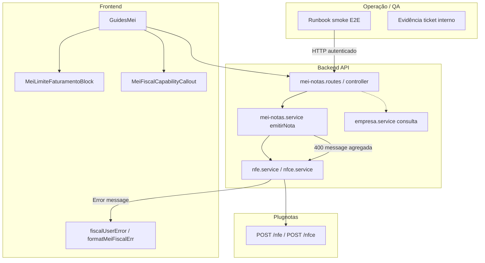
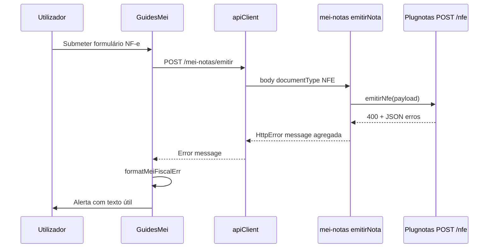

# Arquitetura técnica — POSQA: NF-e / NFC-e (pós-testes automatizados, limite MEI, erros, smoke)

**Versão:** 1.0  
**Data:** 2026-04-07  
**Autoria:** Aria (architect / AIOX)  
**Requisitos de origem:** [`docs/prd/PRD-melhorias-nfe-nfce-pos-testes-automatizados-2026-04-07.md`](../prd/PRD-melhorias-nfe-nfce-pos-testes-automatizados-2026-04-07.md) (**FR-POSQA-\***, **NFR-POSQA-\***, **CR-POSQA-\***)  
**UX de origem:** [`docs/specs/ux-spec-mei-posqa-nfe-nfce-2026-04-07.md`](../specs/ux-spec-mei-posqa-nfe-nfce-2026-04-07.md)

**Complementa (não substitui):** [`docs/technical/architecture-mei-emissao-nfe-nfce-guia-2026-04-06.md`](architecture-mei-emissao-nfe-nfce-guia-2026-04-06.md) — contratos `mei-notas`, Plugnotas, listagens.  
**Alinha-se a:** [`docs/technical/mei-limite-faturamento-agregado-2026-04-02.md`](mei-limite-faturamento-agregado-2026-04-02.md) — agregado cliente/servidor e exclusão NFE/NFCE do teto.

Este documento fixa **camadas técnicas** para fechar a lacuna “CI verde vs confiança em ambiente real”: runbook/smoke, **sem novos endpoints** salvo decisão explícita futura, propagação de erros **400 Plugnotas**, e **transparência do limite MEI** sem alteração de regra de negócio por defeito.

---

## 1. Visão de contexto (POSQA)

**Princípio:** **FR-POSQA-01/02** são sobretudo **documentação + processo**; **FR-POSQA-05/06** concentram-se em **componentes e cadeia de erro** já existentes, com alterações **incrementais** e **CR-POSQA-02** (sem breaking change de API pública).

---

## 2. Fronteiras por requisito

| ID | Camada principal | Alteração de schema / API |
|----|------------------|---------------------------|
| **FR-POSQA-01 / 02** | `docs/runbook/` ou extensão `docs/operacao-mei-nfse.md` | Nenhuma |
| **FR-POSQA-03** | ADR, `PROJECT_MEMORY`, eventual `empresa.service.js` | Nenhuma no MVP se decisão **D1** |
| **FR-POSQA-04** | `docs/stories/` | Nenhuma |
| **FR-POSQA-05** | `MeiLimiteFaturamentoBlock.tsx`, opcionalmente `meiLimiteFaturamento.ts` (comentário de filtro) | Nenhuma — regra já NFSE-only no servidor (`agregarLimiteFaturamento`) e no cliente |
| **FR-POSQA-06** | `GuidesMei.tsx`, `fiscalUserError.ts`, `apiClient` / erros HTTP; opcionalmente `plugnotasIntegrationErrorMessage.ts` | Nenhuma no contrato `POST /mei-notas/emitir` — apenas forma da **mensagem** no corpo de erro já existente |
| **FR-POSQA-07** | CI / script opcional | Nenhuma obrigatória |

---

## 3. Limite de faturamento MEI (**FR-POSQA-05**)

### 3.1 Fonte de verdade (inalterada por POSQA)

| Camada | Implementação | Inclusão NFE/NFCE |
|--------|---------------|-------------------|
| **Servidor** | `agregarLimiteFaturamento` em `backend/src/services/mei-notas.service.js` — query filtra `document_type` **NFSE** (e `null` conforme regra existente) | **Excluídas** |
| **Cliente (lista em memória)** | `frontend/src/utils/meiLimiteFaturamento.ts` — funções puras sobre `NfseRecord[]` alinhadas ao ADR LIM-MEI-01 | **Excluídas** |

**Arquitetura:** POSQA **não** exige mudança de query nem de `computeMeiLimiteProgresso` — apenas **copy** no `MeiLimiteFaturamentoBlock` (spec UX §4.3) para alinhar expectativa do utilizador à regra técnica.

### 3.2 Risco de inconsistência cliente vs servidor

- Se no futuro existir endpoint dedicado `GET /api/mei/limit-progress`, o contrato deve continuar a documentar **exclusão NFE/NFCE** até PRD novo.  
- Enquanto o modo for “agregado a partir da lista”, garantir que `listarNfse` continua a devolver `document_type` para cada linha (já persistido em `mei_nfse`).

---

## 4. Cadeia de erros de emissão NF-e / NFC-e (**FR-POSQA-06**)

### 4.1 Fluxo de dados (erro 4xx Plugnotas)

1. **`nfe.service.js` / `nfce.service.js`** — `requestJson` em falha chama `resolvePlugnotasRequestJsonError` (`plugnotas-emit-400-log.js`), produzindo mensagem agregada (campos + razões).  
2. **`mei-notas.controller.js`** — propaga `HttpError` / `badRequest` com `message` string.  
3. **Cliente** — `apiClient` (ou equivalente) lança `Error` com `message` + opcionalmente metadata de código (`getFiscalErrorCode` / `getPlugnotasCodeFromUnknownError`).  
4. **`formatMeiFiscalErr` em `GuidesMei.tsx`** — delega em `formatFiscalError` (`fiscalUserError.ts`), que pode usar `mapMeiFiscalErrorToCopy` para títulos/CTAs em cenários mapeados.  
5. **UI** — estado `emissionNfseError` (nome histórico) alimenta alerta; mensagens **longas** devem usar o mesmo padrão que NFS-e (`LongFiscalErrorMessage` / `EmissaoFiscalErrorAlert` — ver spec UX §5).

### 4.2 Regras de segurança (**NFR-POSQA-01**)

- **Não** logar no cliente `console.log` com payload completo em produção.  
- Backend já redige corpo em logs de debug (`plugnotas-debug-env`); manter.  
- `looksLikeOpaqueApiPayload` em `fiscalUserError.ts` evita mostrar JSON bruto como mensagem principal — **manter** e reutilizar se **FR-POSQA-06** adicionar ramos para NF-e/NFC-e.  
- Mensagens podem incluir **nomes de campo** (`itens[0].ncm`) porque são **metadados de validação**, não PII; **não** repetir CPF/CNPJ completos se o backend os incluir no texto de erro (truncar no servidor preferível; se não, sanitizar no `formatFiscalError` — decisão na story).

### 4.3 Compatibilidade (**CR-POSQA-02**)

- Respostas HTTP mantêm `Content-Type` e shape de erro já usados pelo frontend.  
- Qualquer novo campo opcional na mensagem deve ser **retrocompatível** (cliente antigo ignora).

---

## 5. Capacidades Plugnotas e decisão §8.1 (**FR-POSQA-03**)

### 5.1 Estado actual

- **`GET /mei-notas/setup/emissao-fiscal/empresa`** devolve payload bruto Plugnotas.  
- **`parsePlugnotasEmpresaCapabilities`** + **`isNfeLikeEmissionBlockedByCapabilities`** — UI bloqueia submit ou mostra `MeiFiscalCapabilityCallout`.  
- **`empresa.service.js`** — POST/PATCH podem manter `nfe`/`nfce` inativos em fluxos MEI focados em NFS-e.

### 5.2 Implicação por opção de produto

| Decisão | Implicação técnica |
|---------|-------------------|
| **D1** | Sem alteração de contrato; reforço de copy e runbook; eventual link para doc de suporte. |
| **D2** | Nova story: estender normalização no **PATCH** empresa (campos CSC, `ativo`, etc.) — desenhar com **@data-engineer** apenas se persistência Supabase for tocada; caso contrário só Plugnotas API. |
| **D3** | Feature flag no frontend (ex.: env `VITE_*` ou remote config) — esconder segmentos NF-e/NFC-e; **não** alterar backend de autorização além do já existente. |

---

## 6. Smoke E2E (**FR-POSQA-01 / 02**) — arquitetura do procedimento

### 6.1 Pré-condições (sem valores secretos no repo)

| Pré-condição | Verificação |
|--------------|-------------|
| `PLUGNOTAS_API_BASE_URL`, `PLUGNOTAS_API_KEY` no **backend** (env local ou pipeline segura) | App arranca `emitir` sem `badRequest('…não configurado')` |
| Utilizador de teste com `requireMeiEnabled` | Token/sessão válida no cliente |
| Certificado A1 e empresa Plugnotas com modalidades **ativas** para o cenário “sucesso” | `GET …/empresa/:cnpj` + UI ou resposta JSON |
| Payload mínimo válido | Conforme `validateNfeLikePayload` — pode reutilizar exemplos dos testes `mei-notas-core.test.js` com dados fictícios |

### 6.2 Sequência mínima (referência para o runbook)

1. Autenticar.  
2. `GET /mei-notas/setup/emissao-fiscal/empresa` — confirmar estado `nfe`/`nfce`.  
3. `POST /mei-notas/emitir` com `documentType: NFE` e `payload` válido; repetir para `NFCE`.  
4. `GET /mei-notas?documentType=NFE|NFCE` — registo com `document_type` coerente.  
5. Opcional: `GET` download PDF/XML quando `plugnotas_id` disponível (mesmo fluxo que produção).  
6. Registar evidência: ID interno da nota, status, timestamp — **não** colar `response_json` completo se contiver dados fiscais reais.

### 6.3 Limitações declaradas

- Sandbox Plugnotas **≠** SEFAZ produção por UF.  
- O runbook deve incluir **“resultado esperado”** flexível (ex.: `processando` vs `concluido`) conforme ambiente.

---

## 7. Estratégia de testes (NFR-POSQA-03)

| Nível | Âmbito |
|-------|--------|
| **Unitário backend** | Mantém `plugnotas-nfe.test.js`, `plugnotas-nfce.test.js`, `mei-notas-core.test.js` — **CR-POSQA-01**. |
| **Unitário frontend** | Se `formatFiscalError` / `mapMeiFiscalErrorToCopy` ganhar ramos para mensagens agregadas NF-e/NFC-e, adicionar testes em `fiscalUserError.test.ts` (se existir) ou ficheiro dedicado. |
| **Componente** | `FiscalIntegrationErrorAlert.test.tsx` já cobre `documentTypeLabel` — estender com corpo longo para NFE/NFCE se necessário. |
| **Integração UI** | `GuidesMei.permissions.test.tsx` — opcional: mock de erro de API com mensagem tipo Plugnotas 400. |

**FR-POSQA-07 (P1):** script `scripts/smoke-nfe-nfce-plugnotas.mjs` (HTTP directo ao Plugnotas, payload inválido → 4xx) + workflow opcional `.github/workflows/posqa-5-plugnotas-smoke-optional.yml` quando secrets existem; caso contrário permanece **manual + evidência** (runbook).

---

## 8. Observabilidade e logs

- Backend: logs `[emissao-fiscal NFe]` / `[emissao-fiscal NFCe]` em respostas 400 — **não** duplicar PII em produção; manter redacção existente.  
- Frontend: evitar `console.error` com objeto `error` completo em builds de produção; preferir mensagem já formatada.

---

## 9. Diagrama de sequência — emissão NF-e com falha Plugnotas

---

## 10. Riscos técnicos e mitigações

| Risco | Mitigação |
|-------|-----------|
| Mensagem Plugnotas muda formato | Testes de *snapshot* frágeis — preferir asserts parciais (`includes('NCM')`) e documentação de versão API no runbook. |
| Duplicação de regra limite cliente/servidor | ADR LIM-MEI-01 já define evolução; POSQA só copy salvo mudança de PRD. |
| Fuga de JSON opaco para o utilizador | `looksLikeOpaqueApiPayload` + revisão manual QA (spec UX §10). |

---

## 11. Checklist de implementação (dev)

- [ ] Copy **Base (MVP)** e painel de detalhe em `MeiLimiteFaturamentoBlock` conforme spec UX (sem mudar query servidor).  
- [ ] Rever `formatMeiFiscalErr` / `formatFiscalError` para paridade NF-e/NFC-e com mensagens agregadas.  
- [ ] Runbook criado/atualizado com sequência §6.2.  
- [ ] Decisão **§8.1** registada (PRD change log ou ADR).  
- [ ] `npm run lint`, `npm run typecheck`, `npm test` nos workspaces tocados.

---

## 12. Change log

| Versão | Data | Notas |
|--------|------|-------|
| 1.0 | 2026-04-07 | Versão inicial — PRD POSQA + spec UX POSQA. |

---

*Próximo passo: **@dev** implementa checklist §11; **@qa** executa smoke §6; **@sm** rastreia stories POSQA com file list.*

— Aria, arquitetando o futuro
