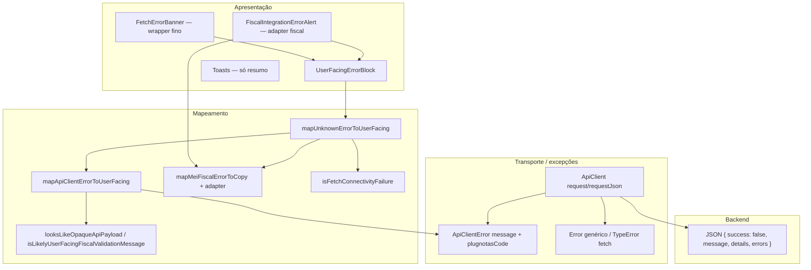

# Arquitetura técnica — Mensagens de erro ao utilizador final

**Versão:** 1.0  
**Data:** 2026-04-07  
**Autoria:** Aria (architect / AIOX)  
**Requisitos de origem:** [`docs/prd/PRD-mensagens-erro-ux-usuario-final-2026-04-07.md`](../prd/PRD-mensagens-erro-ux-usuario-final-2026-04-07.md) (**FR-ERR-***, **NFR-ERR-***)  
**UX de origem:** [`docs/specs/ux-spec-mensagens-erro-usuario-final-2026-04-07.md`](../specs/ux-spec-mensagens-erro-usuario-final-2026-04-07.md)

**Complementa (não substitui):** fluxos fiscais já descritos em [`docs/technical/architecture-mei-emissao-nfe-nfce-guia-2026-04-06.md`](architecture-mei-emissao-nfe-nfce-guia-2026-04-06.md) e [`docs/technical/architecture-mei-posqa-nfe-nfce-2026-04-07.md`](architecture-mei-posqa-nfe-nfce-2026-04-07.md) — este documento **unifica a camada de apresentação e mapeamento** de erros para **toda** a app, com **brownfield** sobre `ApiClient`, `ApiClientError`, `fiscalUserError.ts` e alertas existentes.

---

## 1. Objetivo arquitetural

1. **Separar** “dados do erro bruto” (HTTP, payload JSON, texto do Plugnotas) de “**modelo de UI**” (`UserFacingErrorProps` na spec UX §5).  
2. **Centralizar** classificação (`category`, `source`, `severity`, `recoverable`) e copy canónica (**FR-ERR-B07**, spec §6).  
3. **Minimizar** mudanças de contrato HTTP na **v1**; permitir **evolução opcional** do backend (**FR-ERR-A05**) sem bloquear a Fase B.  
4. Garantir **rastreabilidade** a requisitos (**NFR-ERR-02/03/04**) e testes nos mapeadores.

**Decisão D1 (recomendada):** implementar **primeiro** o *pipeline* completo no **frontend** (componente + mapeadores + refactors incrementais). **D2 (opcional):** estender respostas `success: false` com campos estruturados quando o inventário provar insuficiência do parse no cliente.

---

## 2. Visão de contexto (camadas)



**Fluxo feliz de erro:** `unknown` (catch) → `mapUnknownErrorToUserFacing` → `UserFacingErrorProps` → `UserFacingErrorBlock` (variant adequada).

---

## 3. Modelo de dados (frontend)

### 3.1 Tipo canónico

O contrato da spec UX §5 é a **fonte de verdade** do modelo. Implementar em **um único módulo** exportável:

| Ficheiro sugerido | Conteúdo |
|-------------------|----------|
| `frontend/src/types/userFacingError.ts` | `UserErrorCategory`, `UserErrorSource`, `UserErrorSeverity`, `UserErrorVariant`, `UserErrorAction`, `UserFacingErrorProps` |

**Regra:** componentes **não** duplicam estes tipos; importam do módulo acima.

### 3.2 Adapter fiscal (`MeiFiscalUserCopy` → `UserFacingErrorProps`)

Hoje `mapMeiFiscalErrorToCopy` em `fiscalUserError.ts` devolve `{ title, description, actionLabel?, href? }`.  
**Estratégia:** função pura `meiFiscalUserCopyToUserFacing(copy, options): UserFacingErrorProps` que:

- define `category` / `source` / `severity` com base no contexto da chamada (ex.: emissão → `provedor_fiscal`, `source: provedor_fiscal` quando `technicalDetail` vier do provedor);
- mapeia `actionLabel`/`href` → `secondaryAction` ou `primaryAction` conforme UX;
- mantém **toda** a lógica existente de códigos Plugnotas / 401 / 403 dentro de `mapMeiFiscalErrorToCopy` — **sem** regressão de comportamento.

---

## 4. Mapeamento genérico (API / rede)

### 4.1 Entrada: `mapUnknownErrorToUserFacing`

Assinatura sugerida:

```typescript
function mapUnknownErrorToUserFacing(
  error: unknown,
  context: {
    variant: UserErrorVariant;
    /** ex.: 'transacoes.load', 'mei.catalogo.save' — só logs / analytics P2 */
    surfaceId?: string;
    /** HTTP status se conhecido (resposta já parseada) */
    httpStatus?: number;
    /** payload bruto se ainda disponível (evitar duplo parse) */
    errorPayload?: import('../utils/buildApiErrorMessage').ApiErrorPayload | null;
  }
): UserFacingErrorProps;
```

**Ordem de decisão (pipeline):**

1. **`isFetchConnectivityFailure(error)`** → `category: rede`, `source: network`, `recoverable: true`, copy §6 spec; `technicalDetail` omitido ou mensagem curta sanitizada.  
2. **`error instanceof ApiClientError`** (ou `getPlugnotasCodeFromUnknownError` não nulo) → delegar `mapApiClientErrorToUserFacing`.  
3. **Mensagens fiscais** — se o *call site* já sabe que é fiscal, preferir entrada dedicada `mapFiscalUnknownToUserFacing` que encapsula `formatFiscalError` / `mapMeiFiscalErrorToCopy` (evita heurísticas fracas no genérico).  
4. **HTTP por texto** — padrões já em `fiscalUserError` (401, 403, 5xx) podem ser extraídos para util partilhado `inferCategoryFromMessage` **ou** duplicação controlada até extração.  
5. **Fallback** — **FR-ERR-B07**: título + descrição canónicos `desconhecido`; `technicalDetail` = mensagem bruta **apenas** se `!looksLikeOpaqueApiPayload` e não parecer stack interno (reutilizar heurísticas existentes).

### 4.2 `mapApiClientErrorToUserFacing`

Entrada: `ApiClientError` + opcionalmente `errorPayload` preservado no momento do `catch`.

| Dado disponível | Uso |
|-----------------|-----|
| `plugnotasCode` | Ramo prioritário; título/descrição estáveis; `category: provedor_fiscal` quando aplicável. |
| `message` (hoje agregado por `buildApiErrorMessage`) | **Desagregar** para `technicalDetail`; **não** usar como `title` único. |
| `payload.message` / `payload.details` | `technicalDetail` = concatenação legível; `description` = copy por `httpStatus` ou `validacao_servidor`. |

**Implementação sem mudar o backend:** ao lançar `ApiClientError`, o `apiClient` pode **anexar** propriedade não enumerável ou *subclasse* com `readonly payload?: ApiErrorPayload` **se** o payload ainda estiver em memória — **alternativa mais limpa** a parsear `error.message`.  
**Decisão D3:** preferir **estender** `ApiClientError` com `payload?: ApiErrorPayload | null` (opcional) preenchido em `apiClientErrorFromPayload` — **retrocompatível** (código que só lê `message` continua a funcionar).

Pseudo-fluxo em `apiClientErrorFromPayload`:

```typescript
return new ApiClientError(buildApiErrorMessage(payload), {
  plugnotasCode: …,
  payload: payload ?? null, // novo
});
```

### 4.3 `buildApiErrorMessage`

Permanece a função que monta string para logs e para **detalhe**. A UI **não** deve tratar essa string como `description` final; `mapApiClientErrorToUserFacing` produz `title`/`description` canónicos e atribui a string (ou partes do `payload`) a `technicalDetail`.

---

## 5. Componente de apresentação

### 5.1 `UserFacingErrorBlock`

| Aspeto | Especificação |
|--------|----------------|
| Localização | `frontend/src/components/UserFacingErrorBlock.tsx` (nome final alinhado com @dev) |
| Responsabilidade | Renderizar anatomia UX §4.1; variantes §4.3; `role`/`aria-*` §7 spec |
| Dependências | Reutilizar sub-árvore de `LongFiscalErrorMessage` **ou** extrair `CollapsibleLongText` partilhado se reduzir duplicação com `FiscalIntegrationErrorAlert` |
| CTAs | `button` + `a`; primário primeiro na ordem de foco |

### 5.2 Wrappers brownfield

| Componente actual | Evolução |
|-------------------|----------|
| `FetchErrorBanner` | Implementar como composição: `UserFacingErrorBlock` com `variant: page_banner` + props já derivadas ou pass-through de `mapUnknownErrorToUserFacing` no *call site*. |
| `FiscalIntegrationErrorAlert` / `EmissaoFiscalErrorAlert*` | Manter API pública estável na transição **ou** deprecar com alias; interior passa a montar `UserFacingErrorBlock` com `technicalDetail` = mensagem longa do provedor. |
| Toasts | Só `title` + primeira frase de `description`; `category === provedor_fiscal` com texto longo **não** deve usar toast sozinho (spec §4.3). |

---

## 6. Backend (opcional — decisão D2)

**Quando considerar:** inventário **FR-ERR-A01** mostrar sistematicamente perda de informação ao separar `userMessage` de `supportDetail` só no cliente (ex.: mensagens traduzidas de forma inconsistente).

**Extensão mínima sugerida** (compatível com clientes antigos):

```json
{
  "success": false,
  "message": "…",
  "details": "…",
  "errors": { … },
  "userFacing": {
    "category": "validacao_servidor",
    "title": "…",
    "description": "…",
    "supportDetail": "…",
    "requestId": "uuid-opcional"
  }
}
```

- **`userFacing` opcional:** se presente, o frontend **prefere** estes campos para `title`/`description`/`technicalDetail`, sujeito a validação (whitelist de `category`).  
- **`requestId`:** para suporte; **nunca** obrigatório na UI; **NFR-ERR-03** no *clipboard*.

Se **D2** for rejeitada, documentar em ADR curta: *“Erro ao utilizador v1 = só frontend”*.

---

## 7. Sanitização e suporte (**NFR-ERR-03**)

| Função sugerida | Responsabilidade |
|-----------------|------------------|
| `sanitizeSupportClipboardText(text: string): string` | Remover padrões de JWT, `Bearer`, `token=`, emails opcionalmente (política PO), linhas que coincidam com regex de cookie. |
| Chamada | `onCopySupportDetail` usa texto = `sanitizeSupportClipboardText(technicalDetail)` |

Logs do `apiClient` já redigem headers; o *clipboard* **não** deve duplicar tokens mesmo que apareçam no `technicalDetail` por bug — sanitização defensiva.

---

## 8. Analytics (**FR-ERR-B08**, P2)

- Hook ou função `reportUserErrorShown({ category, surfaceId })` — **sem** `title`, **sem** corpo do provedor.  
- Opcional: hash SHA-256 truncado do `technicalDetail` em *staging* apenas para *debug* — desligado em produção salvo aprovação.

---

## 9. Matriz requisito → artefacto

| ID | Artefacto principal |
|----|------------------------|
| **FR-ERR-A03** | `frontend/src/types/userFacingError.ts` + export no componente |
| **FR-ERR-B01** | `UserFacingErrorBlock.tsx` + wrappers |
| **FR-ERR-B02–B04** | Migração *call sites* + `mapUnknownErrorToUserFacing` |
| **FR-ERR-B05** | Consolidação 401/403 num util partilhado ou re-export de `fiscalUserError` |
| **FR-ERR-B06** | Ramo `plugnotasCode` em `mapApiClientErrorToUserFacing` + adapter fiscal |
| **FR-ERR-B07** | Constantes copy fallback num único módulo `userErrorCopy.ts` |
| **FR-ERR-A05** | Secção 6 deste doc + entrada no inventário; ADR se **D2** |
| **NFR-ERR-01** | Testes RTL: `aria-labelledby`, botão detalhes `aria-expanded` |
| **NFR-ERR-04** | `userErrorCopy.ts` + proibir *string* duplicada fora do módulo (revisão CR) |

---

## 10. Fases de implementação (alinhadas ao PRD)

| Fase | Entregável técnico |
|------|---------------------|
| **A** | Inventário em `docs/`; decisão **D2** sim/não; se sim, *OpenAPI* ou exemplo JSON em `docs/technical/` |
| **B0** | Tipos + `UserFacingErrorBlock` + testes de componente mínimos |
| **B1** | `ApiClientError.payload?` + `mapApiClientErrorToUserFacing` + migração 1–2 fluxos P0 (prova de conceito) |
| **B2** | Adapter fiscal + refator `FiscalIntegrationErrorAlert` |
| **B3** | `FetchErrorBanner`, transações, catálogos MEI, restantes P0 |
| **P2** | `reportUserErrorShown` |

---

## 11. Riscos e mitigação

| Risco | Mitigação |
|-------|-----------|
| Regressão em mensagens fiscais | Testes unitários existentes em `fiscalUserError`; novos testes no adapter; *snapshot* mínimo do componente fiscal |
| `message` duplicado em `technicalDetail` | Construir `technicalDetail` a partir de `payload` quando existir; senão, mensagem completa uma vez só |
| Prop drilling | *Hook* opcional `useUserFacingErrorState()` só se estados locais explodirem — não obrigatório na v1 |
| Performance | Mapeadores puros, sem I/O; memoização só se perf for problema medido |

---

## 12. Critérios de aceite arquiteturais

- [ ] Existe **um** tipo `UserFacingErrorProps` e **um** componente base que a spec UX pode referenciar por caminho.  
- [ ] Nenhum fluxo P0 depende de `throw new Error(buildApiErrorMessage(...))` **sem** passar pelo mapeador antes de mostrar UI.  
- [ ] `ApiClientError` pode transportar `payload` opcional sem quebrar *call sites* que só usam `.message`.  
- [ ] Heurísticas `looksLikeOpaqueApiPayload` / conectividade mantêm-se aplicáveis no pipeline.  
- [ ] Documento de inventário (**FR-ERR-A01**) liga cada linha a `surfaceId` sugerido para analytics P2.

---

## 13. Referências

- [`docs/prd/PRD-mensagens-erro-ux-usuario-final-2026-04-07.md`](../prd/PRD-mensagens-erro-ux-usuario-final-2026-04-07.md)  
- [`docs/specs/ux-spec-mensagens-erro-usuario-final-2026-04-07.md`](../specs/ux-spec-mensagens-erro-usuario-final-2026-04-07.md)  
- `frontend/src/utils/apiClientError.ts`, `frontend/src/services/apiClient.ts`  
- `frontend/src/utils/buildApiErrorMessage.ts`  
- `frontend/src/lib/fiscalUserError.ts`  
- `frontend/src/utils/isFetchConnectivityFailure.ts`  

---

— *Aria — arquitetura pronta para @dev (B0–B3) e decisão PO/backend sobre **D2**.*
