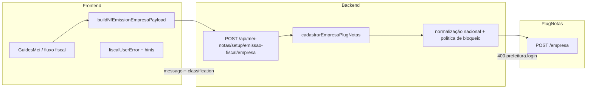

# Arquitetura técnica — NFS-e Nacional como padrão com bloqueio da exceção `prefeitura.login` no PlugNotas

**Versão:** 1.0  
**Data:** 2026-04-10  
**Autoria:** Aria (architect / AIOX)  
**Requisitos de origem:** [`docs/prd/PRD-nfse-nacional-padrao-com-excecao-credenciais-prefeitura-plugnotas-2026-04-09.md`](../prd/PRD-nfse-nacional-padrao-com-excecao-credenciais-prefeitura-plugnotas-2026-04-09.md) (**FR-NATEX-01** a **FR-NATEX-09**, **NFR-NATEX-01** a **NFR-NATEX-05**)  
**UX de origem:** [`docs/specs/ux-spec-nfse-nacional-padrao-bloqueio-excecao-credenciais-prefeitura-plugnotas-2026-04-10.md`](../specs/ux-spec-nfse-nacional-padrao-bloqueio-excecao-credenciais-prefeitura-plugnotas-2026-04-10.md)

**Referência externa (contrato):** [Documentação da API PlugNotas (Postman)](https://documenter.getpostman.com/view/3720339/2sB3WpSh1R?version=latest)

---

## Relação com outros artefatos

| Artefato | Papel |
|----------|-------|
| [`architecture-nfse-nacional-sem-im-prefeitura-mei-2026-04-08.md`](./architecture-nfse-nacional-sem-im-prefeitura-mei-2026-04-08.md) | Base do fluxo nacional-first sem IM/prefeitura como requisito padrão. |
| [`architecture-400-nfse-prefeitura-login-obrigatorio-plugnotas-2026-04-09.md`](./architecture-400-nfse-prefeitura-login-obrigatorio-plugnotas-2026-04-09.md) | Contexto técnico do erro `prefeitura.login obrigatório`; esta nova arquitetura substitui a hipótese de suportar credenciais neste fluxo. |
| [`docs/operacao-mei-nfse.md`](../operacao-mei-nfse.md) | Runbook e classificação operacional dos cenários. |
| [`docs/adr/ADR-plugnotas-nfse-nacional-empresa-spike.md`](../adr/ADR-plugnotas-nfse-nacional-empresa-spike.md) | Contrato nacional adotado e risco de divergência por conta/ambiente. |

---

## 1. Resumo executivo

O sistema deve preservar **NFS-e Nacional** como padrão do fluxo MEI e, ao mesmo tempo, **não** incorporar login/senha de prefeitura no frontend nem no backend deste percurso.

Arquiteturalmente, isso significa:

1. o contrato do fluxo `POST /api/mei-notas/setup/emissao-fiscal/empresa` **não** será expandido para aceitar `nfse.config.prefeitura.login` / `senha`;
2. o frontend **não** exibirá nem coletará esses dados;
3. o backend continuará enviando o payload nacional já suportado e classificará o erro `prefeitura.login obrigatório` como **exceção bloqueada por decisão de produto**, não como convite para enriquecer o payload com credenciais;
4. a UI apresentará uma narrativa de limitação do fluxo, com causalidade correta entre `POST`, fallback `PATCH` e `GET`.

Esta arquitetura implementa a **Policy B** do PRD.

---

## 2. Visão de contexto

### 2.1 Fluxo lógico

### 2.2 Leitura arquitetural

- **Frontend**: continua construindo o payload nacional do jeito suportado hoje.
- **Backend**: mantém o contrato atual e não aceita credenciais municipais nesse fluxo.
- **PlugNotas**: continua sendo a autoridade de validação do cadastro.
- **UX**: quando o upstream exigir credenciais, a aplicação bloqueia o caso e comunica a limitação.

---

## 3. Decisões arquiteturais

### 3.1 Sem expansão de contrato para credenciais

**Decisão:** o body do fluxo `POST /api/mei-notas/setup/emissao-fiscal/empresa` não será ampliado para aceitar:

- `nfse.config.prefeitura.login`
- `nfse.config.prefeitura.senha`
- aliases equivalentes de credenciais municipais

**Motivação:**

- aderência ao PRD;
- redução de superfície de segurança;
- preservação do escopo nacional-first.

### 3.2 Sem UI de credenciais

**Decisão:** o frontend não terá campos, estados ou persistência para login/senha de prefeitura neste fluxo.

**Motivação:**

- manter a experiência principal simples;
- evitar coleta indevida de segredo;
- impedir que o requisito excepcional vire contrato de produto.

### 3.3 Classificação explícita da exceção

**Decisão:** quando o sistema detectar erro explícito de `prefeitura.login` / `senha`, a resposta da aplicação deve classificar o caso como **exceção municipal não suportada neste fluxo**.

Isso deve acontecer sem:

- falar em endpoint errado;
- falar em rota inexistente;
- sugerir preenchimento de campo não disponível;
- apagar a causalidade do `POST` falho.

### 3.4 BFF continua fronteira única

**Decisão:** toda leitura, normalização, classificação e eventual bloqueio continuam no BFF. O browser não conversa diretamente com o PlugNotas e não interpreta contrato externo cru como regra de produto.

---

## 4. Fronteiras por camada

| Camada | Responsabilidade |
|--------|------------------|
| **Frontend** | Construção do payload nacional, exibição do callout nacional e apresentação da narrativa de exceção bloqueada. |
| **Backend** | Montagem final do payload para `POST /empresa`, preservação do contrato atual e classificação dos erros do emissor em termos consumíveis pela UI. |
| **PlugNotas** | Fonte de verdade sobre validação municipal/nacional por conta e município. |
| **Runbook / Operação** | Triagem entre ambiente, payload e exceção municipal bloqueada. |

---

## 5. Arquitetura de dados e contrato

### 5.1 Contrato do frontend para o BFF

Permanece o contrato atual de cadastro da empresa, sem credenciais municipais.

**Explicitamente fora do contrato:**

- `nfse.config.prefeitura.login`
- `nfse.config.prefeitura.senha`
- qualquer segredo municipal equivalente

### 5.2 Contrato do BFF para o PlugNotas

Permanece o payload nacional já suportado, com a política atual do projeto para:

- `nfse.nacional`
- política “apenas NFS-e”
- normalização de endereço e possíveis enriquecimentos já autorizados

**Regra arquitetural:** nenhum enriquecimento futuro com credenciais municipais pode entrar por este fluxo sem novo PRD.

### 5.3 Contrato de erro para a UI

O backend deve continuar disponibilizando metadados que permitam à UI distinguir o caso, por exemplo:

- `plugnotasRequest.method`
- `plugnotasRequest.path`
- `plugnotasCode`
- `httpStatus`

Para esta iniciativa, a classificação funcional esperada é:

- erro de ambiente/configuração;
- erro de payload/contrato;
- **exceção municipal bloqueada**.

---

## 6. Comportamento do backend

### 6.1 Hot path

O hot path de cadastro da empresa continua:

1. validar input atual;
2. normalizar documento e endereço;
3. aplicar política nacional vigente;
4. chamar `POST /empresa`;
5. em conflito, preservar o fallback existente `PATCH`;
6. em erro explícito de credencial municipal, devolver classificação consistente para a UI.

### 6.2 Política de rejeição

Existem duas opções arquiteturalmente válidas:

1. **Classificação pós-upstream**
   - o backend chama o PlugNotas;
   - recebe `400 prefeitura.login obrigatório`;
   - transforma isso em erro de negócio consistente para a UI.

2. **Bloqueio antecipado orientado por política**
   - o backend detecta um cenário em que o município/conta cairia na exceção;
   - bloqueia antes da chamada upstream.

**Decisão para esta arquitetura:** manter **classificação pós-upstream** como baseline, porque ela exige menos suposição e mais aderência à fonte real de verdade do emissor. Bloqueio antecipado só deve entrar se houver regra confiável por município/conta.

### 6.3 Redaction

Mesmo no caso de erro excepcional:

- não logar login/senha de prefeitura;
- não aceitar esses campos;
- manter redaction de payload e PII como já definido no projeto.

---

## 7. Comportamento do frontend

### 7.1 Ponto único de interpretação

O frontend deve continuar centralizando a interpretação do erro em funções de mapping/hints, não em múltiplas branches ad hoc pela página.

### 7.2 Variante UX esperada

A UI deve mapear o caso para uma variante equivalente a:

`prefeitura-login-required-blocked`

com narrativa:

- fluxo padrão continua nacional;
- emissor exigiu algo fora do escopo;
- este caso não é suportado no fluxo atual;
- há orientação operacional.

### 7.3 Callout nacional

O callout “NFS-e em ambiente nacional” é arquiteturalmente apenas presentacional. Ele não altera contrato nem estado remoto; serve para reduzir ambiguidade da jornada.

---

## 8. Observabilidade e diagnóstico

### 8.1 Objetivo

Permitir que suporte e QA consigam responder:

- foi problema de ambiente?
- foi problema de payload?
- foi exceção municipal bloqueada?

### 8.2 Fontes

- resposta JSON do BFF;
- `plugnotasRequest`;
- `plugnotasCode`;
- `httpStatus`;
- logs redigidos do backend;
- runbook operacional.

### 8.3 O que não observar

- segredos municipais;
- payload bruto sensível em canais públicos;
- interpretação de erro baseada apenas em string de console sem metadado contextual.

---

## 9. Segurança

| Tema | Decisão |
|------|---------|
| **Coleta de segredo** | Proibida neste fluxo |
| **Persistência local** | Proibida para credenciais municipais |
| **Expansão de contrato** | Proibida neste PRD |
| **Logs** | Redigidos; sem campos de credenciais |
| **Mudança futura** | Só com novo brief + novo PRD + revisão de arquitetura |

---

## 10. Testes e validação

| Área | Cobertura esperada |
|------|--------------------|
| **Frontend** | Heurística da exceção bloqueada, copy, ausência de campos de credenciais |
| **Backend** | Preservação do contrato sem login/senha, classificação do erro excepcional |
| **Integração** | Causalidade `POST` falho → `GET` negativo |
| **Operação/QA** | Matriz de cenários atualizada no runbook |

Gates obrigatórios para qualquer implementação derivada:

- `npm run lint`
- `npm run typecheck`
- `npm test`

---

## 11. Riscos e mitigação

| Risco | Mitigação |
|-------|-----------|
| Implementação futura recolher login/senha por conveniência | Proibir no contrato e documentar como fora de escopo |
| Time confundir exceção bloqueada com bug de endpoint | Metadados estáveis + UX + runbook alinhados |
| Municípios relevantes ficarem bloqueados | Política de produto explícita; eventual novo ciclo de decisão se necessário |
| Classificação inconsistente entre backend e frontend | Contrato de erro estável e testes dedicados |

---

## 12. Arquivos prováveis impactados por stories derivadas

| Arquivo | Papel provável |
|---------|----------------|
| `backend/src/services/plugnotas/empresa.service.js` | Classificação do erro excepcional e preservação do contrato sem credenciais |
| `backend/src/controllers/mei-notas.controller.js` | Validação/contrato de entrada, se necessário |
| `frontend/src/pages/GuidesMei.tsx` | Callout nacional e alerta de bloqueio |
| `frontend/src/lib/fiscalUserError.ts` | Mapping da exceção bloqueada |
| `frontend/src/utils/nfseNacionalPlugnotasErrorHints.ts` | Heurística de classificação |
| `docs/operacao-mei-nfse.md` | Triagem operacional espelhando a arquitetura |

---

## 13. Mapeamento PRD/spec → arquitetura

| ID | Realização arquitetural |
|----|--------------------------|
| **FR-NATEX-01** | Fluxo nacional-first preservado |
| **FR-NATEX-02** | Sem campos municipais na UI padrão |
| **FR-NATEX-03** | Classificação explícita da exceção bloqueada |
| **FR-NATEX-04** | Proibição arquitetural no frontend |
| **FR-NATEX-05** | Proibição arquitetural no backend |
| **FR-NATEX-06** | Narrativa UX de bloqueio alinhada ao contrato |
| **FR-NATEX-07** | Runbook e triagem técnica consistentes |
| **FR-NATEX-08** | Observabilidade suficiente por metadados e logs redigidos |
| **FR-NATEX-09** | Causalidade `POST`/`PATCH`/`GET` preservada |

---

## Change log

| Versão | Data | Nota |
|--------|------|------|
| 1.0 | 2026-04-10 | Arquitetura inicial derivada do PRD `PRD-nfse-nacional-padrao-com-excecao-credenciais-prefeitura-plugnotas-2026-04-09.md` e da spec UX `ux-spec-nfse-nacional-padrao-bloqueio-excecao-credenciais-prefeitura-plugnotas-2026-04-10.md`, fixando o bloqueio da exceção municipal sem login/senha no frontend ou backend. |
