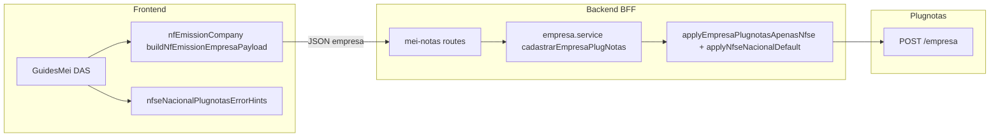

# Arquitetura técnica — **NFS-e Nacional** no cadastro Plugnotas (MEI, sem IM/prefeitura no fluxo)

**Versão:** 1.0  
**Data:** 2026-04-08  
**Autoria:** Aria (architect / AIOX)  
**Requisitos de origem:** [`docs/prd/PRD-nfse-nacional-sem-im-prefeitura-mei-2026-04-08.md`](../prd/PRD-nfse-nacional-sem-im-prefeitura-mei-2026-04-08.md) (**FR-NAT-***, **NFR-NAT-***)  
**UX de origem:** [`docs/specs/ux-spec-nfse-nacional-sem-im-prefeitura-mei-2026-04-08.md`](../specs/ux-spec-nfse-nacional-sem-im-prefeitura-mei-2026-04-08.md)

Este documento fixa **fronteiras de sistema**, **estado brownfield**, **decisões técnicas** e **evolução condicional** face ao contrato Plugnotas. **Não** substitui o ADR de spike nacional, stories, nem evidência operacional em `docs/operacao-mei-nfse.md`.

**Artefactos relacionados:**

- [`docs/adr/ADR-plugnotas-nfse-nacional-empresa-spike.md`](../adr/ADR-plugnotas-nfse-nacional-empresa-spike.md) — campo `nfse.nacional`, **NFR-N04**.  
- [`docs/adr/ADR-plugnotas-empresa-payload-apenas-nfse.md`](../adr/ADR-plugnotas-empresa-payload-apenas-nfse.md) — política `nfe`/`nfce`.  
- [`docs/technical/architecture-empresa-plugnotas-orquestrada-cadastro-certificado-2026-04-07.md`](architecture-empresa-plugnotas-orquestrada-cadastro-certificado-2026-04-07.md) — sequência certificado → empresa.

---

## 1. Visão de contexto

### 1.1 Fluxo lógico (inalterado na maioria do MVP)

O marco de negócio continua: **certificado A1** → **`POST /empresa`** (e resolução de conflitos existente). A entrega **FR-NAT-*** acrescenta **comunicação de modo**, **heurística de erro** e **garantias de não-validação local** de campos municipais; o **payload** nacional já está prescrito no código, salvo revisão por evidência Plugnotas.



### 1.2 Regra de fronteira (contrato JSON)

| Camada | Responsabilidade |
|--------|------------------|
| **Frontend** | Montar `nfse` com `nacional: true` (constantes `PLUGNOTAS_NFSE_NACIONAL_*`); **não** enviar `inscricaoMunicipal` no formulário MEI actual; apresentar callout e erros **FR-NAT-ERR-01**. |
| **Backend** | Normalizar `POST`/`PATCH` conforme `empresa.service.js` + `plugnotas-empresa-documentos-ativos.js`; reforçar `nfse.nacional` onde a política já define; **não** adicionar campos inventados (**NFR-NAT-01** / **FR-NA02**). |
| **Plugnotas** | Autoridade final de validação; pode exigir IM/prefeitura **apesar** de nacional no painel — tratado como **incidente de integração**, não como bug de formulário local. |

---

## 2. Estado actual do código (brownfield)

### 2.1 Payload — frontend

**Ficheiro:** `frontend/src/utils/nfEmissionCompany.ts`

- `nfse`: `{ ativo: true, tipoContrato: 0, config: { producao: true }, nacional: true }` (via `PLUGNOTAS_NFSE_NACIONAL_PAYLOAD_KEY` e `PLUGNOTAS_NFSE_NACIONAL_DEFAULT_ON`).  
- **Sem** `inscricaoMunicipal` no *path* canónico.  
- Testes: `nfEmissionCompany.test.ts` reforçam ausência de `inscricaoMunicipal`.

**Conclusão:** **FR-NAT-API-01** já está **materializado** no cliente para o contrato adoptado no ADR; alteração só após **evidência** e actualização do ADR.

### 2.2 Normalização — backend

**Ficheiros:** `backend/src/services/plugnotas/empresa.service.js`, `plugnotas-empresa-documentos-ativos.js`, `plugnotas-mei-empresa-policy.js`

- `applyNfseNacionalDefaultForPost` / `applyNfseNacionalDefaultForPatch` (e equivalentes no módulo de documentos activos) mantêm `nfse.nacional` alinhado à política.  
- Política “apenas NFS-e”: `nfe`/`nfce` inactivos sem `config` (**NFR-NAT-02**).

**Conclusão:** backend **não** é obrigatório para o MVP de **UX + mensagens**, exceto se a investigação Plugnotas implicar novo campo **documentado**.

### 2.3 Erros e retry — frontend

**Ficheiros:** `frontend/src/pages/GuidesMei.tsx`, `frontend/src/utils/nfseNacionalPlugnotasErrorHints.ts`, `frontend/src/components/FiscalIntegrationErrorAlert.tsx` (`GuiaMeiEmpresaCadastroErrorPanel`), `plugnotasIntegrationErrorMessage` onde aplicável.

- Painel âmbar de `plugnotasPendingRetry` já existe; a spec UX pede **copy condicional** para erros “municipais”.  
- `shouldOfferNfseNacionalOperacaoDocHint` cobre vários padrões; pode **não** disparar se a mensagem citar só `inscricaoMunicipal` sem “nacional” — **lacuna** explícita na spec UX §5.1.

### 2.4 Orquestração

**Ficheiro:** `frontend/src/utils/plugnotasEmitenteSetup.ts` (e handler em `GuidesMei.tsx`)

- Sequência certificado → empresa **já** implementada; esta feature **não** mexe na ordem HTTP.

---

## 3. Lacunas PRD/UX → engenharia

| ID | Lacuna | Direcção técnica |
|----|--------|-------------------|
| **FR-NAT-UX-02** | Callout “NFS-e em ambiente nacional” ausente | Componente leve em `GuidesMei.tsx` (condição `canViewNfse`), `role="region"`, `data-testid` na spec UX. |
| **FR-NAT-ERR-01** | Heurística incompleta para `inscricaoMunicipal` / `nfse.config.prefeitura` | Estender `shouldOfferNfseNacionalOperacaoDocHint` **ou** nova função pura `isPlugnotasMunicipalEmpresaValidationMessage(message)` usada pelos painéis; evitar duplicar regex em três sítios — preferir **uma** API no módulo de hints + testes unitários. |
| **FR-NAT-ERR-01** | `GuiaMeiEmpresaCadastroErrorPanel` sem bloco auxiliar | Passar *slot* opcional, prop `secondaryHint` / `children`, ou envolver com wrapper que consulta a mesma função pura (spec UX §5.3). |
| **FR-NAT-UX-01** | Regressão futura | Garantir que nenhum novo campo IM/prefeitura entra em `NfEmissionCompanyForm` / validação **sem** feature flag “modo municipal” (PRD §6.3-B). |
| **FR-NAT-DOC-01** | Documentação operacional | Entrega em `docs/operacao-mei-nfse.md`; manter âncora em sync com `NFSE_NACIONAL_OPERACAO_DOC_ANCHOR`. |

---

## 4. Decisões arquiteturais

### 4.1 MVP com **sem** mudança obrigatória de payload no backend

**Decisão:** A primeira onda de implementação assume que o contrato `nfse.nacional: true` + `config: { producao: true }` permanece válido. O trabalho é **predominantemente UI + biblioteca de detecção de erro**.

**Revert trigger:** resposta Plugnotas documentada (ticket, sandbox) exigindo outro *shape* → story + **patch ADR** + alteração coordenada em `nfEmissionCompany.ts`, `plugnotas-mei-empresa-policy.js`, testes de contrato.

### 4.2 Single source of truth para “erro municipal”

**Decisão:** Centralizar a classificação da mensagem em **`nfseNacionalPlugnotasErrorHints.ts`** (ou módulo irmão `plugnotasMunicipalValidationHint.ts` se o nome ficar confuso).

**API sugerida (contrato interno):**

```ts
/** Retorna true se a mensagem do emissor sugere obrigatoriedade municipal (IM/prefeitura). */
export function isPlugnotasEmpresaMunicipalRequirementMessage(message: string): boolean;
```

`shouldOfferNfseNacionalOperacaoDocHint` pode **chamar** esta função **ou** absorvê-la — evitar dois conjuntos de regras divergentes.

### 4.3 Composição na UI

**Decisão:** O callout **FR-NAT-UX-02** é **presentacional**: sem estado próprio além de tema; colocado **após** alertas existentes e **antes** de erros voláteis, conforme ordem NAT-L2/L3 da spec UX.

### 4.4 Telemetria (opcional P1)

**Decisão:** Não é exigido pelo PRD P0. Se PO quiser métricas (PRD §9), preferir evento único `nfse_nacional_cadastro_erro_municipal` com propriedade *has_hint* — *behind* flag de analytics, definida na story.

---

## 5. Segurança e dados

- **Sem** novos segredos; **sem** persistir mensagens de erro brutas com PII em `localStorage`.  
- Logs servidor: já existem gates para debug Plugnotas; **não** expandir PII em logs por esta feature.

---

## 6. Testes e qualidade

| Área | Mínimo |
|------|--------|
| Unitário | Novos casos em ficheiro `*.test.ts` junto a `nfseNacionalPlugnotasErrorHints` para *strings* com `inscricaoMunicipal`, `prefeitura`, `nfse.config`. |
| Contrato | Manter `nfEmissionCompany.test.ts` verde; se payload mudar, actualizar expectativas. |
| Gates | `npm run lint`, `npm run typecheck`, `npm test` (**NFR-NAT-03**). |

---

## 7. Riscos e dependências

| Risco | Mitigação |
|-------|-----------|
| **NFR-N04** — API diverge do painel | Mensagens **FR-NAT-ERR-01** + registo de evidência no ADR; **não** prometer sucesso só com copy. |
| Duplicação de heurística | Uma função pura exportada + reutilização em painel âmbar e vermelho. |
| **PRD §6.3-B** futuro | Introduzir *feature flag* ou ramo explícito “municipal” com schema de formulário separado — fora do MVP actual. |

---

## 8. Lista de ficheiros impactados (previsão)

| Ficheiro | Tipo de mudança |
|----------|-----------------|
| `frontend/src/pages/GuidesMei.tsx` | Callout; copy condicional nos painéis de erro |
| `frontend/src/utils/nfseNacionalPlugnotasErrorHints.ts` | Nova/detecção municipal; testes |
| `frontend/src/components/FiscalIntegrationErrorAlert.tsx` (`GuiaMeiEmpresaCadastroErrorPanel`) | Prop opcional ou composição para bloco auxiliar **FR-NAT-ERR-01** |
| `docs/operacao-mei-nfse.md` | Doc (**FR-NAT-DOC-01**) |
| `backend/...` | **Só** se contrato ADR mudar |

---

## 9. Rastreabilidade PRD/UX → arquitetura

| Requisito | Secção |
|-----------|--------|
| **FR-NAT-UX-01** | §2.1, §3, §4.3 |
| **FR-NAT-UX-02** | §3, §4.3 |
| **FR-NAT-API-01** | §2.1, §2.2, §4.1 |
| **FR-NAT-ERR-01** | §2.3, §3, §4.2 |
| **FR-NAT-DOC-01** | §3, §8 |
| **NFR-NAT-01** | §1.2, §4.1 |
| **NFR-NAT-02** | §2.2 |
| **NFR-NAT-EV-01** | §7 |

---

## Change log

| Data | Autor | Nota |
| --- | --- | --- |
| 2026-04-08 | Aria | Versão inicial (PRD + UX spec). |
