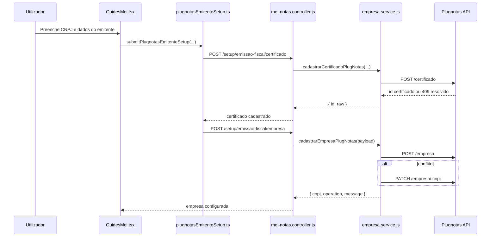

# Arquitetura técnica — Paridade **addCompany** na **Guia MEI** (CNPJ / empresa)

**Versão:** 1.0  
**Data:** 2026-04-09  
**Autoria:** Aria (architect / AIOX)  
**Requisitos de origem:** [`docs/prd/PRD-plugnotas-addcompany-guia-mei-cnpj-mapeamento-2026-04-09.md`](../prd/PRD-plugnotas-addcompany-guia-mei-cnpj-mapeamento-2026-04-09.md)  
**UX de origem:** [`docs/specs/SPEC-front-end-ux-plugnotas-addcompany-guia-mei-2026-04-09.md`](../specs/SPEC-front-end-ux-plugnotas-addcompany-guia-mei-2026-04-09.md)

Este documento fixa a arquitetura técnica para a iniciativa de **paridade addCompany** no brownfield existente. O objetivo não é criar um novo fluxo isolado, mas consolidar como a jornada da **Guia MEI** já materializa a operação canónica **POST `/empresa`** do Plugnotas, preservando **BFF server-side**, **sequência certificado -> empresa**, **retry parcial** e **governança de deriva de contrato**.

---

## 1. Decisão arquitetural

**Decisão principal:** manter a arquitetura atual baseada em **frontend orquestrador + BFF + serviços Plugnotas server-side**, sem criar integração direta browser -> Plugnotas e sem exigir nova rota UI “addCompany”.

### 1.1 Invariantes

- A intenção do utilizador continua a nascer na **Guia MEI**.
- O frontend continua a compor a sequência **cadastro de certificado -> cadastro de empresa**.
- O backend continua a ser a única fronteira com segredos, `x-api-key`, base URL e normalização final do payload.
- O cadastro de empresa no produto continua semanticamente equivalente ao **addCompany / POST `/empresa`** da documentação Plugnotas.
- Quando houver conflito de empresa existente, a política continua a ser **POST com fallback para PATCH** no backend.

### 1.2 Fora da decisão

- Não introduzir browser -> Plugnotas.
- Não substituir o PRD de orquestração única de conclusão.
- Não redesenhar a Guia MEI.

---

## 2. Contexto do sistema

**Leitura arquitetural:** o produto já cumpre a intenção de addCompany por composição de duas chamadas internas. O que esta arquitetura faz é formalizar essa equivalência e definir as fronteiras que não devem ser quebradas.

---

## 3. Estado atual do brownfield

### 3.1 Frontend

**Página principal:** `frontend/src/pages/GuidesMei.tsx`

- Mantém o estado da jornada fiscal, incluindo `plugnotasPendingRetry`.
- Constrói o payload de empresa via `buildNfEmissionEmpresaPayload`.
- Prioriza a hierarquia de feedback em `nfseEmitFeedbackTier1`.
- Já suporta retry parcial com `retryPlugnotasEmpresaRegistro(...)`.

**Orquestrador atual:** `frontend/src/utils/plugnotasEmitenteSetup.ts`

- `submitPlugnotasEmitenteSetup(...)` já tipa a fase da falha como `certificado` ou `empresa`.
- `PlugnotasEmitenteSetupError` já carrega `phase`, `certificadoId` e `cnpj`.
- Isto satisfaz a base arquitetural para **FR-ADDCO-04** sem exigir nova máquina de estados.

### 3.2 Backend

**Controller:** `backend/src/controllers/mei-notas.controller.js`

- Expõe as rotas já suficientes para a iniciativa:
  - `POST /mei-notas/setup/emissao-fiscal/certificado`
  - `POST /mei-notas/setup/emissao-fiscal/empresa`
  - `PATCH /mei-notas/setup/emissao-fiscal/empresa`
  - `GET /mei-notas/setup/emissao-fiscal/empresa`
- Persiste o espelho de `documentosAtivos` após POST/PATCH de empresa.

**Serviço Plugnotas:** `backend/src/services/plugnotas/empresa.service.js`

- `cadastrarCertificadoPlugNotas(...)` resolve 409 de certificado recuperando ID.
- `cadastrarEmpresaPlugNotas(...)` faz `POST /empresa` e, em conflito, tenta `PATCH /empresa/:cnpj`.
- `atualizarEmpresaPlugNotas(...)` preserva atualização sem novo certificado.
- A normalização final de payload continua no backend: CNPJ, IBGE, prefeitura, documentos ativos, defaults NFS-e e política de ambiente.

### 3.3 Endpoint composto já existente

Existe `cadastrarPlugNotasEmitenteComposite` no controller e `runPlugnotasEmitenteCompositeSetup(...)` no backend, mas esse endpoint é um **ativo opcional de evolução**. Para este PRD, ele não substitui a estratégia principal da Guia MEI e não deve virar requisito implícito.

---

## 4. Mapeamento arquitetural dos requisitos

| Requisito | Resposta arquitetural |
|-----------|------------------------|
| **FR-ADDCO-01** | A Guia MEI continua a ser a superfície única; o backend continua a materializar `POST /empresa` via BFF. |
| **FR-ADDCO-02** | `buildNfEmissionEmpresaPayload` define o contrato visual; `empresa.service.js` continua como normalizador e validador final. |
| **FR-ADDCO-03** | A política de conflito permanece encapsulada em `cadastrarEmpresaPlugNotas`, sem segundo fluxo manual na UI. |
| **FR-ADDCO-04** | O retry parcial continua baseado em `plugnotasPendingRetry` + `retryPlugnotasEmpresaRegistro`, sem reenvio do certificado quando `certificadoId` já existe. |
| **FR-ADDCO-05** | A governança de contrato deve ocorrer por checklist de paridade entre doc Plugnotas, payload frontend e normalização backend antes de release. |
| **NFR-ADDCO-01** | Ambiente permanece centralizado no servidor por `PLUGNOTAS_API_BASE_URL`, chave e timeout. |
| **NFR-ADDCO-02** | Nenhum segredo Plugnotas é exposto ao browser; a fronteira externa continua exclusivamente server-side. |
| **NFR-ADDCO-03** | Falhas são distinguidas por fase no frontend e podem ser enriquecidas no backend por `orchestrationPhase` quando a rota composta for usada. |

---

## 5. Componentes e responsabilidades

| Camada | Responsabilidade |
|--------|------------------|
| `GuidesMei.tsx` | Captura intenção do utilizador, decide copy/CTA, controla estados de erro e retry. |
| `nfEmissionCompany.ts` | Constrói payload canónico a partir do formulário, sem conhecer segredos nem política final do provedor. |
| `plugnotasEmitenteSetup.ts` | Orquestra certificado -> empresa e tipa a fase de falha para a UI. |
| `meiNotasService.ts` | Contratos HTTP internos frontend -> BFF. |
| `mei-notas.controller.js` | Borda autenticada do BFF; recebe payload e aciona persistência complementar. |
| `empresa.service.js` | Anticorrupção com Plugnotas: autenticação, normalização, fallback POST/PATCH, mensagens e erros. |
| Plugnotas | Sistema externo de verdade operacional para certificado e empresa. |

**Princípio:** a lógica de UX e a lógica de integração não devem colapsar na mesma camada. O frontend decide experiência; o backend decide contrato externo.

---

## 6. Contrato e fronteiras

### 6.1 Fronteira frontend -> BFF

**Certificado**

- Rota: `POST /mei-notas/setup/emissao-fiscal/certificado`
- Forma: `multipart/form-data`
- Retorno mínimo arquitetural: `id`, `message`, `raw`

**Empresa**

- Rota: `POST /mei-notas/setup/emissao-fiscal/empresa`
- Forma: `{ payload }`
- Retorno mínimo arquitetural: `cnpj`, `operation`, `message`, `raw`

### 6.2 Fronteira BFF -> Plugnotas

- `POST /certificado`
- `POST /empresa`
- `PATCH /empresa/:cnpj`
- `GET /empresa/:cnpj`
- `GET /certificado` em cenários de resolução de 409

### 6.3 Regra de anticorrupção

O frontend pode conhecer a semântica de “configurar empresa no emissor”, mas não deve conhecer detalhes de autenticação, host, fallback POST/PATCH ou heurísticas de parsing do provedor. Esses detalhes ficam confinados ao serviço Plugnotas no backend.

---

## 7. Estratégia de erros e observabilidade

### 7.1 Erros por fase

- **Fase certificado:** erro bloqueia qualquer sugestão de retry de empresa.
- **Fase empresa:** se o certificado já foi aceite, a UI deve oferecer retry parcial.
- **Conectividade:** deve continuar priorizada sobre CTAs de retry funcional.

### 7.2 Observabilidade mínima obrigatória

- Continuar distinguindo falhas de certificado e empresa nos fluxos de frontend.
- Preservar metadados de request Plugnotas no backend (`method`, `path`, `plugnotasCode` quando houver).
- Não introduzir logs com senha do certificado, `.pfx` ou credenciais municipais.

### 7.3 Governança de deriva de contrato

Quando a documentação Plugnotas mudar para `addCompany` / `POST /empresa`, a verificação deve passar por três pontos:

1. Payload produzido em `buildNfEmissionEmpresaPayload`.
2. Normalização aplicada em `cadastrarEmpresaPlugNotas`.
3. Copy/hints de erro na Guia MEI e painéis associados.

---

## 8. Segurança

- Segredos Plugnotas permanecem apenas no backend.
- O browser nunca fala com Plugnotas diretamente.
- `certificadoId` é artefato transitório de sessão e não deve ser promovido a persistência longa sem novo requisito.
- A política de normalização de CNPJ, IE, IBGE e prefeitura continua centralizada no backend para evitar divergência entre clientes.

---

## 9. Evolução recomendada

### 9.1 P0 desta iniciativa

- Consolidar a documentação de que a Guia MEI já representa o caso de uso **addCompany**.
- Manter a arquitetura atual como padrão oficial.
- Usar o backend atual como fonte de verdade para paridade de payload e fallback de conflito.

### 9.2 P1 opcional

- Usar o endpoint composto servidor `emitente composite` apenas se houver necessidade real de reduzir round-trips ou consolidar telemetria.
- Se adotado, mantê-lo como evolução compatível, não como substituição imediata das rotas existentes.

### 9.3 Não recomendado agora

- Nova rota visual dedicada “addCompany”.
- Reimplementação do fluxo diretamente no browser.
- Duplicar a política de normalização Plugnotas no frontend.

---

## 10. Critérios de aceite arquiteturais

- [ ] A arquitetura oficial documenta que a jornada Guia MEI é a materialização do caso de uso **addCompany / POST `/empresa`**.
- [ ] O BFF continua como única fronteira externa com Plugnotas.
- [ ] O retry parcial permanece restrito à fase empresa, sem novo upload de certificado quando `certificadoId` válido estiver disponível.
- [ ] A política de conflito empresa existente continua encapsulada no backend.
- [ ] Mudanças futuras de contrato Plugnotas exigem revisão coordenada de payload, backend normalizador e copy UX antes de release.

---

## 11. Ficheiros de referência

| Área | Ficheiros |
|------|-----------|
| UI / jornada | `frontend/src/pages/GuidesMei.tsx` |
| Orquestração FE | `frontend/src/utils/plugnotasEmitenteSetup.ts` |
| Payload emitente | `frontend/src/utils/nfEmissionCompany.ts` |
| Cliente BFF | `frontend/src/services/meiNotasService.ts` |
| Controller BFF | `backend/src/controllers/mei-notas.controller.js` |
| Serviço Plugnotas | `backend/src/services/plugnotas/empresa.service.js` |
| Rota composta opcional | `backend/src/services/plugnotas/plugnotas-emitente-setup.service.js` |

---

## 12. Change log

| Versão | Data | Autor | Notas |
|--------|------|-------|-------|
| 1.0 | 2026-04-09 | Aria | Versão inicial baseada no PRD addCompany + spec UX + código brownfield existente. |

---

*Handoff sugerido: **@sm** para decompor stories de paridade/checklist; **@dev** para ajustes futuros de copy, payload ou observabilidade; **@qa** para validar matriz certificado vs empresa vs retry.*
