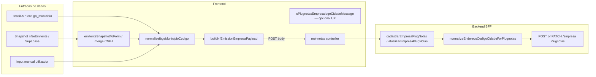

# Arquitetura técnica — **`endereco.codigoCidade` (IBGE)** no cadastro empresa Plugnotas

**Versão:** 1.0  
**Data:** 2026-04-08  
**Autoria:** Aria (architect / AIOX)  
**Requisitos de origem:** [`docs/prd/PRD-plugnotas-empresa-codigo-cidade-ibge-2026-04-08.md`](../prd/PRD-plugnotas-empresa-codigo-cidade-ibge-2026-04-08.md) (**FR-CID-***, **NFR-CID-***)  
**UX de origem:** [`docs/specs/ux-spec-plugnotas-empresa-codigo-cidade-ibge-2026-04-08.md`](../specs/ux-spec-plugnotas-empresa-codigo-cidade-ibge-2026-04-08.md)

Este documento fixa o **contrato da função de normalização**, **pontos de aplicação no cliente e no servidor**, **classificação de mensagens para FR-CID-UX-02**, e **matriz de testes**. **Complementa** a orquestração certificado→empresa e o serviço Plugnotas existentes; **não** altera política **apenas NFS-e** nem `documentosAtivos` (**NFR-CID-04**). **Não** exige novo ADR — alteração de **formato de transporte** do mesmo campo já previsto no contrato de empresa.

**Artefactos relacionados:**

- [`docs/brief/brief-plugnotas-empresa-codigo-cidade-ibge-2026-04-08.md`](../brief/brief-plugnotas-empresa-codigo-cidade-ibge-2026-04-08.md) — causa raiz e âncoras de código.  
- [`docs/technical/architecture-plugnotas-nfse-config-prefeitura-payload-2026-04-08.md`](architecture-plugnotas-nfse-config-prefeitura-payload-2026-04-08.md) — erros **`nfse.config.prefeitura`** (**distinto** de IBGE em `endereco`).  
- [`docs/technical/architecture-empresa-plugnotas-orquestrada-cadastro-certificado-2026-04-07.md`](architecture-empresa-plugnotas-orquestrada-cadastro-certificado-2026-04-07.md) — fase 2 `POST /empresa`.  
- [`docs/adr/ADR-plugnotas-empresa-payload-apenas-nfse.md`](../adr/ADR-plugnotas-empresa-payload-apenas-nfse.md) — **inalterado** por esta entrega.  
- [`docs/operacao-mei-nfse.md`](../operacao-mei-nfse.md) — **FR-CID-DOC-01** (operação).  
- **Código de paridade (DB → API emitente):** `backend/src/services/mei-certificate-store.js` — `emitenteRowToApiShape` já usa `digitsOnly` para `ibge_municipio`; o *gap* actual está no **cliente** (Brasil API, estado React, `buildNfEmissionEmpresaPayload`) e na **ausência** de normalização imediata antes de `POST`/`PATCH` Plugnotas no **`empresa.service.js`**.

---

## 1. Visão de contexto

### 1.1 Problema técnico

| Camada | Sintoma | Causa provável |
|--------|---------|----------------|
| **Cliente** | `form.codigoCidade.trim is not a function` | `codigoCidade` em estado React como **number** (JSON Brasil API, deserialização) enquanto o payload assume **string**. |
| **Transporte JSON** | Plugnotas 400 “não encontrada na tabela de cidades do IBGE” | `endereco.codigoCidade` como **número** em JSON ou string com **não-dígitos**; validador do provedor compara com tabela esperando **formato canónico** (tipicamente string de **7 dígitos**). |
| **Servidor** | Mesmo 400 com cliente “correcto” | Clientes alternativos ou regressões; falta **defesa em profundidade** (**FR-CID-BE-01**). |

### 1.2 Fluxo lógico (brownfield)

**Invariante de sistema:** o objecto enviado a `requestJson(..., '/empresa', payload)` deve ter `payload.endereco.codigoCidade` como **string** contendo **somente** `\d`, após normalização (**FR-CID-PAY-01**). Se o campo estiver ausente ou vazio após normalização, o comportamento segue a **validação já existente** no cliente (400 evitado no cliente) ou erro de negócio no provedor — **fora** do escopo de inventar código IBGE.

---

## 2. Contrato da normalização (semântica partilhada)

### 2.1 Função canónica

**Nome sugerido (frontend):** `normalizeIbgeMunicipioCodigo(raw: unknown): string`  
**Nome sugerido (backend):** `normalizeIbgeMunicipioCodigo(raw)` (ESM, JSDoc espelhado)

**Semântica (obrigatória — NFR-CID-02 idempotência):**

1. Se `raw` é `null` ou `undefined`, retornar `''`.  
2. Converter com `String(raw)`.  
3. Extrair **apenas dígitos** (`0-9`), na ordem original (equivalente a `replace(/\D/g, '')` no JS).  
4. **Padding 6 → 7:** aplicar **só** se **todas** as condições do **PRD** secção 6.2 forem satisfeitas na story (exemplo real + teste); caso contrário **não** padear. Se activo: se o resultado do passo 3 tiver comprimento **6**, prefixar um `'0'` **uma vez** (documentar no código que é **excepção** validada por negócio).  
5. **Não** truncar valores com mais de 7 dígitos nesta v1 (deixar Plugnotas validar — evita corrigir silenciosamente erro humano); opcional futuro: truncar 8+ com log **NFR-CID-03**.

**Saída:** sempre `string` (nunca `number`), para uso em estado React e em `JSON.stringify` do `endereco`.

### 2.2 Paridade com `emitenteRowToApiShape`

O backend já faz `digitsOnly(ibgeRaw) || ibgeRaw.trim()` em **`mei-certificate-store.js`**. A função nova deve ser **semânticamente compatível** para entradas típicas: `"3550308"`, `3550308`, `"3550 308"` ou CEP+código colados — **remover todos os não-dígitos** preserva a sequência numérica útil; valores ambíguos continuam a ser validados pelo Plugnotas.

**Recomendação:** extrair no backend um módulo pequeno reutilizável, por exemplo `backend/src/utils/ibge-municipio-codigo.js`, e **importar** em `empresa.service.js` **e**, se desejado numa fase 2, alinhar `emitenteRowToApiShape` para chamar a mesma função (refactor opcional — **não** bloquear a story de **FR-CID-BE-01**).

---

## 3. Fronteiras por camada

| Camada | Responsabilidade |
|--------|-------------------|
| **Frontend** | (1) Aplicar `normalizeIbgeMunicipioCodigo` em **todas** as entradas listadas na secção 4.1 antes de confiar no tipo `string`. (2) Em `buildNfEmissionEmpresaPayload`, usar o valor normalizado para `endereco.codigoCidade`; demais campos de texto com `String(x ?? '').trim()` onde ainda houver risco de não-string. (3) Opcional **FR-CID-UX-02:** `isPlugnotasEmpresaIbgeCidadeMessage` + render condicional junto de `FiscalIntegrationErrorAlert` / painéis Guia MEI — **sem** disparar para mensagens **PREF-L1** (`nfse.config.prefeitura`) puras (**CID-L2** da spec UX). |
| **Backend** | (1) Antes de `requestJson` em **`cadastrarEmpresaPlugNotas`** e **`atualizarEmpresaPlugNotas`**, clonar ou mutar cópia segura de `payload.endereco` e atribuir `codigoCidade` normalizado; se `endereco` não existir, **não** criar só por esta entrega. (2) **NFR-CID-03:** não adicionar logs com PII extra. (3) **NFR-CID-04:** não alterar `applyEmpresaPlugnotasDocumentSelectionForPost/Patch` nem política `nfse`/`nfe`/`nfce`. |
| **Plugnotas** | Autoridade sobre tabela IBGE; 400 por código **inexistente** na fonte de dados permanece possível após normalização técnica. |

---

## 4. Pontos de aplicação (file map)

### 4.1 Frontend (obrigatório)

| Ficheiro | Alteração |
|----------|-----------|
| **Novo:** `frontend/src/utils/ibgeMunicipioCodigo.ts` | Implementação + export de `normalizeIbgeMunicipioCodigo`; testes em `ibgeMunicipioCodigo.test.ts`. |
| `frontend/src/utils/nfEmissionCompany.ts` | `buildNfEmissionEmpresaPayload`: `codigoCidade` via normalizador; rever outros `.trim()` em `endereco` se algum campo puder vir como não-string do mesmo modo (baixa probabilidade — priorizar `codigoCidade`). |
| `frontend/src/pages/GuidesMei.tsx` | `emitenteSnapshotToForm`: normalizar `codigoCidade` após spread; `applyBrasilApiToEmitente` e merge de prestador (`codigo_municipio`): normalizar antes de `setState`; opcional *hint* / `aria-describedby` conforme spec UX. |
| `frontend/src/utils/brasilApi.ts` | Opcional: tipo `codigo_municipio: string \| number \| null` para reflectir JSON real. |
| **Opcional FR-CID-UX-02:** `frontend/src/utils/plugnotasEmpresaIbgeCidadeMessage.ts` (ou extensão de `nfseNacionalPlugnotasErrorHints.ts`) | `isPlugnotasEmpresaIbgeCidadeMessage(message: string): boolean` — substrings estáveis: `tabela de cidades`, `endereco.codigoCidade`, combinações `codigoCidade` + `IBGE`; **excluir** match quando `isPlugnotasNfseConfigPrefeituraRequirementMessage` for verdadeiro **e** a mensagem **não** citar `endereco`/`codigoCidade` (evitar duplo bloco). |
| `frontend/src/components/FiscalIntegrationErrorAlert.tsx` ou consumidor Guia MEI | Props ou *slot* para linha secundária quando **CID-L1** (spec UX). |

### 4.2 Backend (obrigatório **FR-CID-BE-01**)

| Ficheiro | Alteração |
|----------|-----------|
| **Novo:** `backend/src/utils/ibge-municipio-codigo.js` | Espelho da semântica da secção 2.1; testes em `backend/tests/ibge-municipio-codigo.test.js` (ou agrupar com teste de empresa se preferido). |
| `backend/src/services/plugnotas/empresa.service.js` | Função interna `normalizeEmpresaPayloadEnderecoCodigoCidade(payload)` invocada no início de **`cadastrarEmpresaPlugNotas`** e **`atualizarEmpresaPlugNotas`**, **depois** de `stripDocumentosAtivos` / resolução de documentos e **antes** de `requestJson` / `tryUpdateEmpresa`. Operar sobre `payload.endereco` se for objecto plano. |
| `backend/src/services/plugnotas/plugnotas-emitente-setup.service.js` | Se o payload de empresa passar por aqui sem regravar `endereco`, garantir que o caminho final chama o mesmo normalizador (hoje o composite usa payload do cliente — normalização no servidor cobre inconsistências). |

### 4.3 Documentação

| Ficheiro | Alteração |
|----------|-----------|
| `docs/operacao-mei-nfse.md` | **FR-CID-DOC-01** — bullets 400 IBGE `endereco.codigoCidade` vs dados incorrectos na fonte. |

---

## 5. Classificação de erros (FR-CID-UX-02)

Ordem de avaliação sugerida (alinhar à spec UX secção 3.2):

1. Se `isPlugnotasNfseConfigPrefeituraRequirementMessage(msg)` → tratar como **CID-L2** (fluxo prefeitura); **não** mostrar hint IBGE **a menos que** a mesma mensagem cite explicitamente `endereco.codigoCidade` / tabela IBGE (caso raro — mostrar ambos ou bloco unificado: decisão **PO** na story).  
2. Senão, se `isPlugnotasEmpresaIbgeCidadeMessage(msg)` → **CID-L1**, hint opcional secção 6.2 da spec UX.  
3. Senão → fluxos existentes.

**Testes:** matriz de *fixtures* de `message` strings (português do BFF) em ficheiro de teste do utilitário.

---

## 6. Fluxos que tocam no mesmo campo

| Fluxo | Caminho | Normalização |
|-------|---------|----------------|
| **POST** `…/emissao-fiscal/empresa` | `buildNfEmissionEmpresaPayload` → body JSON | Cliente **+** servidor (**defesa**). |
| **PATCH** `…/emissao-fiscal/empresa` | Mesmo builder ou payload manual futuro | Servidor **sempre**; cliente se usar o mesmo builder. |
| **Composite** `…/emitente` | `buildCompanyPayload` no cliente | Servidor no passo empresa. |
| **NFSe emitir** — prestador | `buildPrestadorEnderecoFromInput` em `mei-notas.service.js` já faz `String(codigoCidadeRaw).trim()` | **Verificar** se convém substituir por `normalizeIbgeMunicipioCodigo` para paridade (**fora** do PRD mínimo — *stretch* na mesma story se o esforço for marginal). |
| **Persistência emitente** `PATCH emitente-nfse` | Já normalizado no store | Opcional alinhar ao util comum (refactor). |

---

## 7. Estratégia de testes (**FR-CID-QA-01**)

| Nível | Casos mínimos |
|-------|----------------|
| **Unitário FE** | `normalizeIbgeMunicipioCodigo(3550308) === '3550308'`; string com máscara; `null` → `''`; idempotência em string já limpa. |
| **Unitário FE** | `buildNfEmissionEmpresaPayload` com `form.codigoCidade` **number** → `endereco.codigoCidade` string só dígitos. |
| **Unitário BE** | Mesmos casos no módulo `ibge-municipio-codigo.js`. |
| **Integração BE** (se existir padrão) | Mock `requestJson`: payload recebido com `codigoCidade` número → após handler, corpo enviado ao fetch com string (inspeccionar spy). |

**Padding 6→7:** um teste **só** quando a story activar a regra com exemplo real documentado no PRD 6.2.

---

## 8. Riscos e decisões explícitas

| Risco | Mitigação |
|-------|-----------|
| Divergência FE vs BE | Mesma tabela de exemplos nos testes; comentário cross-reference `architecture-plugnotas-empresa-codigo-cidade-ibge-2026-04-08.md` secção 2. |
| Padding incorrecto | Default **desligado** até exemplo real (**PRD** 6.2). |
| Falso positivo em `isPlugnotasEmpresaIbgeCidadeMessage` | Lista fechada de substrings; testes de regressão; revisão com mensagens reais de sandbox. |

**Decisão:** **Não** introduzir pacote `packages/shared` só para esta função na v1 (custo de build); duplicar implementação com testes espelhados. Reavaliar se surgirem mais normalizadores fiscais partilhados.

---

## 9. Rastreabilidade PRD / UX → arquitectura

| ID | Onde na arquitectura |
|----|----------------------|
| **FR-CID-FE-01** | Secções 2, 4.1 (`nfEmissionCompany.ts`). |
| **FR-CID-FE-02** | Secção 4.1 (`emitenteSnapshotToForm`). |
| **FR-CID-FE-03** | Secção 4.1 (Brasil API + prestador). |
| **FR-CID-PAY-01** | Secções 1.2, 2, 4.1–4.2. |
| **FR-CID-BE-01** | Secções 3, 4.2. |
| **FR-CID-QA-01** | Secção 7. |
| **FR-CID-DOC-01** | Secção 4.3. |
| **FR-CID-UX-02** | Secções 4.1, 5. |
| **NFR-CID-02** | Secção 2.1 passo 5 + testes idempotência. |
| **NFR-CID-03** | Secção 3 backend. |
| **NFR-CID-04** | Intro + secção 3 (não tocar policy `nfse`/`documentosAtivos`). |

---

## 10. Change log

| Versão | Data | Notas |
|--------|------|--------|
| 1.0 | 2026-04-08 | Versão inicial (PRD + UX spec). |

---

*Arquitectura técnica — Meu Financeiro / BFF Plugnotas / Guia MEI.*
