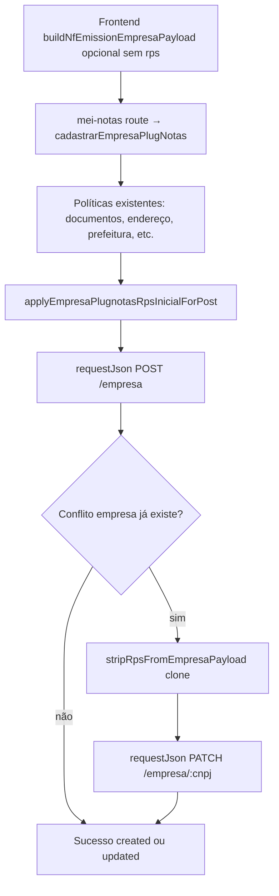
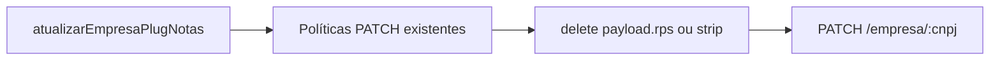

# Arquitetura técnica — **`rps`** inicial canónico no cadastro empresa PlugNotas

**Versão:** 1.0  
**Data:** 2026-04-16  
**Autoria:** Aria (architect / AIOX)  
**Requisitos de origem:** [`docs/prd/PRD-plugnotas-empresa-rps-lote-numero-serie-inicial-1-2026-04-16.md`](../prd/PRD-plugnotas-empresa-rps-lote-numero-serie-inicial-1-2026-04-16.md) (**FR-RPS-POST-01**, **FR-RPS-OVR-01**, **FR-RPS-PATCH-01**, **NFR-RPS-SINGLE-01**, **NFR-RPS-OBS-01**)  
**UX de origem:** [`docs/specs/ux-spec-plugnotas-empresa-rps-inicial-2026-04-16.md`](../specs/ux-spec-plugnotas-empresa-rps-inicial-2026-04-16.md)

Este documento fixa a **política de payload** para o bloco **`rps`**, **pontos de aplicação no BFF**, o **tratamento obrigatório do fallback POST→PATCH** e a **matriz de testes**. Complementa [`docs/adr/ADR-plugnotas-empresa-payload-apenas-nfse.md`](../adr/ADR-plugnotas-empresa-payload-apenas-nfse.md) sem o alterar; uma **nota de um parágrafo** no ADR é opcional (**NFR-RPS-DOC-01**).

**Artefactos relacionados:**

- [`docs/brief/brief-plugnotas-empresa-rps-lote-numero-serie-inicial-1-2026-04-16.md`](../brief/brief-plugnotas-empresa-rps-lote-numero-serie-inicial-1-2026-04-16.md)  
- **Código:** `backend/src/services/plugnotas/empresa.service.js` — `cadastrarEmpresaPlugNotas`, `atualizarEmpresaPlugNotas`, `tryUpdateEmpresa`  
- **Referência API:** [PlugNotas — `addCompany`](https://docs.plugnotas.com.br/#tag/Empresa/operation/addCompany)

---

## 1. Visão de contexto

### 1.1 Decisão de arquitectura

| Decisão | Escolha | Racional |
|---------|---------|----------|
| **Fonte de verdade** | **Backend (BFF)** aplica `rps` canónico antes do `POST /empresa` | **NFR-RPS-SINGLE-01**; evita divergência front/back. |
| **Frontend** | **Opcional** espelhar `rps` em `buildNfEmissionEmpresaPayload` só para paridade DevTools | UX spec §4 — **não** requisito de produto; omitir no MVP reduz superfície de manutenção. |
| **PATCH** | **Nunca** enviar `rps` nesta entrega | **FR-RPS-PATCH-01**; evita repor numeração já consumida. |
| **POST com conflito → PATCH** | **Strip explícito** de `rps` no corpo do **PATCH** de contingência | O código actual reutiliza o **mesmo** objecto `payload` em `tryUpdateEmpresa(cnpj, payload)` após `409`/conflito; sem strip, **violar-se-ia** o PRD. |

### 1.2 Contrato canónico (upstream PlugNotas)

Após política, o objecto enviado a `requestJson('POST', '/empresa', payload)` deve incluir:

```json
"rps": {
  "lote": 1,
  "numeracao": [
    { "numero": 1, "serie": "1" }
  ]
}
```

- **`lote`**, **`numero`:** número (JSON number).  
- **`serie`:** string **`"1"`**.  
- **FR-RPS-OVR-01:** qualquer `rps` vindo do cliente é **substituído** por este bloco no caminho de criação (antes do `POST`).

---

## 2. Fluxo lógico (brownfield)



**Fluxo separado — actualização explícita:**



---

## 3. Pontos de extensão no BFF

### 3.1 Módulo de política (recomendado)

Criar **`backend/src/services/plugnotas/plugnotas-empresa-rps-inicial.js`** (ou nome equivalente no padrão `plugnotas-*.js`) com:

| Função | Semântica |
|--------|------------|
| **`applyEmpresaPlugnotasRpsInicialForPost(payload)`** | Se `payload` é objecto não array: atribuir `payload.rps = { lote: 1, numeracao: [{ numero: 1, serie: '1' }] }` (imutável quanto a valores canónicos). Idempotente. |
| **`stripRpsFromEmpresaPayload(payload)`** | Remove a chave `rps` do objecto (ou devolve **cópia** sem `rps` — preferir cópia rasa se o chamador precisar do original com `rps` para logs de depuração; ver §3.3). |

**Constantes:** `RPS_INICIAL_PLUGNOTAS` exportada só para testes ou `Object.freeze` interno.

**Alternativa aceitável:** funções no próprio `empresa.service.js` se o time quiser zero ficheiros novos — com o custo de aumentar um ficheiro já longo (~1000 linhas).

### 3.2 `cadastrarEmpresaPlugNotas`

**Ordem sugerida** (após políticas que já existem e **imediatamente antes** do `try` que chama `requestJson('POST', '/empresa', payload)`):

1. Manter sequência actual até `applyPrefeituraPortalCredentialsPolicy(...)`.  
2. Chamar **`applyEmpresaPlugnotasRpsInicialForPost(payload)`**.  
3. `requestJson('POST', '/empresa', payload)`.

No ramo **`catch`** quando `isConflictLikeError(createError)`:

- Chamar **`tryUpdateEmpresa(cnpj, stripRpsFromEmpresaPayload(payload))`** — **não** passar `payload` com `rps` no PATCH.

**Nota:** `buildUpdateAttempts` e logs em `raw.attemptedEndpoints` podem ainda referenciar estruturas; garantir que testes cobrem que o **body** do PATCH **não** contém `rps`.

### 3.3 `atualizarEmpresaPlugNotas`

No início do processamento do `payload` (após cópia e normalização de CNPJ), **remover** `rps`:

- `delete payload.rps` **ou** `stripRpsFromEmpresaPayload` in-place.

Isto cumpre **FR-RPS-PATCH-01** mesmo que um cliente envie `rps` manualmente.

### 3.4 Outras rotas

Procurar **`PATCH`** / **`POST`** para `/empresa` no backend; qualquer caminho que actualize empresa deve alinhar-se: **só** `cadastrarEmpresaPlugNotas` → primeiro `POST` leva `rps`; restantes **strip**.

---

## 4. Front-end

| Tema | Directiva |
|------|-----------|
| **MVP** | **Nenhuma** alteração obrigatória em `GuidesMei.tsx` nem em `nfEmissionCompany.ts` (alinha UX **UX-RPS-SURFACE-01**). |
| **Opcional** | Duplicar `rps` canónico em `buildNfEmissionEmpresaPayload` **apenas** se QA/DevTools precisarem de paridade; o BFF continua a **sobrescrever** no POST (**FR-RPS-OVR-01**). |
| **Erros** | Sem novos mapeamentos obrigatórios em `nfseNacionalPlugnotasErrorHints.ts` (UX **UX-RPS-ERR-01**). |

---

## 5. Observabilidade (**NFR-RPS-OBS-01**)

- Reutilizar **logging existente** de `400` no cadastro empresa (`plugnotas-empresa-cadastro-debug`, `plugnotas-empresa-ibge-table-400-log`, etc.).  
- Se a mensagem de erro citar `rps` / `numeracao` / `lote`, o corpo já sanitizado para cliente deve continuar a aplicar-se; **não** é obrigatório novo ficheiro de log salvo a story identifique *gap*.  
- Teste manual: sandbox (**NFR-RPS-SBX-01**) com um CNPJ de teste e verificação do corpo `POST` (proxy ou logs de integração).

---

## 6. Matriz de testes (mínimo)

| Camada | Caso |
|--------|------|
| **Unitário** | `applyEmpresaPlugnotasRpsInicialForPost` — payload vazio parcial, `rps` pré-existente com valores “errados” → sempre canónico. |
| **Unitário** | `stripRpsFromEmpresaPayload` — com e sem `rps`; cópia vs mutação conforme implementação. |
| **Integração / mock** | `cadastrarEmpresaPlugNotas` com `requestJson` mock: primeiro argumento POST contém `rps` esperado. |
| **Integração / mock** | Simular `POST` 409 + `PATCH` 200: corpo do **PATCH** **sem** `rps` (assert explícito). |
| **Integração** | `atualizarEmpresaPlugNotas`: entrada com `rps` no JSON → upstream PATCH **sem** `rps`. |

---

## 7. Riscos técnicos

| Risco | Mitigação |
|-------|-----------|
| Esquecer o strip no **fallback** POST→PATCH | Checklist de code review §3.2; teste dedicado na matriz §6. |
| Duplicar lógica no front e back | MVP: **só** back; ADR/nota se o front espelhar mais tarde. |
| Plugnotas rejeitar `rps` em conta/município específico | Evidência em sandbox; escalação operacional (**NFR-RPS-OBS-01**); não alterar PRD sem novo ciclo. |

---

## 8. Rastreabilidade PRD ↔ arquitectura

| ID PRD | Realização técnica |
|--------|---------------------|
| **FR-RPS-POST-01** | `applyEmpresaPlugnotasRpsInicialForPost` antes de `POST /empresa` |
| **FR-RPS-OVR-01** | Mesma função **sobrescreve** `payload.rps` |
| **FR-RPS-PATCH-01** | `delete`/`strip` em `atualizarEmpresaPlugNotas` + strip no fallback `tryUpdateEmpresa` |
| **NFR-RPS-SINGLE-01** | Módulo único BFF; front opcional |
| **FR-RPS-QA-01** | Matriz §6 |

---

*Arquitectura técnica — Aria (AIOX). Implementação: @dev; story: @sm.*
