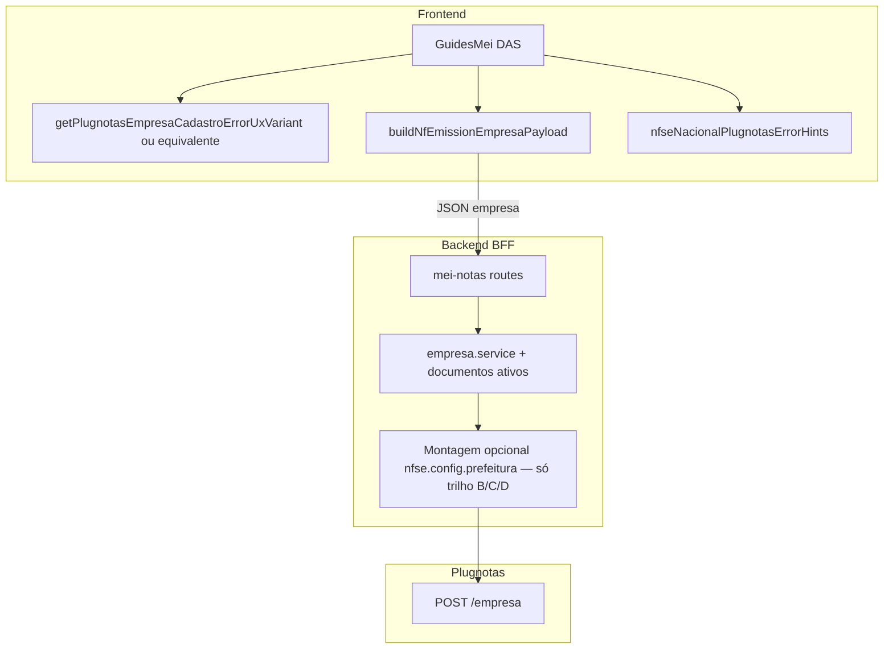

# Arquitetura técnica — **`nfse.config.prefeitura`** vs **`inscricaoMunicipal`** (cadastro empresa Plugnotas)

**Versão:** 1.0  
**Data:** 2026-04-08  
**Autoria:** Aria (architect / AIOX)  
**Requisitos de origem:** [`docs/prd/PRD-plugnotas-empresa-nfse-config-prefeitura-payload-2026-04-08.md`](../prd/PRD-plugnotas-empresa-nfse-config-prefeitura-payload-2026-04-08.md) (**FR-PREF-***, **NFR-PREF-***)  
**UX de origem:** [`docs/specs/ux-spec-plugnotas-nfse-config-prefeitura-payload-2026-04-08.md`](../specs/ux-spec-plugnotas-nfse-config-prefeitura-payload-2026-04-08.md)

Este documento fixa **fronteiras de sistema**, **classificação de erros**, **evolução condicional do payload** e **estado do cliente** para o gap **IM na raiz ≠ `nfse.config.prefeitura`**. **Complementa** (não substitui) a arquitetura NFS-e Nacional e o ADR de spike; **não** inventa schema Plugnotas sem **NFR-PREF-EV-01**.

**Artefactos relacionados:**

- [`docs/technical/architecture-nfse-nacional-sem-im-prefeitura-mei-2026-04-08.md`](architecture-nfse-nacional-sem-im-prefeitura-mei-2026-04-08.md) — baseline nacional, **FR-NAT-ERR-01**.  
- [`docs/technical/architecture-empresa-plugnotas-orquestrada-cadastro-certificado-2026-04-07.md`](architecture-empresa-plugnotas-orquestrada-cadastro-certificado-2026-04-07.md) — fase 2 `POST /empresa`.  
- [`docs/adr/ADR-plugnotas-nfse-nacional-empresa-spike.md`](../adr/ADR-plugnotas-nfse-nacional-empresa-spike.md) — `nfse.nacional`; qualquer `nfse.config.prefeitura` no JSON exige **actualização formal** do ADR (**NFR-PREF-01** / **FR-NA02**).  
- [`docs/adr/ADR-plugnotas-empresa-payload-apenas-nfse.md`](../adr/ADR-plugnotas-empresa-payload-apenas-nfse.md) — **NFR-PREF-02**.  
- [`docs/operacao-mei-nfse.md`](../operacao-mei-nfse.md) — **FR-PREF-DOC-01**.

---

## 1. Visão de contexto

### 1.1 Problema de domínio (contrato)

O Plugnotas valida **`nfse.config.prefeitura`** como ramo **independente** de **`inscricaoMunicipal`** na raiz do JSON de empresa. O produto pode enviar IM preenchida e ainda receber **400** com `fields.nfse.config.prefeitura: Preenchimento obrigatório`. A arquitetura deve:

1. **Explicar** isso na camada de apresentação (variante PREF-L1 da spec UX).  
2. **Não** inferir equivalência no payload nem na validação local.  
3. **Só** mutar `nfse.config` com **prefeitura** após evidência documentada (**NFR-PREF-EV-01**) e decisão PO trilho **B/C/D**.

### 1.2 Fluxo lógico (brownfield + extensões condicionais)



**Trilho A:** ramo **PREF** ausente; alterações limitadas a **VAR**, *hints*, copy, `operacao-mei-nfse.md`.

**Trilhos B/C/D:** **PREF** preenche `nfse.config.prefeitura` conforme ADR; **C/D** podem exigir **campos extra** no formulário ou estado React (ver secção 5).

---

## 2. Fronteiras por camada

| Camada | Responsabilidade (PREF) |
|--------|-------------------------|
| **Frontend** | Classificar mensagem de erro em **`prefeitura-config`** vs **`municipal-generic`** vs **`generic`** (spec UX secção 6); renderizar copy **FR-PREF-UX-01**; *hint* do campo IM **sem** equivalência com `nfse.config.prefeitura` (spec UX secção 4); opcionalmente recolher dados para trilho **C/D** e incluir no payload **só** quando PO/story o definir. |
| **Backend** | Propagar mensagem Plugnotas/BFF sem perder substrings úteis (`nfse.config`, `prefeitura`); **não** adicionar `prefeitura` em `nfse.config` sem ADR (**NFR-PREF-01**); em **B**, derivar valor no servidor a partir de dados já enviados (ex.: `endereco.codigoCidade`) **só** com regra documentada. |
| **Plugnotas** | Autoridade de validação; exige ou dispensa `prefeitura` consoante conta/ambiente (**NFR-N04** no ecossistema NAT). |

---

## 3. Estado actual do código (brownfield)

### 3.1 Detecção de mensagem — `nfseNacionalPlugnotasErrorHints.ts`

- `isPlugnotasEmpresaMunicipalRequirementMessage` já cobre `nfse.config`, `config.prefeitura` e contexto empresa/NFS-e (**FR-PREF-HINT-01**).  
- **Lacuna vs spec UX:** a UI **não** distingue ainda **PREF-L1** (copy específica “configuração da prefeitura no NFS-e”) de **PREF-L2** (só IM na mensagem).

**Direcção:** exportar função pura **adicional** (nome sugerido: `isPlugnotasNfseConfigPrefeituraRequirementMessage`) que retorne `true` só quando a mensagem normalizada indicar **`nfse.config.prefeitura`**, **`config.prefeitura`** ou combinação **prefeitura + obrigatório** no contexto de validação de empresa — **subconjunto** da lógica municipal actual, para evitar duas árvores de regras divergentes.

Contrato interno sugerido:

```ts
/** PREF-L1: erro cita explicitamente prefeitura na config NFS-e (não apenas IM na raiz). */
export function isPlugnotasNfseConfigPrefeituraRequirementMessage(message: string): boolean;

export type PlugnotasEmpresaCadastroErrorUxVariant =
  | 'generic'
  | 'municipal-generic'
  | 'prefeitura-config';

export function getPlugnotasEmpresaCadastroErrorUxVariant(
  message: string
): PlugnotasEmpresaCadastroErrorUxVariant;
```

**Regra de composição:** `getPlugnotasEmpresaCadastroErrorUxVariant` deve implementar a prioridade da spec UX secção 3.2 (**PREF-L1** > **PREF-L2** > **PREF-L3**).

### 3.2 Payload — `nfEmissionCompany.ts` + backend

- Hoje: `nfse.config` típico `{ producao: true }`, sem `prefeitura`; `inscricaoMunicipal` opcional na raiz quando o formulário preenche.  
- **NFR-PREF-02:** política “apenas NFS-e” e `documentosAtivos` permanecem intocáveis salvo story explícita.

### 3.3 UI — `GuidesMei.tsx` e painéis de erro

- Painel âmbar de retry e `GuiaMeiEmpresaCadastroErrorPanel` devem consumir **a mesma** variante (**spec UX secção 5.3**).  
- **404** pós-falha de fase 2: condicionar microcopy (spec UX secção 5.4) a estado local “última tentativa de empresa falhou” — requer **flag** ou enum de último resultado de `plugnotasEmitenteSetup` (ou equivalente), **sem** persistência obrigatória em `localStorage`.

---

## 4. Trilhos técnicos (PRD secção 6)

| Trilho | Mudança de código | Risco arquitetural |
|--------|-------------------|-------------------|
| **A** | Frontend + docs; **zero** `nfse.config.prefeitura` | Baixo; depende de operação Plugnotas. |
| **B** | Backend (e possivelmente cliente só para IBGE consistente): função pura `buildPrefeituraFromCodigoCidade` **só** após schema citável | Alto se schema incerto (**PRD secção 11**). |
| **C** | Frontend: campos condicionais + extensão de `NfEmissionCompanyForm` / payload; backend pode só repassar | Médio; escopo de catálogo contido por PO. |
| **D** | Estado React: após primeiro 400 com variante `prefeitura-config`, revelar bloco **C** ou CTA; opcional *retry* com payload enriquecido | Médio-alto; testes de máquina de estados. |

**Gate:** **NFR-PREF-EV-01** satisfeito antes de merge de **B/C/D** que altere `POST /empresa`.

---

## 5. Estado do cliente (trilho D e 404)

### 5.1 Sinal mínimo recomendado

Após falha na fase empresa (orquestração existente), manter em estado React (ou no módulo de setup):

- `lastEmpresaCadastroErrorMessage: string | null`  
- `lastEmpresaCadastroUxVariant: PlugnotasEmpresaCadastroErrorUxVariant | null`

Isto permite:

1. Renderizar copy **§5.4** da spec UX quando `GET /empresa` devolve 404 **e** `lastEmpresaCadastroUxVariant !== null` (ou flag booleana derivada).  
2. Trilho **D:** mostrar bloco adicional após `prefeitura-config` sem depender só da última mensagem volátil do servidor na mesma renderização.

**Privacidade:** não persistir mensagem bruta com PII em armazenamento persistente (**alinhado** à secção 5 da arquitetura NAT).

### 5.2 Reset de estado

Limpar `lastEmpresaCadastro*` após sucesso de `POST /empresa`, ao sair do painel DAS relevante, ou ao iniciar novo envio completo — critérios finos na story para evitar *stale* hints.

---

## 6. Segurança e dados

- **NFR-PREF-01:** qualquer chave nova em `nfse.config` passa por revisão ADR + revisão de segurança (dados municipais podem ser identificadores sensíveis em alguns desenhos).  
- Logs: não expandir PII nas mensagens de erro logadas; manter redacção existente do BFF.

---

## 7. Testes e qualidade

| Área | Mínimo |
|------|--------|
| Unitário | Casos para `isPlugnotasNfseConfigPrefeituraRequirementMessage` e `getPlugnotasEmpresaCadastroErrorUxVariant` com *string* real do incidente (`fields.nfse.config.prefeitura: Preenchimento obrigatório`) e casos só-IM. |
| Integração / RTL | Opcional: painel âmbar mostra título/corpo PREF-L1 quando variante é `prefeitura-config`. |
| Contrato | Se **FR-PREF-API-01:** actualizar `nfEmissionCompany.test.ts` e testes backend de payload; **NFR-PREF-03** — `npm run lint`, `typecheck`, `test`. |

---

## 8. Riscos e dependências

| Risco | Mitigação |
|-------|-----------|
| Duas famílias de regras (municipal vs prefeitura-config) divergirem | Implementar `prefeitura-config` como **subconjunto** testado contra `isPlugnotasEmpresaMunicipalRequirementMessage`. |
| UI mostrar copy PREF-L1 para falsos positivos | Testes negativos (NFC-e only, mensagens sem contexto empresa). |
| Backend **B** envia objeto `prefeitura` errado | Feature flag ou *kill switch* até sandbox verde; ADR com exemplo redigido. |

---

## 9. Lista de ficheiros impactados (previsão)

| Ficheiro | Trilho A (mínimo) | Trilho B/C/D |
|----------|-------------------|--------------|
| `frontend/src/utils/nfseNacionalPlugnotasErrorHints.ts` | Variante PREF-L1 + testes | Possível reexport / reordenação |
| `frontend/src/pages/GuidesMei.tsx` | Copy condicional; estado 404; *hint* IM | Bloco C/D; estado máquina |
| `frontend/src/components/FiscalIntegrationErrorAlert.tsx` | Props ou composição partilhada | — |
| `frontend/src/utils/nfEmissionCompany.ts` | *Hint* / tipos se formulário C | Campos + `buildNfEmissionEmpresaPayload` |
| `backend/src/services/plugnotas/empresa.service.js` | — | Derivação **B** ou repasse **C** |
| `backend/src/services/plugnotas/plugnotas-empresa-documentos-ativos.js` | — | Mesmo que acima |
| `docs/adr/ADR-plugnotas-nfse-nacional-empresa-spike.md` ou apêndice | — | Schema `prefeitura` |
| `docs/operacao-mei-nfse.md` | **FR-PREF-DOC-01** | — |

---

## 10. Rastreabilidade PRD/UX → arquitetura

| ID | Secção |
|----|--------|
| **FR-PREF-UX-01** | §1, §3.3, §5 |
| **FR-PREF-HINT-01** | §3.1 |
| **FR-PREF-API-01** | §1.2, §4, §9 |
| **FR-PREF-DOC-01** | §9 |
| **NFR-PREF-01** | §2, §6, §8 |
| **NFR-PREF-02** | §3.2 |
| **NFR-PREF-EV-01** | §4 |
| **NFR-PREF-03** | §7 |
| Spec UX PREF-L1/L2, `getPlugnotasEmpresaCadastroErrorUxVariant` | §3.1 |
| Spec UX secção 5.4 (404) | §5.1 |

---

## Change log

| Data | Autor | Nota |
| --- | --- | --- |
| 2026-04-08 | Aria | Versão inicial (PRD PREF + UX spec PREF); complementa arquitetura NAT 2026-04-08. |
