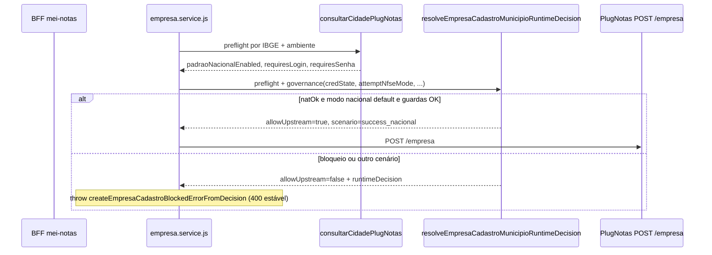

# Arquitetura técnica — precedência do preflight NFS-e Nacional sobre sinal de login municipal (PlugNotas)

**Versão:** 1.0  
**Data:** 2026-04-15  
**Autoria:** Aria (architect / AIOX)  
**PRD de origem:** [`docs/prd/PRD-preflight-nacional-precedencia-sobre-login-municipal-plugnotas-2026-04-15.md`](../prd/PRD-preflight-nacional-precedencia-sobre-login-municipal-plugnotas-2026-04-15.md)  
**UX de origem:** [`docs/specs/ux-spec-preflight-nacional-precedencia-login-municipal-plugnotas-2026-04-15.md`](../specs/ux-spec-preflight-nacional-precedencia-login-municipal-plugnotas-2026-04-15.md)

**Referências externas (contrato PlugNotas):**

- [PlugNotas — Consultar disponibilidade do município e metadados](https://docs.plugnotas.com.br/#operation/getCidadeById)
- [PlugNotas — Empresa / addCompany](https://docs.plugnotas.com.br/#tag/Empresa/operation/addCompany)

**Relação com arquitetura anterior:**

- [`docs/technical/architecture-correcao-runtime-cadastro-empresa-plugnotas-contrato-oficial-triagem-municipal-2026-04-14.md`](./architecture-correcao-runtime-cadastro-empresa-plugnotas-contrato-oficial-triagem-municipal-2026-04-14.md) — descreve o pipeline `adaptador + preflight + motor de decisão`. **Este documento** especifica apenas a **correção da matriz de decisão** quando `padraoNacionalEnabled` e `requiresLogin` / `requiresSenha` coexistem (município “híbrido”).

---

## 1. Resumo executivo

### O que permanece (invariantes)

- Fronteira **browser → BFF → PlugNotas**; sem chamadas diretas ao PlugNotas a partir do cliente.
- Rota pública do cadastro: `POST /api/mei-notas/setup/emissao-fiscal/empresa` (**CR-PFLNAT-01**).
- Operações PlugNotas: `POST /empresa`, fallback `PATCH /empresa/:cnpj`, consulta `GET /empresa/:cnpj` (**CR-PFLNAT-03**).
- Contrato de erro para o frontend: `errors.plugnotasCode`, `errors.runtimeDecision`, `plugnotasRequest`, `httpStatus` — **sem novo schema** obrigatório (**FR-PFLNAT-03**).
- Política de credenciais municipais em `applyPrefeituraPortalCredentialsPolicy` (**prefeituraPortalCredentials.js**) mantém-se; o fix **não** introduz envio de `prefeitura.login` / `senha` no trilho nacional por defeito.

### O que muda

- **Uma única alteração semântica** na função `resolveEmpresaCadastroMunicipioRuntimeDecision` em `backend/src/services/plugnotas/empresa-cadastro-runtime-decision.js`: quando `preflight.padraoNacionalEnabled === true`, o motor deve conceder **`allowUpstream: true`** e cenário **`success_nacional`** (via `buildRuntimeDecisionFromPreflight`) **antes** de entrar nos ramos que devolvem `prefeitura_login_required_blocked` **só** com base em `requiresLogin` / `requiresSenha` **sem** par credencial válido.
- Estado actual do código: os ramos `if (!authRequired && natOk)` e `if (authRequired && !hasValidPair)` fazem com que `authRequired === true` **impedir** `success_nacional` mesmo com `natOk === true`. A correção **reordena / refatora** essa lógica para implementar **DP-PFLNAT-01** e **DP-PFLNAT-02**.

### Decisão arquitetural

**AD-PFLNAT-01:** A precedência “**nacional disponível → permitir upstream no modo nacional default**” é uma **regra do motor de decisão** centralizada em `resolveEmpresaCadastroMunicipioRuntimeDecision`, não uma heurística esparsa em `empresa.service.js`, para manter **uma única fonte de verdade** alinhada aos testes em `backend/tests/empresa-cadastro-runtime-rec500-regression.test.js` e extensões.

---

## 2. Contexto do problema (técnico)

| Sinal do preflight | Significado para o BFF |
|--------------------|-------------------------|
| `padraoNacionalEnabled === true` | Modo NFS-e Nacional está disponível para o município no ambiente considerado. |
| `requiresLogin \|\| requiresSenha` | Metadado indica que, noutros contextos, o portal municipal pode exigir autenticação — **não** implica, sozinho, que o cadastro no **modo nacional** deva ser bloqueado se o nacional está ativo (**DP-PFLNAT-05**). |

**Bug:** `authRequired` é derivado como `Boolean(requiresLogin \|\| requiresSenha)` e avaliado em conjunto com `!authRequired && natOk`, pelo que **`natOk && authRequired` nunca** entra no ramo `success_nacional` e cai em `prefeitura_login_required_blocked` quando `!hasValidPair`.

---

## 3. Máquina de decisão alvo (matriz lógica)

Notação: `natOk = padraoNacionalEnabled === true`, `authRequired = requiresLogin || requiresSenha` (derivado do preflight), `gov` = parâmetros de governança (`prefeituraCredentialsEnabled`, `attemptNfseMode`, `credState`).

**Ordem recomendada de avaliação (conceitual):**

1. **Guardas de payload / credenciais parciais** (já existentes): `hasPartialKeys`, chaves `prefeitura` sem par, etc. — inalterados.
2. **Nacional disponível + tentativa em modo nacional:** se `natOk` **e** o fluxo é o nacional default (`attemptNfseMode === 'nacional'`) **e** não há condição de governança que exija bloqueio explícito (ver secção 4), então **`allowUpstream: true`**, `scenario: 'success_nacional'`.
3. **Sem nacional:** manter ramos `prefeitura_ibge_apenas_insuficiente_dp02` e bloqueios já definidos.
4. **Auth municipal sem nacional ou com regras de trilho municipal:** ramos `prefeitura_login_required_blocked` / `prefeitura_login_required_fallback_available` / `success_municipal` conforme **governança** e par de credenciais — alinhado a **FR-PFLNAT-02**.

A implementação pode **fundir** o passo 2 com os `if` existentes, desde que a propriedade **“`natOk` implica upstream no percurso nacional default sem credenciais municipais”** fique demonstrável por teste (incluindo IBGE **5002704**).

---

## 4. Condições de governança (sem alteração de produto além do PRD)

Estes ramos **devem permanecer** após o refactor:

| Situação | Comportamento esperado |
|----------|-------------------------|
| `credState.hasPartialKeys` | Bloquear com `payload_contrato` / mensagem de paridade — **antes** de nacional. |
| `!authRequired && hasAnyPrefeituraKey` (chaves enviadas sem necessidade) | Bloqueio de contrato — comportamento existente. |
| `authRequired && hasValidPair && prefeituraCredentialsEnabled && attemptNfseMode === 'municipal'` | `success_municipal` / upstream conforme código atual. |
| `authRequired && hasValidPair && !prefeituraCredentialsEnabled` | Bloqueio quando política não permite trilho — mantido. |

**Nota sobre `runEmpresaCadastroMunicipioPreflight` (`empresa.service.js`):** continua a calcular `municipalAuthRequired = Boolean(preflight.requiresLogin || preflight.requiresSenha)` para contexto de `applyPrefeituraPortalCredentialsPolicy`. Em municípios híbridos com nacional, esse boolean pode permanecer `true` **sem** impedir o cadastro nacional **se** o payload **não** incluir bloco `prefeitura` com chaves — a política só age quando há chaves. Nenhuma alteração obrigatória neste ficheiro para **AD-PFLNAT-01**, salvo revisão de testes se algum assert depender da ordem antiga de erro.

---

## 5. Diagrama de sequência (hot path corrigido)

---

## 6. Superfícies e ficheiros

| Camada | Ficheiro / artefacto | Alteração |
|--------|----------------------|-----------|
| **Motor de decisão** | `backend/src/services/plugnotas/empresa-cadastro-runtime-decision.js` | **Obrigatória:** reordenar / refatorar `resolveEmpresaCadastroMunicipioRuntimeDecision` para **DP-PFLNAT-01**–**03**. |
| **Serviço empresa** | `backend/src/services/plugnotas/empresa.service.js` | Opcional: comentário ou teste; lógica de preflight **chama** o motor já corrigido. |
| **Política credenciais** | `backend/src/services/plugnotas/prefeituraPortalCredentials.js` | Sem mudança esperada para este PRD. |
| **Testes** | `backend/tests/empresa-cadastro-runtime-rec500-regression.test.js` (e ficheiros que cubram a matriz) | **Obrigatório:** caso **FR-PFLNAT-04** — preflight com `padraoNacionalEnabled: true`, `requiresLogin: true`, IBGE `5002704`, `allowUpstream: true`, cenário `success_nacional`. |
| **Frontend** | `frontend/src/lib/fiscalUserError.ts`, alertas fiscais | **Sem** mudança estrutural; regressão UX conforme spec (**NFR-PFLNAT-04** gates no repo). |

---

## 7. Contrato HTTP e `runtimeDecision`

- **HTTP:** respostas 400 existentes reutilizam os mesmos `plugnotasCode` (**CR-PFLNAT-02**); apenas **a condição de emissão** muda.
- **`runtimeDecision`:** continua a incluir `padraoNacionalEnabled`, `requiresLogin`, `requiresSenha`, `codigoIbge`, `consultedMunicipio`, `upstreamCallSkipped`, `scenario`, `environment` onde já aplicável (**FR-PFLNAT-03**).
- **Cenário de sucesso:** quando o upstream corre, o serviço já compõe decisão final com `buildEmpresaCadastroSuccessRuntimeDecision` — sem alteração de contrato.

---

## 8. Segurança e observabilidade

| Tópico | Tratamento |
|--------|------------|
| **Segredos** | Chaves PlugNotas apenas no servidor (**NFR-PFLNAT-02**). |
| **Logs** | Não logar credenciais municipais; `runtimeDecision` pode ser útil em nível `debug` já existente — sem dados pessoais em excesso (**NFR-PFLNAT-01**). |
| **Ambiente** | `resolveEmpresaCadastroTargetEnvironment` já deriva produção vs homologação do payload; o preflight deve usar o mesmo ambiente (**NFR-PFLNAT-03**). |

---

## 9. Estratégia de testes (gates)

1. **Unitário:** matriz `resolveEmpresaCadastroMunicipioRuntimeDecision` com combinações `(natOk, authRequired, hasValidPair, prefeituraCredentialsEnabled, attemptNfseMode)`.
2. **Regressão REC500 / brownfield:** garantir que cenários antigos (flag off, sem credenciais, DP02) não quebram.
3. **Gate de repositório:** `npm run lint`, `npm run typecheck`, `npm test` no backend (e monorepo conforme **AGENTS.md**).

---

## 10. Riscos técnicos e mitigação

| Risco | Mitigação |
|-------|-----------|
| Regressão em trilho municipal explícito | Manter testes com `attemptNfseMode === 'municipal'` e `prefeituraCredentialsEnabled` conforme matriz existente. |
| Divergência homologação vs produção no preflight | Testes parametrizados por `environment`. |
| Duplicação de lógica `natOk` fora do motor | **AD-PFLNAT-01:** qualquer novo check deve residir no mesmo módulo ou chamar a função exportada. |

---

## 11. Critérios de prontidão (arquitetura)

- [ ] `resolveEmpresaCadastroMunicipioRuntimeDecision` implementa precedência **nacional antes de bloqueio PLOGIN** para o percurso descrito no PRD.  
- [ ] Teste automatizado cobre IBGE **5002704** (ou mock equivalente) com flags híbridas.  
- [ ] Nenhuma rota nova; nenhuma alteração de OpenAPI interna do BFF além do comportamento de erro já padronizado.  
- [ ] Documentação cruzada: este ficheiro + PRD + UX spec; runbook opcional conforme Story C do PRD.  

---

## 12. Change log

| Data | Versão | Descrição |
|------|--------|-----------|
| 2026-04-15 | 1.0 | Arquitetura técnica inicial (PFLNAT): matriz de decisão, ficheiros, testes e invariantes. |
