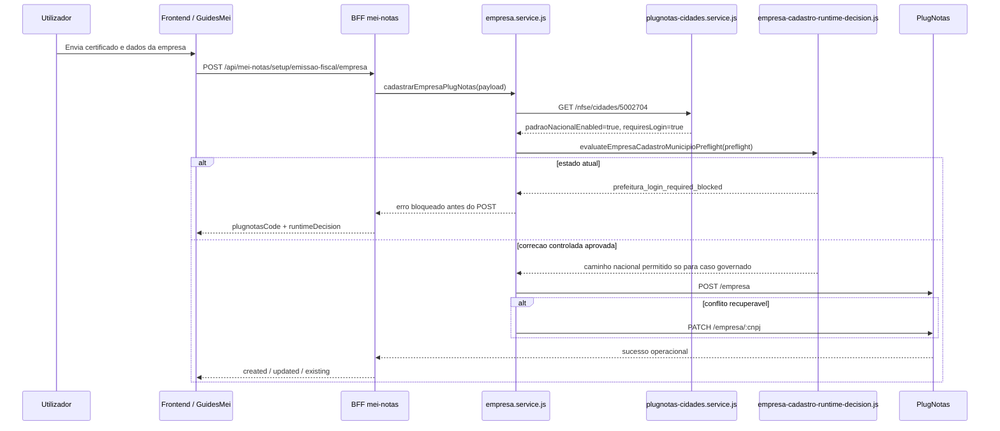

# Arquitetura tecnica -- recorrencia `prefeitura_login_required_blocked` no municipio `5002704`

**Versao:** 1.2  
**Data:** 2026-04-15  
**Autoria:** Aria (architect / AIOX)  
**PRD de origem:** [`docs/prd/PRD-recorrencia-prefeitura-login-required-blocked-5002704-2026-04-14.md`](../prd/PRD-recorrencia-prefeitura-login-required-blocked-5002704-2026-04-14.md)  
**Spec UX de origem:** [`docs/specs/ux-spec-recorrencia-prefeitura-login-required-blocked-5002704-2026-04-14.md`](../specs/ux-spec-recorrencia-prefeitura-login-required-blocked-5002704-2026-04-14.md)

**Referencias externas (contrato):**

- [PlugNotas -- Empresa / addCompany](https://docs.plugnotas.com.br/#tag/Empresa/operation/addCompany)
- [PlugNotas -- Consultar disponibilidade do municipio e metadados](https://docs.plugnotas.com.br/#operation/getCidadeById)
- [PlugNotas -- OpenAPI oficial (`api.json`)](https://docs.plugnotas.com.br/api.json)

---

## 1. Resumo executivo

Esta arquitetura nao desenha um fluxo municipal novo. Ela formaliza como o caso recorrente `5002704` deve ser tratado sobre a arquitetura RTCAD ja existente.

### O que o sistema ja faz hoje

- o frontend continua a chamar `POST /api/mei-notas/setup/emissao-fiscal/empresa`;
- o BFF continua a ser a unica fronteira com o PlugNotas;
- o BFF ja executa `GET /nfse/cidades/{codigoIbge}` antes do cadastro da empresa;
- o motor `evaluateEmpresaCadastroMunicipioPreflight()` bloqueia `requiresLogin=true` ou `requiresSenha=true` antes do `POST /empresa`;
- o frontend ja mapeia `prefeitura_login_required_blocked` como excecao municipal e reduz retry cego.

### O que este documento decide

1. **Epic 1 obrigatorio:** a arquitetura do caso `5002704` e primeiro de descoberta dirigida e decisao governada, nao de bugfix imediato;
2. **Epic 2 condicional:** se produto validar excecao controlada, a mudanca deve acontecer apenas no BFF, no ponto de decisao apos o preflight e antes do `POST /empresa`;
3. **Invariante central:** nao existe inversao global da precedencia `login/senha` vs `padraoNacional`;
4. **Invariante de fronteira:** nenhuma credencial municipal entra no browser nem na UI atual.

### Decisao central

**Arquitetura alvo para `5002704`:** `runtime RTCAD atual + camada de governanca dirigida por municipio/ambiente`, sendo a governanca de descoberta obrigatoria agora e a governanca de excecao tecnica apenas condicional.

---

## 2. Relacao com artefatos existentes

| Artefato | Papel |
|---|---|
| [`docs/technical/architecture-correcao-runtime-cadastro-empresa-plugnotas-contrato-oficial-triagem-municipal-2026-04-14.md`](./architecture-correcao-runtime-cadastro-empresa-plugnotas-contrato-oficial-triagem-municipal-2026-04-14.md) | Arquitetura ampla do cluster RTCAD. Este documento reutiliza essa base e restringe a decisao ao caso `5002704`. |
| [`docs/technical/architecture-resolucao-governada-prefeitura-login-required-blocked-2026-04-13.md`](./architecture-resolucao-governada-prefeitura-login-required-blocked-2026-04-13.md) | Governa o tratamento do codigo `prefeitura_login_required_blocked`; este documento especializa a governanca para recorrencia com municipio identificado. |
| [`docs/specs/ux-spec-recorrencia-prefeitura-login-required-blocked-5002704-2026-04-14.md`](../specs/ux-spec-recorrencia-prefeitura-login-required-blocked-5002704-2026-04-14.md) | Define a experiencia atual bloqueada, a descoberta dirigida e a eventual excecao controlada. |
| [`docs/operacao-mei-nfse.md`](../operacao-mei-nfse.md) | Runbook canonico para triagem e causalidade. |
| [`docs/qa/qa-matriz-rtcad-cadastro-empresa-plugnotas-2026-04-14.md`](../qa/qa-matriz-rtcad-cadastro-empresa-plugnotas-2026-04-14.md) | Matriz QA que deve ganhar linha dedicada para `5002704`. |
| `backend/src/services/plugnotas/empresa.service.js` | Orquestracao atual do cadastro empresa, incluindo preflight, `POST` e fallback `PATCH`. |
| `backend/src/services/plugnotas/empresa-cadastro-runtime-decision.js` | Motor de decisao atual do BFF. |
| `backend/src/services/plugnotas/plugnotas-cidades.service.js` | Preflight municipal no PlugNotas. |
| `backend/src/services/plugnotas/prefeituraPortalCredentials.js` | Policy atual de bloqueio a `prefeitura.login` / `senha`. |
| `frontend/src/lib/fiscalUserError.ts` | Taxonomia e copy da UI para cenarios fiscais. |
| `frontend/src/pages/GuidesMei.tsx` | Orquestracao da jornada e supressao de retry cego em cenarios bloqueados. |

---

## 3. Decisao arquitetural

**Decisao principal:** manter a arquitetura brownfield `frontend -> BFF -> PlugNotas` e introduzir, para `5002704`, apenas uma camada de governanca sobre o ponto de decisao ja existente no backend.

### Invariantes

- a rota publica continua `POST /api/mei-notas/setup/emissao-fiscal/empresa`;
- o browser nao chama o PlugNotas diretamente;
- o BFF continua a concentrar token, URL base, preflight, classificacao e fallback;
- `prefeitura_login_required_blocked` permanece valido para todos os demais municipios;
- a UI continua com duas fases visiveis: `certificado` e `empresa`;
- nao ha coleta nem persistencia de `prefeitura.login` / `senha`;
- qualquer excecao futura para `5002704` deve ser governada por municipio/ambiente ou regra equivalente, e nao por inversao geral da regra.

### Fora da decisao

- nao criar fluxo municipal-first;
- nao abrir feature flag ampla para credenciais municipais;
- nao alterar schema de banco;
- nao criar endpoint publico novo;
- nao alterar a taxonomia geral da UI para todos os municipios a partir deste caso.

---

## 4. Estado atual no codigo

### 4.1 Backend

| Componente atual | Comportamento observado |
|---|---|
| `resolveEmpresaCadastroMunicipioPreflightInput()` | exige `endereco.codigoCidade` valido e define ambiente `producao`/`homologacao` |
| `consultarCidadePlugNotas()` | chama `GET /nfse/cidades/{codigoIbge}` e normaliza `padraoNacionalEnabled`, `requiresLogin`, `requiresSenha` |
| `evaluateEmpresaCadastroMunicipioPreflight()` | bloqueia quando `requiresLogin` ou `requiresSenha` sao `true`; so segue com `padraoNacionalEnabled === true` e sem auth municipal |
| `runEmpresaCadastroMunicipioPreflight()` | executa o preflight antes do `POST`/`PATCH` e lanca erro bloqueado quando o cenario nao e `success_nacional` |
| `applyPrefeituraPortalCredentialsPolicy()` | rejeita payload com `nfse.config.prefeitura.login` ou `senha` antes de qualquer chamada externa |
| `cadastrarEmpresaPlugNotas()` / `atualizarEmpresaPlugNotas()` | preservam o contrato publico atual, com `POST /empresa` e fallback `PATCH /empresa/:cnpj` |

### 4.2 Frontend

| Componente atual | Comportamento observado |
|---|---|
| `resolveMeiFiscalScenario()` | reconhece `prefeitura_login_required_blocked` e `prefeitura_ibge_apenas_insuficiente_dp02` por codigo estavel |
| `mapMeiFiscalErrorToCopy()` | apresenta `prefeitura_login_required_blocked` como excecao municipal nao suportada |
| `GuidesMei.tsx` | calcula `plugnotasRetryBlockedByScenario` e suprime retry cego nos cenarios bloqueados |
| `getPlugnotasEmpresaCadastroErrorUxVariant()` | mantem a variante `prefeitura-login-required` como hint textual de fallback |
| `buildNfEmissionEmpresaPayload()` | ja emite contrato nacional oficial (`nfse.config.nfseNacional` + `consultaNfseNacional`) sem credenciais municipais |

### 4.3 Consequencia arquitetural

O caso `5002704` nao nasce de ausencia de infraestrutura tecnica. Ele nasce da **regra ja implementada** no motor de decisao do BFF. Por isso a arquitetura correta e discovery-first, com correcao condicionada apenas se a governanca validar.

---

## 5. Visao de contexto do caso `5002704`



---

## 6. Arquitetura alvo por epico

### 6.1 Epic 1 -- descoberta e decisao de produto

**Natureza arquitetural:** governanca, observabilidade e rastreabilidade; sem alterar a regra de negocio publica do runtime.

#### Objetivo tecnico

- consolidar evidencias redigidas do preflight de `5002704`;
- comparar comportamento por ambiente;
- fechar se o caso e erro de policy local excessiva ou dependencia municipal legitima;
- preparar o ponto de extensao tecnico sem o ativar prematuramente.

#### Mudancas permitidas neste epico

- documentacao tecnica;
- runbook e QA;
- teste automatizado do ramo hibrido atual;
- observabilidade/redaction adicionais, se necessarias;
- eventuais ajustes nao-breaking no `runtimeDecision` ja existente.

#### Mudancas proibidas neste epico

- override ativo para `5002704`;
- mudanca na precedencia geral do motor;
- UI nova para credenciais municipais;
- nova rota publica.

### 6.2 Epic 2 -- correcao controlada do runtime (condicional)

**Natureza arquitetural:** extensao estreita no BFF para um caso governado.

#### Objetivo tecnico

Permitir que o caso aprovado de `5002704` atravesse o caminho nacional **sem** transformar `padraoNacionalEnabled=true` em vitoria geral sobre `requiresLogin` / `requiresSenha`.

#### Restricao central

A correcao precisa ser:

- server-side;
- governada por municipio/ambiente ou regra equivalente;
- limitada ao ponto de decisao;
- transparente para o contrato publico;
- neutra para os demais municipios.

---

## 7. Ponto de extensao recomendado

### 7.1 Onde a governanca deve entrar

O ponto de extensao correto fica **entre** o resultado normalizado do preflight e a decisao final que hoje devolve `prefeitura_login_required_blocked`.

Em termos logicos:

```text
preflight -> governanca do caso -> decisao final -> POST/PATCH ou bloqueio
```

### 7.2 Porque este e o ponto certo

- o preflight ja concentra a verdade do municipio por ambiente;
- o motor de decisao ja concentra a regra que hoje bloqueia;
- colocar a excecao antes do preflight nao faz sentido, porque o caso depende precisamente da semantica do preflight;
- colocar a excecao no frontend violaria `DP-REC500-05` e criaria divergencia entre UI e backend.

### 7.3 Forma arquitetural recomendada

**Opcao recomendada:** adicionar uma camada server-side dedicada de governanca estreita, por exemplo um helper separado ou extensao isolada do motor atual.

Responsabilidade desta camada:

- receber `codigoIbge`, ambiente e booleans do preflight;
- verificar se existe decisao formal aprovada para o caso;
- devolver uma de duas respostas:
  - `manter_bloqueio_vigente`
  - `permitir_caminho_nacional_controlado`

### 7.4 Formato logico recomendado

```ts
type GovernedMunicipioHybridRule = {
  codigoIbge: string;
  environment: 'producao' | 'homologacao' | 'all';
  requiresPadraoNacionalEnabled: true;
  appliesWhenLoginRequired?: boolean;
  appliesWhenSenhaRequired?: boolean;
  decision: 'permitir_caminho_nacional_controlado';
  source: 'decisao_produto_validada';
};
```

### 7.5 Regra de seguranca

Se nao houver regra governada valida para `5002704`, o comportamento continua exatamente igual ao atual.

---

## 8. Maquina de decisao para `5002704`

### 8.1 Estado atual

| Preflight `5002704` | Acao atual |
|---|---|
| `requiresLogin=true` ou `requiresSenha=true` | bloquear antes do `POST /empresa` com `prefeitura_login_required_blocked` |

### 8.2 Estado futuro condicional

| Preflight `5002704` | Regra governada | Acao |
|---|---|---|
| `padraoNacionalEnabled=true` + `requiresLogin=true` | ausente | manter bloqueio atual |
| `padraoNacionalEnabled=true` + `requiresLogin=true` | presente e validada | permitir caminho nacional controlado |
| `padraoNacionalEnabled!=true` | qualquer | manter bloqueio atual |
| qualquer outro municipio | qualquer | manter regra geral atual |

### 8.3 Pseudocodigo recomendado

```text
preflight = consultarCidadePlugNotas(codigoIbge, environment)

if !preflight:
  bloquear_ambiente_configuracao()

if caso_governado_aprovado(preflight, codigoIbge, environment):
  seguir_para_post_empresa()

if preflight.requiresLogin || preflight.requiresSenha:
  bloquear_prefeitura_login_required_blocked()

if preflight.padraoNacionalEnabled === true:
  seguir_para_post_empresa()

bloquear_prefeitura_ibge_apenas_insuficiente_dp02()
```

### 8.4 Propriedade importante

O `if caso_governado_aprovado(...)` e **aditivo e estreito**. Ele nao substitui o motor atual; ele apenas intercepta o ramo hibrido aprovado antes da regra geral de bloqueio.

---

## 9. Contrato BFF -> frontend

### 9.1 O que deve permanecer

- `errors.plugnotasCode`;
- `errors.httpStatus`;
- `errors.plugnotasRequest` quando houver chamada externa relevante;
- `errors.runtimeDecision` ou `data.runtimeDecision` como metadado opcional sanitizado;
- `operation = created|updated|existing` no sucesso.

### 9.2 Comportamento no estado atual

Para `5002704` enquanto bloqueado:

- `plugnotasCode = prefeitura_login_required_blocked`;
- `runtimeDecision.scenario = prefeitura_login_required_blocked`;
- `runtimeDecision.codigoIbge = 5002704`;
- `runtimeDecision.upstreamCallSkipped = true`;
- a UI continua no estado `REC500-UX-L1`.

### 9.3 Comportamento se a excecao for aprovada

Para `5002704` com correcao controlada aprovada:

- nao e necessario novo `plugnotasCode` publico;
- o frontend deve ver sucesso operacional normal (`created`, `updated` ou `existing`);
- a diferenciacao de que houve regra governada pode ficar apenas em observabilidade e QA;
- a UX segue `REC500-UX-L3` sem "modo especial" visivel.

### 9.4 Consequencia importante

A taxonomia publica do frontend nao precisa de proliferacao de novos codigos para suportar a excecao. O contrato atual ja suporta:

- bloqueio governado por codigo estavel existente;
- sucesso governado por operacao normal.

---

## 10. Impacto no frontend

### 10.1 Epic 1

Impacto minimo ou nulo em codigo.

O que precisa ficar consistente:

- `fiscalUserError.ts` continua a tratar `prefeitura_login_required_blocked` como excecao municipal;
- `GuidesMei.tsx` continua a suprimir retry cego para esse cenario;
- `nfseNacionalPlugnotasErrorHints.ts` continua apenas como hint secundario;
- QA e runbook passam a distinguir explicitamente `5002704`.

### 10.2 Epic 2 condicional

Se a excecao controlada for aprovada:

- o frontend nao ganha novo formulario;
- o frontend nao ganha nova rota;
- o frontend apenas passa a ver sucesso normal quando o BFF permitir o caminho governado;
- o bloqueio atual continua para todos os demais casos.

### 10.3 Consequencia arquitetural

Este desenho mantem a UX simples porque desloca toda a complexidade do caso `5002704` para o BFF e para a governanca documental, e nao para o browser.

---

## 11. Observabilidade, evidencia e redaction

### 11.1 Sinais que precisam existir

- `codigoIbge` normalizado;
- ambiente do preflight;
- `padraoNacionalEnabled`;
- `requiresLogin`;
- `requiresSenha`;
- se houve ou nao `upstreamCallSkipped`;
- decisao final do caso (`bloqueado`, `permitido_controlado`, `fase_2_municipal`);
- se uma regra governada foi aplicada.

### 11.2 Onde isso deve viver

- logs estruturados server-side;
- matriz QA;
- runbook operacional;
- PRD e arquitetura;
- evidencias redigidas por ambiente.

### 11.3 O que nao pode aparecer

- token PlugNotas;
- certificado bruto;
- payload sensivel completo;
- qualquer credencial municipal;
- evidencia com dados reais nao redigidos.

---

## 12. Testabilidade

### 12.1 Backend

Cobertura obrigatoria ou recomendada:

- `evaluateEmpresaCadastroMunicipioPreflight()` com `padraoNacionalEnabled=true` + `requiresLogin=true`;
- `runEmpresaCadastroMunicipioPreflight()` bloqueando antes do `POST`;
- regra governada inexistente mantendo bloqueio;
- regra governada existente permitindo caminho nacional controlado;
- nao regressao para municipios fora do escopo;
- fallback `POST` -> `PATCH` intacto quando o caso governado prosseguir.

### 12.2 Frontend

Cobertura obrigatoria ou recomendada:

- `prefeitura_login_required_blocked` continua sem pedir credenciais;
- retry cego continua bloqueado no estado atual;
- se houver sucesso governado, a UI o trata como sucesso operacional normal;
- nenhum ajuste global nos hints faz `padraoNacional=true` vencer sempre.

### 12.3 QA documental

Cobertura obrigatoria:

- linha dedicada para `5002704` na matriz QA;
- resultado por ambiente;
- estado atual da decisao (`em descoberta`, `excecao controlada`, `fase 2 municipal`);
- referencia cruzada a este documento.

---

## 13. Rollout

### 13.1 Fase obrigatoria

1. concluir evidencias de `producao`;
2. capturar ou justificar ausencia de `homologacao`;
3. obter validacao do fornecedor ou evidencia equivalente;
4. decidir entre `manter bloqueio`, `correcao controlada` ou `fase 2 municipal`.

### 13.2 Fase condicional

Somente se houver aprovacao de correcao controlada:

1. introduzir regra governada server-side;
2. ativar testes do ramo hibrido aprovado;
3. validar comportamento apenas para `5002704` e ambiente autorizado;
4. atualizar matriz QA e runbook;
5. observar se o sucesso aparece sem regressao na taxonomia existente.

### 13.3 Fallback

Se qualquer validacao falhar:

- remover ou desativar a regra governada;
- voltar ao bloqueio atual;
- manter o caso como backlog fase 2 municipal ou descoberta inconclusiva, conforme decisao de produto.

---

## 14. Riscos tecnicos e mitigacoes

| Risco | Impacto | Mitigacao |
|---|---|---|
| Inverter globalmente a precedencia sem querer | municipios realmente municipais passam no caminho errado | ponto de extensao estreito e condicional, fora da regra global |
| Colocar a excecao no frontend | divergencia entre UX e backend, risco de bypass narrativo | excecao apenas no BFF |
| Criar override sem evidencias por ambiente | comportamento diferente entre producao e homologacao | discovery-first obrigatorio |
| Proliferar novos codigos publicos | aumento de acoplamento no frontend sem necessidade | reaproveitar sucesso operacional normal e codigo bloqueado existente |
| Tratar `5002704` como modelo para todos os casos | regressao brownfield e escopo inflado | governanca por municipio/ambiente ou equivalente |

---

## 15. Mapeamento PRD + UX -> realizacao tecnica

| Origem | Materializacao arquitetural |
|---|---|
| **DP-REC500-01** | discovery-first e governanca explicita do caso |
| **DP-REC500-02** | proibicao de inversao global da precedencia |
| **DP-REC500-03** | camada estreita de governanca server-side por municipio/ambiente |
| **DP-REC500-04** | se a validacao reprovar a excecao, manter bloqueio e abrir backlog fase 2 |
| **DP-REC500-05** | BFF continua como fronteira unica com o PlugNotas |
| **FR-REC500-01/02** | trilha de evidencia por ambiente com preflight redigido |
| **FR-REC500-03** | decisao formal unica do caso |
| **FR-REC500-04/05** | correcao controlada sem contaminar outros ramos RTCAD |
| **FR-REC500-06** | testes automatizados do ramo hibrido |
| **FR-REC500-07/08** | matriz QA e runbook alinhados ao resultado |
| **FR-REC500-09** | saida explicita para backlog fase 2 municipal |
| **UX REC500-UX-L1** | estado atual bloqueado com CTA operacional, sem retry cego |
| **UX REC500-UX-L3** | sucesso governado tratado como sucesso normal |
| **UX REC500-UX-L4** | manutencao honesta do bloqueio se fase 2 municipal for confirmada |

---

## 16. Criterios de aceite arquiteturais

- [ ] A arquitetura preserva `frontend -> BFF -> PlugNotas` como fronteira oficial.
- [ ] O estado atual de `5002704` continua explicitamente bloqueado antes do `POST /empresa`.
- [ ] O `Epic 1` pode ser executado sem alterar rota publica nem abrir UI municipal.
- [ ] Qualquer `Epic 2` entra apenas no ponto de decisao apos o preflight.
- [ ] Nao existe inversao global da precedencia `login/senha` vs `padraoNacional`.
- [ ] O frontend nao precisa de novos codigos publicos para suportar a excecao controlada.
- [ ] QA e runbook recebem linha dedicada para `5002704`.
- [ ] Nenhuma credencial municipal e exposta ao browser.

---

## 17. Proximos passos arquiteturais

1. Revisar esta arquitetura com Produto, QA e Frontend.
2. Fechar o formato da evidencia redigida por ambiente para `5002704`.
3. So desenhar a regra governada concreta se a Story 1.2 aprovar correcao controlada.
4. Se a decisao for fase 2 municipal, usar este documento como baseline historica e abrir arquitetura dedicada para a iniciativa seguinte.

---

## 18. Decisao formal REC500 — espelho (PRD v1.1, 2026-04-15)

Espelho coerente com [`docs/prd/PRD-recorrencia-prefeitura-login-required-blocked-5002704-2026-04-14.md`](../prd/PRD-recorrencia-prefeitura-login-required-blocked-5002704-2026-04-14.md) secao **18**.

| Campo | Valor |
|-------|--------|
| **Resultado unico** | **manter policy vigente** |
| **Evidencia base** | [`docs/qa/rec500-preflight-5002704-ambientes-2026-04-14.md`](../qa/rec500-preflight-5002704-ambientes-2026-04-14.md) |
| **Epic 2** | **Nao iniciar** enquanto a decisao for manter policy; regra governada server-side apenas apos eventual **correcao controlada** futura e aprovacao formal. |
| **Fase 2 municipal** | **Nao** confundir com Epic 2; backlog separado se credencial municipal na jornada for iniciativa futura explicita. |

**Implicacao tecnica imediata:** nenhuma alteracao no motor `evaluateEmpresaCadastroMunicipioPreflight()` nem no ponto de extensao pos-preflight para `5002704` nesta entrega; continuidade do bloqueio atual antes do `POST /empresa`.

**Rastreabilidade QA/docs (Story 1.3):** linha `RTCAD-REC500-01` em [`docs/qa/qa-matriz-rtcad-cadastro-empresa-plugnotas-2026-04-14.md`](../qa/qa-matriz-rtcad-cadastro-empresa-plugnotas-2026-04-14.md); runbook [`docs/operacao-mei-nfse.md`](../operacao-mei-nfse.md) (`#rec500-ibge-5002704-caso-recorrente`).

---

## 19. Change log

| Versao | Data | Nota |
|---|---|---|
| 1.0 | 2026-04-14 | Arquitetura tecnica inicial da recorrencia `5002704`, baseada no PRD e na spec UX, com discovery-first obrigatorio e correcao apenas condicional no BFF. |
| 1.1 | 2026-04-15 | Espelho da decisao formal `manter policy vigente` (PRD secao 18); Epic 2 nao acionado; versao de documento alinhada ao PRD 1.1. |
| 1.2 | 2026-04-15 | Ponteiros para matriz RTCAD e runbook REC500 (alinhamento Story 1.3); coerente com PRD 1.2. |

---

*Arquitetura brownfield -- Meu Financeiro / Guia MEI -- caso recorrente `5002704`; governanca obrigatoria agora, override tecnico apenas se houver validacao formal.*
