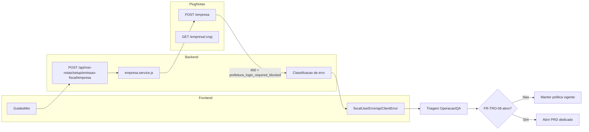
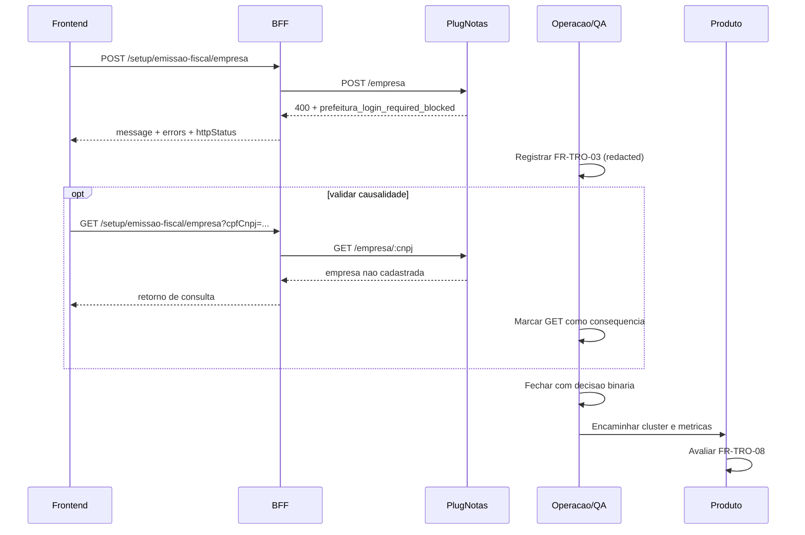

# Arquitetura tecnica — resolucao governada `prefeitura_login_required_blocked`

**Versao:** 1.0  
**Data:** 2026-04-13  
**Autoria:** Aria (architect / AIOX)  
**PRD de origem:** [`docs/prd/PRD-resolucao-governada-prefeitura-login-required-blocked-2026-04-13.md`](../prd/PRD-resolucao-governada-prefeitura-login-required-blocked-2026-04-13.md)  
**Spec UX de origem:** [`docs/specs/ux-spec-resolucao-governada-prefeitura-login-required-blocked-2026-04-13.md`](../specs/ux-spec-resolucao-governada-prefeitura-login-required-blocked-2026-04-13.md)

---

## 1. Resumo executivo

Esta arquitetura define o desenho tecnico para tratar o cenario:

- `POST /api/mei-notas/setup/emissao-fiscal/empresa` com `HTTP 400`;
- `errors.plugnotasCode = prefeitura_login_required_blocked`.

A decisao central e manter o runtime atual (Frontend -> BFF -> PlugNotas), sem criar fluxo municipal novo, e aplicar uma camada de governanca operacional em dois trilhos:

1. **Trilho A (obrigatorio):** triagem padronizada, evidencia minima FR-TRO-03 e decisao binaria.
2. **Trilho B (condicional):** escalonamento para iniciativa nova somente quando houver gatilho FR-TRO-08.

Nao ha mudanca de schema, endpoint novo ou alteracao de contrato funcional para esta iniciativa.

---

## 2. Relacao com artefatos existentes

| Artefato | Papel |
|---|---|
| [`docs/technical/architecture-tratativa-operacional-prefeitura-login-required-blocked-2026-04-13.md`](./architecture-tratativa-operacional-prefeitura-login-required-blocked-2026-04-13.md) | Baseline tecnico da tratativa operacional. |
| [`docs/technical/architecture-nfse-nacional-padrao-bloqueio-excecao-credenciais-prefeitura-plugnotas-2026-04-10.md`](./architecture-nfse-nacional-padrao-bloqueio-excecao-credenciais-prefeitura-plugnotas-2026-04-10.md) | Politica nacional-first e bloqueio de excecao municipal sem credenciais no fluxo atual. |
| [`docs/specs/ux-spec-resolucao-governada-prefeitura-login-required-blocked-2026-04-13.md`](../specs/ux-spec-resolucao-governada-prefeitura-login-required-blocked-2026-04-13.md) | Contrato UX para narrativa, estados, acessibilidade e handoff. |
| [`docs/operacao-mei-nfse.md`](../operacao-mei-nfse.md) | Protocolo canonico de operacao/QA. |
| [`docs/architecture/project-decisions/tro-governanca-gatilhos-escalonamento-prefeitura-login-required-blocked-2026-04-13.md`](../architecture/project-decisions/tro-governanca-gatilhos-escalonamento-prefeitura-login-required-blocked-2026-04-13.md) | Fonte de governanca dos gatilhos FR-TRO-08 por cluster. |

---

## 3. Objetivos arquiteturais

1. Preservar a politica NFS-e Nacional como fluxo padrao.
2. Evitar reclassificacao incorreta como "erro de endpoint" para `prefeitura_login_required_blocked`.
3. Padronizar saida tecnica para operacao/QA com metadados minimos e rastreaveis.
4. Separar decisao operacional imediata de decisao de produto para escalonamento.
5. Garantir compatibilidade brownfield (sem breaking change de contrato).

---

## 4. Decisoes arquiteturais e invariantes

### 4.1 Invariantes obrigatorios

1. `prefeitura_login_required_blocked` e excecao nao suportada no fluxo nacional atual.
2. Sem suporte a `login`/`senha` municipal neste fluxo.
3. Sem alteracao funcional do endpoint atual para "contornar" o caso.
4. Escalonamento de iniciativa nova apenas por FR-TRO-08.
5. Evidencia redigida e auditavel por ticket/ambiente/responsavel.

### 4.2 Consequencias tecnicas

- O desenho e de **governanca de comportamento** e **padronizacao de diagnostico**, nao de nova feature de emissao municipal.
- Reaproveitamento total da arquitetura existente de runtime.
- Evolucao futura (suporte municipal) depende de novo PRD + nova arquitetura dedicada.

---

## 5. Contexto de sistema e fluxo tecnico



---

## 6. Sequencia operacional-governada



---

## 7. Componentes e responsabilidades

| Camada | Componente | Responsabilidade |
|---|---|---|
| Frontend | `frontend/src/pages/GuidesMei.tsx` | Submeter fluxo, exibir estados de erro, manter narrativa nacional-first. |
| Frontend dominio | `frontend/src/lib/fiscalUserError.ts` | Traduzir erro tecnico para mensagem consistente de usuario/operacao. |
| Frontend util | `frontend/src/utils/apiClientError.ts` | Preservar metadados tecnicos relevantes para triagem. |
| Backend integracao | `backend/src/services/plugnotas/empresa.service.js` | Chamar upstream e normalizar erro para contrato interno. |
| Backend API | rotas/controladores `mei-notas` | Entregar contrato estavel para o frontend. |
| Operacao/QA | runbook + artefatos `docs/qa/` | Registrar evidencia FR-TRO-03 e decisao final por ocorrencia. |
| Produto | governanca TRO | Reavaliar gatilhos e decidir escalonamento por cluster. |

---

## 8. Contrato tecnico de erro e evidencia

<a id="arch-fr-tro-campos-evidencia"></a>

### 8.1 Campos minimos obrigatorios (FR-TRO-03)

1. `message`
2. `errors.plugnotasCode`
3. `errors.plugnotasRequest.method`
4. `errors.plugnotasRequest.path`
5. `errors.httpStatus`

### 8.2 Exemplo de payload de evidencia

```json
{
  "message": "Fluxo nacional vigente nao suporta esta exigencia municipal.",
  "errors": {
    "plugnotasCode": "prefeitura_login_required_blocked",
    "plugnotasRequest": {
      "method": "POST",
      "path": "/empresa"
    },
    "httpStatus": 400
  }
}
```

### 8.3 Regras de redaction

- nunca registrar segredo, certificado, token ou senha;
- nunca anexar payload sensivel bruto sem mascara;
- sempre identificar ambiente (`local`, `homologacao`, `producao controlada`).

---

## 9. Motor de decisao (operacional e de governanca)

<a id="arch-fr-tro-classificacao-operacional"></a>

### 9.1 Classificacao operacional (trilho A)

```text
if plugnotasCode == prefeitura_login_required_blocked:
  classificacao = "nao suportado no fluxo nacional"
  decisao_final = "esperado pela politica vigente" (default)
  validar_causalidade_post_get()
else:
  seguir triagem padrao por codigo
```

<a id="arch-fr-tro-escalonamento-governado"></a>

### 9.2 Escalonamento governado (trilho B)

```text
if gatilho in [volume_recorrente_impacto_operacional,
               demanda_comercial_explicita,
               decisao_estrategica_ampliar_cobertura]:
  abrir_PRD_dedicado()
else:
  manter_politica_vigente()
```

<a id="arch-fr-tro-saidas-cluster"></a>

### 9.3 Saidas obrigatorias por ocorrencia/cluster

- decisao binaria registrada;
- ticket + artefato local vinculados;
- resultado de reavaliacao FR-TRO-08 por cluster;
- proxima revisao registrada em governanca.

---

## 10. Compatibilidade e impacto brownfield

| Area | Impacto esperado |
|---|---|
| Endpoints existentes | Nenhuma mudanca de assinatura/rota. |
| Banco de dados | Nenhuma migracao requerida. |
| Frontend | Ajustes apenas de narrativa/estado, quando necessario. |
| Backend | Ajustes apenas de classificacao/normalizacao, quando necessario. |
| Runbook/governanca | Evolucao principal desta iniciativa. |

Regra: qualquer mudanca que altere contrato funcional atual deve sair desta arquitetura e entrar em iniciativa dedicada.

---

## 11. Seguranca, observabilidade e compliance

1. **Seguranca:** nao coletar credenciais municipais no fluxo atual.
2. **Observabilidade:** preservar metadados estruturados para diagnostico (sem dados sensiveis).
3. **Compliance:** redaction obrigatoria e trilha auditavel por ticket/artefato.
4. **Confiabilidade:** manter causalidade entre falha de cadastro (`POST`) e consulta negativa posterior (`GET`).

---

## 12. Estrategia de validacao tecnica

<a id="arch-fr-tro-validacao-funcional"></a>

### 12.1 Validacao funcional

- confirmar classificacao correta para `prefeitura_login_required_blocked`;
- confirmar ausencia de narrativa "endpoint errado";
- confirmar decisao binaria em todas as ocorrencias auditadas.

### 12.2 Validacao de UX

- mensagem de erro alinhada ao contrato UX;
- acessibilidade minima WCAG AA para alertas principais;
- CTAs de proximo passo consistentes com runbook.

### 12.3 Gates de qualidade (quando houver alteracao de codigo)

- `npm run lint`
- `npm run typecheck`
- `npm run test`

---

<a id="arch-fr-tro-riscos-tecnicos"></a>

## 13. Riscos tecnicos e mitigacoes

| Risco | Impacto | Mitigacao |
|---|---|---|
| Reclassificacao indevida como bug de endpoint | Retrabalho entre times | Reforcar motor de decisao e checklist FR-TRO-03. |
| Escalonamento ad hoc sem gatilho | Desvio de roadmap | Exigir governanca FR-TRO-08 com aprovador formal. |
| Deriva entre docs (PRD/spec/runbook) | Inconsistencia operacional | Manter fonte canonica unica e links cruzados obrigatorios. |
| Evidencia incompleta ou sensivel | Risco de auditoria/compliance | Template padrao com redaction obrigatoria e revisao QA. |

---

## 14. Rastreabilidade PRD + UX -> arquitetura

| Origem | Materializacao arquitetural |
|---|---|
| FR-TRO-01/02 | Regra de classificacao fixa e proibicao de "endpoint errado". |
| FR-TRO-03 | Contrato minimo de evidencia estruturada (secao 8). |
| FR-TRO-04 | Regra tecnica de causalidade `POST` -> `GET`. |
| FR-TRO-05/06 | Encerramento binario com ticket + artefato por ocorrencia. |
| FR-TRO-07/08 | Gate de escalonamento por gatilho e decisao por cluster. |
| NFR-TRO-01/02/05 | Redaction, ambiente identificado e trilha auditavel. |
| NFR-TRO-03/04 | Sem remendo funcional de endpoint e governanca com baixo overhead. |
| UX Secoes 6/7/8 | Fluxos A/B/C, regras de copy e estados de interface. |
| UX Secao 9 | Requisitos de acessibilidade para alertas e feedback. |

---

## 15. Criterios de aceite tecnicos

- [ ] Runtime atual preservado (sem novo endpoint e sem migracao).
- [ ] Classificacao `prefeitura_login_required_blocked` padronizada no fluxo.
- [ ] Evidencia FR-TRO-03 capturada com redaction e ambiente definido.
- [ ] Causalidade `POST` falho -> `GET` consequente preservada.
- [ ] Decisao binaria registrada por ocorrencia e por cluster.
- [ ] Escalonamento para iniciativa nova apenas por FR-TRO-08.

---

## 16. Proximos passos arquiteturais

1. Revisar arquitetura com Produto, Operacao/QA e Frontend.
2. Validar aderencia dos artefatos operacionais ao contrato FR-TRO-03.
3. Criar stories tecnicas somente se houver gap real de classificacao/copy.
4. Se FR-TRO-08 ativar, abrir arquitetura complementar para iniciativa nova.

---

## 17. Change log

| Versao | Data | Nota |
|---|---|---|
| 1.0 | 2026-04-13 | Arquitetura tecnica inicial da resolucao governada (`trilho A/B`) baseada no PRD e na spec UX de 13/04/2026. |
