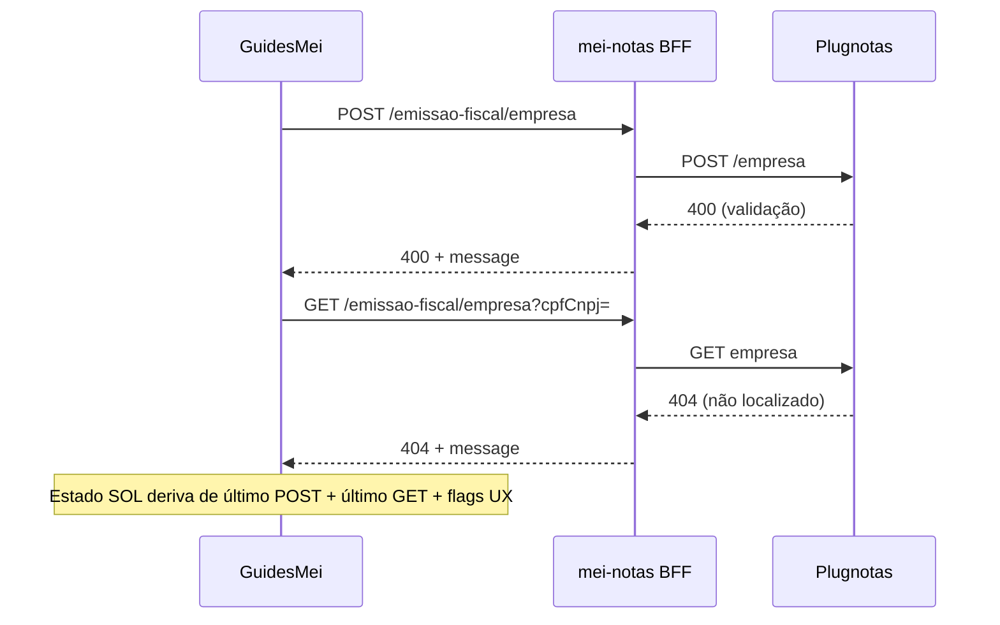

# Arquitetura técnica — Encadeamento **400** (`prefeitura`) → **404** (`GET` empresa) no Guia MEI

**Versão:** 1.0  
**Data:** 2026-04-08  
**Autoria:** Aria (architect / AIOX)  
**Requisitos de origem:** [`docs/prd/PRD-solucao-400-prefeitura-404-get-empresa-mei-2026-04-08.md`](../prd/PRD-solucao-400-prefeitura-404-get-empresa-mei-2026-04-08.md) (**FR-SOL-***, **NFR-SOL-***)  
**UX de origem:** [`docs/specs/ux-spec-solucao-400-prefeitura-404-get-empresa-mei-2026-04-08.md`](../specs/ux-spec-solucao-400-prefeitura-404-get-empresa-mei-2026-04-08.md) (SOL-L0…L3)

Este documento fixa **modelo de estado do cliente**, **composição com a camada PREF**, **fronteiras BFF ↔ Plugnotas** e **estratégia de testes** para a narrativa “POST falhou → GET 404 esperado”. **Não** altera o contrato JSON `POST /empresa` por si só (**FR-PREF-API-01** / trilhos B/C/D continuam no [`architecture-plugnotas-nfse-config-prefeitura-payload-2026-04-08.md`](architecture-plugnotas-nfse-config-prefeitura-payload-2026-04-08.md)).

**Artefactos relacionados:**

- [`docs/technical/architecture-plugnotas-nfse-config-prefeitura-payload-2026-04-08.md`](architecture-plugnotas-nfse-config-prefeitura-payload-2026-04-08.md) — variante `prefeitura-config`, payload condicional.  
- [`docs/technical/architecture-empresa-plugnotas-orquestrada-cadastro-certificado-2026-04-07.md`](architecture-empresa-plugnotas-orquestrada-cadastro-certificado-2026-04-07.md) — fases certificado + empresa.  
- [`docs/operacao-mei-nfse.md`](../operacao-mei-nfse.md) — **FR-SOL-DIAG-01**, **FR-SOL-ANT-01** (âncora sugerida `#cadastro-post-404-get-empresa`).  
- **Código:** `frontend/src/pages/GuidesMei.tsx`, `frontend/src/utils/nfseNacionalPlugnotasErrorHints.ts`, `frontend/src/utils/guiaMeiEmpresaGetCache.ts`, `frontend/src/utils/plugnotasEmitenteSetup.ts`, `frontend/src/services/meiNotasService.ts` (`consultarEmpresaEmissaoNf`), `backend` rotas `mei-notas/setup/emissao-fiscal/empresa`.

---

## 1. Visão de contexto

### 1.1 Invariante de sistema

- O **404** do `GET …/emissao-fiscal/empresa?cpfCnpj=` é, do ponto de vista do domínio, **ausência de recurso** na conta Plugnotas para aquele CNPJ — **compatível** com “`POST` nunca persistiu com sucesso”.  
- O **400** no `POST` é **falha de validação** no corpo (ex.: `fields.nfse.config.prefeitura`) — causa **independente** do código HTTP do `GET`, mas **correlacionada** na jornada do utilizador.  
- A arquitetura **não** deve exigir mudança no BFF para “transformar 404 em 200” — a correção é **produto + eventual payload** (PREF), não mascarar o semântico HTTP.

### 1.2 Fluxo lógico (camadas)



---

## 2. Modelo de estado UX (SOL-L0…L3)

A spec UX define **comportamento** por estado; aqui fixa-se **sinais técnicos** recomendados.

| Estado UX | Sinais (recomendação @dev) | Notas |
|-----------|----------------------------|--------|
| **SOL-L0** | Último `POST` empresa (fase 2) **2xx** **e** último `GET` para o mesmo CNPJ **200** com payload útil | Limpar flags “cadastro pendente”; `invalidateMeiEmpresaGetCache` já usado após sucesso de sync. |
| **SOL-L1** | `POST` fase 2 **falhou** (4xx/5xx) **e** mensagem ou UI derivada de `GET` indica **not found** (`isPlugnotasEmpresaConsultNotFoundMessage`) **enquanto** painel de erro do POST ainda visível | Hoje: `plugnotasPendingRetry` + prefixo `withPlugnotasEmpresaConsultPendingCadastroPrefixIfApplicable` cobre parte do caso; **reforçar** com bloco explícito spec UX secção 4.1 se ainda não renderizado. |
| **SOL-L2** | `POST` fase 2 falhou **mas** o utilizador **não** vê o painel de erro (reload, mudança de passo, *remount*) **e** `GET` parece 404 / não encontrado | **Lacuna típica:** estado React perdido. **Solução preferida:** flag **session-scoped** `empresaFase2LastAttemptFailed` (userId + CNPJ) com TTL curto (ex.: 15–30 min) ou até **POST 2xx** / **GET 200**, **sem** gravar mensagem de erro completa (evitar PII/leak em `sessionStorage`). |
| **SOL-L3** | `GET` not found **e** **não** há evidência de falha recente de `POST` (flag ausente, primeiro acesso) | Copy neutra; não assumir erro prévio. |

**Tipo TypeScript sugerido (módulo puro, testável):**

```ts
export type PlugnotasEmpresaCadastroSolUxState = 'L0' | 'L1' | 'L2' | 'L3';

export function resolvePlugnotasEmpresaCadastroSolUxState(input: {
  lastPostEmpresaPhase2Ok: boolean | null;
  lastGetEmpresaNotFound: boolean;
  postErrorPanelVisible: boolean;
  sessionPostFailedFlag: boolean; // SOL-L2 — ver secção 3
}): PlugnotasEmpresaCadastroSolUxState;
```

A função **centraliza** a prioridade: se `lastPostEmpresaPhase2Ok === true` e dados remotos ok → **L0**; se painel POST visível + GET not found → **L1**; se GET not found + `sessionPostFailedFlag` → **L2**; se GET not found sozinho → **L3**.

---

## 3. Estado persistente mínimo (SOL-L2)

**Objectivo:** satisfazer **FR-SOL-404-01** após reload sem duplicar texto de erro sensível.

**Recomendação:**

1. **Chave:** `mei:empresaFase2Fail:v1:${userId}:${cnpjDigits}` (paralelo ao padrão `guiaMeiEmpresaGetCache.ts`).  
2. **Valor:** `{ t: number }` ou boolean — apenas **marcador temporal** de “houve falha”; detalhe do erro permanece **só** em estado React até perda de contexto.  
3. **Escrever:** no *catch* do submit empresa fase 2 (após falha confirmada).  
4. **Limpar:** no **2xx** do `POST` empresa **ou** no **200** do `GET` empresa para aquele CNPJ (cadastro passou a existir).  
5. **TTL:** expiração automática (ex.: 30 min) para não mostrar **L2** indefinidamente.

**Alternativa mais simples (MVP):** só **SOL-L1** + documentação operacional (**FR-SOL-DIAG-01**) se PO aceitar que reload perde contexto; a spec UX lista **L2** como desejável — arquitectura acima desbloqueia **L2** sem novo endpoint.

**Privacidade:** não armazenar corpo de erro Plugnotas em `sessionStorage`; CNPJ já é contexto da sessão MEI.

---

## 4. Fronteiras por camada

| Camada | Responsabilidade (SOL) |
|--------|-------------------------|
| **Plugnotas** | Fonte da verdade: 400 validação, 404 ausência de empresa. |
| **BFF** | Propagar `status` e `message` (ou `errors`) **sem** alterar semântica; logs servidor já usados para debug cadastro. **Sem** requisito SOL de novo campo JSON. |
| **Frontend** | Derivar **SOL-L***; compor copy spec UX; manter **PREF-L1** via `getPlugnotasEmpresaCadastroErrorUxVariant`; aplicar `withPlugnotasEmpresaConsultPendingCadastroPrefixIfApplicable` onde fizer sentido **ou** substituir por componente único que implemente **L1** sem duplicar parágrafos (spec UX secção 5.3). |
| **Documentação** | `operacao-mei-nfse.md` — encadeamento e antipadrões (**FR-SOL-ANT-01**). |

---

## 5. Integração com código existente

### 5.1 Já implementado (brownfield)

- **`plugnotasPendingRetry`** — indica sequência certificado OK / empresa pendente de retry; usado no prefixo de consulta (**spec PREF §5.4**).  
- **`withPlugnotasEmpresaConsultPendingCadastroPrefixIfApplicable`** + **`isPlugnotasEmpresaConsultNotFoundMessage`** — detectam 404 textual e enriquecem mensagem quando `plugnotasPendingRetry` é verdadeiro.  
- **`plugnotasEmpresaRetryDetail`** — guarda mensagem do último erro de empresa para painel âmbar e variante PREF.  
- **`fetchEmpresaJsonWithMeiCache`** — cache **só** de respostas bem-sucedidas do *fetcher*; falhas (ex.: excepção em 404) **não** devem poisonar cache (validar no `consultarEmpresaEmissaoNf` que erro propaga sem gravar envelope de sucesso).

### 5.2 Evolução recomendada (story @dev)

1. Introduzir **`resolvePlugnotasEmpresaCadastroSolUxState`** (ou equivalente) e componente **`PlugnotasEmpresaCadastroSolContextBanner`** (nome livre) que renderize copy das spec UX secções 4–5 conforme **L1/L2/L3**.  
2. Opcional: **session flag** secção 3 para **L2**.  
3. Garantir que **L1** com **PREF-L1** renderiza **primeiro** bloco PREF (copy `prefeitura-config`), **depois** encadeamento SOL (spec UX 5.3 — evitar repetição).  
4. Testes unitários na função pura de estado + testes RTL em `GuidesMei` ou componente extraído (spec UX secção 10).

---

## 6. Critério técnico de “resolvido” (**FR-SOL-DIAG-02**)

| Verificação | Método |
|-------------|--------|
| POST aceite | Resposta BFF **2xx** após `POST …/emissao-fiscal/empresa` |
| GET confirma | `GET` mesmo CNPJ **200** com corpo empresa (ou política documentada equivalente) |
| Estado cliente | Transição para **SOL-L0**; flags session limpas; `invalidateMeiEmpresaGetCache` chamado após mutações bem-sucedidas |

---

## 7. Relação com trilhos PREF (A–D)

- **Trilho A (só conta/suporte):** entrega SOL é **só** estado + copy + doc; **zero** alteração `nfse.config` — **NFR-SOL-02** mantém ADR apenas NFS-e.  
- **Trilhos B/C/D:** quando **FR-PREF-API-01** activo, alterações de payload seguem arquitetura PREF; o modelo **SOL-L*** permanece válido (400 pode mudar de motivo; 404 ainda segue POST falhado).

---

## 8. Testes e observabilidade

| Área | Orientação |
|------|------------|
| **Unitário** | `resolvePlugnotasEmpresaCadastroSolUxState` com matriz L0–L3; regressão `withPlugnotasEmpresaConsultPendingCadastroPrefixIfApplicable`. |
| **RTL** | Cenários spec UX: POST 400 `prefeitura` + GET 404 → encadeamento visível; reload simulado com session flag → **L2**. |
| **Manual** | Network: ordem POST → GET; confirmar que 404 não é tratado como bug de “só consulta” em runbook interno. |
| **Logs** | Backend existente para 400 cadastro empresa; **não** exigir novo campo só para SOL. |

---

## 9. Riscos e mitigações

| Risco | Mitigação |
|-------|-----------|
| Duplicação de copy PREF + SOL | Um componente orquestra ordem (spec UX 5.3); testes de *snapshot* de texto. |
| **sessionStorage** cheio / privado | Fallback gracioso → comportamento **L3**; TTL curto. |
| Cache GET serve dados velhos após POST OK | Já mitigado por `invalidateMeiEmpresaGetCache` nos fluxos de sucesso — rever qualquer novo caminho de POST 2xx. |

---

## 10. Rastreabilidade PRD / UX → arquitetura

| ID | Secção |
|----|--------|
| **FR-SOL-DIAG-01** | 1, 4, doc **operacao-mei-nfse** |
| **FR-SOL-DIAG-02** | 6 |
| **FR-SOL-404-01** | 2, 3, 5.2 |
| **FR-SOL-ANT-01** | Doc operacional + copy via componente SOL |
| **FR-SOL-PLAY-01** | Copy “primeiro passo” na UI (spec UX 7); sem lógica servidor |
| **NFR-SOL-01** | Fora do código — registo PO/ADR; arquitetura só exige *hook* para futuro “motivo do trilho” se necessário |
| **NFR-SOL-02** | 7 |
| **NFR-SOL-03** | Gates repo inalterados |

| Spec UX | Secção arquitetura |
|---------|-------------------|
| SOL-L0…L3 | 2, 3 |
| Encadeamento §4 | 5.2 componente |
| 404 §5 | 2, 3, 5 |
| Antipadrões §6 | 9 + QA |
| Playbook §7 | 4 (frontend only) |

---

## 11. Change log

| Data | Autor | Nota |
|------|-------|------|
| 2026-04-08 | Aria | Versão inicial a partir do PRD SOL e spec UX SOL; alinhada a `nfseNacionalPlugnotasErrorHints` e `GuidesMei` brownfield. |
