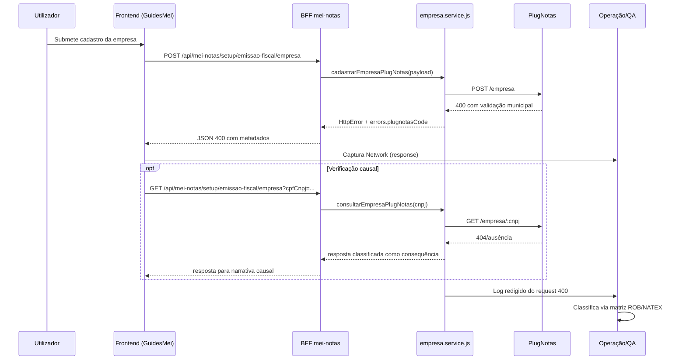

# Arquitetura técnica — teste operacional `prefeitura_login_required_blocked`

**Versão:** 1.0  
**Data:** 2026-04-10  
**Autoria:** Aria (architect / AIOX)  
**PRD de origem:** [`docs/prd/PRD-teste-operacional-prefeitura-login-required-blocked-2026-04-10.md`](../prd/PRD-teste-operacional-prefeitura-login-required-blocked-2026-04-10.md)  
**Spec UX de origem:** [`docs/specs/ux-spec-teste-operacional-prefeitura-login-required-blocked-2026-04-10.md`](../specs/ux-spec-teste-operacional-prefeitura-login-required-blocked-2026-04-10.md)

---

## 1. Resumo executivo

Este documento define a arquitetura técnica para **execução e validação operacional** do cenário:

- `POST /api/mei-notas/setup/emissao-fiscal/empresa` com `HTTP 400`;
- `errors.plugnotasCode = prefeitura_login_required_blocked`.

A arquitetura aqui é de **processo técnico-operacional**, não de nova feature.  
O objetivo é padronizar:

1. o fluxo de coleta de evidência;
2. a correlação entre frontend, backend e runbook;
3. a decisão final (`esperado` vs `regressão`) com causalidade preservada.

---

## 2. Relação com artefatos existentes

| Artefato | Papel |
|---|---|
| [`docs/technical/architecture-nfse-nacional-padrao-bloqueio-excecao-credenciais-prefeitura-plugnotas-2026-04-10.md`](./architecture-nfse-nacional-padrao-bloqueio-excecao-credenciais-prefeitura-plugnotas-2026-04-10.md) | Arquitetura canônica da política nacional-first e bloqueio da exceção |
| [`docs/technical/architecture-400-nfse-prefeitura-login-obrigatorio-plugnotas-2026-04-09.md`](./architecture-400-nfse-prefeitura-login-obrigatorio-plugnotas-2026-04-09.md) | Contexto técnico do erro de `prefeitura.login` obrigatório |
| [`docs/technical/architecture-briefing-acao-prefeitura-400-get-404-guia-mei-2026-04-09.md`](./architecture-briefing-acao-prefeitura-400-get-404-guia-mei-2026-04-09.md) | Base de causalidade operacional `POST` -> `GET` |
| [`docs/operacao-mei-nfse.md`](../operacao-mei-nfse.md) | Matriz ROB/NATEX para classificação final |
| [`backend/src/services/plugnotas/empresa.service.js`](../../backend/src/services/plugnotas/empresa.service.js) | Classificação backend e metadados diagnósticos |
| [`backend/src/services/plugnotas/prefeituraPortalCredentials.js`](../../backend/src/services/plugnotas/prefeituraPortalCredentials.js) | Código e mensagem pública de `prefeitura_login_required_blocked` |

---

## 3. Decisão arquitetural

**Decisão:** reutilizar o pipeline técnico já existente (frontend -> BFF -> PlugNotas) e adicionar uma camada explícita de **evidência correlacionada** para o teste operacional.

### Invariantes

1. Frontend continua chamando apenas o BFF.
2. BFF continua chamando PlugNotas por serviço server-side.
3. Não há coleta de `login`/`senha` de prefeitura no frontend para este fluxo.
4. A classificação final do cenário permanece baseada em `plugnotasCode` + causalidade do fluxo.

### Não decisões

1. Não introduzir endpoint novo para triagem.
2. Não alterar política de produto.
3. Não alterar contrato de payload para credenciais municipais.

---

## 4. Contexto técnico do fluxo de teste

---

## 5. Arquitetura de componentes para validação

| Camada | Componente | Responsabilidade no teste |
|---|---|---|
| Frontend | `GuidesMei.tsx` / `apiClient.ts` | Disparo do POST/GET e exposição do erro ao operador via DevTools |
| Frontend domínio | `fiscalUserError.ts` / `apiClientError.ts` | Preservar `plugnotasCode` e `httpStatus` na narrativa |
| BFF | rotas `mei-notas` + controllers | Fronteira única de integração |
| Serviço PlugNotas | `empresa.service.js` | Chamada upstream, classificação e enriquecimento de metadados |
| Política municipal | `prefeituraPortalCredentials.js` | Contrato semântico para `prefeitura_login_required_blocked` |
| Observabilidade | logs redigidos + Network response | Evidência mínima obrigatória para decisão |
| Operação/QA | runbook ROB/NATEX | Classificação final e conclusão do caso |

---

## 6. Contrato técnico de evidência

### 6.1 Artefato de resposta (frontend)

A evidência do `POST` deve registrar, no mínimo:

1. `message`
2. `errors.plugnotasCode`
3. `errors.plugnotasRequest.method`
4. `errors.plugnotasRequest.path`
5. `errors.httpStatus`

### 6.2 Artefato de log (backend)

A evidência do backend deve conter:

1. linha de log redigido do request `400` de cadastro empresa;
2. sem token, certificado, payload bruto ou credencial em claro.

### 6.3 Correlação mínima

A correlação entre frontend e backend deve usar:

1. proximidade temporal do evento;
2. método/path do request (`POST /empresa`);
3. `httpStatus` e `plugnotasCode`.

---

## 7. Causalidade operacional (`POST` -> `GET`)

Regra arquitetural obrigatória:

1. falha no `POST` é causa raiz primária;
2. ausência em `GET` posterior é estado consequente até cadastro bem-sucedido;
3. a decisão final não deve reclassificar o problema como “endpoint errado” quando `plugnotasCode` já identifica exceção municipal bloqueada.

---

## 8. Segurança e privacidade

1. Evidências operacionais usam apenas dados redigidos.
2. Nenhuma etapa do teste deve exigir exposição de segredo em ticket público.
3. O procedimento não habilita novos dados sensíveis no frontend.
4. Logs devem seguir o mecanismo de redaction já existente no backend.

---

## 9. Rastreabilidade PRD/spec -> arquitetura

| ID | Realização arquitetural |
|---|---|
| **FR-TOP-01** | Fluxo canônico de submissão via frontend/BFF |
| **FR-TOP-02** | Captura obrigatória em DevTools Network |
| **FR-TOP-03** | Captura obrigatória de log redigido backend |
| **FR-TOP-04** | Contrato mínimo de evidência definido na secção 6 |
| **FR-TOP-05** | Passo de verificação causal com GET posterior |
| **FR-TOP-06** | Classificação final via runbook ROB/NATEX |
| **FR-TOP-07** | Saída obrigatória binária: `esperado` ou `regressão` |
| **FR-TOP-08** | Regra de decisão para `prefeitura_login_required_blocked` |
| **NFR-TOP-01** | Redaction obrigatória nos artefatos |
| **NFR-TOP-02** | Procedimento reproduzível por pré-condições explícitas |
| **NFR-TOP-03** | Reinício backend após alteração de ambiente |
| **NFR-TOP-04** | Sem alteração funcional obrigatória no código da aplicação |
| **DP-TOP-01..03** | Decisão operacional preservada na camada de classificação |

---

## 10. Critérios de aceite técnicos

- [ ] Pipeline de evidência executável sem mudança de arquitetura de runtime.
- [ ] Contrato mínimo de evidência capturado no frontend e backend.
- [ ] Causalidade `POST` -> `GET` preservada na análise.
- [ ] Classificação final alinhada ao runbook para o caso `prefeitura_login_required_blocked`.
- [ ] Processo documentado sem exposição de segredo.

---

## 11. Fora do escopo técnico desta arquitetura

1. Novo contrato API para credenciais municipais.
2. Implementação de formulário de credenciais no frontend.
3. Alteração da lógica canônica de bloqueio nacional-first.
4. Migrações de banco ou infraestrutura.

---

## 12. Change log

| Versão | Data | Nota |
|---|---|---|
| 1.0 | 2026-04-10 | Arquitetura inicial do teste operacional derivada do PRD e da spec UX TOP. |

