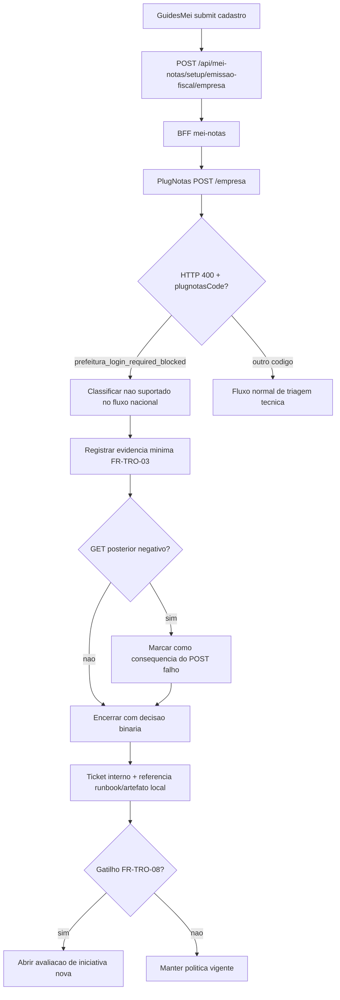
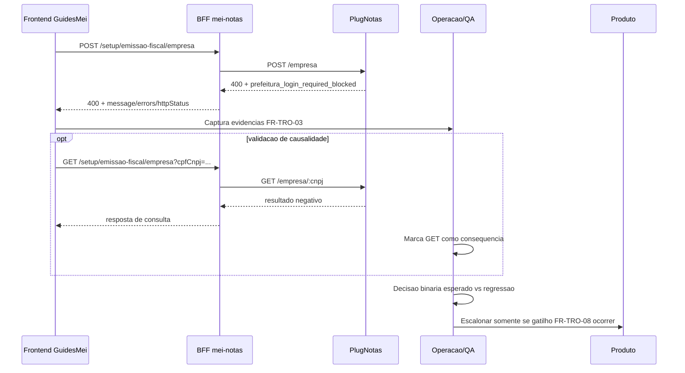

# Arquitetura tecnica — tratativa operacional `prefeitura_login_required_blocked`

**Versao:** 1.0  
**Data:** 2026-04-13  
**Autoria:** Aria (architect / AIOX)  
**PRD de origem:** [`docs/prd/PRD-tratativa-operacional-prefeitura-login-required-blocked-2026-04-13.md`](../prd/PRD-tratativa-operacional-prefeitura-login-required-blocked-2026-04-13.md)  
**Spec UX de origem:** [`docs/specs/ux-spec-tratativa-operacional-prefeitura-login-required-blocked-2026-04-13.md`](../specs/ux-spec-tratativa-operacional-prefeitura-login-required-blocked-2026-04-13.md)

---

## 1. Resumo executivo

Esta arquitetura define como o sistema deve tratar, observar e decidir sobre o incidente:

- `POST /api/mei-notas/setup/emissao-fiscal/empresa` com `HTTP 400`;
- `errors.plugnotasCode = prefeitura_login_required_blocked`.

O alvo e padronizar a decisao operacional, evitando falso bug tecnico de endpoint.
Nao e uma arquitetura de nova feature municipal; e uma arquitetura de governanca operacional para o fluxo atual.

---

## 2. Relacao com artefatos existentes

| Artefato | Papel |
|---|---|
| [`docs/operacao-mei-nfse.md#top-roteiro-operacional-prefeitura-login-required-blocked`](../operacao-mei-nfse.md#top-roteiro-operacional-prefeitura-login-required-blocked) | Fonte canonica do roteiro e classificacao ROB/NATEX |
| [`docs/technical/architecture-teste-operacional-prefeitura-login-required-blocked-2026-04-10.md`](./architecture-teste-operacional-prefeitura-login-required-blocked-2026-04-10.md) | Base tecnica do teste operacional ja institucionalizado |
| [`docs/specs/ux-spec-teste-operacional-prefeitura-login-required-blocked-2026-04-10.md`](../specs/ux-spec-teste-operacional-prefeitura-login-required-blocked-2026-04-10.md) | Referencia de execucao A-D em UI/Network |
| [`backend/src/services/plugnotas/empresa.service.js`](../../backend/src/services/plugnotas/empresa.service.js) | Camada de classificacao tecnica do erro de integracao |
| [`frontend/src/lib/fiscalUserError.ts`](../../frontend/src/lib/fiscalUserError.ts) | Narrativa de erro para utilizador/operacao |
| [`frontend/src/utils/apiClientError.ts`](../../frontend/src/utils/apiClientError.ts) | Preservacao de metadados de erro no cliente |

---

## 3. Decisao arquitetural

**Decisao principal:** manter o runtime atual (Frontend -> BFF -> PlugNotas) e formalizar uma camada de decisao operacional sobre metadados de erro.

### 3.1 Invariantes

1. NFS-e Nacional permanece como caminho padrao (DP-TRO-01).
2. `prefeitura_login_required_blocked` e tratado como excecao nao suportada no fluxo nacional (DP-TRO-02).
3. Nao reclassificar como "erro de endpoint" quando o contrato de erro estiver presente (DP-TRO-03).
4. Sem alteracao funcional de endpoint para encerrar esta tratativa (DP-TRO-04, NFR-TRO-03).

### 3.2 Consequencia tecnica

A principal mudanca e de protocolo de operacao/QA/produto: padrao de evidencia, causalidade e decisao binaria.
Nao ha novo endpoint, schema, fila, ou migracao de infraestrutura.

---

## 4. Arquitetura logica da tratativa



---

## 5. Sequencia tecnica de referencia



---

## 6. Componentes e responsabilidades

| Camada | Componente | Responsabilidade |
|---|---|---|
| Frontend | `GuidesMei.tsx` | Acionar POST/GET e expor estado de erro sem narrativa de endpoint errado |
| Frontend dominio | `fiscalUserError.ts` | Mapear `plugnotasCode` para narrativa correta |
| Frontend util | `apiClientError.ts` | Preservar `httpStatus` e metadados para diagnostico |
| Backend BFF | rotas/controller `mei-notas` | Contrato HTTP estavel para o cliente |
| Backend integracao | `empresa.service.js` | Chamada upstream e classificacao de erro |
| Operacao/QA | runbook + `docs/qa/` | Evidencia redigida e classificacao final |
| Produto | backlog/PRD | Decisao de iniciativa nova por gatilho de recorrencia |

---

## 7. Contrato tecnico de evidencia (FR-TRO-03)

Campos minimos obrigatorios por ocorrencia:

1. `message`
2. `errors.plugnotasCode`
3. `errors.plugnotasRequest.method`
4. `errors.plugnotasRequest.path`
5. `errors.httpStatus`

Exemplo de estrutura esperada:

```json
{
  "message": "Este fluxo usa NFS-e Nacional como padrao...",
  "errors": {
    "plugnotasCode": "prefeitura_login_required_blocked",
    "plugnotasRequest": {
      "method": "POST",
      "path": "/empresa"
    },
    "httpStatus": 400
  }
}
```

Regra de privacidade (NFR-TRO-01): evidencias sem token, senha, certificado, payload bruto ou PII sensivel nao mascarada.

---

## 8. Motor de decisao operacional

Regra de classificacao:

1. Se `plugnotasCode == prefeitura_login_required_blocked` -> decisao padrao = `esperado pela politica vigente`.
2. Se `GET` posterior vier negativo apos esse `POST` -> registrar como consequencia, nao causa raiz.
3. So classificar como `regressao tecnica` quando houver evidencia de quebra fora do contrato definido acima.

Saida obrigatoria (FR-TRO-06):

- `esperado pela politica vigente`; ou
- `regressao tecnica a corrigir`.

---

## 9. Seguranca, compliance e observabilidade

1. Redaction obrigatoria em todos os artefatos operacionais (NFR-TRO-01).
2. Ambiente da ocorrencia explicitado (`local`, `homologacao`, `producao controlada`) para reproducibilidade (NFR-TRO-02).
3. Reuso do runbook canonico e de artefato local padrao para reduzir divergencia documental (NFR-TRO-04).
4. Sem introduzir novos segredos no frontend para este fluxo.

---

## 10. Rastreabilidade PRD/UX -> arquitetura

| ID | Implementacao arquitetural |
|---|---|
| FR-TRO-01 | Regra padrao de classificacao por `plugnotasCode` |
| FR-TRO-02 | Proibicao de narrativa "endpoint errado" no diagnostico |
| FR-TRO-03 | Contrato minimo de evidencia definido na secao 7 |
| FR-TRO-04 | Regra causal `POST` falho -> `GET` consequente |
| FR-TRO-05 | Vinculo obrigatorio a ticket + runbook/artefato local |
| FR-TRO-06 | Saida binaria obrigatoria no encerramento |
| FR-TRO-07 | Escalonamento formal para iniciativa nova quando recorrente |
| FR-TRO-08 | Gatilhos objetivos de escalonamento incorporados no fluxo |
| NFR-TRO-01 | Politica de redaction obrigatoria |
| NFR-TRO-02 | Ambiente explicitado para reproducao |
| NFR-TRO-03 | Sem mudanca funcional necessaria no endpoint |
| NFR-TRO-04 | Reuso de runbook e artefato padrao |
| DP-TRO-01..04 | Invariantes de politica e contrato preservados |

---

## 11. Criterios de aceite tecnicos

- [ ] Fluxo de triagem executavel sem alterar arquitetura de runtime.
- [ ] Evidencia minima FR-TRO-03 capturada com redaction.
- [ ] Causalidade `POST` falho -> `GET` negativo preservada quando aplicavel.
- [ ] Decisao final binaria registrada por ocorrencia.
- [ ] Ticket interno e referencia ao runbook/artefato local presentes.
- [ ] Escalonamento para produto somente por gatilhos FR-TRO-08.

---

## 12. Fora de escopo desta arquitetura

1. Suporte municipal com `login`/`senha` no fluxo atual.
2. Mudanca de contrato do endpoint de cadastro atual.
3. Redesign da jornada para municipal-first.
4. Troca de provedor ou refactor amplo de integracao PlugNotas.

---

## 13. Change log

| Versao | Data | Nota |
|---|---|---|
| 1.0 | 2026-04-13 | Arquitetura tecnica inicial da tratativa operacional `prefeitura_login_required_blocked`, derivada do PRD e da spec UX de 13/04/2026. |

